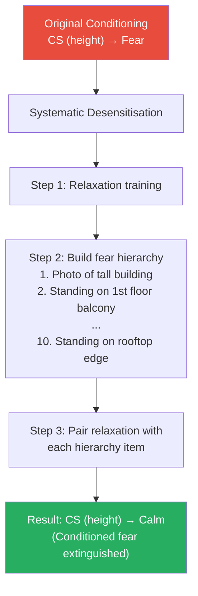

# Learning Theory Applications: Behaviour Modification and Personality Change

## Overview

The true test of any personality theory is its practical utility. Both Pavlov's classical conditioning and Skinner's operant conditioning have generated a rich array of **applied behaviour modification techniques** that are used in clinical psychology, education, rehabilitation, and organisational settings. This file integrates the applied dimension of both theories and explores how **personality change** is conceptualised and implemented from a behaviourist perspective.

> 📄 **Source PDF**: [MPC-003/Block-2/Unit-3.pdf — Pages 44–52](/pdfs/MPC-003%20Personality%20Theories%20and%20Assessment/Block-2/Unit-3.pdf)
> 📚 **Course**: MPC-003 Personality Theories and Assessment

---

## 1. Behaviour Modification: The Core Philosophy

From the behaviourist perspective, **personality change = behaviour change**. There is no need to excavate repressed memories (psychoanalysis) or restructure cognitive schemas (CBT) — changing the contingencies in the environment is sufficient to reshape personality.

The fundamental equation:
```
Maladaptive behaviour → Identify maintaining reinforcers → Remove/alter them → Behaviour extinguishes
Adaptive behaviour → Identify target response → Reinforce systematically → Behaviour strengthens
```

**Key principle** (Skinner): "In putting forward a programme for the treatment of abnormal behaviour, Skinner repeatedly asserted that the goal is simply to replace abnormal behaviour with normal behaviour."

---

## 2. Classical Conditioning-Based Techniques

### 2.1 Systematic Desensitisation

Developed by Joseph Wolpe (building on Pavlovian counter-conditioning), this remains one of the **most empirically supported treatments** for anxiety disorders.

**Mechanism**: Pair relaxation (incompatible with anxiety) with progressive exposure to feared stimuli. The feared CS loses its ability to elicit anxiety because:
- Relaxation and anxiety cannot co-exist (reciprocal inhibition)
- Repeated CS presentation without UCS extinguishes the original conditioning

**Steps**:
1. Teach deep relaxation (progressive muscle relaxation, diaphragmatic breathing)
2. Construct fear hierarchy (least to most feared situations)
3. While relaxed, imagine Hierarchy Item 1
4. When Item 1 produces no anxiety, move to Item 2
5. Continue until even the most feared item produces no anxiety response

**Conditions treated**:
- Specific phobias (heights, spiders, needles)
- Social anxiety
- Examination anxiety (particularly relevant for IGNOU students!)
- Sexual dysfunction (impotence, vaginismus)
- Stuttering, nightmares, obsessive-compulsive features



### 2.2 Flooding (Exposure Therapy)

**Mechanism**: Prolonged, intense exposure to the feared CS without the UCS until the conditioned response extinguishes through exhaustion.

Unlike systematic desensitisation (gradual exposure), flooding confronts the full feared stimulus immediately. This works because:
- The CS is maintained until the anxiety response decreases naturally
- Extinction occurs as no harm (UCS) materialises despite the feared CS

**Example**: A client with agoraphobia is asked to enter a crowded shopping mall and remain for 90+ minutes until anxiety subsides naturally. After repeated sessions, the mall no longer elicits panic.

**Ethical consideration**: Flooding is distressing and requires informed consent. Dropout rates are higher than systematic desensitisation.

### 2.3 Aversion Therapy

**Mechanism**: Counter-conditioning — pairing a CS currently associated with pleasure (alcohol, cigarettes) with an aversive UCS (nausea-inducing drug, mild electric shock) until the CS elicits aversion rather than approach.

**Aversion therapy for alcohol addiction** (Schwartz & Lacey, 1982):
1. Patient drinks alcohol (CS) 
2. Simultaneously given apomorphine (drug → severe nausea = UCS)
3. After repeated pairings: smell/taste of alcohol → nausea (new CR)
4. Approach behaviour extinguished; avoidance established

**Important caveat**: Aversion therapy must be conducted ethically, with full informed consent, and is most effective when combined with other treatments addressing underlying psychological needs.

| Technique | Mechanism | Best Applications |
|-----------|-----------|-------------------|
| Systematic Desensitisation | Extinction + reciprocal inhibition | Phobias, anxiety |
| Flooding | Extinction (forced) | Phobias, PTSD |
| Aversion Therapy | Counter-conditioning | Addictions |

---

## 3. Operant Conditioning-Based Techniques

### 3.1 Token Economy

The token economy is Skinner's most socially impactful intervention design. It creates a **miniature economic system** within an institution where adaptive behaviours are reinforced with tokens (secondary reinforcers) exchangeable for primary reinforcers.

**Components of a well-designed token economy**:
- **Explicit behavioural targets**: Specific, observable behaviours defined
- **Token delivery**: Immediate, consistent token award for target behaviours
- **Token exchange**: Tokens traded for meaningful backup reinforcers
- **Response cost** (optional): Tokens removed for inappropriate behaviours

**Settings and applications**:

```
Psychiatric hospitals → Compliance with treatment, self-care, social engagement
Schools → Academic work, attendance, prosocial behaviour
Juvenile detention → Disciplinary compliance, educational participation
Autism treatment → Communication skills, daily living activities
Substance abuse programs → Abstinence, attendance, participation
```

**Research evidence**: Token economies have demonstrated effectiveness across populations, with particularly strong evidence for:
- Children with intellectual disabilities
- Adults with schizophrenia
- Students with ADHD (classroom management)

**Indian context**: Token economies are increasingly used in Indian special education settings, government psychiatric hospitals, and community-based rehabilitation programmes.

### 3.2 Differential Reinforcement

Rather than punishing unwanted behaviour, differential reinforcement:
- **Reinforces** a target behaviour that is incompatible with or an alternative to the problem behaviour
- **Extinguishes** the problem behaviour by withdrawing its reinforcement

Types:
- **DRA (Differential Reinforcement of Alternative behaviour)**: Reinforce a specific alternative
- **DRO (Differential Reinforcement of Other behaviour)**: Reinforce any behaviour *except* the problem behaviour
- **DRL (Differential Reinforcement of Low rates)**: Reinforce the behaviour only when it occurs less frequently

### 3.3 Behaviour Contracts

Written agreements specifying:
- Target behaviours
- Reinforcers for completion
- Consequences for non-completion
- Monitoring procedures

Widely used in education, substance abuse treatment, and outpatient therapy.

### 3.4 Applied Behaviour Analysis (ABA)

ABA is the systematic application of operant conditioning principles to improve socially significant behaviours. It is the **most evidence-based approach for autism spectrum disorder (ASD)**.

Core ABA methodology: **ABC Analysis**
```
A — Antecedent: What triggers the behaviour?
B — Behaviour: What exactly does the person do?
C — Consequence: What follows the behaviour? (reinforcer/punisher)
```

ABA modifies antecedents and consequences to reshape behaviour patterns systematically.

---

## 4. Behaviour Modification for Addictions

Both classical and operant conditioning contribute to addiction, and both provide treatment tools.

**Classical conditioning in addiction**:
- Drug-related cues (syringes, bar environments) become CSs that trigger cravings
- Even after physical withdrawal, exposure to these cues reinstates drug-seeking
- **Cue exposure therapy**: Systematic desensitisation-like exposure to drug cues without drug availability — extinguishing conditioned cravings

**Operant conditioning in addiction**:
- Drug use is initially reinforced positively (euphoria) and negatively (relief from withdrawal discomfort)
- Variable ratio reinforcement maintains drug-seeking despite increasingly infrequent "highs"
- Treatment: Provide competing reinforcers through **Community Reinforcement Approach (CRA)** — reinforcing drug-free behaviours in work, family, recreation

---

## 5. Behaviour Modification in Educational Settings

Behaviourist principles remain foundational in education, even as cognitive approaches have expanded:

**Classical conditioning in classrooms**:
- Test anxiety conditioned through past failure/humiliation → Needs systematic desensitisation
- Positive classroom climate → Association of learning with pleasure (positive CS)

**Operant conditioning in classrooms**:
- **Positive reinforcement** of desired academic and social behaviours
- **Shaping** complex skills (writing, mathematical reasoning) through successive approximations
- **Token economies** for classroom management
- **Intermittent reinforcement** for sustained effort (praise on VR schedule maintains higher work rates)

**Key for Indian educational context**: India's competitive examination system (JEE, NEET, UPSC) creates intense fixed-interval reinforcement schedules — students show characteristic pre-exam surges in studying (the "FI scallop") followed by rest periods after examinations.

---

## 6. Behaviour Modification for Personality Disorders

From a behaviourist perspective, personality disorders represent **pervasive, maladaptive patterns** maintained by reinforcement contingencies.

**Dialectical Behaviour Therapy (DBT)** — Linehan's treatment for Borderline Personality Disorder — incorporates extensive operant conditioning principles:
- **Skills training** (shaping adaptive emotion regulation behaviours)
- **Behaviour chain analysis** (identifying antecedents and consequences of crises)
- **Contingency management** (reinforcing adaptive coping; not reinforcing crisis behaviour)

**Antisocial Personality Disorder**: Skinnerian analysis suggests early reinforcement of manipulative and aggressive behaviours within a punitive family environment shapes the antisocial pattern.

---

## 7. Limitations of Behaviour Modification

Despite its effectiveness, behaviour modification faces important challenges:

**Generalisation problem**: Behaviours learned in therapy settings may not generalise to natural environments. Token economies in hospitals may not transfer to community life.

**Maintenance problem**: Reinforcement must continue for behaviour to persist. When tokens or other programmatic reinforcers are removed, gains may reverse.

**Ethical concerns**:
- Who defines "adaptive" behaviour? (Cultural, political biases can enter)
- Does behaviour modification respect autonomy and dignity?
- Skinner himself argued for a **designed culture** — but who designs it?

**Cognitive mediation**: Pure behaviour modification ignores internal processes. CBT research demonstrates that combining conditioning-based techniques with cognitive restructuring produces better outcomes.

---

## 8. 🧠 Memory Aid: BEATS for Behaviour Modification

| Letter | Technique | Used for |
|--------|-----------|----------|
| **B**locking | Extinction | Remove reinforcer → stop behaviour |
| **E**xposure | Flooding/SD | Phobia extinction |
| **A**version | Counter-conditioning | Addiction |
| **T**okens | Token Economy | Institutional settings |
| **S**haping | Successive Approx. | Complex skill building |

---

## 9. 🔗 External Resources

### Foundational Reading
- [Systematic Desensitisation — Wikipedia](https://en.wikipedia.org/wiki/Systematic_desensitization)
- [Aversion Therapy — Wikipedia](https://en.wikipedia.org/wiki/Aversion_therapy)
- [Token Economy — Wikipedia](https://en.wikipedia.org/wiki/Token_economy)
- [Applied Behaviour Analysis — Wikipedia](https://en.wikipedia.org/wiki/Applied_behavior_analysis)
- [Flooding Therapy — Wikipedia](https://en.wikipedia.org/wiki/Flooding_(psychology))

### Educational Videos
- 🎥 [Token Economy Explained (MIT OpenCourseWare Psychology)](https://ocw.mit.edu/courses/psychology/)
- 🎥 [ABA Therapy and Autism — explained (YouTube)](https://www.youtube.com/watch?v=VnHdBH-4aYs)
- 🎥 [Systematic Desensitisation in practice (YouTube)](https://www.youtube.com/watch?v=6z5TOsmFiNY)

### Research Papers
- Wolpe, J. (1958). *Psychotherapy by Reciprocal Inhibition*. Stanford University Press. — Original SD formulation
- Linehan, M. M. (1993). *Cognitive-Behavioural Treatment of Borderline Personality Disorder*. Guilford. — DBT foundation
- Kazdin, A. E. (2021). Single-case experimental designs: Characteristics, changes, and challenges. *Journal of Experimental Analysis of Behaviour*, 115(1), 56–85.
- Cooper, J. O., Heron, T. E., & Heward, W. L. (2020). *Applied Behaviour Analysis* (3rd ed.). Pearson.

---

## 10. 📝 Self-Assessment Questions

### Conceptual Understanding
1. What is the underlying Pavlovian mechanism behind systematic desensitisation? Why does it work?

2. Compare flooding and systematic desensitisation as exposure-based treatments. What are the theoretical and practical differences?

3. Explain why a token economy works even when the tokens have no intrinsic value. What conditioning concept underlies this?

### Applied Analysis
4. Design a simple token economy for a classroom of children with ADHD. Specify: (a) target behaviours, (b) token type, (c) backup reinforcers, (d) exchange schedule.

5. A therapist is using aversion therapy to treat alcohol addiction. A patient asks: "Why can't I just stop drinking through willpower?" Using Pavlovian principles, explain why classical conditioning makes this difficult, and how aversion therapy addresses the conditioning directly.

6. A child refuses to attend school due to severe anxiety. Outline a behaviour modification programme using systematic desensitisation, specifying the fear hierarchy and the relaxation technique.

### Critical Thinking
7. Critics argue that token economies are "bribery" and undermine intrinsic motivation. Evaluate this critique using Skinner's theory AND the research on intrinsic motivation (Deci & Ryan's self-determination theory).

8. How would a purely behavioural approach and a cognitive-behavioural approach differ in treating social anxiety? What does each add to the other?

---

## Summary

The applied dimension of learning theory — behaviour modification — represents one of psychology's most practical contributions. From the consulting room to the classroom to the psychiatric ward, Pavlovian and Skinnerian principles provide a coherent technology for **personality change through environmental redesign**.

The key techniques — systematic desensitisation, flooding, aversion therapy, token economy, ABA, and shaping — each address specific patterns of maladaptive conditioning with specific reconditioning strategies. While behaviour modification has limitations (generalisation, ethics, cognitive mediation), it remains among the **most evidence-based intervention approaches** available to the practitioner.

---

*Previous: [← Skinner's Operant Conditioning](/mpc-003/block-2/skinner-operant-conditioning-personality)*  
*Next: [Comparative Analysis: Learning Theories vs. Other Personality Theories →](/mpc-003/block-2/learning-theory-comparison-evaluation)*
