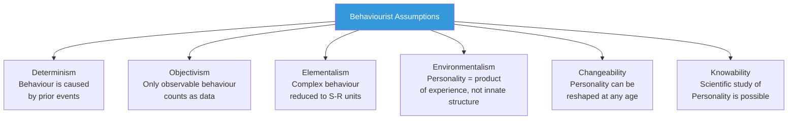
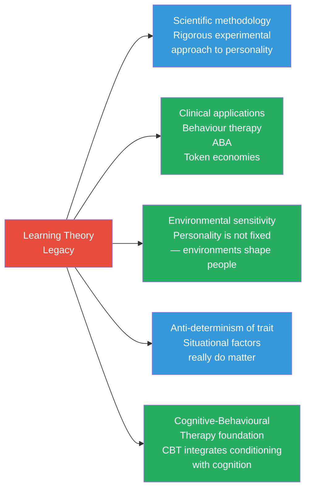

# Learning Theories of Personality: Comparative Analysis and Evaluation

## Overview

Having studied Pavlov's classical conditioning and Skinner's operant conditioning in depth, this final file synthesises their contributions and places them in the broader landscape of personality psychology. We examine: (1) how the learning theories compare with other major personality frameworks; (2) the internal strengths and weaknesses of the behaviourist position; and (3) the legacy and ongoing relevance of these theories.

> 📄 **Source PDF**: [MPC-003/Block-2/Unit-3.pdf — Pages 51–57](/pdfs/MPC-003%20Personality%20Theories%20and%20Assessment/Block-2/Unit-3.pdf)
> 📚 **Course**: MPC-003 Personality Theories and Assessment

---

## 1. The Behaviourist Position: Core Assumptions

Learning theories of personality rest on a distinct set of philosophical commitments:

These commitments contrast sharply with both the psychoanalytic tradition (which emphasises determinism but through unconscious processes) and the humanistic tradition (which emphasises freedom, agency, and conscious meaning).

---

## 2. Comparative Analysis: Learning Theory vs. Major Personality Theories

### 2.1 Learning Theory vs. Psychoanalytic Theory (Freud, Horney, Sullivan)

| Dimension | Learning Theory | Psychoanalytic Theory |
|-----------|----------------|----------------------|
| **Unit of analysis** | Observable behaviour | Unconscious mental content |
| **Cause of personality** | Conditioning history | Early psychosexual development |
| **Pathology** | Maladaptive conditioning | Unresolved conflicts, repression |
| **Treatment** | Behaviour modification | Insight through free association |
| **Verification** | Laboratory experiments | Clinical case studies |
| **Role of childhood** | Learning experiences shape responses | Instinctual drive conflicts |
| **Change mechanism** | Reconditioning | Making unconscious conscious |

**Key difference**: For Freud, personality is driven by *internal* forces (libido, death instinct, unconscious conflicts). For Pavlov and Skinner, personality is driven by *external* forces (stimuli, reinforcement contingencies).

**Practical implication**: Behaviourists treat symptoms directly — Freud said this would cause "symptom substitution" (a new symptom would emerge if the root cause was untreated). Research has shown symptom substitution rarely occurs with behaviour therapy — undermining the psychoanalytic argument.

### 2.2 Learning Theory vs. Social Cognitive Theory (Bandura)

Bandura represents a bridge — he retained the behaviourist commitment to observation and learning but added **cognitive processes** (expectations, self-efficacy, vicarious learning) that pure behaviourism rejected.

| Dimension | Skinner's Behaviourism | Bandura's Social Cognitive Theory |
|-----------|----------------------|----------------------------------|
| **Cognitive processes** | Excluded entirely | Central (self-efficacy, expectations) |
| **Observation** | Only direct conditioning matters | Observational (vicarious) learning is fundamental |
| **Agency** | Denied — behaviour is controlled | Reciprocal determinism — person influences environment |
| **Reinforcement** | Must be directly experienced | Can be vicarious (observing others reinforced) |
| **Self-concept** | Irrelevant | Core construct (self-efficacy) |

**Verdict**: Social cognitive theory *extends* behaviourism rather than replacing it — retaining its scientific rigour while acknowledging human cognitive complexity.

### 2.3 Learning Theory vs. Trait Theory (Allport, Cattell, Big Five)

| Dimension | Learning Theory | Trait Theory |
|-----------|----------------|-------------|
| **Personality structure** | No traits — only behaviour patterns | Stable traits organised hierarchically |
| **Individual differences** | Due to different learning histories | Due to trait dimensions (partly innate) |
| **Stability across situations** | Context-dependent (no cross-situational consistency) | High cross-situational consistency expected |
| **Genetic factors** | Minimised | Substantial (heritability 40–60%) |
| **Measurement** | Direct behavioural observation | Personality inventories (questionnaires) |

**Person-Situation Debate**: Mischel (1968) — a behaviourist sympathiser — famously challenged trait theory, showing that behaviour varies more across situations than trait theory predicts. This debate continues, though modern personality research shows that both traits AND situational factors matter.

### 2.4 Learning Theory vs. Humanistic Theory (Rogers, Maslow)

| Dimension | Learning Theory | Humanistic Theory |
|-----------|----------------|------------------|
| **Human nature** | Mechanistic, reactive | Active, growth-oriented |
| **Focus** | Specific behaviours | Whole person, self-concept |
| **Motivation** | Reinforcement/punishment | Self-actualisation, organismic valuing |
| **Consciousness** | Irrelevant | Central |
| **Therapeutic goal** | Symptom removal | Personal growth, authenticity |
| **Research method** | Laboratory experiment | Phenomenological methods |

---

## 3. Major Critiques of Learning Theory as Personality Theory

### 3.1 The "Missing Personality" Problem

Skinner himself admitted his framework describes **specific behaviours and behaviour change** — not personality in the traditional sense. The word "personality" barely appears in Skinner's theoretical writings.

**Implication**: Learning theory may be better described as a *theory of behaviour* than a *theory of personality*. It can explain why a person does X in situation Y — but not who that person *is* across all situations and life domains.

### 3.2 Biological Constraints on Learning (Garcia Effect)

**Garcia, McGowan, & Green (1972)** demonstrated that rats learn taste aversions after just one trial, even when the interval between CS and UCS is over an hour — violating the standard conditioning principle that acquisition requires many pairings and short ISI.

This "**preparedness**" effect (Seligman, 1971) shows that:
- Not all stimuli are equally conditionable
- Evolution has prepared organisms to learn certain CS-UCS associations faster than others (snakes and heights vs. flowers and mushrooms)
- "Biological constraints on conditioning" fundamentally challenge the behaviourist claim that any neutral stimulus can become a CS

**Instinctive drift** (Breland & Breland, 1961): Trained animals kept reverting to biologically-prepared behaviours, overriding their operant conditioning. A raccoon trained to drop coins in a box began rubbing and manipulating them (food-washing instinct) despite this preventing reinforcement.

### 3.3 Chomsky's Language Critique

Noam Chomsky's (1959) devastating review of Skinner's *Verbal Behaviour* (1957) identified fundamental problems:

1. **Productivity**: Humans routinely produce and understand sentences they've never encountered before — impossible to explain through conditioning of specific responses
2. **Universal grammar**: All human languages share deep structural properties despite enormous surface variation — suggesting an innate Language Acquisition Device (LAD), not learned associations
3. **Critical period**: Language is acquired most efficiently in early childhood regardless of explicit instruction — suggesting biological maturation, not reinforcement
4. **Poverty of the stimulus**: Children learn grammatical rules from exposure to impoverished, fragmentary speech — reinforcement cannot account for the richness of what is learned

Chomsky's critique was enormously influential, contributing to the **cognitive revolution** that dethroned behaviourism as the dominant paradigm in the 1960s–70s.

### 3.4 The Complexity of Human Experience

*Boulding (1984)*: Skinner's application of animal conditioning principles to complex human social behaviour makes an unwarranted assumption — that the laws governing rat lever-pressing generalise to human love, creativity, religious experience, moral reasoning, and political organisation.

**Thought experiment**: Can operant conditioning explain:
- Why Van Gogh painted despite receiving almost no reinforcement?
- Why people sacrifice their lives for abstract principles?
- Why someone falls in love?
- Why humans create art, music, and literature?

These phenomena seem to require cognitive, emotional, and motivational constructs that behaviourism explicitly excludes.

---

## 4. Enduring Contributions and Legacy

Despite its limitations, learning theory made permanent contributions to personality psychology and clinical practice:

### 4.1 Cognitive-Behavioural Therapy

CBT — the current gold standard for most psychological disorders — emerged from the integration of:
- Behaviourist conditioning principles (exposure, reinforcement)
- Cognitive theory (Beck, Ellis — identifying and challenging maladaptive thoughts)

This hybrid demonstrates that the most effective interventions use **both** conditioning and cognition.

### 4.2 The Environmental Turn in Personality Research

Behaviourism's legacy includes a sustained awareness that:
- **Situations matter**: The same person behaves differently across contexts
- **Poverty and adversity shape personality**: Childhood environments profoundly influence adult traits
- **Intervention works**: Personality patterns *can* be changed through environmental redesign

---

## 5. Integrative Comparison: Which Theory for Which Question?

| Question | Best Theory |
|----------|-------------|
| How do phobias develop? | Pavlov (classical conditioning) |
| Why is gambling hard to stop? | Skinner (VR schedule) |
| How does self-confidence develop? | Bandura (self-efficacy) |
| What are stable personality dimensions? | Cattell/Big Five (trait theory) |
| What is the deepest source of personality? | Freud (unconscious dynamics) |
| How do I change my habits? | Skinner (reinforcement) + CBT |
| Why do I feel unfulfilled despite success? | Rogers/Maslow (humanistic) |

**The mature answer**: No single theory adequately captures the full complexity of personality. Each theory illuminates different facets:
- Behaviourist theories excel at **explaining specific behaviour patterns and treatment**
- Trait theories excel at **describing individual differences and predicting behaviour**
- Psychodynamic theories excel at **understanding unconscious motivation and defence**
- Humanistic theories excel at **capturing meaning, growth, and subjective experience**

---

## 6. Learning Theory in the Indian Psychological Context

**Colonisation of psychology**: Western behaviourist approaches dominated Indian clinical psychology through the 20th century. NIMHANS, Bangalore pioneered behaviour therapy in India in the 1970s.

**Indigenous frameworks**: Indian philosophical traditions (Yoga, Vedanta, Buddhism) offer different perspectives on personality change:
- Buddhist mindfulness tradition emphasises **awareness of conditioning itself** — which aligns with CBT's metacognitive approach
- Karma theory parallels (and contrasts with) conditioning: Karma implies that intentional actions (not just reinforced responses) shape future experience
- Indian emphasis on dharma (duty/role) suggests personality is partly understood through relational and social contexts — aligning with Sullivan's interpersonal theory and Bandura's social cognitive approach

**Contemporary application**: ABA for autism is growing rapidly in India; behaviour modification is used in Indian schools; token economies appear in NIMHANS's psychiatric rehabilitation programmes.

---

## 7. 🧠 Memory Aid: PLEASE for Evaluation

| Letter | Evaluative Point |
|--------|-----------------|
| **P** | Parsimony — elegant explanation with few principles |
| **L** | Lab-based — scientific but artificial |
| **E** | Environment primary — genetics/biology minimised |
| **A** | Applied power — therapy techniques work well |
| **S** | Symptom focus — not whole personality |
| **E** | Evolution ignored — Garcia effect, preparedness |

---

## 8. 🔗 External Resources

### Foundational Reading
- [Behaviourism — Wikipedia](https://en.wikipedia.org/wiki/Behaviorism)
- [Cognitive Revolution — Wikipedia](https://en.wikipedia.org/wiki/Cognitive_revolution)
- [Person-Situation Debate — Wikipedia](https://en.wikipedia.org/wiki/Person%E2%80%93situation_debate)
- [Preparedness (Learning) — Wikipedia](https://en.wikipedia.org/wiki/Preparedness_(learning))
- [Cognitive Behavioural Therapy — Wikipedia](https://en.wikipedia.org/wiki/Cognitive_behavioral_therapy)

### Educational Videos
- 🎥 [Behaviourism vs. Cognitive Revolution — Crash Course History of Psychology (YouTube)](https://www.youtube.com/watch?v=vo4pMVb0R6M)
- 🎥 [Comparing Personality Theories — Overview (YouTube)](https://www.youtube.com/watch?v=DX1fQbXBIi8)
- 🎥 [Mischel and the Person-Situation Debate (YouTube)](https://www.youtube.com/watch?v=7Wkubf1PnWE)

### Research Papers
- Mischel, W. (1968). *Personality and Assessment*. Wiley. — The situationist challenge to trait theory
- Seligman, M. E. P. (1971). Phobias and preparedness. *Behaviour Therapy*, 2(3), 307–320.
- Breland, K., & Breland, M. (1961). The misbehaviour of organisms. *American Psychologist*, 16(11), 681–684.
- Chomsky, N. (1959). Review of B. F. Skinner's Verbal Behaviour. *Language*, 35(1), 26–58.
- Beck, A. T., & Clark, D. A. (2020). *Cognitive Therapy of Anxiety Disorders: Science and Practice*. Guilford. — CBT as integration of behaviourism and cognitive theory

---

## 9. 📝 Self-Assessment Questions

### Conceptual Understanding
1. How does learning theory differ from psychoanalytic theory in its explanation of personality development and psychopathology? Which approach do you find more scientifically credible, and why?

2. What is the "Garcia effect" (biological constraints on conditioning) and why does it challenge the behaviourist claim that any neutral stimulus can become a conditioned stimulus?

3. Explain the "person-situation debate" in personality psychology. How did Mischel's research challenge trait theory, and how did behaviourism contribute to this debate?

### Applied Analysis
4. A student asks: "If Skinner is right that personality is just conditioning, can I really change my personality?" Discuss this question using Skinner's theory, Bandura's theory, and one critique of behaviourism.

5. Compare the behaviourist approach to personality change (behaviour modification) with the psychoanalytic approach (insight therapy). What evidence exists for the effectiveness of each?

6. A clinical psychologist is treating a client with social anxiety. Construct a case conceptualisation from (a) a Pavlovian perspective, (b) a Skinnerian perspective, and (c) a social cognitive perspective. How does each lead to a different treatment plan?

### Critical Thinking
7. "Behaviourism dehumanises people by treating them like laboratory animals." Evaluate this critique, considering: (a) Skinner's own response to it, (b) the practical benefits of behaviour modification, and (c) whether other personality theories are immune to similar charges.

8. Chomsky's critique of Skinner focused on language, but similar arguments might apply to other complex human behaviours (artistic creativity, moral reasoning, religious experience). Identify one such behaviour and explain why conditioning principles seem insufficient to explain it.

9. In an examination question on the learning theory of personality, you are asked to "critically evaluate the behaviourist approach." Using the material across this unit, write a 400-word model answer.

---

## Summary: The Behaviourist Contribution in Perspective

The learning theory of personality — encompassing both Pavlov's classical conditioning and Skinner's operant conditioning — offers a **scientifically rigorous, environmentally focused, and practically powerful** account of how personality patterns develop and can be changed.

Its core strengths are its **measurability, predictability, and clinical utility**. Its core limitations are its **incompleteness as a personality theory** (focusing on specific behaviours rather than the integrated self), its **underestimation of biological factors** (preparedness, language acquisition device), and its **exclusion of cognitive processes** that humans clearly use in navigating personality.

The field of personality psychology has moved beyond pure behaviourism — but behaviourism's legacy lives on in CBT (the most widely practised therapeutic approach), ABA (the standard treatment for autism), and the fundamental insight that **environments shape people profoundly and systematically**.

For the IGNOU MAPC examination, ensure you can:
- Define and illustrate all classical conditioning principles (acquisition, generalisation, discrimination, extinction, spontaneous recovery)
- Describe all elements of Skinner's operant conditioning (operant vs. respondent, schedules, shaping, secondary reinforcement)
- Apply both theories to explain personality development and pathology
- Evaluate both theories critically using evidence (Garcia, Chomsky, Breland, Mischel)
- Compare learning theories with at least two other major personality approaches

---

*Previous: [← Behaviour Modification Applications](/mpc-003/block-2/learning-theory-applications-behaviour-modification)*  
*Next: [Unit 4: Other Learning Theories →](/mpc-003/block-2/)*
