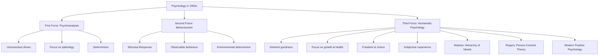

# Humanistic Approach to Personality: The Third Force

## Introduction

The mid-twentieth century witnessed a quiet revolution in psychology. While Freudian psychoanalysis peered into the depths of the unconscious and behaviourism reduced human beings to stimulus-response machines, a third voice emerged — one that insisted on treating persons as whole, conscious, purposeful beings striving toward growth and meaning. This voice became known as **humanistic psychology**, or what Abraham Maslow dramatically called the **"Third Force"**.

The humanistic approach, developed primarily by Abraham Maslow and Carl Rogers in the 1950s and 1960s, offered a fundamentally new paradigm — not just a variation of existing theories but a philosophical reorientation that changed how psychologists think about health, therapy, motivation, and what it means to be fully human.

---

## Origins: Reacting Against the Dominant Forces

To understand why the humanistic approach emerged, we must appreciate what it was reacting against.

### The First Force: Psychoanalysis

Freudian psychoanalysis, despite its profound insights into unconscious motivation and defence mechanisms, presented a deeply pessimistic portrait of human nature. People were driven by primitive biological urges (the id), constrained by a punitive conscience (the superego), and perpetually in conflict. The unconscious controlled behaviour while the conscious ego struggled to maintain order. Pathology was the central focus — understanding neurosis, psychosis, and dysfunction.

Many therapists and psychologists in the 1940s and 1950s found this framework both incomplete and demoralising. What about human creativity, love, transcendence, and the capacity for genuine goodness? Psychoanalysis had little to say about these.

### The Second Force: Behaviourism

Behaviourism, championed by Watson and Skinner, offered scientific rigour but at a steep price. It reduced human beings to passive reactors to environmental stimuli — reinforcement and punishment shaped behaviour, and inner life was either irrelevant or inaccessible. The person was a "black box"; what mattered were observable inputs and outputs.

Maslow and Rogers found this framework equally limiting. It ignored consciousness, meaning, values, and the felt experience of being alive. A rat in a Skinner box and a poet writing a sonnet about mortality were, in the behaviourist framework, essentially the same kind of organism.

### The Third Force: Humanism

Maslow coined the term "Third Force" to position humanistic psychology as a genuine alternative — not merely a synthesis of the first two but a fundamentally different approach grounded in different assumptions about human nature.

---

## Core Assumptions of the Humanistic Approach

The humanistic approach rests on several foundational assumptions that distinguish it from every other psychological tradition.

### 1. Inherent Goodness and Positive Potential

Humanists begin from the premise that human beings are inherently good and possess unique attributes for greatness. This is not naïve optimism but a principled stance: people, when freed from distorting social conditions, tend toward health, growth, and prosocial behaviour. This contrasts sharply with the Freudian view that civilisation requires suppressing fundamentally antisocial instincts.

### 2. Subjective Meaning is Primary

Most psychologists of the time believed that behaviour could only be understood *objectively* — through external observation and measurement. Humanists argued this created a paradox: if we can only understand people from outside, we conclude that individuals cannot understand themselves.

Rogers argued instead that the meaning of behaviour is essentially **personal and subjective**. What makes science reliable is not that scientists are purely objective but that observed events can be *agreed upon by different observers* — what Rogers called **intersubjective verification**. Subjective experience is not unscientific; it is the very subject matter of psychology.

### 3. Rejection of Determinism

Both psychoanalysis (determinism by unconscious forces) and behaviourism (determinism by reinforcement history) denied genuine human freedom and choice. Humanists insisted on acknowledging human agency — the capacity to make choices, take responsibility, and author one's own life. This philosophical commitment connects humanistic psychology to existentialist philosophy (Sartre, Heidegger, Kierkegaard).

### 4. Focus on Growth, Not Pathology

Classical psychology studied what went wrong with people — neurosis, psychosis, dysfunction. Maslow argued that studying only the sick gave an incomplete and distorted picture of human nature. A psychology of human beings should also study what goes right — flourishing, peak experience, wisdom, and love. He deliberately studied the healthiest people he could find to understand the upper range of human possibility.

### 5. The Whole Person

Humanistic psychology takes a **holistic** perspective. Human beings cannot be fully understood by reducing them to biological drives, conditioned responses, or cognitive processes. The person is more than the sum of their parts — a unified, experiencing consciousness engaged with a meaningful world.

---

## Key Distinguishing Features

| Feature | Psychoanalysis | Behaviourism | Humanistic |
|---------|---------------|--------------|-----------|
| View of human nature | Conflicted, driven by instincts | Passive, shaped by environment | Inherently good, growth-oriented |
| Focus | Pathology, unconscious | Observable behaviour | Growth, meaning, health |
| Method | Case studies, free association | Controlled experiments | Phenomenological, biographical |
| Determinism | Yes (unconscious) | Yes (reinforcement) | No (emphasises choice) |
| Unit of analysis | Id/ego/superego dynamics | Stimulus-response | Perceived/phenomenal reality |
| View of therapy | Uncovering unconscious | Behaviour modification | Facilitating authentic growth |

---

## Central Themes in Humanistic Theories

### Self-Actualisation: The Master Motive

The central theme unifying humanistic theories is the drive toward **self-actualisation** — the realisation of one's full potential. This concept was initially developed by Kurt Goldstein (in *The Organism*, 1934) as a biological tendency, then elaborated in different ways by Maslow and Rogers.

For Maslow, self-actualisation was the peak of a hierarchy — achievable only after lower needs are met. For Rogers, it was a continuous, ever-present tendency in every living organism. Despite these differences, both agreed that the fundamental motive of human life is not merely survival or pleasure-seeking but becoming more fully oneself.

### Personal Responsibility

Humanistic psychology emphasises that individuals are responsible for their choices and their lives. This is empowering but also demanding — it means we cannot blame our neuroses entirely on our parents or our conditioning.

### Living in the Present

Influenced by existentialism and Eastern philosophy, humanists emphasised present-moment experience (what psychologists now study under "mindfulness") over ruminating about the past or anxiously projecting into the future.

### The Phenomenal Field

A core methodological commitment of humanistic psychology is attention to the **phenomenal field** — the total world of experience as perceived by the individual. To understand a person's behaviour, you must understand their subjective reality, not just the objective situation.

---

## Abraham Maslow and Carl Rogers: Two Humanistic Giants

### Maslow's Empirical Humanism

Maslow's unique contribution was grounding humanistic ideas in *observation*. Rather than proposing ideal requirements for human beings (as some philosophers did), he studied real people whom he judged to be psychologically healthy and self-actualising — including Abraham Lincoln, Albert Einstein, Eleanor Roosevelt, and others. From biographical analysis, he extracted characteristics of flourishing human beings. This gave humanistic psychology an empirical anchor, however imperfect.

### Rogers' Therapeutic Humanism

Rogers' contribution was more therapeutic and relational. His work emerged from clinical practice — hours of careful listening to clients discovering their own truth. His central insight was that people have an innate capacity for growth when conditions are right, and that the therapist's role is to provide those conditions: *empathy*, *genuineness* (congruence), and *unconditional positive regard*. These three "core conditions" became the foundation of person-centred therapy and influenced counselling worldwide.

---

## Positive Psychology: The Contemporary Heir

In recent years, **positive psychology**, launched by Martin Seligman as APA president in 2000, has carried humanistic ideas into mainstream research. Like the humanistic approach, positive psychology focuses on human flourishing and potential. Unlike classic humanistic psychology, it embraces quantitative research methods (surveys, randomised controlled trials, neuroscience) to study happiness, strength, meaning, and resilience.

Key figures in positive psychology include:
- **Martin Seligman** — PERMA model (Positive emotions, Engagement, Relationships, Meaning, Achievement)
- **Mihaly Csikszentmihalyi** — Theory of flow (optimal experience)
- **Christopher Peterson** — Character strengths and virtues
- **Barbara Fredrickson** — Broaden-and-build theory of positive emotions

Research in positive psychology has validated many humanistic intuitions while adding rigorous empirical grounding. For instance, flow experiences (Csikszentmihalyi) resemble Maslow's peak experiences, and research on meaning-making parallels Rogers' emphasis on authentic selfhood.

---

## Coaching Psychology: An Applied Offshoot

Another domain influenced by the humanistic approach is **coaching psychology** — a focus on enhancing individual potential in professional and personal domains. Originating in sports coaching, it has grown into a substantial field within psychology. Unlike therapy (which addresses pathology), coaching focuses on goal-setting, strengths, motivation, and peak performance in essentially healthy individuals — a thoroughly humanistic enterprise.

---

## Critical Evaluation

### Strengths
The humanistic approach genuinely enriched psychology by:
- Restoring dignity and agency to the human person
- Directing attention toward health, not just pathology
- Inspiring highly effective therapeutic approaches (person-centred therapy)
- Influencing education, organisational psychology, and positive psychology
- Taking seriously subjective experience as legitimate data

### Criticisms
Humanistic psychology has also attracted significant criticism:

**Lack of scientific rigour**: The concepts of self-actualisation, peak experience, and phenomenal field are difficult to operationalise and measure. Much humanistic research relies on case studies and biographical analysis rather than controlled experiments.

**Cultural and class bias**: Critics note that Maslow's hierarchy assumes a certain socioeconomic context. The emphasis on self-actualisation may privilege those whose basic needs are already met — a luxury unavailable to billions.

**Naïve optimism**: The assumption of inherent human goodness, while inspiring, may underestimate the real capacity for destructiveness and selfishness in human nature.

**Neglect of social structures**: By focusing on the individual's inner journey, humanistic psychology can inadvertently neglect systemic social inequalities that shape human possibility.

Despite these criticisms, the humanistic approach remains a vital corrective to overly mechanistic or pathology-focused models of the human being.

---

## Memory Aid: THE THIRD FORCE

**T** — Third Force (Maslow's term for humanism)  
**H** — Holistic view of the person  
**E** — Emphasis on subjective experience  
**T** — Toward growth and self-actualisation  
**H** — Health-focused (not pathology)  
**I** — Inherent goodness assumed  
**R** — Rejection of determinism  
**D** — Dignity and freedom of the person

---

## Mermaid Diagram: Humanistic Psychology in Context

---

## External Resources

### Wikipedia
- [Humanistic psychology — Wikipedia](https://en.wikipedia.org/wiki/Humanistic_psychology)
- [Third Force (psychology) — Wikipedia](https://en.wikipedia.org/wiki/Third_Force_(psychology))
- [Positive psychology — Wikipedia](https://en.wikipedia.org/wiki/Positive_psychology)

### Educational Videos
- [What is Humanistic Psychology? — Crash Course Psychology](https://www.youtube.com/watch?v=4gzMBHlu5tQ) — Overview of humanistic approach and its key theorists
- [Maslow's Hierarchy of Needs — TED-Ed](https://www.youtube.com/watch?v=u3MBGHbEQV8) — Animated explanation of Maslow's theory
- [Carl Rogers and Person-Centred Therapy — Simply Psychology](https://www.youtube.com/watch?v=iEMIUaRV5dQ)

### Recent Research (2020–2024)
- Bland, A.M. & DeRobertis, E.M. (2020). "Humanistic Perspective." In V. Zeigler-Hill & T.K. Shackelford (Eds.), *Encyclopedia of Personality and Individual Differences*. Springer. — Comprehensive contemporary overview of humanistic perspectives in personality.
- Heintzelman, S.J. (2020). "Eudaimonia in the Contemporary Science of Subjective Well-Being: Psychological Well-Being, Self-Determination, and Meaning in Life." In E. Diener et al. (Eds.), *Noba Textbook Series: Psychology*. DEF Publishers. — Links humanistic ideas to modern wellbeing research.
- Kaufman, S.B. (2021). *Transcend: The New Science of Self-Actualization*. TarcherPerigee. — Evidence-based reinterpretation of Maslow's framework.
- Wong, P.T.P. (2022). "The Humanistic Psychology Movement: Legacy, Challenges and Prospects." *Journal of Humanistic Psychology*, 62(2), 181–193.

### Additional Sources
- [APA Division 32: Humanistic Psychology](https://www.apadivisions.org/division-32)
- [Association for Humanistic Psychology](http://www.ahpweb.org/)
- Maslow, A.H. (1970). *Motivation and Personality* (2nd ed.). Harper & Row.
- Rogers, C.R. (1961). *On Becoming a Person*. Constable.

---

## Self-Assessment Questions

**Basic Level**
1. What is meant by the "Third Force" in psychology, and why did Maslow use this term?
2. List three core assumptions of the humanistic approach that distinguish it from psychoanalysis and behaviourism.
3. What is the "phenomenal field" as used in humanistic psychology?

**Intermediate Level**
4. Compare and contrast the humanistic approach with psychoanalysis on the following dimensions: view of human nature, focus of inquiry, and view of the unconscious.
5. How does the concept of "intersubjective verification" (Rogers) allow humanistic psychology to claim scientific status despite emphasising subjective experience?
6. In what ways does positive psychology represent both continuity and departure from classic humanistic psychology?

**Advanced Level**
7. Critically evaluate the accusation that humanistic psychology is culturally biased toward individualistic, Western, middle-class values. How might the theory need to be modified for cross-cultural validity?
8. Some critics argue that humanistic psychology's rejection of determinism makes it incompatible with scientific psychology. Evaluate this argument, drawing on the distinction between phenomenological and experimental methods.

---

## Real-World Applications

**Education**: Humanistic principles underpin **student-centred learning** — the idea that education should develop the whole person, foster intrinsic motivation, and allow students to pursue their natural curiosity rather than simply absorbing transmitted knowledge. Approaches like Montessori education and project-based learning reflect humanistic values.

**Psychotherapy**: Person-centred therapy, directly derived from Rogers' humanistic theory, is one of the most widely practised therapeutic approaches worldwide. Research consistently shows that the therapeutic relationship (warmth, empathy, genuineness) predicts outcomes as well as or better than specific techniques.

**Organisational Psychology**: Maslow's hierarchy has profoundly influenced management theory — from Herzberg's two-factor theory of motivation to contemporary approaches emphasising employee purpose, autonomy, and growth. Companies like Google and Patagonia explicitly design workplaces around humanistic principles.

**Indian Context**: Humanistic values find resonance in Indian philosophical traditions. The concept of *dharma* (fulfilling one's inherent nature and purpose) parallels self-actualisation. The Vedantic notion of *svadhyaya* (self-study) echoes Rogers' emphasis on self-knowledge. Contemporary Indian psychologists like Girishwar Misra have explored how humanistic concepts can be enriched by Indian philosophical frameworks including the concept of *ānanda* (bliss) as the ultimate human potential.

---

**Source PDFs**:
- 📄 [Block-2/Unit-4.pdf — Pages 58–76](/pdfs/MPC-003%20Personality%20Theories%20and%20Assessment/Block-2/Unit-4.pdf)
- 📚 MPC-003 Personality Theories and Assessment
