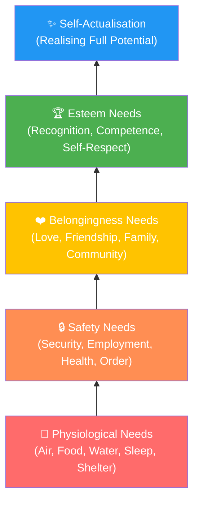
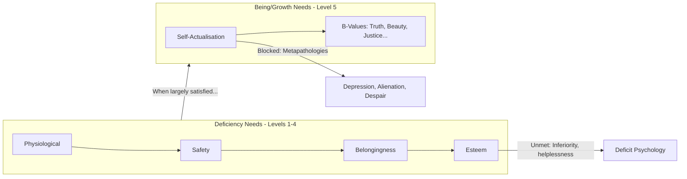

# Maslow's Hierarchy of Needs: From Survival to Self-Actualisation

## Introduction

In 1943, Abraham Maslow published "A Theory of Human Motivation" in *Psychological Review*, introducing what would become one of the most recognised frameworks in all of psychology and management science. His **hierarchy of needs** proposed that human motivation operates on multiple levels — and crucially, that lower-level needs must be substantially met before higher-level needs become motivating forces.

The pyramid image that most people associate with Maslow (though he never actually drew a pyramid in his writings) has been reproduced in psychology textbooks, management training programmes, and motivational posters worldwide. But there is much more to the theory than the visual metaphor suggests — including nuanced distinctions between deficit motivation and growth motivation, and deeply insightful observations about what fully functioning human beings actually look like.

---

## Abraham Maslow: The Man Behind the Theory

Abraham Maslow was born on April 1, 1908, in Brooklyn, New York, the son of Jewish immigrants from Russia. He received his BA (1930), MA (1931), and PhD (1934) in psychology from the University of Wisconsin, where he was influenced by behaviourist Harry Harlow. After graduation, he worked with E.L. Thorndike at Columbia, where his interests shifted from animal to human behaviour.

Teaching at Brooklyn College in the late 1930s and 1940s, Maslow encountered an extraordinary intellectual community — European psychoanalysts and Gestalt psychologists fleeing Nazi Germany, including Alfred Adler, Erich Fromm, and Karen Horney. This exposure broadened his thinking beyond experimental psychology.

A pivotal intellectual encounter occurred when Maslow met **Kurt Goldstein**, the neurologist and philosopher who had developed the concept of self-actualisation in *The Organism* (1934). Goldstein argued that all living organisms have a single master motive: to actualise their capacities. Maslow transformed this biological concept into a theory of human personality and motivation.

Maslow served as Chair of Psychology at Brandeis University (1951–1969) before spending his final years in California, where he died of a heart attack in 1970.

---

## The Architecture of Needs: Five Levels

Maslow proposed that human needs are hierarchically organised, with the most fundamental (and compelling) needs at the base. The key principle: **the lower a need in the hierarchy, the more prepotent (dominating) it is**. When multiple needs are simultaneously active, the lowest unsatisfied need will be most urgent.

Higher-order needs emerge into awareness only when lower-level needs are substantially satisfied. This sequential emergence is not rigid or absolute — Maslow acknowledged that needs can be partially satisfied, and exceptional individuals sometimes transcend basic needs for the sake of higher values — but the general pattern holds.

### Level 1: Physiological Needs

At the foundation are the **physiological needs** — the biological requirements for human survival: air, food, water, sleep, warmth, excretion, and shelter. These are the most powerful of all needs.

Maslow believed these needs are the most basic and instinctive, because all others become secondary until physiological needs are met. When the body lacks a certain substance, it develops a hunger for it (homeostasis); when satisfied, the hunger ceases. An organism facing starvation cannot attend meaningfully to the higher reaches of human potential — creativity and self-expression are luxuries when survival is threatened.

**Homeostatic principle**: Maslow applied the concept of homeostasis (the body's tendency to maintain equilibrium, like a thermostat) not only to physical needs but to psychological ones as well. When you lack safety, you seek it; when you have enough, the drive ceases.

### Level 2: Safety Needs

Once physiological needs are met, **safety needs** move to the foreground. These include:
- Physical safety and security from harm
- Steady employment and financial security
- Health insurance and access to healthcare
- Safe neighbourhoods and predictable environments
- Protection from the elements and natural disasters

Safety needs are not just about survival but about predictability and order. Human beings thrive when they can rely on a stable, orderly environment. Children who grow up in chaotic, unpredictable homes often develop chronic anxiety — their safety needs were never adequately met, and they carry that vigilance into adult life.

**Regression under stress**: During emergencies or periods of acute threat, people "regress" to safety concerns even if they were previously operating at higher levels. A secure professional facing job loss suddenly finds their entire motivational world contracted around financial security.

### Level 3: Belongingness and Love Needs

After physiological and safety needs are substantially met, **belongingness and love needs** emerge. These include:
- Warm, affectionate relationships
- Romantic partnerships
- Close friendships
- Family bonds
- Membership in social, cultural, or religious communities

Maslow considered these needs to be less urgent than survival needs but profoundly important to human wellbeing. Human beings are fundamentally social animals; the drive for connection and belonging is not a luxury but a deep psychological necessity.

Research strongly validates this. Studies of mortality show that social isolation is as deadly as smoking 15 cigarettes a day. The famous Harvard Study of Adult Development (over 75 years of follow-up) identified the quality of relationships as the single strongest predictor of health and happiness in old age.

**Relevance for India**: India's joint family system and strong community ties speak directly to belongingness needs. The widespread joint family arrangement provides built-in networks of support, belonging, and identity — a natural fulfilment of Level 3 needs that Western nuclear families often struggle to replicate.

### Level 4: Esteem Needs

The fourth level comprises **esteem needs** — needs for dignity, respect, and recognition. Maslow identified two versions:

**Lower esteem needs (esteem from others)**: The need for respect, recognition, status, fame, prestige, and attention from other people. These are external forms of esteem — how others see and value us.

**Higher esteem needs (self-esteem)**: The need for self-respect, competence, mastery, self-confidence, independence, and freedom. These rest on inner experience of capability — a sense of earned competence through real achievement.

Maslow ranked self-esteem above esteem from others because it is more stable and authentic. External recognition can be withdrawn; inner competence, once genuinely earned, is more durable.

**Consequences of unmet esteem needs**: Deprivation of esteem needs leads to feelings of inferiority, helplessness, and inadequacy. In severe cases, this can manifest as narcissistic disorders (compensatory inflated self-image masking deep inadequacy) or chronic depression and self-defeat.

### Level 5: Self-Actualisation

The apex of the hierarchy is **self-actualisation** — what Maslow described with the phrase: *"What a man can be, he must be."*

Self-actualisation refers to the fulfilment of one's full potential — becoming everything one is capable of becoming. Crucially, this is not a single universal endpoint but is *idiosyncratic*: one person's self-actualisation might be expressed in parenting, another's in athletic excellence, another's in scientific discovery, another's in spiritual practice.

Maslow emphasised that self-actualisation is not driven by deficiency (needing to fill a gap) but by the *positive desire for personal growth* — the intrinsic pull toward becoming more fully oneself. This is motivationally different from all lower needs.

---

## Deficiency Needs vs. Growth Needs

Maslow drew a fundamental distinction between **Deficiency Needs (D-Needs)** and **Growth Needs (B-Needs or Being Needs)** — one of the most important and often neglected aspects of his theory.

### Deficiency Needs (D-Needs): Levels 1–4

The first four levels — physiological, safety, belongingness, and esteem — are called **deficiency needs** because:
- They are activated by a *lack* — a felt deprivation
- When satisfied, they cease to motivate (the need disappears)
- Their satisfaction brings *relief* from tension, not positive joy
- They operate like homeostatic systems — you feel the need only when the balance is disturbed

Think of hunger: when you are hungry, the need to eat is compelling. Once you have eaten enough, you stop thinking about food. The D-need has been satisfied and no longer motivates. The same principle applies to safety, love, and esteem — they motivate only when deficient.

**Developmental trajectory**: In normal development, humans move through these levels progressively. As newborns, the entire world is physiological needs. Gradually, safety awareness emerges. Then social needs. Then esteem. This is the work of the first years and decades of life.

**Fixation under trauma**: If a particular need level was chronically unmet during development (severe hunger in childhood, unpredictable neglect, abusive relationships), a person may become "fixated" at that level — continuing to organise their motivational life around that deficit even when circumstances have changed. A child who grew up in poverty may remain preoccupied with financial security even after becoming wealthy.

### Growth Needs (B-Needs): Level 5

Self-actualisation, by contrast, operates on entirely different principles:
- It is activated by *abundance* rather than deficit — you can only pursue it when lower needs are sufficiently met
- Satisfying it *increases* the desire for more, rather than extinguishing it
- It involves *positive* motivation toward growth, not relief from tension
- It does not involve homeostasis — there is no "enough" point

Maslow also called these **Being Needs** (B-needs) — needs related to *being* more fully oneself, rather than filling a gap. He also discussed **metamotivation** — the specific quality of motivation at the self-actualisation level, directed toward **B-values** (Being-values or metavalues): truth, beauty, goodness, wholeness, aliveness, uniqueness, justice, order, simplicity, and so on.

When self-actualisers are *unable* to pursue their B-values — when they are forced to live in conditions that frustrate their growth — Maslow said they experience **metapathologies**: depression, despair, disgust, alienation, cynicism, and existential emptiness. These are not neurotic symptoms but healthy responses to being denied one's deepest nature.

---

## Mermaid Diagram: D-Needs vs. B-Needs

---

## How Development Unfolds

Maslow proposed a developmental sequence: we move through the levels not as sharp stages but as gradual shifts in motivational priority.

In infancy, physiological needs dominate completely. Within months, safety awareness emerges — the infant distinguishes secure from threatening environments. By toddlerhood, belongingness needs are clearly active. In childhood and adolescence, esteem needs become salient — identity, competence, and social recognition matter intensely. In adulthood, if lower needs are well met, self-actualisation becomes possible.

This developmental sequence is not deterministic — it can be arrested or distorted by trauma, neglect, chronic deprivation, or illness. And it is not one-way: people can regress under stress. Career failure may reactivate esteem deficits; bereavement may reactivate belongingness needs; economic collapse may reactivate safety needs.

---

## Critical Evaluation of the Hierarchy

### Strengths
- **Intuitive appeal**: The theory resonates with everyday experience — people who are hungry find it hard to concentrate on abstract goals
- **Practical applications**: Enormous influence in management, education, marketing, and therapy
- **Positive focus**: Directed psychology toward health, growth, and flourishing rather than only pathology
- **Holistic**: Treats human motivation as multi-dimensional rather than reducing it to a single drive

### Criticisms

**Methodological limitations**: Maslow arrived at the hierarchy partly through introspection and anecdote, not systematic empirical research. The specific ordering of needs has been challenged.

**Cultural bias**: The hierarchy reflects Western individualist values. Research shows that in collectivist cultures (China, Japan, Korea, India), belongingness needs may actually be more foundational than esteem needs, and self-actualisation may be understood in relational rather than individual terms.

**Artists and creators**: Many of history's greatest artists — Van Gogh, Kafka, Keats — created profound work despite poverty, illness, and social isolation. Their lower needs were hardly met, yet they self-actualised in Maslow's sense. This challenges the strict sequential model.

**Research support mixed**: Empirical tests of the hierarchy have produced inconsistent results. Wahba and Bridwell (1976) found little support for the specific ordering in their classic review. More recent research (Tay & Diener, 2011) found support for the *existence* of the five need categories but *not* for their strict hierarchical ordering.

**Elitism**: Maslow's claim that only 1–2% of people achieve self-actualisation, selected according to his own criteria, strikes many as elitist and methodologically circular.

---

## External Resources

### Wikipedia
- [Maslow's hierarchy of needs — Wikipedia](https://en.wikipedia.org/wiki/Maslow%27s_hierarchy_of_needs)
- [Self-actualisation — Wikipedia](https://en.wikipedia.org/wiki/Self-actualization)
- [Abraham Maslow — Wikipedia](https://en.wikipedia.org/wiki/Abraham_Maslow)

### Educational Videos
- [Maslow's Hierarchy of Needs — Crash Course Psychology #14](https://www.youtube.com/watch?v=vcB8JDkNMrg)
- [Abraham Maslow's Hierarchy of Needs Explained — Academy of Ideas](https://www.youtube.com/watch?v=gnj6k3fGHF0)
- [Does Maslow's Hierarchy of Needs Hold Up? — Big Think](https://www.youtube.com/watch?v=jJiEFVuN_W0)

### Recent Research (2020–2024)
- Kaufman, S.B. (2021). *Transcend: The New Science of Self-Actualization*. TarcherPerigee. — The most comprehensive contemporary rethinking of Maslow's pyramid, based on modern personality science.
- Reiss, S. (2022). "Maslow's Legacy: Myth, Truth and the Science of Motivation." *Frontiers in Psychology*, 13. — Critical evaluation of Maslow's contributions and limitations.
- Yang, Y. et al. (2023). "Cross-Cultural Validation of Maslow's Hierarchy of Needs." *Journal of Cross-Cultural Psychology*, 54(1), 45–63.
- Bridgman, T., Cummings, S., & Ballard, J. (2019). "Who Built Maslow's Pyramid? A History of the Creation of Management Studies' Most Famous Symbol." *Academy of Management Learning & Education*, 18(1), 81–98. — Fascinating history of how the pyramid diagram became detached from Maslow's actual ideas.

---

## Self-Assessment Questions

**Basic Level**
1. Name the five levels of Maslow's hierarchy from lowest to highest.
2. What is meant by "prepotency" of a need?
3. Distinguish between D-needs and B-needs (deficiency needs and growth/being needs).

**Intermediate Level**
4. How does the homeostatic principle explain the operation of deficiency needs? Give two examples.
5. A child who grew up in chronic poverty becomes a successful adult but remains obsessively focused on financial security. How does Maslow's theory explain this?
6. Why might the strict hierarchical ordering of needs be culturally biased? How might the hierarchy look different in a collectivist culture like India?

**Advanced Level**
7. Tay and Diener (2011) found support for Maslow's need categories but not their strict hierarchical ordering. What are the implications of this finding for the theory? Does it undermine the core framework?
8. Critically evaluate the claim that Maslow's theory is more philosophical wisdom than empirical science. What would be needed to make it genuinely scientific?

---

## Memory Aid: PSBES — "Psychology's Best Explanation of Survival"

**P**hysiological → **S**afety → **B**elongingness → **E**steem → **S**elf-Actualisation

Or alternatively: "People Seeking Beautiful, Enriching Satisfaction"

---

## Real-World Applications

**Management and HR**: Maslow's hierarchy is foundational to **motivation theories in management**. Herzberg's two-factor theory (hygiene factors parallel D-needs; motivators parallel B-needs) is directly inspired by Maslow. Contemporary HR practices around purpose-driven work, employee recognition, and team culture address different levels of the hierarchy.

**Marketing**: Brands explicitly appeal to different levels. Food and beverage advertising addresses physiological needs; security systems address safety needs; social media platforms address belongingness; luxury goods and professional development address esteem; transcendent brand experiences (Apple, Patagonia) address self-actualisation.

**Education**: Schools that first address students' safety (from bullying, from hunger — hence the importance of mid-day meals), then belonging (class community), then competence (esteem), create conditions for intellectual growth. The National Education Policy 2020 in India explicitly acknowledges the importance of addressing children's holistic wellbeing — a Maslovian insight.

**Positive Psychology Interventions**: Contemporary interventions targeting life satisfaction and flourishing often explicitly address Maslovian needs — interventions around gratitude and savouring (esteem/growth), social connection exercises (belongingness), and purpose/meaning programmes (self-actualisation).

---

**Source PDFs**:
- 📄 [Block-2/Unit-4.pdf — Pages 61–66](/pdfs/MPC-003%20Personality%20Theories%20and%20Assessment/Block-2/Unit-4.pdf)
- 📚 MPC-003 Personality Theories and Assessment
