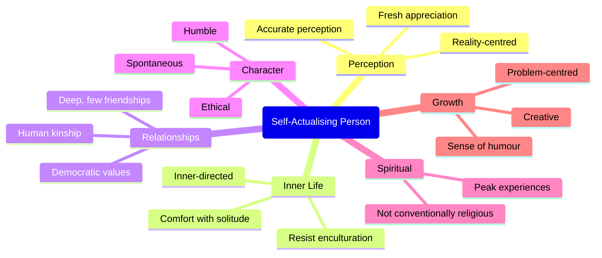

# Maslow's Self-Actualisation: Characteristics, Peak Experiences & Evaluation

## Introduction

What does a psychologically healthy, fully functioning human being actually look like? This is the question Abraham Maslow asked — and one almost no psychologist before him had systematically tried to answer. Most psychological research focused on what goes wrong with people: neurosis, psychosis, depression, anxiety. Maslow argued that to understand human nature fully, we need to study its upper range — the people who most fully realise their potential.

His method was **biographical analysis**: he selected a group of people — historical figures and contemporaries — whom he judged to exemplify psychological health and self-actualisation, then systematically identified the qualities they shared. The result was one of the most influential portraits of psychological maturity in the history of psychology.

---

## Who Were Maslow's Self-Actualisers?

Maslow's sample of self-actualising individuals included:

**Historical figures**: Abraham Lincoln, Thomas Jefferson, Albert Einstein, Eleanor Roosevelt, Jane Addams, William James, Albert Schweitzer, Benedict Spinoza, Aldous Huxley, Beethoven, Martin Buber, Walt Whitman, Goethe, Pablo Casals.

**Contemporary individuals**: Approximately 12 unnamed people Maslow knew personally and judged to meet the criteria.

This was not a random or representative sample — Maslow explicitly selected people he believed to exemplify self-actualisation. Critics rightly note this circularity: the characteristics are derived from people chosen because they were already considered self-actualising. Nevertheless, the profile Maslow generated has proved remarkably generative and resonant.

---

## The 18 Characteristics of Self-Actualisers

Maslow derived the following characteristics from his biographical analysis. These are not aspirational ideals but observed qualities — things these people actually demonstrated in their lives.

### 1. Reality-Centred

Self-actualisers can clearly distinguish what is real and genuine from what is fake and dishonest. They are remarkably good at detecting deception, pretension, and the artificial. This connects to their strong sense of identity — they are not easily fooled by surface appearances.

### 2. Problem-Centred

They approach life's challenges as **problems requiring solutions** rather than personal affronts or catastrophes. They maintain perspective and objectivity in the face of difficulties that would overwhelm ordinary people. They do not take problems personally but engage them practically.

### 3. Different Perception of Means and Ends

Self-actualisers do not simply believe "the ends justify the means." For them, the *process* (journey, means) is often more valuable than the outcome (ends). They find intrinsic satisfaction in activities rather than only instrumental value. A scientist who loves the process of inquiry independent of career rewards exemplifies this orientation.

### 4. Comfortable with Solitude

They genuinely enjoy being alone. This is not loneliness or social rejection but a genuine capacity for **productive solitude** — they can be self-sufficient without being cold or antisocial. They also enjoy deep relationships with a small number of people rather than shallow connections with many.

### 5. Enjoy Deep but Few Relationships

Related to comfort with solitude, self-actualisers tend to have a small circle of deep, authentic relationships rather than a large network of superficial ones. Quality, not quantity, characterises their social lives.

### 6. Autonomy from Physical and Social Needs

They are relatively **independent of both physical environment and social approval**. While not ascetics, they are not enslaved to comfort, luxury, or the good opinion of others. This inner-directedness gives them remarkable freedom to pursue their own values even when these conflict with social expectations.

### 7. Resist Enculturation (Nonconformists)

Self-actualisers do not simply absorb and conform to the values and norms of their culture. They maintain a capacity for **independent evaluation** — they accept some cultural conventions (to avoid unnecessary friction) but are not *defined* by them. They are nonconformists in the best sense: not rebellious for its own sake, but genuinely free to evaluate and choose.

### 8. Acceptance of Self and Others

They accept themselves — their strengths and weaknesses, their quirks and imperfections — without excessive guilt or self-criticism. Similarly, they accept others without trying to remake them. If a quality in themselves or others is not truly harmful, they let it be, even finding it charming. This does not mean they are complacent about genuine character flaws — they work actively to change those.

### 9. Spontaneous and Simple

Their behaviour is natural, authentic, and spontaneous rather than calculated or artificial. They behave consistently — what you see is what you get. They do not perform for audiences or maintain separate public and private selves.

### 10. Unhostile Sense of Humour

Their humour is thoughtful, philosophical, and self-aware — they joke at their own expense and at the human condition, never at the expense of others. They do not use humour to demean, belittle, or create "in-group/out-group" dynamics. Their laughter arises from genuine perception of life's absurdities rather than aggression.

### 11. Ethical Behaviour

They have a strong personal sense of right and wrong, though their ethics may not align with conventional morality. Their ethical behaviour flows from inner conviction, not social conformity or fear of punishment. They distinguish between means and ends and act with integrity even when it is costly.

### 12. Democratic Values

They possess what Maslow called **democratic character structure** — they are respectful toward all people regardless of social status, race, education, or background. They can learn from anyone. This connects to their deep respect for individual dignity.

### 13. Human Kinship (Social Interest)

Maslow borrowed this term from Alfred Adler — a deep sense of **identification with humanity as a whole**. Self-actualisers feel themselves to be part of the human family and feel genuine compassion for human suffering, even for people very different from themselves.

### 14. Humility and Respect

They are genuinely humble — not falsely modest, but aware of how much they do not know and respectful of others' contributions. This humility enables continued growth; they remain students of life.

### 15. Sense of Wonder and Fresh Appreciation

They can see the **beauty in ordinary things** with a freshness that has not been dulled by familiarity. A sunset, a piece of music, a mathematical proof — they can appreciate these again and again as if for the first time. This is the opposite of the jaded boredom that afflicts many people.

### 16. Spiritual but Not Conventionally Religious

They have what Maslow called **mystic experience** or **oceanic feeling** — moments of profound connection with something larger than themselves. But this spirituality is not confined to orthodox religion; it is a natural openness to transcendent experience regardless of theological framework.

### 17. Creative, Inventive, and Original

Not necessarily in the sense of artistic creation, but in a **fundamental, pervasive creativity** — an originality in perception and approach that can be applied to any domain. A self-actualising homemaker, factory worker, or businessman can be creative in their work without producing conventional "art."

### 18. Peak Experiences

Self-actualisers have more **peak experiences** than the average person — and they are more open to having them.

---

## Peak Experiences: Moments of Transcendence

**Peak experiences** are moments of profound happiness, wonder, and transcendence — what Maslow described as moments that "take you out of yourself." They can be triggered by nature, music, love, creative work, athletic performance, or spiritual practice.

During peak experiences:
- Normal boundaries of self temporarily dissolve
- The person feels connected to something larger — life, nature, humanity, the universe
- There is a sense of both smallness (awe) and expansion (unity with all)
- Time seems to stop or slow
- The experience feels deeply meaningful and even sacred

Peak experiences tend to:
- Leave a lasting positive mark on the person
- Produce greater openness, compassion, and zest for life
- Often trigger reassessment of values and priorities

Maslow considered peak experiences to be healthy, growth-promoting, and potentially spiritual — regardless of whether they occur in a religious context. A scientist experiencing a breakthrough, an athlete in a state of flow, an artist absorbed in creation — all may be having peak experiences.

**Connection to Flow**: Mihaly Csikszentmihalyi's concept of **flow** — optimal experience in which a person is fully absorbed in a challenging, meaningful activity — is closely related to peak experience and has been extensively researched. Flow experiences are associated with higher wellbeing, meaning, and life satisfaction.

---

## Imperfections of Self-Actualisers

Maslow was careful to note that self-actualised people are not perfect. He identified several characteristic imperfections:

1. **Anxiety and guilt** — though realistic rather than neurotic; they feel genuine remorse when they fall short of their values
2. **Absent-mindedness** — absorbed in their work or inner life, they can neglect practical matters
3. **Excessive kindness** — sometimes exploited
4. **Moments of ruthlessness** — a "surgical coldness" when they feel principle demands hard choices
5. **Occasional loss of humour** — under pressure or in moral conflict
6. **Metapathologies** — when unable to live by their B-values, they experience depression, alienation, cynicism, and despair

These imperfections make the portrait more credible and humanising. Self-actualisation is not sainthood.

---

## Comparison Table: Ordinary vs. Self-Actualising Motivation

| Dimension | D-Motivation (Ordinary) | B-Motivation (Self-Actualising) |
|-----------|------------------------|--------------------------------|
| Driven by | Deficiency, lack | Abundance, desire to grow |
| Goal | Tension reduction | Expansion, creativity |
| When satisfied | Drive stops | Drive continues or intensifies |
| Values pursued | Security, approval, status | Truth, beauty, justice, wholeness |
| Response to failure | Defence, anxiety | Learning, adjustment |
| Time orientation | Anxiety-driven past/future | Present-centred |

---

## Critical Evaluation of Maslow's Theory

### Unique Contributions

**Focus on healthy people**: Maslow's greatest innovation was studying flourishing rather than pathology. This redirected psychological attention to the upper range of human possibility.

**Inspirational framework**: The hierarchy and the concept of self-actualisation have inspired countless people in education, therapy, management, and personal development. Its influence on humanistic education, counselling, and organisational psychology is immeasurable.

**Hierarchy as practical tool**: Even if the strict ordering is not universal, the framework serves as a useful diagnostic tool — when helping an individual or designing a programme, attending to multiple levels of need is valuable.

### Methodological Criticisms

**Circular selection**: Maslow selected his sample based on his own intuitive judgement that they were self-actualising, then derived characteristics from this sample. This makes the results difficult to validate independently.

**Non-representative sample**: Historical figures, mostly Western, mostly male. The portrait of self-actualisation may reflect culturally specific rather than universal qualities.

**Observational data**: Biographical analysis is not a rigorous scientific method. It lacks controls, random sampling, and operationalised constructs.

### Theoretical Criticisms

**2% ceiling**: Maslow estimated that only about 1–2% of people achieve genuine self-actualisation. This raises the question: is this a meaningful psychological category if it applies to virtually nobody? Rogers disagreed, arguing that the actualising tendency operates in all living things.

**Artists without basic needs met**: Many creative geniuses produced their best work in poverty, illness, and social rejection. Keats wrote while dying of tuberculosis. Van Gogh was perennially destitute. Kafka was anxiety-ridden and socially isolated. This challenges the strict hierarchical model.

**Cultural specificity**: The emphasis on individual autonomy, resistance to enculturation, and self-directed growth reflects Western individualist values. Self-actualisation in collectivist cultures (India, Japan, China) may look different — more relational, community-oriented, and duty-bound.

---

## Recent Research: Scott Barry Kaufman's Rethinking

Scott Barry Kaufman's book *Transcend: The New Science of Self-Actualization* (2021) represents the most thorough contemporary engagement with Maslow's work. Key revisions include:

1. **Replacing the pyramid with a sailboat**: Kaufman argues the pyramid metaphor is misleading. A sailboat metaphor better captures how security (the boat hull) and growth (the sail) interact dynamically rather than sequentially.

2. **Integration of security and growth**: Rather than strict hierarchy, Kaufman argues for integrated development — security and growth needs can be addressed simultaneously, not only sequentially.

3. **Empirical measurement**: Using modern personality science, Kaufman developed empirical measures for self-actualisation characteristics and validated them across large samples.

4. **Adding Transcendence**: Maslow, in his later work, added a sixth level above self-actualisation — **transcendence** — involving self-transcendence and connection to something greater than oneself. Kaufman incorporates this into his revised framework.

---

## External Resources

### Wikipedia
- [Self-actualisation — Wikipedia](https://en.wikipedia.org/wiki/Self-actualization)
- [Peak experience — Wikipedia](https://en.wikipedia.org/wiki/Peak_experience)
- [Abraham Maslow — Wikipedia](https://en.wikipedia.org/wiki/Abraham_Maslow)
- [Flow (psychology) — Wikipedia](https://en.wikipedia.org/wiki/Flow_(psychology))

### Educational Videos
- [Maslow's Self-Actualisation and Peak Experiences — Psychology with Dr. D](https://www.youtube.com/watch?v=oi7KXyRs1tg)
- [Flow, the Secret to Happiness — Mihaly Csikszentmihalyi TED Talk](https://www.youtube.com/watch?v=fXIeFJCqsPs)
- [The Real Maslow: Rethinking the Pyramid — Scott Barry Kaufman TED Talk](https://www.youtube.com/watch?v=Ugwkm5Gs9Xs)

### Recent Research (2020–2024)
- Kaufman, S.B. (2021). *Transcend: The New Science of Self-Actualization*. TarcherPerigee. — Comprehensive modern revision of Maslow's theory with empirical grounding.
- Talevich, J.R. et al. (2022). "Toward a Comprehensive Taxonomy of Human Needs." *PLoS ONE*, 17(4). — Cross-cultural study of human need structures.
- Hopper, E. (2020). "Maslow's Hierarchy of Needs Explained." *ThoughtCo.* — Accessible contemporary overview.
- Dye, K., Mills, A.J., & Weatherbee, T. (2022). "Maslow: Man Interrupted — Reading Management Theory in Context." *Management Decision*, 60(6). — Historical and critical analysis of how Maslow's ideas were distorted in management contexts.

---

## Self-Assessment Questions

**Basic Level**
1. According to Maslow, what is a peak experience? Give an example.
2. List five characteristics of self-actualising people identified by Maslow.
3. What are metapathologies? When do they occur?

**Intermediate Level**
4. Distinguish between "reality-centred" and "problem-centred" as characteristics of self-actualisers. How are they related?
5. Maslow says self-actualisers "resist enculturation." What does this mean, and how is it different from mere rebelliousness?
6. How does Kaufman's "sailboat" metaphor improve on Maslow's "pyramid" in representing human motivation? What specific criticisms of the hierarchy does it address?

**Advanced Level**
7. Critically evaluate Maslow's biographical analysis method. What are its strengths and limitations as a basis for psychological knowledge? What alternative methods could be used to study self-actualisation more rigorously?
8. Apply Maslow's concept of self-actualisation to understand the career of a great Indian leader (e.g., Dr. B.R. Ambedkar, Mahatma Gandhi, or Dr. APJ Abdul Kalam). Does their life story support or challenge Maslow's hierarchical model?

---

## Memory Aid: PARDSAUHES — The Self-Actualiser

**P**roblem-centred  
**A**cceptance (self and others)  
**R**eality-centred  
**D**emocratic values  
**S**pontaneous  
**A**utonomous  
**U**nhostile humour  
**H**uman kinship  
**E**thical  
**S**ense of wonder

---

**Source PDFs**:
- 📄 [Block-2/Unit-4.pdf — Pages 63–66](/pdfs/MPC-003%20Personality%20Theories%20and%20Assessment/Block-2/Unit-4.pdf)
- 📚 MPC-003 Personality Theories and Assessment
