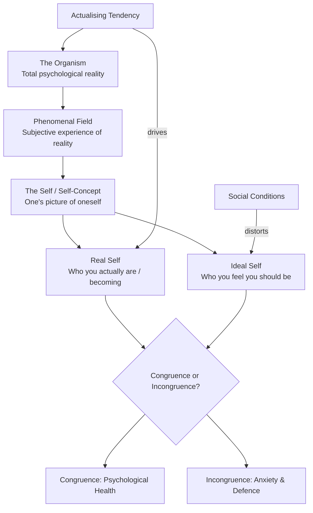

# Carl Rogers' Person-Centred Theory of Personality

## Introduction

Carl Rogers is arguably the most influential psychotherapist of the twentieth century. His theoretical framework — emerging from thousands of hours of careful clinical listening — transformed how we think about personality, psychological health, and the conditions under which human beings grow and change.

Unlike Freud, who saw human nature as fundamentally conflicted and in need of management, Rogers saw it as fundamentally trustworthy — oriented toward growth, honesty, and fulfilment when not distorted by social conditioning. Unlike Maslow, whose self-actualisation was a peak achieved by the rare few, Rogers saw the actualising tendency as operative in every living organism — from the simplest plant to the most complex human being.

Rogers' theory is known by several names: **person-centred theory**, **self-theory**, and **client-centred theory** (referring to the therapeutic application). It is fundamentally **phenomenological** — centred on the lived, subjective experience of the person — and **idiographic** — concerned with the unique individual rather than general laws.

---

## Carl Rogers: The Person Behind the Theory

Carl Rogers was born on January 8, 1902, in Oak Park, Illinois, into a devout Protestant family. Raised on a farm from age 12, he developed a capacity for patient observation of living things — a quality that would later characterise his therapeutic presence. He initially trained for the Protestant ministry at Union Theological Seminary in New York City, then transferred to Teachers College, Columbia University to pursue counselling.

Throughout the 1930s, Rogers worked in child psychology, developing his clinical sensibility. In 1940, he joined Ohio State University, where he began articulating what would become his theoretical framework. His landmark publications include:
- *Counseling and Psychotherapy* (1942) — introducing non-directive therapy
- *Client-Centered Therapy* (1951) — full elaboration of the person-centred approach
- *On Becoming a Person* (1961) — his most widely read work, accessible and personal
- *Person to Person* (1967) — co-authored with Barry Stevens

Rogers spent his final decades in La Jolla, California, applying his ideas to large group processes and international conflict resolution. He died in 1987, having become one of the most translated psychologists in the world.

Rogers' greatness lay partly in his intellectual courage — he was among the first to conduct empirical research on psychotherapy outcomes, recording sessions and analysing transcripts, which was controversial at the time. His commitment to both rigorous inquiry and humanistic values made him a bridge-builder between science and the helping relationship.

---

## Core Components of Rogers' Theory

Rogers' theory can be organised around three interconnected constructs: **(1) the Organism and Phenomenal Field**, **(2) the Self (Real and Ideal)**, and **(3) the Actualising Tendency**. These give rise to the key dynamics of **congruence and incongruence**, and the account of **psychological development**.

---

## 1. The Organism and Phenomenal Field

### The Organism

For Rogers, the **organism** is the totality of the person — biological, psychological, and social — as a whole. It is the *locus of all experience*: everything that is potentially available to awareness at any given moment.

Rogers' view of the organism is characteristically optimistic: *"the core of man's nature is essentially positive"* and human beings are *"trustworthy organisms."* This is not sentiment but a considered philosophical stance that emerged from his clinical experience: when people are truly heard and accepted, they tend toward growth, authenticity, and prosocial behaviour rather than destructiveness.

### The Phenomenal Field

The **phenomenal field** is the totality of experience — both conscious and unconscious — as perceived and organised by the individual. It constitutes the person's private, subjective frame of reference — their unique reality.

The phenomenal field is, by definition, **known only to the person themselves**. Another person can approximate knowledge of it through careful, empathetic listening — but can never know it perfectly. This is why Rogers emphasised the therapeutic value of deep listening: the therapist attempts to enter the client's phenomenal world as fully as possible.

A crucial principle follows: **behaviour is determined by the phenomenal field (subjective reality), not by external stimuli (objective reality)**. To understand why a person behaves as they do, you must understand how they perceive and experience their world — not merely what is "objectively" happening.

Two people in the same external situation may behave entirely differently because their phenomenal fields differ. A job interview experienced as exciting by one candidate is experienced as terrifying by another; the objective event is identical but the phenomenal reality — and thus the behaviour — differs profoundly.

---

## 2. The Self: Real and Ideal

### Self-Concept

The **self** (or self-concept) is the organised, consistent set of perceptions and beliefs about oneself — one's picture of "I" and "me," including:
- Perceptions of one's characteristics
- Perceptions of one's relationships
- Values attached to these perceptions

The self-concept is central to Rogers' theory of personality — it is the organising principle around which experiences are interpreted and behaviour directed. Rogers described it as a "gestalt" — a patterned whole that is more than the sum of its parts.

The self-concept is not static but developed through experience, particularly through interactions with significant others. It is the *central psychological structure* that must be protected, that defines who we are, and that shapes how we interpret incoming experience.

### The Real Self

The **real self** is the person you actually are — or more precisely, the person you are becoming through the process of actualisation. It is grounded in the organism's actual experience, drives, feelings, and needs. The real self is not a fixed entity but a direction — the trajectory of authentic development.

Rogers saw the real self as fundamentally healthy and growth-oriented. When freed from distorting social demands, the real self naturally develops in the direction of greater complexity, differentiation, and integration.

### The Ideal Self

The **ideal self** is the self-concept one *wishes* one were — the person one feels one *should* be according to the values, standards, and expectations of significant others and society.

Rogers carefully distinguished between a healthy ideal self (aspirational, growth-oriented, one that motivates genuine development) and a distorted ideal self (an impossible standard imposed by others that can never be met because it does not correspond to who one actually is).

The ideal self created by social demands and conditional love is not something to strive for (that is the real self's function) but an external imposition that creates perpetual feelings of inadequacy. For an individual to achieve genuine happiness and self-actualisation, **the real self and ideal self must be as similar (congruent) as possible**.

---

## 3. Congruence and Incongruence

This is arguably Rogers' most clinically important concept — the relationship between the self-concept and the organism's actual experience.

### Congruence

**Congruence** exists when the self-concept *accurately reflects* the organism's actual experience. When what you believe about yourself corresponds to what you actually feel and experience, you are **psychologically adjusted, mature, and fully functioning**.

A congruent person:
- Accepts and "owns" their full range of experiences, including uncomfortable ones
- Does not need to distort or deny experiences to protect their self-concept
- Can update their self-concept as new experiences occur
- Is authentic — their behaviour matches their inner experience

Congruence does not mean perfect clarity or absence of conflict — it means that the self-concept is open and flexible enough to accommodate experience as it actually occurs.

### Incongruence

**Incongruence** arises when the self-concept *does not accurately reflect* actual experience — when there is a gap between who you believe you are and what you actually experience.

Rogers observed that much psychological disturbance results from this incongruence. When experiences occur that contradict the self-concept, they are perceived as threatening. To protect the self-concept, the person deploys **defence mechanisms** — specifically, Rogers identified two:

**Distortion**: The threatening experience is allowed into awareness but its meaning is altered so it seems consistent with the self-concept. For example, if your self-concept includes "I am a caring person," but you feel genuine anger at your child, you might distort this as "I am justifiably concerned about their behaviour" — reframing anger as concern.

**Denial**: The threatening experience is not allowed into awareness at all. It is screened out before it can reach consciousness. If you believe "I am not an angry person," genuine anger may simply be blocked from awareness.

Both mechanisms reduce anxiety in the short term but prevent growth and create increasing rigidity in the self-structure.

### Progression of Incongruence: From Neurosis to Psychosis

Rogers described a progression in the severity of incongruence:

1. **Mild incongruence**: Some experiences are distorted or denied, but the person functions adequately. They may experience occasional anxiety, emotional flatness, or a vague sense of inauthenticity.

2. **Neurosis**: Significant incongruence produces chronic anxiety, rigid defences, relationship difficulties, and persistent psychological distress. The person is "always on the defensive" and cannot be open to experience.

3. **Psychotic break**: If the defensive system becomes overwhelmed — if too many contradictory experiences force their way into awareness — the self-concept disorganises. The result is the fragmented, bizarre behaviour associated with psychosis: denied aspects of self erupt uncontrollably.

This continuum suggests that many forms of psychological disturbance exist on a single dimension — the degree of incongruence between self and experience — rather than as categorically different conditions.

---

## 4. Self-Actualisation: The Single Motivating Force

Unlike Maslow's multi-layered hierarchy of needs, Rogers proposed a **single motivating principle**: the **actualising tendency**.

Rogers (1959) maintained that every organism — from the simplest bacterium to the most complex human being — possesses an inherent tendency to develop all its capacities in ways that maintain or enhance the organism and move it toward greater autonomy. This tendency is:
- **Directional**: always pointing toward growth, complexity, and autonomy
- **Constructive**: oriented toward health rather than destruction
- **Indestructible**: it can be suppressed (by harsh environments, trauma, or distorting conditions) but never permanently eliminated without destroying the organism itself
- **Selective**: it attends only to those aspects of the environment that promise constructive development

The single goal of life, in Rogers' framework, is **to become more fully oneself** — to become self-actualised. This is not a destination but a process: an ongoing movement toward greater authenticity, openness, and integration.

Rogers described the **fully functioning person** as the ideal outcome of this process:
- **Open to experience**: no experiences need to be denied or distorted
- **Existential living**: living fully in each moment, not defensively pre-scripting experience
- **Organismic trust**: trusting one's own feelings and reactions as reliable guides
- **Freedom and creativity**: living as the author of one's own choices
- **Psychological richness**: experiencing the full range of human feeling, including fear and pain

---

## 5. The Development of Self

Rogers, unlike Freud, Sullivan, and Erikson, did not propose a stage theory of personality development. Development for Rogers is not a sequence of universal stages but an ongoing, idiosyncratic process of building, testing, and refining the self-concept in relation to experience.

### The Role of Positive Regard

From early childhood, the need for **positive regard** — love, warmth, approval, and acceptance from others — is deeply motivating. Parents are the primary source of positive regard, and children are exquisitely sensitive to their reactions.

**Unconditional positive regard**: The ideal developmental condition is one in which children feel loved and valued regardless of their specific behaviours and feelings — *unconditional* acceptance of the person, even while specific behaviours may be redirected.

**Conditional positive regard**: The problem arises when positive regard is given *conditionally* — you are loved when you behave in certain ways (feelings, expressions, choices) and not loved when you do not. The child then learns to suppress or deny the experiences and feelings that attract disapproval.

### Conditions of Worth

Through conditional positive regard, children develop **conditions of worth** — internal standards specifying what they must be like to be worthy of love and regard. These become internalised as part of the self-concept: "I am only loveable if I am strong/kind/successful/obedient."

Conditions of worth are the primary source of incongruence. When you experience something that violates your conditions of worth (feeling angry when you "should" be grateful; feeling afraid when you "should" be brave), the experience cannot be accurately symbolised — it must be distorted or denied.

### A Developmental Example (from the IGNOU text)

Rogers illustrates this with a vivid example: A three-year-old boy who resents the arrival of a new sibling feels hostile toward the baby — a perfectly natural, authentic emotional response to competition for parental attention. When his mother catches him pinching the baby, she punishes him and demands that he love his sister.

The conflict: the boy's genuine feeling (hostility) contradicts what his mother requires of him (love). Since the mother's approval is vital, the boy may alter his self-concept to exclude hostility: "I do not feel angry at my sister." The emotion is denied, and a self-concept inconsistent with actual experience is formed.

Rogers identified three crucial points for parents in such situations:
1. **Acknowledge the child's feeling** — "You feel angry at your sister right now."
2. **Avoid threatening loss of love** — the worst punishment is withdrawal of affection
3. **Redirect the behaviour** — the hostile *action* can be clearly prevented without denying the *feeling*

This allows the child to integrate their authentic experience ("I feel angry") with a realistic self-concept without being forced into denial or distortion.

---

## Comparison: Rogers vs. Maslow

| Dimension | Maslow | Rogers |
|-----------|--------|--------|
| View of self-actualisation | Peak achieved by 1-2%; hierarchy prerequisite | Continuous tendency in all living things |
| Motivation | Multiple levels (hierarchy) | Single: actualising tendency |
| Focus | Characteristics of self-actualisers | Self-concept and its development |
| Development | Stage-like progression through needs | Continuous, non-staged; shaped by conditions of worth |
| Therapy | Education/environment (indirect) | Person-centred therapy (direct) |
| Method | Biographical analysis | Clinical observation; phenomenology |
| Core problem | Unmet needs | Incongruence between self and experience |

---

## Evaluation of Rogers' Theory

### Contributions

**Emphasis on therapeutic relationship**: Rogers' identification of *empathy*, *congruence*, and *unconditional positive regard* as core therapeutic conditions has been enormously influential. Meta-analyses consistently show that these "common factors" predict therapeutic outcome as much as specific techniques.

**Phenomenological perspective**: Rogers' insistence on understanding behaviour from the client's perspective transformed clinical practice — from diagnosing and treating to listening and facilitating.

**Research on psychotherapy**: Rogers' commitment to recording and studying therapy sessions pioneered the empirical study of the therapeutic process.

**Democratising therapy**: Person-centred therapy is accessible, non-hierarchical, and applicable across cultures. Rogers' ideas spread worldwide and influenced counselling in India, Japan, South Africa, and many other cultures.

**Self-concept research**: Rogers inspired enormous research on self-concept, self-esteem, and self-consistency that continues today.

### Criticisms

**Neglect of the unconscious**: Rogers accepted client self-reports as essentially accurate reflections of experience. Psychoanalytic critics argue that unconscious processes — not accessible to self-report — shape behaviour in profound ways that Rogers' framework ignores.

**Naïve phenomenology**: Rogers' acceptance of subjective experience as the primary datum of psychology has been criticised as epistemologically naive — self-reports are subject to distortions, motivated reasoning, and cultural framing.

**Surface focus**: The theory deals primarily with conscious experience and self-concept; it does not explore deeper developmental history, neurobiological foundations, or systemic social factors.

**Insufficient theory of psychopathology**: While Rogers offers a continuum from congruence to incongruence, this single dimension may be insufficient to account for the complexity of psychological disorders.

**Cultural limitations**: The emphasis on individual authenticity, self-acceptance, and autonomy from social expectations reflects individualist Western values. In cultures where self is fundamentally relational and group harmony is paramount, these values may not translate straightforwardly.

---

## External Resources

### Wikipedia
- [Carl Rogers — Wikipedia](https://en.wikipedia.org/wiki/Carl_Rogers)
- [Person-centred therapy — Wikipedia](https://en.wikipedia.org/wiki/Person-centered_therapy)
- [Congruence (psychology) — Wikipedia](https://en.wikipedia.org/wiki/Congruence_(psychology))
- [Unconditional positive regard — Wikipedia](https://en.wikipedia.org/wiki/Unconditional_positive_regard)

### Educational Videos
- [Carl Rogers' Person-Centred Theory — Crash Course Psychology](https://www.youtube.com/watch?v=1qBxIzVeMnA)
- [Congruence and Incongruence in Rogers' Theory — Simply Psychology](https://www.youtube.com/watch?v=7K-HVWK5g3Q)
- [Carl Rogers on Empathy — Historic Interview](https://www.youtube.com/watch?v=iMi7uY83z-U) — Rare footage of Rogers discussing his core concepts

### Recent Research (2020–2024)
- Cooper, M. & Dryden, W. (Eds.) (2020). *The Handbook of Pluralistic Counselling and Psychotherapy*. Sage. — Contemporary applications of person-centred ideas in pluralistic practice.
- Kirschenbaum, H. (2022). "The Current Status of Carl Rogers and the Person-Centered Approach." *Psychotherapy*, 59(3), 380–391.
- Wilkins, P. (2021). *Person-Centred Therapy: 100 Key Points and Techniques* (2nd ed.). Routledge.
- Josefsson, T. et al. (2023). "Self-Concept Clarity and Psychological Wellbeing: A Systematic Review and Meta-Analysis." *Psychological Bulletin*, 149(1-2), 1–32. — Modern research on self-concept congruence and wellbeing.

---

## Self-Assessment Questions

**Basic Level**
1. What is the "phenomenal field" in Rogers' theory? Why is it important for understanding behaviour?
2. Distinguish between the "real self" and the "ideal self" in Rogers' framework.
3. What is congruence? What happens when a person experiences significant incongruence?

**Intermediate Level**
4. Explain how "conditions of worth" develop and how they contribute to psychological problems according to Rogers.
5. Rogers proposed only one motivating force (the actualising tendency) while Maslow proposed a hierarchy of needs. Evaluate these two approaches — which is more theoretically powerful? Which is more empirically supported?
6. Using the example of the three-year-old boy and his new sibling, explain the Rogerian perspective on how self-concept develops. What does Rogers say parents should do, and why?

**Advanced Level**
7. Psychoanalytic critics argue that Rogers' theory ignores the unconscious and therefore gives an incomplete account of personality. How might Rogers respond to this criticism? Who do you think is more persuasive?
8. Compare Rogers' concept of "fully functioning person" with Maslow's concept of "self-actualising person." Are these essentially the same construct, or are there important differences? What research could be done to distinguish them empirically?

---

## Memory Aid: ROSCA — Rogers' Core Concepts

**R**eal Self (authentic, actualising)  
**O**rganism (locus of all experience)  
**S**elf-concept (organised picture of "I")  
**C**ongruence/Incongruence (self-experience match)  
**A**ctualising Tendency (single motivating force)

---

## Real-World Applications

**Counselling and Psychotherapy**: Person-centred therapy is one of the most widely practised therapeutic approaches in the world. Evidence supports its effectiveness for depression, anxiety, trauma, and relationship difficulties. The core conditions — empathy, congruence, unconditional positive regard — have been validated in hundreds of outcome studies.

**Education**: Rogers applied his ideas to education in *Freedom to Learn* (1969), arguing that the best learning occurs when students are intrinsically motivated and the teacher acts as a facilitator rather than an authority figure who transmits knowledge. Concepts like student-centred learning, formative feedback, and safe classroom environments all reflect Rogerian principles.

**Organisational Development**: Person-centred principles have been applied to organisational settings — emphasising genuine listening, trust in employees' self-direction, and creation of conditions for authentic engagement. This parallels contemporary research on psychological safety in workplaces (Amy Edmondson's work at Harvard).

**Conflict Resolution**: Rogers spent his final years applying person-centred principles to international and political conflicts, facilitating large groups in places like Northern Ireland and South Africa. His work demonstrated that deep listening and genuine acceptance of the other's perspective could reduce hostility between groups with profound historical grievances.

**Indian Context**: Rogers' emphasis on empathetic listening resonates with the counselling traditions in India where *shravana* (attentive listening) is a classical value. Contemporary Indian counsellors have adapted person-centred approaches within cultural contexts that emphasise family and community alongside individual self-concept. The challenge of balancing individual authenticity with relational obligations is a live theoretical and clinical issue in Indian psychology.

---

**Source PDFs**:
- 📄 [Block-2/Unit-4.pdf — Pages 67–76](/pdfs/MPC-003%20Personality%20Theories%20and%20Assessment/Block-2/Unit-4.pdf)
- 📚 MPC-003 Personality Theories and Assessment
