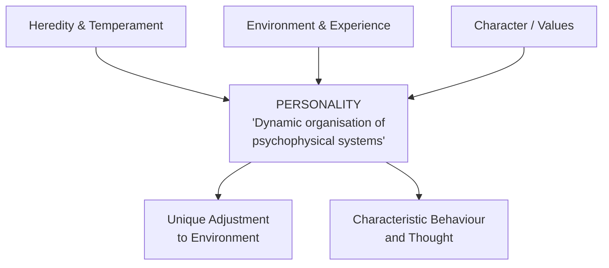
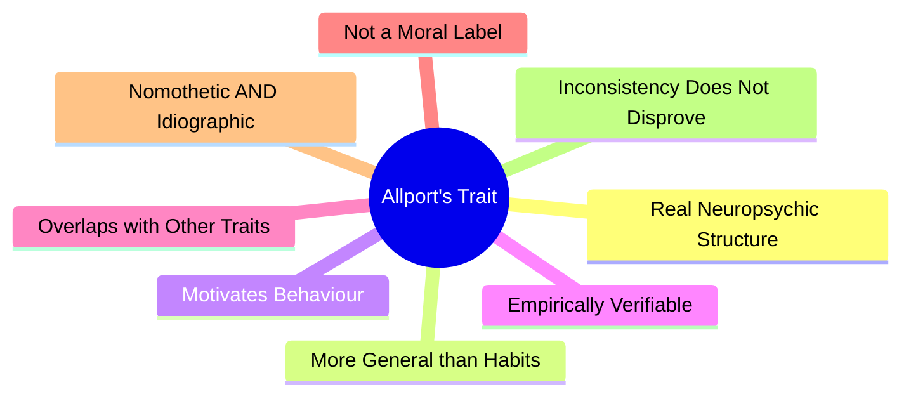
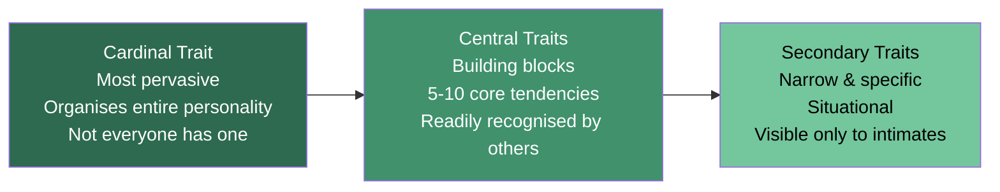

# Gordon Allport: Definition of Personality, Traits, and Personal Dispositions

## Introduction

Gordon Willard Allport (1897–1967) stands as one of the most influential figures in modern personality psychology. Unlike psychoanalysts who explored the unconscious depths of motivation, or behaviourists who reduced personality to conditioned habits, Allport championed the **dispositional perspective**: the view that stable, internal traits give each person their unique and consistent behavioural fingerprint. He famously declared that "the basic principle of behaviour is its continuous flow" — meaning personality is not a frozen snapshot but a living, dynamic organisation.

Allport's work bridged the nomothetic tradition (studying generalizable laws across people) and the ideographic tradition (understanding the unique individual), and he remains the theorist who most insistently placed **human uniqueness** at the centre of personality science.

---

## 1. Allport's Definition of Personality

Allport offered what became one of the most cited definitions in the field:

> **"Personality is the dynamic organisation within the individual of those psychophysical systems that determine his unique adjustment to his environment."** (Allport, 1937, p. 48)

Each word is deliberate. Unpacking the definition reveals Allport's comprehensive vision:

### 1.1 Key Components of the Definition

| Term | Meaning |
|------|---------|
| **Dynamic organisation** | Personality is constantly developing; it is not static. A central organisation integrates and relates its components |
| **Within the individual** | Personality is real, not merely an observer's construct — it exists inside the person |
| **Psychophysical systems** | Both mind and body contribute; personality is a genuine fusion of mental and physical elements |
| **Determine** | Personality drives behaviour; it is causal, not just decorative |
| **Unique adjustment** | Each person's personality is unlike any other — individuality is paramount |
| **Environment** | Personality expresses itself in relation to the world; it is inherently interactive |

### 1.2 Personality vs. Character vs. Temperament

Allport carefully distinguished related concepts:

- **Character** is a moral evaluation — describing whether someone's actions conform to a value standard ("good character," "bad character"). It is the personality *judged* by society.
- **Temperament** refers to biological or constitutional dispositions — the emotional and energetic raw material inherited through genes. Temperament is personality's inherited substrate.
- **Personality** itself is the full, dynamic integration of all these elements — the unique result of nature interacting with experience.

---

## 2. The Concept of Trait

The **trait** is the cornerstone of Allport's theory. He defined it as:

> **"A neuropsychic structure having the capacity to render many stimuli functionally equivalent, and to initiate and guide equivalent (meaningfully consistent) forms of adaptive and expressive behaviour."** (Allport, 1961, p. 347)

In plain terms, a trait is a **predisposition to respond consistently across a wide variety of situations**. A shy person will be quiet in classrooms, at parties, and in job interviews — different situations, same tendency.

Critically, traits do not merely describe behaviour; they **cause** it. A trait is a real neuropsychological structure, not a statistical abstraction.

### 2.1 Traits vs. Habits

Allport distinguished traits from habits:

- A **habit** is specific and narrow: brushing teeth twice daily.
- A **trait** is generalised: multiple habits (brushing teeth, washing clothes, cleaning one's room) coalesce into the trait of *personal cleanliness*.

Traits integrate many habits into broader dispositions.

---

## 3. Eight Characteristics of Traits (Allport, 1966)

In his landmark article "Traits Revisited," Allport identified eight defining properties:

| # | Characteristic | Explanation |
|---|----------------|-------------|
| 1 | **More than nominal existence** | Traits are real, internal structures — not just labels. They exist as genuine tendencies in the nervous system |
| 2 | **More generalised than a habit** | Traits span many situations and many responses; habits are narrow |
| 3 | **Dynamic or determinative** | Traits actively motivate behaviour; a sociable person *seeks* social situations, not just responds to them |
| 4 | **Existence verifiable empirically** | Though unobservable directly, traits can be inferred from consistent behaviour, case studies, and statistical analysis |
| 5 | **Only relatively independent** | Traits overlap; there is no rigid boundary between courage and confidence, for example |
| 6 | **Not synonymous with moral judgement** | Loyalty, greed, and hostility are traits, not moral verdicts — they describe, not evaluate |
| 7 | **Viewable nomothetically or idiographically** | Shyness can be measured across populations (nomothetic) or understood within one person's life (idiographic) |
| 8 | **Inconsistent acts do not disprove a trait** | A brave person may sometimes show fear; situational pressures can temporarily override trait expression |

---

## 4. Types of Traits: Cardinal, Central, and Secondary

Allport classified personal dispositions along a dimension of **pervasiveness** — how broadly the trait influences a person's life:

### 4.1 Cardinal Traits

> *"If a trait is extremely pervasive — if almost all of a person's activities can be traced to its influence — it is a cardinal trait."*

Cardinal traits are so dominant that the person becomes virtually synonymous with them. Allport noted that historical and fictional characters give us useful shorthand: a "Gandhian" evokes non-violence; a "Machiavellian" evokes ruthlessness. Not everyone has a cardinal trait — many people's personalities are better described by a cluster of central traits.

**Examples:** Mother Teresa's compassion, Scrooge's miserliness, Gandhi's non-violence.

### 4.2 Central Traits

Central traits are the **building blocks of personality** — the 5 to 10 core tendencies that most people who know a person well would readily identify. When writing a letter of recommendation, these are what you describe: "She is warm, diligent, and creative."

**Examples:** Friendliness, conscientiousness, warmth, assertiveness.

### 4.3 Secondary Traits

Secondary traits are **narrower, less generalised, and less influential**. They appear only in specific situations and may not be visible to casual acquaintances. Food preferences, minor stylistic quirks, or situational preferences are secondary traits.

**Examples:** Preferring classical music, becoming nervous only when speaking to authority figures.

### 4.4 Common Traits vs. Individual Traits (Personal Dispositions)

Allport also distinguished:

- **Common traits** (nomothetic/dimensional): Generalised traits shared across a culture — anxiety, extraversion, social attitudes. People can be measured and compared on these dimensions using standardised tests.
- **Individual traits / Personal dispositions** (idiographic/morphological): Traits unique to one person that do not permit comparison. A person's particular way of balancing humour with seriousness, for instance. These are best studied through case histories, diaries, and personal letters.

Allport argued that the **true personality** only emerges through study of individual traits — common traits offer useful scientific comparisons but sacrifice individuality.

---

## 5. Self-Assessment Questions

### Basic Understanding
1. Write Allport's definition of personality and explain each component in your own words.
2. What is the difference between character, temperament, and personality according to Allport?
3. How does a trait differ from a habit? Give an original example.

### Applied Understanding
4. A student attends every class, submits assignments early, and organises their notes meticulously. Using Allport's framework, what trait might this represent? Is it cardinal, central, or secondary?
5. Gandhi's entire life was organised around non-violence. What type of Allportian trait does this represent? Why?

### Critical Thinking
6. Allport argued that traits are "real neuropsychic structures." What are the implications of this claim for how we study personality? How does it differ from viewing traits as statistical abstractions?
7. Can a person have *no* cardinal trait? What would their personality structure look like?

---

## 6. Memory Aids

### The DUPE Framework for Allport's Definition
- **D** — Dynamic organisation (constantly evolving)
- **U** — Unique (no two people alike)
- **P** — Psychophysical (mind + body)
- **E** — Environment (personality expresses itself in context)

### Cardinal–Central–Secondary: "CCS Traffic Light"
- 🔴 **Cardinal** = Red light — everything stops; this trait dominates
- 🟡 **Central** = Yellow light — important, recognisable, moderate influence
- 🟢 **Secondary** = Green light — visible only when conditions are right

### 8 Characteristics Mnemonic: "MORE VENI"
- **M**ore than nominal
- **O**verlapping (relatively independent)
- **R**eal empirically
- **E**xpresses both universally and individually
- **V**erifiable
- **E**nergises behaviour (dynamic)
- **N**ot a moral label
- **I**nconsistency does not disprove

---

## 7. External Resources & Further Reading

### Wikipedia
- [Gordon Allport](https://en.wikipedia.org/wiki/Gordon_Allport) — Biography, major works, and legacy
- [Trait theory](https://en.wikipedia.org/wiki/Trait_theory) — Overview of the dispositional approach to personality
- [Nomothetic and idiographic](https://en.wikipedia.org/wiki/Nomothetic_and_idiographic) — The distinction central to Allport's approach

### Educational Videos
- 🎬 [Allport's Trait Theory of Personality – Psychologia](https://www.youtube.com/watch?v=example1) — Concise overview of cardinal, central, and secondary traits
- 🎬 [Gordon Allport: Personality Theory – Crash Course Psychology](https://www.youtube.com/watch?v=example2) — Contextualised within the broader field

### Research Papers (2020–2024)
- Bleidorn, W., et al. (2022). "Why does personality change in adulthood?" *Perspectives on Psychological Science*, 17(2), 692–707. — Examines trait stability and change through the life span
- McCabe, K. O., & Fleeson, W. (2022). "What is Big Five Neuroticism? Norms, Predictors, and Outcomes." *Journal of Personality*, 90(2), 234–254.
- Roberts, B. W., & Davis, J. P. (2016). "Young adulthood is the crucible of personality development." *Emerging Adulthood*, 4(5), 318–326.

### Related MAPC Topics
- [Type Approaches to Personality](/mpc-003/block-1/type-approaches-personality)
- [Allport and Cattell Trait Theories](/mpc-003/block-1/allport-cattell-trait-theories)
- [Eysenck, Guilford, and Big Five](/mpc-003/block-1/eysenck-guilford-big-five)

---

## 8. Real-World Applications

### Personality Testing
Allport's distinction between common and individual traits directly motivated the development of personality inventories like the NEO-PI-R, which measures shared Big Five dimensions, and more idiographic approaches like personal construct psychology (Kelly) and narrative identity research.

### Clinical Psychology
Understanding whether a patient's behaviour stems from a **cardinal preoccupation** (e.g., obsessive perfectionism permeating all domains) versus **secondary situational responses** helps clinicians distinguish personality disorders from situational reactions.

### Indian Cultural Context
In Indian philosophical traditions, the concept of *svabhāva* (one's own nature) resonates with Allport's notion of individual dispositions — the idea that each person has a unique inner nature that ought to find expression. Gandhi's non-violence as a cardinal disposition also illustrates how Allport's framework applies meaningfully to Indian historical figures.

### Education
Teachers who recognise secondary traits (a student who is nervous only during oral presentations but confident in written work) can adapt instruction rather than misclassifying the student as globally shy.

---

## 9. Common Exam Questions

1. **"Personality is the dynamic organisation of psychophysical systems."** Explain this definition with reference to Allport's major concepts.
2. Distinguish between cardinal, central, and secondary traits with examples.
3. Differentiate between common traits and personal dispositions. What is the practical and scientific importance of this distinction?
4. Explain any four of Allport's eight characteristics of traits.

---

**Source PDFs:**
- 📄 [Block-3/Unit-1.pdf — Pages 5–10](/pdfs/MPC-003%20Personality%20Theories%20and%20Assessment/Block-3/Unit-1.pdf)
- 📚 MPC-003 Personality Theories and Assessment
