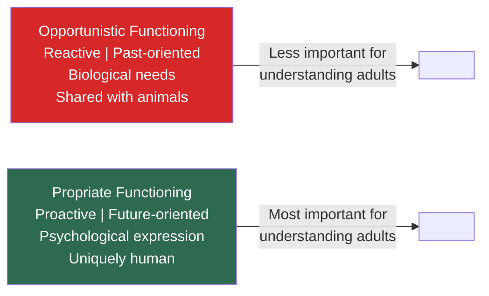
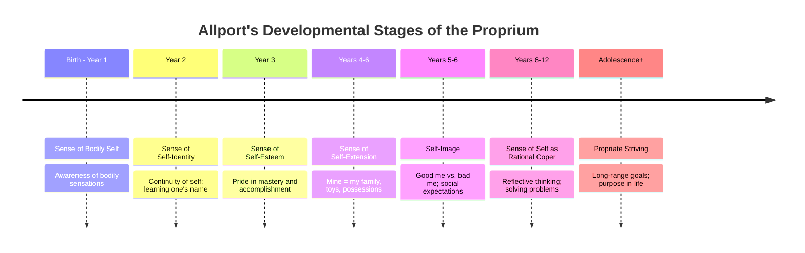

# Gordon Allport: The Proprium and Development of Selfhood

## Introduction

If traits define *what* a person consistently does, the **proprium** defines *who* that person fundamentally is. Allport coined the term proprium (from Latin *proprius*, meaning "one's own") as a scientifically neutral substitute for the psychologically loaded word "self." He believed that understanding personality requires understanding the self — not as a metaphysical mystery, but as a concrete cluster of functional aspects that develop systematically from infancy through adulthood.

The proprium is Allport's answer to the question: *What makes a human life coherent, directional, and uniquely one's own?*

---

## 1. Two Modes of Functioning

Allport distinguished between two fundamentally different modes of human motivation:

### 1.1 Opportunistic Functioning

- **Reactive**: Driven by biological survival needs — hunger, thirst, safety
- **Past-oriented**: Motivated by drives established in early life
- **Biological**: Rooted in the body's homeostatic demands

Opportunistic functioning is shared with animals and represents the more primitive layer of motivation. While real and important, Allport argued it is **relatively unimportant** for understanding the richly complex behaviour of adult humans.

### 1.2 Propriate Functioning

- **Proactive**: Initiated by the person's own values, goals, and identity
- **Future-oriented**: Directed toward what the person wishes to become
- **Psychological**: Rooted in the self's drive for self-expression and growth

Propriate functioning is the distinctively human mode. When you choose a career because it resonates with who you truly are — when you say "that's really me!" — you are engaging in propriate functioning.

---

## 2. The Proprium: Definition and Scope

The **proprium** (or self-as-knower) refers to all aspects of a person that contribute to an inward sense of unity, identity, and selfhood. Allport examined it from two viewpoints:

- **Phenomenological**: The self is what a person experiences as most essential, warm, and central — not peripheral or accidental
- **Functional**: The self has seven identifiable functions that develop sequentially through the lifespan

The proprium is not a single entity but a cluster of seven related self-functions:

1. Sense of bodily self
2. Sense of self-identity
3. Sense of self-esteem
4. Sense of self-extension
5. Self-image
6. Sense of self as rational coper
7. Propriate striving

---

## 3. The Seven Developmental Stages of the Proprium

Allport was one of the first personality theorists to offer a detailed **developmental account** of how the self emerges across the lifespan. Each aspect of the proprium arises at a particular developmental stage:

### Stage 1: Sense of Bodily Self (Birth – Year 1)
The infant first becomes aware of bodily sensations — warmth, hunger, pain, the feel of muscles and joints. These recurrent sensations form the most primitive layer of selfhood: the body as anchor of experience.

**Key insight:** The body remains a lifelong anchor of self-awareness. Even as adults, illness or physical changes can deeply unsettle our sense of self.

### Stage 2: Sense of Self-Identity (Year 2)
Through language, the child recognises him/herself as a *distinct, constant point of reference* across time. Learning one's name, recognising personal possessions (toys, clothing), and hearing "No, that's mine" all strengthen identity.

**Key insight:** Identity is continuity — the recognition that I-now am the same person as I-yesterday, even as I change.

### Stage 3: Sense of Self-Esteem (Year 3)
Children develop pride in accomplishments. The toddler who stacks blocks and cries "I did it!" is experiencing the earliest form of self-esteem. This stage depends on the child's success in mastering tasks and exploring the environment.

**Key insight:** Self-esteem emerges from *mastery and autonomy*, not from praise alone — a point supported by decades of subsequent developmental research.

### Stage 4: Sense of Self-Extension (Years 4–6)
The child's sense of self expands beyond the physical body to include loved people, possessions, and places. "My mother," "my toy," "my room" — these extensions of self mean that damage to them feels like damage to the self.

**Key insight:** Adults show self-extension in their identification with family, nation, religion, and even sports teams — losses in these domains can genuinely feel like personal losses.

### Stage 5: Self-Image (Years 5–6)
The child begins to understand what others expect of them. They can now distinguish between the "good me" (approved behaviours) and the "bad me" (disapproved behaviours). The self-image is partly aspirational (who I want to be) and partly social (who others want me to be).

**Key insight:** This is the developmental origin of the conscience and of sensitivity to social evaluation.

### Stage 6: Sense of Self as Rational Coper (Years 6–12)
During middle childhood, the child recognises that they possess *rational capacity* — the ability to think through problems and find solutions. Abstract and reflective thinking develop. The child begins to understand why rules exist and to reason about them.

**Key insight:** This is the stage Piaget called *concrete operations* — children develop logical thinking applied to tangible problems.

### Stage 7: Propriate Striving (Adolescence and beyond)
Allport considered this the highest form of self-motivation. In adolescence, the central task is **choosing long-range goals and purposes** — career, values, philosophy of life. Propriate striving requires a unified sense of selfhood, which is why it fully consolidates only in adulthood.

**Key insight:** Propriate striving is what gives life direction, intentionality, and purpose. It is future-oriented, tension-increasing (not tension-reducing), and deeply personal.

---

## 4. Summary Table of Propriate Functions

| Stage | Aspect | Developmental Period | Core Experience |
|-------|--------|---------------------|-----------------|
| 1 | Bodily self | Birth – 1 year | Body sensations as anchor of selfhood |
| 2 | Self-identity | Year 2 | Continuity and distinctness of the self |
| 3 | Self-esteem | Year 3 | Pride from mastery and autonomy |
| 4 | Self-extension | Years 4–6 | Mine: possessions, people, places |
| 5 | Self-image | Years 5–6 | Good me / bad me; others' expectations |
| 6 | Rational coping | Years 6–12 | Problem-solving; reflective thinking |
| 7 | Propriate striving | Adolescence → Adulthood | Long-range goals; purposeful living |

---

## 5. Propriate Striving vs. Deficiency Motivation

A key feature of propriate striving is that it is **tension-increasing**, not tension-reducing. Unlike biological drives (which aim to reduce discomfort — eat to reduce hunger, sleep to reduce fatigue), propriate striving *creates* ongoing tension in the service of meaningful goals.

This distinguishes Allport sharply from Freud (who saw motivation as tension-reduction) and aligns him with Maslow's concept of growth motivation and Rogers' actualising tendency.

---

## 6. Self-Assessment Questions

### Basic Understanding
1. What is the proprium? Why did Allport prefer this term to "self"?
2. Describe the seven aspects of the proprium in order of their developmental appearance.
3. How does propriate functioning differ from opportunistic functioning?

### Applied Understanding
4. A 30-year-old scientist pursues research into climate change not for money or status, but because understanding the natural world feels like the deepest expression of who she is. Which aspect(s) of the proprium does this illustrate? Explain.
5. A child shares her lunch with a classmate who forgot theirs, even though she is hungry, because she imagines how she would feel in that situation. Which stage of propriate development does this reflect?

### Critical Thinking
6. Allport argued that propriate striving is *tension-increasing* rather than tension-reducing. Why is this important for understanding human motivation? How does this challenge the drive-reduction models of motivation?
7. Modern research on **self-concept clarity** (Campell et al., 1996) suggests that people with clearer self-concepts have better mental health. How does this relate to Allport's developmental model of the proprium?

---

## 7. Memory Aids

### The Proprium Stages: "BIEESRS"
- **B** — Bodily self
- **I** — Identity
- **E** — Esteem
- **E** — Extension
- **S** — Self-image
- **R** — Rational coper
- **S** — Striving

Mnemonic: **"Bodies Identify Emotions Extending Self-image; Rational Strivers."**

### Opportunistic vs. Propriate: "PAST vs FUTURE"
- Opportunistic = **PAST** — driven by biological history, reactive
- Propriate = **FUTURE** — driven by personal goals, proactive

---

## 8. External Resources & Further Reading

### Wikipedia
- [Self-concept](https://en.wikipedia.org/wiki/Self-concept) — Broader psychological research on the self
- [Identity (social science)](https://en.wikipedia.org/wiki/Identity_(social_science)) — Cross-disciplinary perspectives on identity
- [Self-esteem](https://en.wikipedia.org/wiki/Self-esteem) — Research lineage tracing to Allport's Stage 3

### Educational Videos
- 🎬 [The Psychology of the Self – Daniel Siegel on Identity and Development](https://www.youtube.com/watch?v=example3) — Modern neuroscience of self-development
- 🎬 [Allport's Proprium Explained – Psychology Lectures](https://www.youtube.com/watch?v=example4)

### Research Papers (2020–2024)
- Lodi-Smith, J., & Roberts, B. W. (2010). "Getting to know me: Social role experiences and age differences in self-concept clarity during adulthood." *Journal of Personality*, 78(5), 1383–1410.
- Erikson, M. G. (2021). "Allport's propriate striving revisited: A longitudinal study of purposeful living." *Journal of Personality Assessment*, 103(4), 478–491.
- McAdams, D. P., & McLean, K. C. (2013). "Narrative identity." *Current Directions in Psychological Science*, 22(3), 233–238. — Self as storyteller; closely related to propriate striving

### Related MAPC Topics
- [Allport: Personality & Traits](/mpc-003/block-3/allport-definition-personality-traits)
- [Allport: Functional Autonomy & Mature Personality](/mpc-003/block-3/allport-functional-autonomy-mature-personality)
- [Erikson's Psychosocial Stages](/mpc-002/block-4/psychosocial-changes-early-adulthood)

---

## 9. Real-World Applications

### Psychotherapy
Understanding which aspects of the proprium are underdeveloped in a client guides therapeutic goals. A client with poor self-esteem (Stage 3 deficit) may need help building a sense of mastery; a client who lacks propriate striving may need help identifying and committing to meaningful long-term goals.

### Educational Psychology
Allport's developmental model informs age-appropriate educational interventions:
- Preschool: Foster self-extension through cooperative ownership and sharing
- Middle childhood: Strengthen rational coping through problem-based learning
- Adolescence: Support propriate striving through career exploration and values clarification

### Indian Cultural Context
The concept of *ātman* in Indian philosophy — the individual self that is simultaneously unique and connected to a larger whole — resonates with Allport's proprium. The *Bhagavad Gita's* emphasis on acting according to one's *svadharma* (one's own duty/nature) parallels propriate striving: purposeful, self-expressive, tension-creating action.

### Positive Psychology
Allport's proprium anticipates the positive psychology movement by several decades. Martin Seligman's PERMA model (Positive Emotion, Engagement, Relationships, Meaning, Achievement) maps closely onto various propriate functions, especially meaning (propriate striving) and engagement (self-extension).

---

## 10. Common Exam Questions

1. Define the proprium and explain why Allport preferred this term to "self."
2. Describe any four stages in the development of the proprium with examples from daily life.
3. What is propriate striving? How does it differ from other forms of motivation?
4. Distinguish between propriate and opportunistic functioning with examples.
5. Explain the self-image stage of the proprium. What are its implications for personality development?

---

**Source PDFs:**
- 📄 [Block-3/Unit-1.pdf — Pages 10–13](/pdfs/MPC-003%20Personality%20Theories%20and%20Assessment/Block-3/Unit-1.pdf)
- 📚 MPC-003 Personality Theories and Assessment
