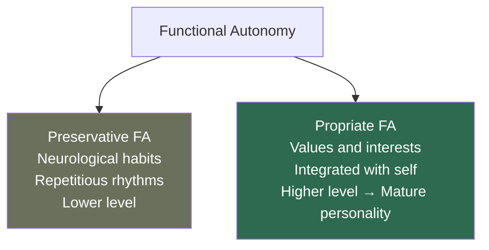
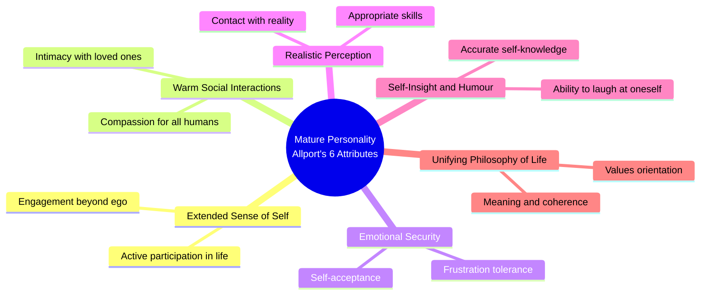
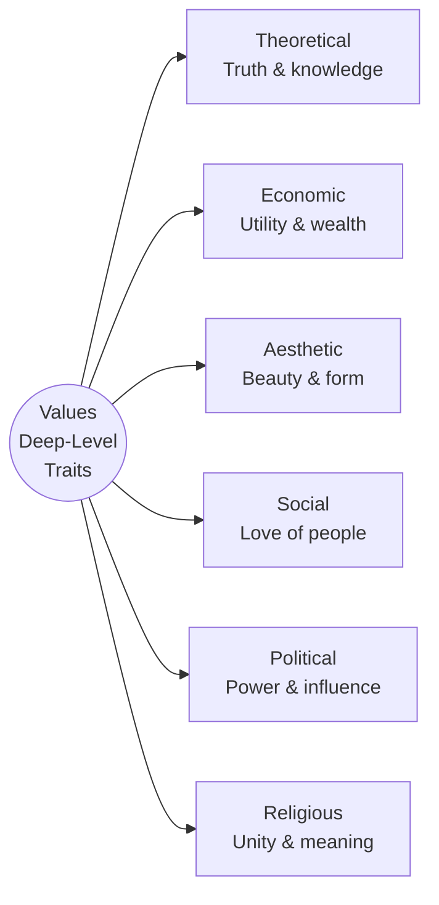

# Gordon Allport: Functional Autonomy and the Mature Personality

## Introduction

Two of Gordon Allport's most original contributions to personality psychology are the concept of **functional autonomy** — the idea that adult motives are independent of their childhood origins — and his vision of the **mature personality**, a psychologically healthy individual characterised by six specific attributes. Together, these concepts reflect Allport's fundamentally optimistic, growth-oriented view of human nature and his insistence that understanding adults requires understanding their *present* motivational landscape, not just their past.

---

## 1. Functional Autonomy of Motives

### 1.1 The Core Idea

> *"Adult motives are varied and self-sustaining, contemporaneous systems growing out of antecedent systems but functionally independent of them."* (Allport, 1961)

The principle is elegant: **what motivates a behaviour today may be completely different from what originally motivated it**. The past is past. There are no necessary strings attached between present motives and their origins.

**Allport's own example:** A young student takes a field study course in college because it fulfils a requirement, pleases his parents, or fits his schedule. As he works, he becomes absorbed in the subject — perhaps for life. The original motives (convenience, approval) have vanished. What was a *means to an end* has become an *end in itself*.

Other everyday examples:
- A carpenter who learned woodworking to earn money but now crafts furniture purely for the love of it
- A person who began exercising to lose weight but now runs marathons for the joy of running
- A musician who practised scales as a child under parental pressure but now plays because music is inseparable from who they are

### 1.2 Why Functional Autonomy Matters

Allport was fundamentally opposed to what he called **genetic fallacy** — the error of explaining present behaviour entirely by tracing it to its historical origins. Psychoanalysis, he argued, commits this fallacy: it reduces everything about the adult to their infant experiences. But adults are not merely older versions of their childhood selves. They have genuinely new motivations.

Functional autonomy affirms that adult personality is **contemporaneous** — driven by what matters now, not by echoes of the past.

---

## 2. Types of Functional Autonomy

Allport (1961) distinguished two levels of functional autonomy:

### 2.1 Preservative Functional Autonomy

This lower-level type refers to **feedback mechanisms in the nervous system** that sustain simple repetitious behaviours through neurological self-maintenance.

- Governed by simple neurological principles
- Involves habitual rhythms: eating at the same time daily, going to bed at a fixed hour, the familiar route driven automatically
- The behaviour perpetuates itself through the nervous system's tendency to sustain regular patterns

**Examples:**
- Waking automatically at the usual time even on holidays
- Addictive cravings (the craving exists independently of the original pleasure)
- Tapping a foot to music — a self-sustaining neuromotor loop

Preservative functional autonomy is relatively mechanical and does not involve the higher self or proprium.

### 2.2 Propriate Functional Autonomy

This higher-level type refers to **acquired interests, values, attitudes, and intentions** that have become integrated into the person's self-concept and drive behaviour independent of external reinforcement.

- Involves the master motivational system
- Imparts consistency and direction to personality
- People do not need to be constantly rewarded to sustain their propriate interests
- Represents the highest form of human motivation: striving for values, growth, and self-consistency

**Examples:**
- A scientist who continues research long after any academic requirement or financial incentive — curiosity is now intrinsic
- An activist who fights for justice not for recognition but because it reflects their deepest values
- An artist who creates even when no one is watching

| Feature | Preservative | Propriate |
|---------|-------------|-----------|
| Level | Lower (neurological) | Higher (psychological) |
| Examples | Habitual rhythms, cravings | Values, interests, vocational commitment |
| Relation to proprium | None | Integrated with self |
| Mechanism | Neurological self-maintenance | Self-consistency motivation |
| Growth orientation | No | Yes |

---

## 3. The Mature Personality

Allport believed that the development of a fully mature personality is a **lifelong process of becoming** — not a fixed endpoint. Mature adults are characterised by six specific attributes:

### 3.1 A Widely Extended Sense of Self

Truly mature persons can transcend their own ego. They participate actively in work, family, community, politics, religion — whatever they experience as valuable. They are genuinely *interested* in the world beyond themselves.

*Contrast:* Immature individuals remain self-absorbed, using others primarily as mirrors for their own needs.

### 3.2 Capacity for Warm Social Interactions

Allport identified two kinds of interpersonal warmth:
- **Intimacy**: Deep love for family and close friends — caring that is vulnerable and genuinely connected
- **Compassion**: The ability to tolerate differences in values and attitudes between self and others, and to show profound respect for the human condition

Mature compassion does not require agreement; it requires a genuine appreciation for human dignity and complexity.

### 3.3 Emotional Security and Self-Acceptance

Mature adults maintain a positive self-image and can tolerate frustration, irritation, and personal shortcomings without becoming inwardly hostile or defensively rigid. They manage their emotions (anger, guilt, depression) without allowing them to damage their relationships or functioning.

This is not denial of negative emotions but *integration* of them — acknowledging, processing, and moving forward.

### 3.4 Realistic Perception, Skills, and Assignments

Healthy people see things as they *are*, not as they *wish* them to be. They are in direct contact with reality and do not distort it perceptually to fit their needs or fantasies. They also possess appropriate skills for their work and can set personal desires aside when the task requires it.

*This is Allport's closest approximation to what later researchers would call* ***cognitive flexibility*** *and* ***reality orientation.***

### 3.5 Self-Insight and Humour

Mature adults have an accurate picture of their own strengths and weaknesses — neither falsely modest nor grandiose. **Humour** plays a special role here: the capacity to laugh at oneself and at things one cherishes, without ceasing to cherish them. Humour prevents both self-glorification and phoniness.

> *"Humour is the ability to laugh at the things one cherishes (including oneself) and still cherish them."* (Allport, 1961)

### 3.6 A Unifying Philosophy of Life

The mature person can "put it all together" — they have a clear, consistent, systematic way of finding meaning in their lives. This does not require formal religious belief but does require a **dominant value orientation** that makes life coherent.

*Examples of unifying philosophies:* commitment to scientific truth, devotion to family welfare, religious faith, dedication to social justice.

---

## 4. Application: The Study of Values

Allport collaborated to develop the **Study of Values** scale (Allport, Vernon & Lindzey), grounded in Eduard Spranger's six value types from his book *Types of Men*.

> Values, for Allport, are **deep-level traits** — the most fundamental dispositions that organise a person's personality and give life its direction.

### Spranger's Six Value Types

| Value Type | Primary Orientation | Typical Career |
|------------|--------------------|----|
| **Theoretical** | Discovery of truth; rational, empirical, critical | Scientist, philosopher |
| **Economic** | Utility and pragmatism; wealth creation | Business, finance |
| **Aesthetic** | Form, harmony, beauty; experience valued for grace and symmetry | Artist, designer |
| **Social** | Love of people; love as the only suitable relationship | Social worker, teacher |
| **Political** | Power, influence, personal impact | Politician, executive |
| **Religious** | Unity and cosmic meaning; understanding the world as a whole | Clergy, philosopher |

**Key finding:** People are not pure types — they exhibit blends of these values in varying proportions. A medical professional might combine strong social and theoretical values, for example.

The Study of Values scale consists of 45 items and takes ~20 minutes. It has been widely used in vocational psychology and has demonstrated reliability and validity across occupational groups.

---

## 5. Self-Assessment Questions

### Basic Understanding
1. What is functional autonomy of motives? Explain with an example from daily life.
2. Distinguish between preservative and propriate functional autonomy.
3. List all six characteristics of Allport's mature personality.

### Applied Understanding
4. A retired teacher who no longer needs to earn a living continues to tutor underprivileged children voluntarily. Using functional autonomy, explain their motivation.
5. Match each of Spranger's six value types to a character from Indian history or mythology who exemplifies it.
6. A person is deeply afraid of confrontation but recognises this clearly and works to manage it without projecting their anxiety onto others. Which characteristic of the mature personality does this illustrate?

### Critical Thinking
7. Allport claimed that adult motives are independent of their origins. Does modern research on early attachment (Bowlby) and childhood trauma challenge or support this view?
8. Is a "unifying philosophy of life" always healthy? Could extreme ideological commitment be pathological rather than mature? Where does Allport's framework draw the line?

---

## 6. Memory Aids

### Six Attributes of Maturity: "WERSHU"
- **W** — Warm social interactions
- **E** — Extended sense of self
- **R** — Realistic perception and skills
- **S** — Self-insight and humour
- **H** — (e)Honoured emotions / Emotional security
- **U** — Unifying philosophy of life

### Spranger's Values: "TEAPSR"
- **T** — Theoretical
- **E** — Economic
- **A** — Aesthetic
- **P** — Political
- **S** — Social
- **R** — Religious

### Functional Autonomy Core Principle
> **"Present motives are independent of past origins. The past is past — adult motivation is contemporary."**

---

## 7. External Resources & Further Reading

### Wikipedia
- [Functional autonomy of motives](https://en.wikipedia.org/wiki/Functional_autonomy_of_motives) — Allport's concept explained
- [Eduard Spranger](https://en.wikipedia.org/wiki/Eduard_Spranger) — Background on the theorist who inspired the Study of Values
- [Self-actualisation](https://en.wikipedia.org/wiki/Self-actualization) — Related concept in Maslow's hierarchy; compare with Allport's mature personality

### Educational Videos
- 🎬 [Allport's Functional Autonomy of Motives – Psychologia](https://www.youtube.com/watch?v=example5)
- 🎬 [What is Psychological Maturity? – TED-Ed](https://www.youtube.com/watch?v=example6)
- 🎬 [Values and Personality – Harvard Extension](https://www.youtube.com/watch?v=example7)

### Research Papers (2020–2024)
- Bleidorn, W., et al. (2021). "Toward a theoretical framework for understanding personality stability and change." *Psychological Review*, 128(5), 887–905.
- Luhmann, M., et al. (2023). "Values as predictors of life satisfaction: A meta-analysis." *Psychological Bulletin*, 149(1–2), 1–24.
- Schultz, P. W., & Tabanico, J. (2022). "Intrinsic motivation and nature relatedness: Assessing eudaimonic approaches to environmental values." *Environment and Behavior*, 54(6), 1–29.

### Related MAPC Topics
- [Allport: Personality & Traits](/mpc-003/block-3/allport-definition-personality-traits)
- [Allport: Proprium & Selfhood](/mpc-003/block-3/allport-proprium-selfhood)
- [Maslow's Hierarchy of Needs](/mpc-003/block-2/maslow-hierarchy-needs)
- [Rogers' Person-Centred Theory](/mpc-003/block-2/rogers-person-centered-theory)

---

## 8. Real-World Applications

### Positive Psychology and Wellbeing
Allport's mature personality closely anticipates the eudaimonic wellbeing tradition. Characteristics like self-insight, purposeful living, and warm relationships map directly onto Ryff's six dimensions of psychological wellbeing (autonomy, environmental mastery, personal growth, positive relations with others, purpose in life, self-acceptance).

### Career Counselling
The Study of Values has been used in vocational guidance for decades. Knowing whether a person is primarily theoretically, socially, or aesthetically oriented helps predict occupational fit, work satisfaction, and long-term commitment.

### Mindfulness and Self-Awareness
The mature personality's requirement for **self-insight** — accurate knowledge of one's strengths and weaknesses — aligns with contemporary mindfulness-based interventions. Mindfulness training has been shown to improve self-insight, emotional regulation, and compassion, all of which Allport considered hallmarks of maturity.

### Indian Cultural Perspective
The *Bhagavad Gita* explicitly describes the *sthitaprajña* — a person of steady wisdom who has transcended reactive impulses and acts from a deep, integrated value system. This ancient archetype maps remarkably well onto Allport's mature personality: extended self (kinship with all beings), emotional security (equanimity in success and failure), and a unifying philosophy of life (dharma).

---

## 9. Comparison: Allport's Mature Personality vs. Related Theories

| Dimension | Allport | Maslow | Rogers | Erikson |
|-----------|---------|--------|--------|---------|
| Self-transcendence | Extended sense of self | Self-actualisation | Fully functioning person | Generativity |
| Warm relationships | Capacity for warmth | Belongingness (fulfilled) | Unconditional positive regard | Intimacy vs. isolation |
| Emotional health | Emotional security | Peak experiences | Openness to experience | Ego integrity |
| Purpose | Unifying philosophy | Mission in life | Organismic valuing | Meaning-making |

---

## 10. Common Exam Questions

1. Explain functional autonomy of motives with examples. Distinguish between preservative and propriate functional autonomy.
2. Describe any four characteristics of Allport's mature personality with examples.
3. What is the Study of Values? Name and explain any three of Spranger's value types.
4. How does Allport's concept of the mature personality compare to Maslow's self-actualised person?
5. "Adult motives grow out of but are functionally independent of childhood experiences." Critically evaluate this statement.

---

**Source PDFs:**
- 📄 [Block-3/Unit-1.pdf — Pages 13–18](/pdfs/MPC-003%20Personality%20Theories%20and%20Assessment/Block-3/Unit-1.pdf)
- 📚 MPC-003 Personality Theories and Assessment
