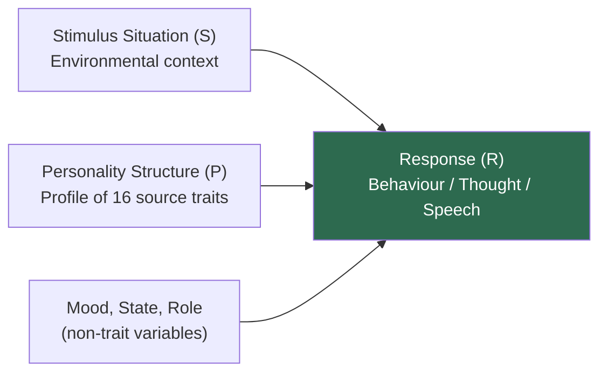
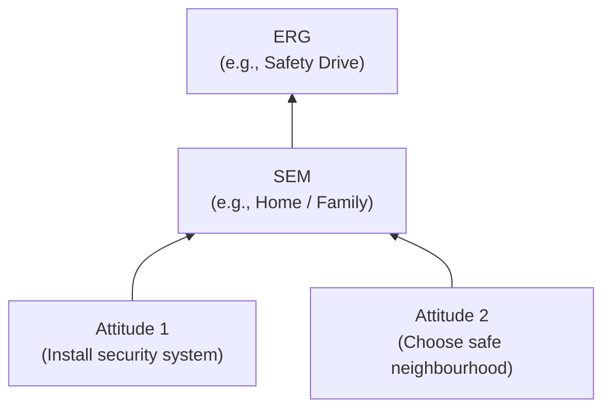

# Raymond Cattell: Trait Theory of Personality — Source Traits, Factor Analysis, and the 16PF

## Introduction

Raymond Cattell (1905–1998) brought the rigour of quantitative science to personality psychology. Where Allport relied primarily on conceptual analysis and clinical observation, Cattell used **factor analysis** — a powerful mathematical technique — to carve personality at its joints. His goal was nothing less than a comprehensive taxonomy of human personality: to identify the minimum set of fundamental traits needed to predict human behaviour across all situations.

Cattell's landmark definition captures his predictive ambition:

> **"Personality is that which permits a prediction of what a person will do in a given situation."** (Cattell, 1965)

This is not personality as a poetic description of the self but personality as a *working tool* for scientific prediction. It leads naturally to his **specification equation** and ultimately to the famous **16 Personality Factor Questionnaire (16PF)**.

---

## 1. Cattell's Scientific Approach

Cattell believed clinicians' observations — however insightful — could not form a scientific basis for understanding personality. He insisted on:

- **Inductive methodology**: Gather large data → apply factor analysis → discover underlying structure
- **Multivariate statistics**: Personality involves many variables simultaneously; only multivariate methods can capture this
- **Three data sources**: L-data, Q-data, and OT-data (discussed below)

### 1.1 Biographical Sketch

| Feature | Details |
|---------|---------|
| Born | 1905, Staffordshire, England |
| Died | 1998, Honolulu, Hawaii |
| Education | BSc Chemistry (London), PhD Psychology (University of London) |
| Career highlights | Child guidance clinic director (5 years); worked with E.L. Thorndike; University of Illinois (30+ years); founded Institute for Personality and Ability Testing (IPAT) |
| Major contributions | 16PF, MAVA technique, fluid/crystallized intelligence, factor-analytic personality taxonomy |

---

## 2. The Specification Equation

Cattell formalised personality's predictive role in mathematical terms:

$$R = f(S, P)$$

Where:
- **R** = the person's specific response (what the person does, thinks, or says)
- **f** = an unspecified mathematical function
- **S** = the stimulus situation at a given moment in time
- **P** = the person's personality structure (their trait profile)

**What this means:** A person's response in any given situation is a function of *both* the situational context and their personality structure. Neither alone is sufficient.

Cattell acknowledged limitations: to increase predictive accuracy, researchers must also account for:
- **Moods** (temporary emotional states)
- **Social roles** (what the situation calls for)
- **Trait weights** — not all traits are equally relevant in every situation (e.g., anxiety deserves higher weight in emotionally arousing situations)

---

## 3. Categories of Traits

Cattell used factor analysis to identify various categories of traits. His system is the most comprehensive taxonomic framework in classical personality theory.

### 3.1 Surface Traits vs. Source Traits

This is Cattell's most fundamental distinction:

| Feature | Surface Traits | Source Traits |
|---------|---------------|--------------|
| Definition | Observable cluster of behaviours that seem to go together | Underlying unitary dimensions revealed by factor analysis |
| Example | Neuroticism = inability to concentrate + indecisiveness + restlessness | Ego Strength (Factor C) — a single underlying factor |
| Basis | Multiple correlated surface behaviours | Single causal factor |
| Stability | Less stable over time | More stable — true building blocks |
| Scientific value | Low | High — source of predictive power |

**Analogy:** Surface traits are like symptoms; source traits are like underlying diseases. The same symptom can stem from different causes; the underlying cause is what matters scientifically.

### 3.2 The 16 Source Traits (16PF Factors)

Through extensive factor analysis, Cattell identified 16 source traits that constitute the fundamental structure of normal personality:

| Factor | Trait (Low Score ↔ High Score) |
|--------|-------------------------------|
| A | Reserved ↔ **Warmth** |
| B | Concrete ↔ **Reasoning** |
| C | Reactive ↔ **Emotional Stability** |
| E | Deferential ↔ **Dominance** |
| F | Serious ↔ **Liveliness** |
| G | Expedient ↔ **Rule-Consciousness** |
| H | Shy ↔ **Social Boldness** |
| I | Utilitarian ↔ **Sensitivity** |
| L | Trusting ↔ **Vigilance** |
| M | Grounded ↔ **Abstractness** |
| N | Forthright ↔ **Privateness** |
| O | Self-Assured ↔ **Apprehension** |
| Q1 | Traditional ↔ **Openness to Change** |
| Q2 | Group-Oriented ↔ **Self-Reliance** |
| Q3 | Tolerates Disorder ↔ **Perfectionism** |
| Q4 | Relaxed ↔ **Tension** |

The 16PF questionnaire is a self-report scale measuring these 16 factors. It has been widely used in clinical, occupational, and research settings for decades.

### 3.3 Global Traits (Secondary Factors)

Cattell found that primary traits cluster into five broader **global traits**:

Notably, Cattell's global factors anticipate the Big Five (OCEAN) that became dominant in personality psychology after 1990.

---

## 4. ERGs, SEMs, and the Dynamic Lattice

Cattell extended his framework to include **motivational** structures:

### 4.1 ERGs (Ergic Goals)

Cattell proposed that humans are **innately driven by ergs** — biological goal-directed motivational structures analogous to drives or instincts. The term "erg" derives from the Greek *ergon* (work/energy).

Examples of identified ERGs:
- Food-Seeking
- Mating
- Gregariousness
- Parental Protectiveness
- Exploration
- Safety
- Self-Assertion
- Pugnacity
- Narcissistic Sex
- Acquisitiveness

### 4.2 SEMs (Socially Shaped Ergic Manifolds)

SEMs are **socially acquired channels** through which ergs are expressed. They are the culturally shaped ways in which innate drives become organised:
- **Examples:** Profession, family and home, spouse, religion
- SEMs get their energy from ERGs — they are socially shaped but biologically powered
- Because they are culturally acquired, SEMs vary across cultures

### 4.3 The Dynamic Lattice

Cattell's **dynamic lattice** is a graphical model showing how attitudes (specific behavioural tendencies) connect to SEMs, which connect to ERGs through **subsidiation chains** — where some attitudes are subordinate to others in a hierarchy.

---

## 5. Data Sources

Cattell insisted on triangulating personality data from three independent sources:

| Data Type | Description | Advantage | Disadvantage |
|-----------|-------------|-----------|-------------|
| **L-data** (Life Record) | Behaviour in real, everyday situations (school performance, peer interactions) | High ecological validity | Difficult to collect |
| **Q-data** (Questionnaire) | Self-ratings of behaviour, feelings, thoughts (e.g., 16PF) | Easy to administer | Prone to faking or impression management |
| **OT-data** (Objective Test) | Performance on specially designed tasks scored objectively (e.g., Rorschach) | Resistant to faking | May lack face validity |

The 16PF is the primary Q-data instrument. Cattell argued that a robust personality taxonomy should be consistent across all three data types.

---

## 6. Intelligence: Fluid vs. Crystallized

Cattell made a landmark distinction in intelligence theory:

| Type | Definition | Basis | Changes with Age |
|------|-----------|-------|-----------------|
| **Fluid Intelligence (Gf)** | Ability to learn new things regardless of past experience; reasoning in novel situations | Primarily hereditary; reflects neurological capacity | Peaks in late adolescence; declines in old age |
| **Crystallized Intelligence (Gc)** | Ability to solve problems using accumulated knowledge and experience | Both hereditary and environmental | Increases through adulthood; relatively stable in old age |

Cattell believed intelligence was primarily inherited and used MAVA analysis to estimate heritability.

---

## 7. Self-Assessment Questions

### Basic Understanding
1. What is Cattell's definition of personality? How does it reflect his scientific approach?
2. Distinguish between surface traits and source traits with examples.
3. Name all 16 source traits in Cattell's 16PF. Choose any five and explain them.

### Applied Understanding
4. Using Cattell's specification equation R = f(S, P), predict how a highly anxious student (high Factor Q4) might respond to an unexpected examination. What situational factors would you weight most heavily?
5. A person who grew up in a joint family in rural India develops strong affiliative tendencies. Is this best explained as an ERG, SEM, or constitutional trait?

### Critical Thinking
6. Cattell argued that approximately one-third of personality is determined by heredity and two-thirds by environment. How does MAVA allow him to arrive at this estimate? What are the limitations of this approach?
7. The Big Five personality model became more influential than Cattell's 16PF. What might account for this, given that Cattell's model has greater specificity?

---

## 8. Memory Aids

### The 16PF Primary Traits: "WRED LSSVAPO SPQT"
(Warmth, Reasoning, Emotional Stability, Dominance, Liveliness, Social Boldness, Sensitivity, Vigilance, Abstractness, Privateness, Openness-to-Change, Self-Reliance, Perfectionism, Tension — and Rule-Consciousness, Apprehension)

### Specification Equation in Plain English
> **"What you DO = what the SITUATION demands × who you ARE."**

### ERG vs. SEM
- **ERG** = *E*nergised *R*ight *G*ene — innate biological drive
- **SEM** = *S*ocially *E*xtended *M*otive — culturally learned channel for the ERG

### Surface vs. Source
- **Surface** = what you *see* (the cluster of symptoms)
- **Source** = what *causes* it (the underlying factor)

---

## 9. External Resources & Further Reading

### Wikipedia
- [Raymond Cattell](https://en.wikipedia.org/wiki/Raymond_Cattell) — Biography and full theoretical contributions
- [16PF Questionnaire](https://en.wikipedia.org/wiki/16PF_Questionnaire) — Detailed description of the instrument
- [Factor analysis in psychology](https://en.wikipedia.org/wiki/Factor_analysis) — The statistical foundation of Cattell's approach
- [Fluid and crystallized intelligence](https://en.wikipedia.org/wiki/Fluid_and_crystallized_intelligence) — Cattell's dual intelligence model

### Educational Videos
- 🎬 [Cattell's 16PF Personality Theory – Psychologia](https://www.youtube.com/watch?v=example8)
- 🎬 [Factor Analysis Explained Visually – StatQuest](https://www.youtube.com/watch?v=FgakZw6K1QQ)
- 🎬 [Fluid vs. Crystallized Intelligence – Crash Course](https://www.youtube.com/watch?v=example9)

### Research Papers (2020–2024)
- Hopwood, C. J., & Bleidorn, W. (2022). "Multiwave, multimethod personality assessment." *Psychological Assessment*, 34(10), 853–867. — Builds on Cattell's multi-data approach
- Paunonen, S. V., & Ashton, M. C. (2001). "Big Five factors and facets and the prediction of behavior." *Journal of Personality and Social Psychology*, 81(3), 524–539.
- Cattell, H. E. P., & Mead, A. D. (2008). "The Sixteen Personality Factor Questionnaire (16PF)." In *The SAGE handbook of personality theory and assessment* (Vol. 2, pp. 135–159).

### Related MAPC Topics
- [Allport: Personality & Traits](/mpc-003/block-3/allport-definition-personality-traits)
- [Eysenck, Guilford, and Big Five](/mpc-003/block-1/eysenck-guilford-big-five)
- [Cattell Trait Theories (Block 1)](/mpc-003/block-1/allport-cattell-trait-theories)

---

## 10. Comparing Allport and Cattell on Traits

| Dimension | Allport | Cattell |
|-----------|---------|---------|
| Method | Conceptual/clinical + idiographic | Factor-analytic + nomothetic |
| Number of traits | Infinite individual dispositions | 16 universal source traits |
| Core distinction | Cardinal / Central / Secondary | Surface / Source |
| Data sources | Case studies, letters, biographies | L-data, Q-data, OT-data |
| Measurement | Study of Values | 16PF questionnaire |
| View of uniqueness | Central — individual traits paramount | Acknowledged but secondary |
| Goal | Understand the individual | Predict behaviour across people |

---

## 11. Real-World Applications

### Occupational Psychology
The 16PF has been used extensively in employee selection and career counselling. Different profiles predict success in different occupations: high Dominance (E) and Social Boldness (H) for leadership; high Rule-Consciousness (G) and Perfectionism (Q3) for detail-oriented roles.

### Clinical Assessment
Cattell identified 12 abnormal personality factors beyond his 16 normal ones. The combination of normal and clinical scales allows comprehensive personality assessment in clinical settings.

### Indian Educational Context
Cattell's concept of fluid vs. crystallised intelligence has profound implications for Indian education. Traditional gurukul models emphasised crystallised intelligence (accumulated wisdom); modern competitive examinations test fluid intelligence. Understanding both dimensions helps design more balanced educational assessment.

### Cross-Cultural Research
Cattell's concept of **syntality** — the personality profile of a group or nation — was one of the first attempts at cross-cultural personality research. While methodologically dated, it anticipated the modern field of cross-cultural personality psychology.

---

## 12. Common Exam Questions

1. Define Cattell's concept of personality and explain the specification equation R = f(S, P).
2. Distinguish between surface traits and source traits with examples.
3. Describe the 16 source traits identified by Cattell. How are they assessed using the 16PF?
4. What are ERGs? How do SEMs relate to ERGs in Cattell's dynamic lattice?
5. How does Cattell use the MAVA technique to estimate hereditary and environmental contributions to personality?
6. Distinguish between fluid and crystallized intelligence as proposed by Cattell.
7. Compare the trait theories of Allport and Cattell on any four dimensions.

---

**Source PDFs:**
- 📄 [Block-3/Unit-2.pdf — Pages 20–31](/pdfs/MPC-003%20Personality%20Theories%20and%20Assessment/Block-3/Unit-2.pdf)
- 📚 MPC-003 Personality Theories and Assessment
