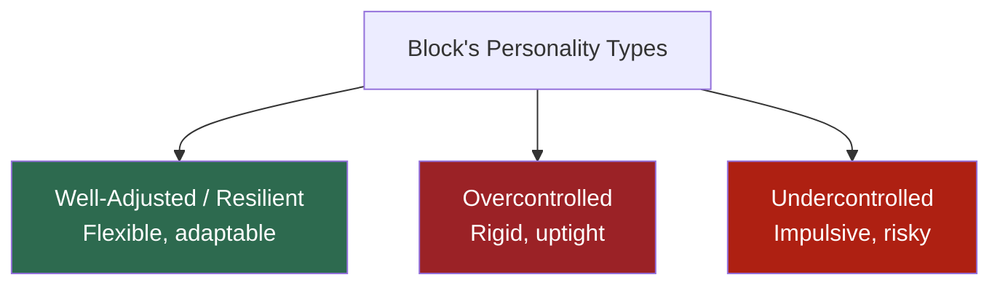
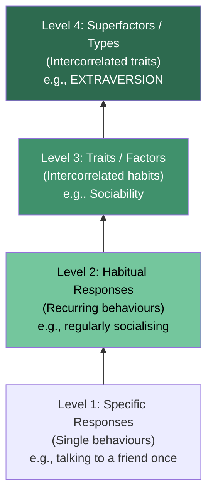
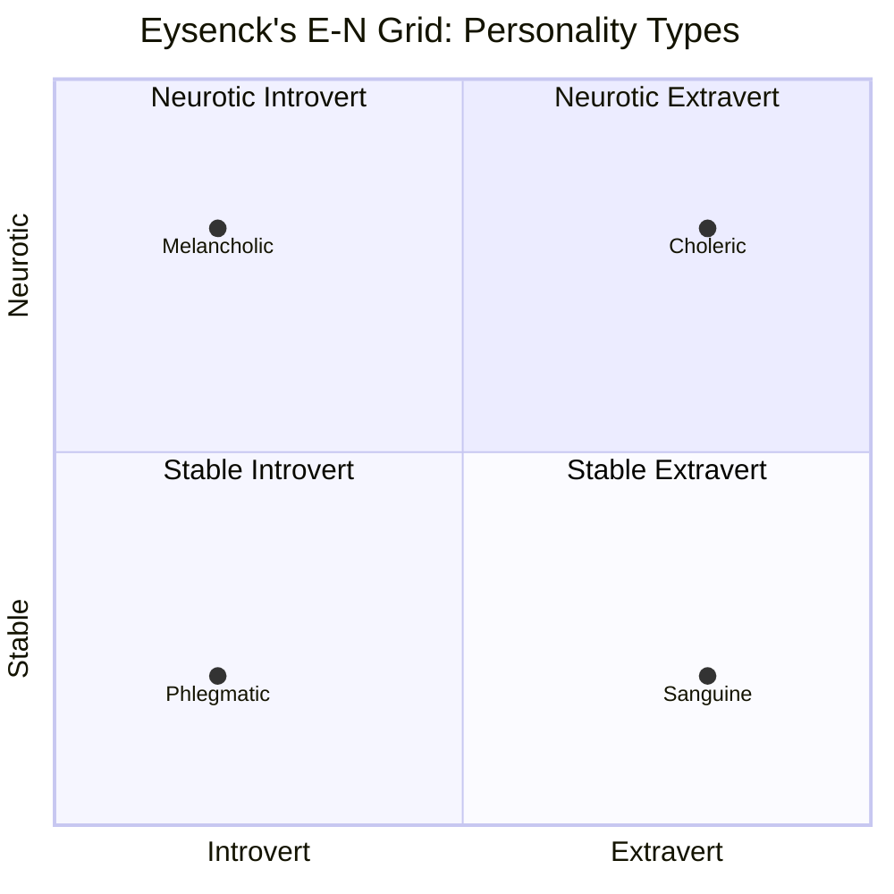
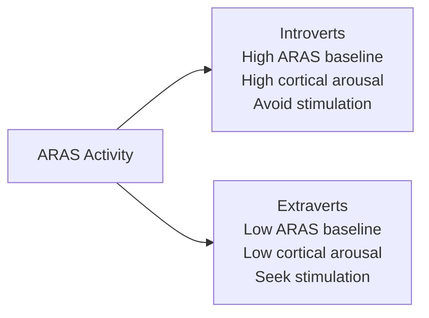

# Hans Eysenck: Trait-Type Theory, PEN Model, and Neurophysiological Basis of Personality

## Introduction

Hans Eysenck (1916–1997) brought biological precision to personality psychology. His central argument was radical and systematic: human personality, in all its complexity, can be reduced to **three fundamental dimensions** — Extraversion, Neuroticism, and Psychoticism — each rooted in measurable neurophysiological processes. Unlike Cattell's 16 factors or Allport's infinite individual dispositions, Eysenck proposed an elegant, parsimonious, and experimentally testable model.

His **PEN model** (Psychoticism-Extraversion-Neuroticism) represents one of the most scientifically rigorous frameworks in personality psychology, combining descriptive taxonomy, causal biological theory, and empirical measurement into a unified system.

---

## 1. Type Theory vs. Trait Theory: The Key Distinction

Before exploring Eysenck, it is important to understand the foundational distinction between **type** and **trait** theories:

| Feature | Type Theory | Trait Theory |
|---------|------------|-------------|
| Nature | **Discontinuous** — you are either this type or that type | **Continuous** — traits exist on a spectrum |
| Example | A person is either an *introvert* or an *extravert* | A person can be *anywhere* on the introversion-extraversion continuum |
| Classification | Categorical: mutually exclusive categories | Dimensional: infinite degrees |
| Measurement | Assigns person to a category | Assigns a score on a scale |

**Important note:** Eysenck uses the word "type" but means it dimensionally — his types are continuous superfactors, not discrete categories. Most people fall near the middle, with fewer at the extremes.

---

## 2. Historical Type Theories

### 2.1 The Four Humours (Ancient Greek)

One of the oldest personality typologies — attributed to Hippocrates and elaborated by Galen:

| Humour | Bodily Fluid | Character | Big Five Parallel |
|--------|-------------|-----------|------------------|
| Choleric | Yellow bile | Irritable, ambitious | Low Agreeableness |
| Melancholic | Black bile | Depressed, anxious | High Neuroticism |
| Sanguine | Blood | Optimistic, sociable | High Openness/Extraversion |
| Phlegmatic | Phlegm | Calm, unemotional | Low Neuroticism |

While scientifically obsolete, the four humours illustrate how personality typologies are deeply embedded in human history across cultures.

### 2.2 Sheldon's Somatotype Theory

William Sheldon proposed three body-type/personality correlations:

| Body Type | Personality Type | Characteristics |
|-----------|-----------------|----------------|
| **Endomorph** (Viscerotonic) | Plump, soft | Relaxed, sociable, tolerant, comfort-loving, peaceful |
| **Mesomorph** (Somatotonic) | Muscular | Active, assertive, vigorous, combative |
| **Ectomorph** (Cerebrotonic) | Lean, delicate | Quiet, fragile, restrained, non-assertive, sensitive |

Sheldon rated people on a 1–7 scale on each dimension simultaneously. **Example:** A basketball player = Ecto(7), Endo(1), Meso(1); a wrestler = Endo(1), Meso(7), Ecto(1).

> **Critical Assessment:** Somatotype theory has been heavily criticised for weak empirical methodology. Body type and personality show minimal reliable correlation. The theory is now primarily of historical interest.

### 2.3 Ayurvedic Doshas (Body Types)

Ayurvedic medicine identifies three *doshas* that parallel Sheldon's types:

| Dosha | Sheldon Equivalent | Character | Physical Build |
|-------|-------------------|-----------|----|
| **Vata** | Ectomorph | Changeable, unpredictable, enthusiastic, imaginative, impulsive; energy fluctuates | Slender, prominent joints, cool dry skin; prone to anxiety, insomnia |
| **Pita** | Mesomorph | Quick, articulate, intelligent, passionate; short explosive temper | Medium build, fair/ruddy; tends to sweat; prone to ulcers |
| **Kapha** | Endomorph | Relaxed, slow to anger, procrastinating, obstinate | Heavy, solid; slow digestion; prone to obesity, allergies |

The Ayurvedic system integrates personality, constitution, and health in a holistic framework that has been practised for over 3,000 years in India.

### 2.4 Jungian Personality Types (Myers-Briggs)

Jung's typology identifies four dichotomous functions:

| Dimension | Description |
|-----------|-------------|
| **E vs. I** | Extraversion (recharge externally) vs. Introversion (recharge internally) |
| **N vs. S** | Intuition (inner voice, patterns) vs. Sensing (concrete observation) |
| **T vs. F** | Thinking (logic in decisions) vs. Feeling (values in decisions) |
| **J vs. P** | Judgement (structure, organisation) vs. Perception (flexibility, openness) |

The 4 dimensions yield **16 personality types** (e.g., INTJ = Introversion, Intuition, Thinking, Judging). The Myers-Briggs Type Indicator (MBTI) is the most widely used personality test globally — particularly in business and organisational settings.

### 2.5 Type A and Type B Personalities

Proposed by cardiologist **Meyer Friedman** after observing that stressed, impatient patients wore out the edges of waiting room sofas:

| Type A | Type B |
|--------|--------|
| Workaholic, driven, impatient | Laid-back, easy-going |
| Always busy, time-pressured | Relaxed approach to time |
| Competitive, easily frustrated | Less competitive |
| Higher risk of cardiovascular disease | Lower cardiovascular risk |

Type A/B personality remains clinically relevant in health psychology, particularly cardiac risk research.

### 2.6 Block's Three Personality Types

J. Block (1971) identified three types from longitudinal research with adolescents:

1. **Well-Adjusted (Resilient):** Adaptable, flexible, resourceful, interpersonally successful
2. **Overcontrolled:** Maladjusted; uptight, rigid, difficult to interact with
3. **Undercontrolled:** Maladjusted; impulsive, risky, potentially delinquent

---

## 3. Eysenck's Hierarchical Taxonomy (PEN Model)

Eysenck proposed a **four-level hierarchical model** of personality:

The hierarchy reflects **increasing stability and generality**:
- Specific responses: variable, situation-dependent
- Superfactors: stable across time, highly general, most predictive

---

## 4. The Three Superfactors: E, N, and P

Eysenck argued that three **orthogonal** (uncorrelated) dimensions account for most personality variation:

### 4.1 Extraversion–Introversion (E)

| High Extraversion | Low Extraversion (Introversion) |
|-------------------|---------------------------------|
| Sociable, popular | Reserved, quiet |
| Optimistic, excitable | Introspective, reliable |
| Seeks stimulation | Avoids overstimulation |
| Unreliable, impulsive | Cautious, planned |

### 4.2 Neuroticism–Stability (N)

| High Neuroticism | Low Neuroticism (Stability) |
|-----------------|----------------------------|
| Anxious, worried | Calm, even-tempered |
| Moody, unstable | Carefree, emotionally stable |
| Easily upset | Copes well with stress |
| Persistent emotional reactions | Quickly returns to baseline |

### 4.3 Psychoticism–Superego Strength (P)

| High Psychoticism | Low Psychoticism (Superego Strength) |
|-------------------|--------------------------------------|
| Egocentric, impulsive | Altruistic, empathic |
| Troublesome, hostile | Conventional, socialised |
| Socially withdrawn | Cooperative |
| Callous, insensitive | Caring, considerate |

Eysenck noted that Psychoticism is more common in men and that high P scores, combined with other factors, predict vulnerability to psychopathology and antisocial behaviour.

---

## 5. Neurophysiological Basis of Personality

Eysenck's most distinctive contribution was providing **biological causal explanations** for each dimension:

### 5.1 Extraversion and Cortical Arousal (ARAS)

The **Ascending Reticular Activating System (ARAS)** regulates baseline cortical arousal:

- **Introverts**: Higher baseline ARAS activity → chronically higher cortical arousal → already near optimal → avoid additional stimulation
- **Extraverts**: Lower baseline ARAS activity → chronically under-aroused → seek stimulation to reach optimal arousal level

This follows the **Yerkes-Dodson Law**: performance is optimal at intermediate arousal levels. Introverts are already near optimal; more stimulation takes them past it. Extraverts are below optimal; they need more stimulation.

**The Lemon Juice Test:** When lemon juice is placed on the tongue, introverts salivate *twice* as much as extraverts — demonstrating higher sensitivity to stimulation.

### 5.2 Neuroticism and the Visceral Brain (Limbic System)

The **visceral brain (limbic system)** — comprising the hippocampus, amygdala, septum, and hypothalamus — regulates emotional responses:

- **High Neuroticism**: Lower activation thresholds in the limbic system → quick, intense emotional reactions to minor stressors → prolonged reactions even after stimulus removal
- **Stable personality**: Higher thresholds → calm responses, quick return to baseline

### 5.3 Psychoticism and Gonadal Hormones

- **Testosterone**: Higher levels correlate with higher psychoticism
- **MAO (Monoamine Oxidase)**: Low platelet MAO activity found in psychotic patients and their relatives → potential biological marker for psychoticism/vulnerability

This explains why P is more common in men (higher testosterone) and why schizophrenia shows familial clustering.

---

## 6. Psychopathology Implications

Eysenck proposed specific vulnerability pathways:

| Personality Profile | Risk |
|---------------------|------|
| High E + High N | Psychopathic/antisocial disorders |
| High I + High N | Anxiety disorders (phobias, obsessions, compulsions) |
| High P | Psychosis spectrum |

> Genetic predisposition + environmental stressors → psychological disorder. Genes alone do not determine psychopathology.

---

## 7. Measurement: EPQ and Differences between Introverts and Extraverts

The **Eysenck Personality Questionnaire (EPQ)** measures E, N, P, and includes a **Lie Scale** to detect socially desirable responding. A Junior EPQ exists for children aged 7–15.

### Research Findings on Introvert-Extravert Differences

| Domain | Introverts | Extraverts |
|--------|-----------|-----------|
| Pain tolerance | Lower | Higher |
| Work habits | More focused, fewer breaks | More coffee breaks, social at work |
| Academic performance | Higher grades | Lower grades |
| Optimal work time | Morning | Afternoon/evening |
| Vocational preference | Theoretical/scientific (engineering, chemistry) | People-oriented (sales, social work) |
| Sensitivity to stimulation | Higher | Lower (lemon juice test) |
| Psychiatric withdrawal | More common | Less common |
| Academic withdrawal | Less common | More common (academic reasons) |

---

## 8. Self-Assessment Questions

### Basic Understanding
1. What is the difference between type and trait theories of personality? Give an example using introversion.
2. Describe Eysenck's hierarchical model of personality with four levels.
3. Name and define Eysenck's three superfactors.

### Applied Understanding
4. A student who is chronically anxious, emotionally reactive, and prone to mood swings scores high on which of Eysenck's dimensions? What is the neurophysiological basis of this trait?
5. Using the Type A/B framework, describe a workplace scenario where Type A and Type B personalities might clash. What recommendations would you make for team management?
6. Match each of the Four Humours to Eysenck's E-N grid (Sanguine = Stable Extravert, etc.).

### Critical Thinking
7. Eysenck claimed his PEN model is superior to Cattell's 16PF because it provides *causal* explanations. How does the ARAS theory of extraversion demonstrate this advantage? What are its limitations?
8. The MBTI is used widely in business despite limited predictive validity in research. What does this tell us about the gap between scientific and applied psychology?

---

## 9. Memory Aids

### PEN Model: "PEN writes your personality"
- **P** = Psychoticism (antisocial/empathic)
- **E** = Extraversion (outgoing/reserved)
- **N** = Neuroticism (anxious/stable)

### Neurophysiological Basis: "ACE"
- **A**RAS → Extraversion (cortical **A**rousal)
- **C**ortex (limbic) → Neuroticism (**C**limbic system)
- **E**ndocrine → Psychoticism (testosterone and MAO **E**nzymes)

### Introvert vs. Extravert: "I Stay In, E Goes Out"
- **I**ntrovert = already aroused → stays in, avoids stimulation
- **E**xtravert = under-aroused → goes out, seeks stimulation

### Sheldon's Types: "EME" = Endo-Meso-Ecto
- **E**ndomorph = Easy-going (round)
- **M**esomorph = Muscular = Masterful
- **E**ctomorph = Ectoplasm (thin, sensitive)

---

## 10. External Resources & Further Reading

### Wikipedia
- [Hans Eysenck](https://en.wikipedia.org/wiki/Hans_Eysenck) — Biography, PEN model, and controversies
- [Eysenck Personality Questionnaire](https://en.wikipedia.org/wiki/Eysenck_Personality_Questionnaire) — The EPQ described in detail
- [Myers–Briggs Type Indicator](https://en.wikipedia.org/wiki/Myers%E2%80%93Briggs_Type_Indicator) — Overview of MBTI
- [Reticular activating system](https://en.wikipedia.org/wiki/Reticular_activating_system) — The neurological basis of arousal and extraversion

### Educational Videos
- 🎬 [Eysenck's PEN Model of Personality – Psychologia](https://www.youtube.com/watch?v=example10)
- 🎬 [Introvert vs. Extrovert: What's the Difference? – Crash Course Psychology](https://www.youtube.com/watch?v=example11)
- 🎬 [The Biology of Personality – MIT OpenCourseWare](https://www.youtube.com/watch?v=example12)

### Research Papers (2020–2024)
- Revelle, W., Wilt, J., & Rosenthal, A. (2010). "Personality and cognition: The personality-cognition link." *Personality and Individual Differences*, 47, 477–483.
- DeYoung, C. G. (2023). "Cybernetic Big Five Theory: A formal model of trait biology." *Psychological Review*, 130(2), 360–401. — Modern neuroscience of personality dimensions
- Fleeson, W., & Gallagher, P. (2022). "The implications of Big Five standing for the distribution of trait manifestation in behavior." *Journal of Personality and Social Psychology*, 118(2), 301–318.

### Related MAPC Topics
- [Eysenck, Guilford, and Big Five](/mpc-003/block-1/eysenck-guilford-big-five)
- [Allport: Personality & Traits](/mpc-003/block-3/allport-definition-personality-traits)
- [Cattell: Trait Theory & 16PF](/mpc-003/block-3/cattell-trait-theory-16pf)

---

## 11. Comparing the Three Major Trait/Type Theorists

| Dimension | Allport | Cattell | Eysenck |
|-----------|---------|---------|---------|
| Number of traits | Infinite individual dispositions | 16 source traits | 3 superfactors |
| Method | Conceptual + case study | Factor analysis | Factor analysis + experiment |
| Heredity emphasis | Moderate | Low–moderate | High |
| Biological basis | Minimal | Moderate | Strong (ARAS, limbic, hormones) |
| Key tool | Study of Values | 16PF | EPQ |
| Approach | Idiographic + nomothetic | Nomothetic | Nomothetic + experimental |

---

## 12. Real-World Applications

### Clinical Psychology
Eysenck's E×N interaction predicts differential vulnerability to disorders — a clinically useful screening approach. High introversion + high neuroticism signals anxiety disorder risk; high extraversion + high neuroticism signals conduct disorder risk.

### Workplace Psychology
Understanding extraversion helps design work environments: introverts thrive in quiet, focused settings; extraverts in collaborative, stimulating ones. Research on optimal workspace design draws heavily on Eysenck's arousal theory.

### Indian Cultural Context
The Ayurvedic dosha system represents India's indigenous personality typology with a 3,000-year history. Comparing Vata-Pita-Kapha to Eysenck's E-N grid reveals fascinating convergences: Vata resembles high N + moderate E; Pita resembles high E + moderate N; Kapha resembles low N + low E. This comparison bridges Western empirical science with Indian traditional medicine.

### Health Psychology
Type A personality research (Friedman's original observation in a cardiology waiting room) spawned decades of research linking personality to cardiovascular health. Contemporary research examines whether hostility (rather than overall Type A) is the active cardiac risk factor.

---

## 13. Common Exam Questions

1. Explain Eysenck's hierarchical taxonomy of personality. How does he distinguish between types, traits, habitual responses, and specific responses?
2. Describe the three superfactors in Eysenck's PEN model. Provide the neurophysiological basis for any two of them.
3. What is the difference between type and trait theories? How does Eysenck resolve this distinction in his own framework?
4. Compare Sheldon's somatotype theory with Ayurvedic doshas. What are the strengths and limitations of body-type personality theories?
5. What are the main differences between introverts and extraverts according to Eysenck's research? How does the ARAS explain these differences?
6. Describe the Eysenck Personality Questionnaire (EPQ). What does the Lie Scale measure and why is it important?
7. What personality profiles does Eysenck predict as vulnerable to anxiety disorders vs. antisocial disorders?

---

**Source PDFs:**
- 📄 [Block-3/Unit-3.pdf — Pages 32–48](/pdfs/MPC-003%20Personality%20Theories%20and%20Assessment/Block-3/Unit-3.pdf)
- 📚 MPC-003 Personality Theories and Assessment
