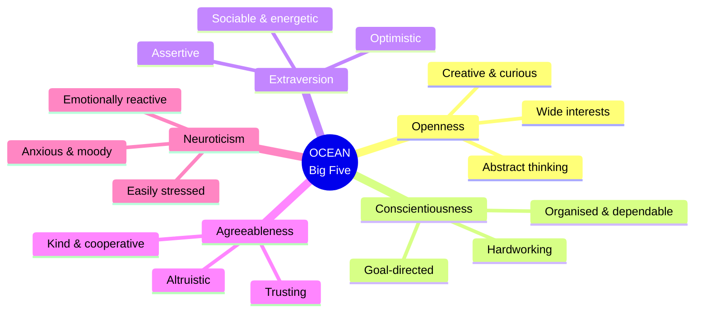
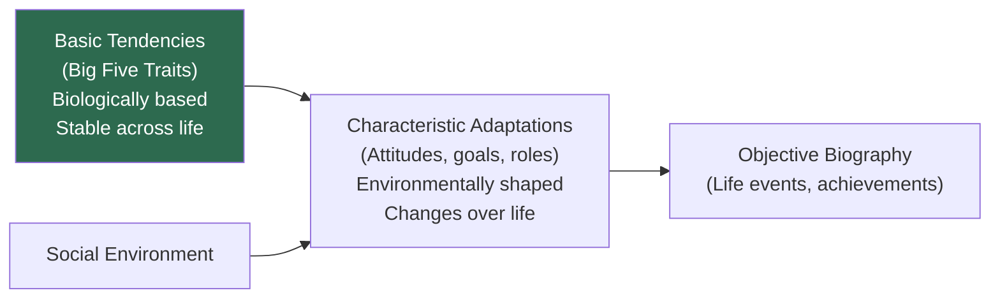

# The Big Five Factors: OCEAN Model — Basic Dimensions of Personality

## Introduction

After decades of competing personality systems — Allport's thousands of traits, Cattell's 16 factors, Eysenck's 3 superfactors — personality psychology converged in the late 20th century on a remarkable consensus: **five broad dimensions** capture the fundamental structure of human personality. Known as the **Big Five** or **Five-Factor Model (FFM)**, and memorised through the acronym **OCEAN**, this framework emerged not from any single theorist's intuition but from the empirical analysis of how personality words cluster together in natural language across cultures.

The Big Five represents the most widely validated and cross-culturally replicated personality taxonomy in the history of psychology.

---

## 1. Origins: The Lexical Hypothesis

### 1.1 The Core Idea

The **lexical hypothesis** states:

> *Those individual differences that are most important, salient, and socially relevant in human life will come to be encoded as single words in the natural language.*

If personality dimensions matter to human survival and social life, then language will have preserved those dimensions in its vocabulary. By analysing which personality words cluster together (i.e., which traits co-occur across many people), researchers can discover the fundamental structure of personality.

### 1.2 Historical Development

| Researcher | Contribution |
|-----------|-------------|
| **Allport & Odbert (1936)** | Identified ~18,000 English personality-descriptive words |
| **Cattell (1943)** | Reduced to 4,500 relevant items, then to 35 clusters using semantic analysis |
| **Fiske (1949)** | Factor-analysed 22 of Cattell's variables → first five-factor solution |
| **Norman (1967), Smith (1967)** | Replicated five factors across multiple samples |
| **Goldberg (1981)** | Coined the term "Big Five"; systematic lexical research |
| **McCrae & Costa (1987, 1992)** | Developed Five-Factor Theory (FFT) and the NEO PI-R questionnaire |

The five factors were initially labelled: (i) Extraversion/Surgency, (ii) Agreeableness, (iii) Conscientiousness, (iv) Emotional Stability, (v) Culture/Intellect. Later standardised to OCEAN.

---

## 2. The Five Dimensions (OCEAN)

Each dimension is a continuous spectrum — people fall at various points between the two poles.

### 2.1 Openness to Experience (O)

**Also called:** Intellect, Intellect/Imagination (in lexical research)

> Breadth, depth, and complexity of an individual's mental and experiential life

| High Openness | Low Openness |
|--------------|-------------|
| Imaginative, creative, curious | Practical, conventional, down-to-earth |
| Wide range of interests | Narrow interests |
| Artistic, insightful | Simple, straightforward |
| Open to abstract ideas | Concrete, pragmatic |
| Seeks novelty | Prefers routine |

**Predictions:** High O associated with creativity, academic achievement in arts/humanities, openness to diverse cultures, and liberal political attitudes.

### 2.2 Conscientiousness (C)

> Impulse control, goal-directed behaviour, organisation, and dependability

| High Conscientiousness | Low Conscientiousness |
|-----------------------|-----------------------|
| Organised, thorough | Disorganised, careless |
| Dependable, responsible | Unreliable |
| Hardworking, goal-directed | Easily distracted |
| Planful, systematic | Spontaneous, careless |
| Mindful of details | Overlooks details |

**Predictions:** C is the strongest Big Five predictor of **job performance** across virtually all occupations. High C also predicts longevity, academic achievement, and lower health-risk behaviours.

### 2.3 Extraversion (E)

> Activity, energy, sociability, and positive emotionality

| High Extraversion | Low Extraversion (Introversion) |
|------------------|--------------------------------|
| Sociable, talkative, energetic | Reserved, quiet |
| Assertive, enthusiastic | Introspective |
| Emotionally expressive | Emotionally controlled |
| Gregarious, optimistic | Prefers solitude |
| Seeks external stimulation | Finds stimulation in ideas |

**Predictions:** High E predicts leadership emergence, relationship satisfaction, subjective wellbeing, and success in sales/social roles.

### 2.4 Agreeableness (A)

> Prosocial attitudes, altruism, trust, and cooperation

| High Agreeableness | Low Agreeableness |
|--------------------|-------------------|
| Kind, sympathetic | Competitive, antagonistic |
| Cooperative, trusting | Suspicious, sceptical |
| Altruistic, helpful | Self-interested |
| Modest, humble | Arrogant |
| Tolerant | Stubborn |

**Predictions:** High A predicts relationship satisfaction, prosocial behaviour, and cooperation in group settings. Low A predicts conflict, narcissism, and antisocial tendencies.

### 2.5 Neuroticism (N)

> Emotional instability, anxiety, moodiness, and vulnerability to stress

**Also expressed as its opposite: Emotional Stability**

| High Neuroticism | Low Neuroticism (Stability) |
|-----------------|----------------------------|
| Anxious, tense, moody | Calm, even-tempered |
| Easily upset | Emotionally resilient |
| Irritable, sad | Composed, secure |
| Emotionally reactive | Rarely distressed |
| Vulnerable to stress | Copes effectively |

**Predictions:** N predicts mental health problems, relationship dissatisfaction, job stress, and physical health issues. High N is associated with all common psychological disorders.

---

## 3. Big Five vs. Five-Factor Model vs. Five-Factor Theory

There are important conceptual distinctions among three related terms:

| Term | What It Is | Key Feature |
|------|-----------|-------------|
| **Big Five** | Empirical taxonomy of trait clusters | Descriptive; derived from lexical research; Goldberg's term |
| **Five-Factor Model (FFM)** | Broader label covering both Big Five and questionnaire research | Descriptive framework (McCrae & Costa's term in questionnaire tradition) |
| **Five-Factor Theory (FFT)** | Causal theory about why the Big Five exist | Proposes biological, genetic basis; distinguishes basic tendencies from characteristic adaptations |

### 3.1 Key Difference: Factor V

The fifth factor is labelled differently in the two traditions:
- **Lexical (Big Five):** "Intellect/Imagination" (Goldberg)
- **Questionnaire (FFM):** "Openness to Experience" (McCrae & Costa)

This subtle difference reflects whether the fifth factor primarily captures cognitive breadth (intellect) or aesthetic-experiential openness.

---

## 4. Theoretical Perspectives on the Big Five

### 4.1 Interpersonal Theory (Sullivan; Wiggins & Trapnell)
The Big Five describe the enduring patterns of interpersonal situations. All five dimensions have interpersonal implications — Extraversion and Agreeableness most directly, but C, N, and O also shape relationship patterns.

### 4.2 Socioanalytic Theory (Hogan)
Personality traits function as **social reputations** — descriptions of how others perceive you. This introduces risk of **self-deceptive bias** in questionnaire measures: people may report how they wish to be seen rather than how they actually are.

### 4.3 Evolutionary Theory (Buss & Shackelford)
Humans evolved "**difference-detecting mechanisms**" to perceive others' personalities — especially on dimensions relevant to survival and reproduction. The Big Five represent the most evolutionarily important individual differences, hardwired into our social perception.

### 4.4 Five-Factor Theory (McCrae & Costa)
- The Big Five have a **substantial genetic base** (heritability ~40–60%)
- **Basic tendencies** (the five traits) are stable across life
- **Characteristic adaptations** (attitudes, goals, roles, relationships) interact with environment and change over time
- Biological factors account for the structure; learning has little influence on the basic factors themselves

---

## 5. Characteristics of the Big Five Factors

Six important empirically established properties:

1. **Dimensional, not categorical:** People vary continuously on each factor; most fall near the middle
2. **Stable over 45+ years:** Beginning in young adulthood, Big Five scores remain remarkably stable (Soldz & Vaillant, 1999)
3. **Heritable:** All five factors show substantial heritability (~40–60%) across twin studies
4. **Evolutionarily adaptive:** Traits probably served adaptive functions in ancestral environments (Buss, 1996)
5. **Cross-culturally universal:** Five-factor structure replicated across languages as diverse as German, Chinese, Korean, Filipino, and Hindi (McCrae & Costa, 1997)
6. **Clinically useful:** Knowing Big Five profile aids psychotherapy planning and predicts therapeutic change (Costa & McCrae, 1992)

---

## 6. Measurement Instruments

### 6.1 Key Instruments

| Instrument | Items | Features |
|-----------|-------|----------|
| **BFI (Big Five Inventory)** | 44 items | Short phrases; free for research; Oliver John's lab |
| **NEO PI-R** | 240 items | Measures 5 factors + 6 facets each; most comprehensive; commercial |
| **NEO-FFI** | 60 items | Shortened version of NEO PI-R; commercial |
| **IPIP Scales** | 100+ items | Free, public domain; analogs to NEO scales |
| **Big Five Aspect Scales (BFAS)** | 100 items | Measures 2 "aspects" per factor; public domain |
| **Mini-Markers** | 40 adjectives | Saucier's single-adjective set; public domain |
| **TIPI** | 10 items | Two items per factor; for quick measurement only |

### 6.2 Facets (NEO PI-R)

Each Big Five domain contains 6 **facets** — more specific sub-dimensions. For example, Extraversion facets include: Warmth, Gregariousness, Assertiveness, Activity, Excitement Seeking, Positive Emotions.

When researchers need finer-grained distinctions, they use facet-level measurement rather than broad domain scores.

---

## 7. Predictive Validity of the Big Five

The Big Five have robust predictive relationships with life outcomes:

| Outcome | Best Predictor |
|---------|---------------|
| Job performance (all jobs) | C (Conscientiousness) |
| Leadership emergence | E (Extraversion) |
| Relationship satisfaction | N↓ (Low Neuroticism), A |
| Academic achievement | C, O |
| Physical health and longevity | C, N↓ |
| Mental health problems | N |
| Juvenile delinquency | A↓, C↓ |
| Creativity | O |
| Subjective wellbeing | E, N↓ |

---

## 8. Limitations of the Big Five

1. **Personality is more than the Big Five:** Motivations, emotions, self-concept, life narratives, social roles, and autobiographical memory are NOT captured by the five factors
2. **Western origin:** Originally derived from American/European samples; generalisability continues to be tested
3. **Lexical gaps:** Some important traits (impulsivity, sensation-seeking) are not well-captured in natural language
4. **Descriptive, not explanatory:** The Big Five describe *what* varies; FFT attempts to explain *why*, but remains debated
5. **Socioanalytic critique:** Self-report measures may reflect social reputation more than actual personality

---

## 9. Self-Assessment Questions

### Basic Understanding
1. What is the lexical hypothesis? How did it give rise to the Big Five?
2. Define each of the five OCEAN dimensions and provide two personality traits for each.
3. What are the key differences between the Big Five and the Five-Factor Model?

### Applied Understanding
4. A person scores high on C and low on N. Predict their likely career path, study habits, and health behaviours.
5. Research shows that C is the strongest predictor of job performance across all occupational types. Why might this be? What specific facets of C would matter most for a surgeon vs. a teacher?
6. In which Big Five dimension would you expect to find the largest cultural differences? Why?

### Critical Thinking
7. Block (1995) argued that factor analysis is an inadequate method for identifying basic personality dimensions. What might be the limitations of factor-analytic approaches? What alternative methods might be used?
8. Can the Big Five fully describe personality? What important aspects of personality are left out, and how would you study them?

---

## 10. Memory Aids

### OCEAN Acronym
- **O** — Openness (imagination, curiosity)
- **C** — Conscientiousness (organisation, discipline)
- **E** — Extraversion (sociability, energy)
- **A** — Agreeableness (kindness, cooperation)
- **N** — Neuroticism (anxiety, moodiness)

### Personality Quick Sketches
- High O = The Philosopher/Artist
- High C = The Surgeon/Engineer
- High E = The Salesperson/Politician
- High A = The Caregiver/Social Worker
- High N = The Worrier/Artist

### The Lexical Journey: "ACQ → 35 → 16PF → Big 5"
Allport/Cattell/Questionnaires → 35 variables → 16PF → Big Five

---

## 11. External Resources & Further Reading

### Wikipedia
- [Big Five personality traits](https://en.wikipedia.org/wiki/Big_Five_personality_traits) — Comprehensive overview with research summaries
- [Five-factor model of personality](https://en.wikipedia.org/wiki/Five-factor_model_of_personality)
- [Lexical hypothesis](https://en.wikipedia.org/wiki/Lexical_hypothesis) — The linguistic basis of trait taxonomy
- [NEO PI-R](https://en.wikipedia.org/wiki/Revised_NEO_Personality_Inventory) — The standard measurement instrument

### Educational Videos
- 🎬 [The Big Five Personality Traits – Crash Course Psychology](https://www.youtube.com/watch?v=example13)
- 🎬 [Are You a Good Judge of Character? Big Five & Personality Research](https://www.youtube.com/watch?v=example14)
- 🎬 [Personality Traits vs. Life Outcomes: What Research Shows – Robert Plomin](https://www.youtube.com/watch?v=example15)

### Research Papers (2020–2024)
- Roberts, B. W., & DelVecchio, W. F. (2000). "The rank-order consistency of personality traits from childhood to old age: A quantitative review of longitudinal studies." *Psychological Bulletin*, 126(1), 3–25.
- Bleidorn, W., et al. (2022). "The Big Five across socioeconomic status: Measurement invariance, relationships, and age trends." *European Journal of Personality*, 36(3), 441–460.
- Soto, C. J., & Jackson, J. J. (2013). "Five-factor model of personality." In R. Biswas-Diener & E. Diener (Eds.), *Noba textbook series: Psychology.* Champaign, IL: DEF publishers.
- Fleeson, W., & Gallagher, P. (2022). "The implications of Big Five standing for the distribution of trait manifestation in behavior." *Journal of Personality and Social Psychology*, 118(2), 301–318.

### Related MAPC Topics
- [Allport: Personality & Traits](/mpc-003/block-3/allport-definition-personality-traits)
- [Cattell: Trait Theory & 16PF](/mpc-003/block-3/cattell-trait-theory-16pf)
- [Eysenck: Trait-Type & PEN Model](/mpc-003/block-3/eysenck-trait-type-pen-model)
- [Eysenck, Guilford, Big Five (Block 1)](/mpc-003/block-1/eysenck-guilford-big-five)

---

## 12. Real-World Applications

### Occupational Psychology
The Big Five has transformed personnel selection and career counselling. C consistently predicts performance; E predicts success in leadership and sales roles; A predicts teamwork. Many HR departments now use validated Big Five instruments in hiring.

### Clinical Psychology
Big Five profiles help clinicians understand personality pathology. Personality disorders cluster predictably: BPD = high N, low A; antisocial personality = low A, low C; obsessive-compulsive personality = high C. The DSM-5 now includes an Alternative Model of Personality Disorders aligned with Big Five dimensions.

### Educational Psychology
Understanding students' Big Five profiles helps educators:
- High O students thrive with creative, exploratory pedagogy
- High C students excel with structured, goal-oriented approaches
- High N students may need additional emotional support during examinations

### Indian Cultural Context
Cross-cultural research has examined whether OCEAN replicates in India. Studies with Hindi-speaking samples generally support the Big Five structure, though the specific configuration and importance of dimensions may differ. For example, **Agreeableness** (reflecting interdependence, cooperation, and social harmony) may carry greater weight in collectivist Indian cultural contexts than in Western individualistic samples. Research by Lodhi et al. and others has explored Big Five measurement in Indian populations.

### Positive Psychology
Big Five profiles predict positive outcomes: High E and low N associate with life satisfaction; high O associates with personal growth; high C associates with goal attainment. Understanding one's own Big Five profile can be a starting point for targeted personal development — a key application of the framework.

---

## 13. Comparing Cattell, Eysenck, and the Big Five

| Dimension | Cattell (16PF) | Eysenck (PEN) | Big Five (OCEAN) |
|-----------|---------------|---------------|-----------------|
| Number of factors | 16 | 3 | 5 |
| Method | Factor analysis | Factor analysis + experiment | Factor analysis (lexical + questionnaire) |
| Key instrument | 16PF | EPQ | NEO PI-R, BFI |
| Biological basis | Moderate | Strong | Moderate (FFT) |
| Cross-cultural research | Limited | Moderate | Extensive |
| Clinical application | Moderate | Strong | Very strong |
| Everyday understanding | Complex | Simple | Moderate |

---

## 14. Common Exam Questions

1. What are the Big Five dimensions of personality? Describe each dimension with traits at both poles.
2. How was the Big Five discovered? Explain the lexical hypothesis and the role of factor analysis.
3. Distinguish between the Big Five and the Five-Factor Model. What is Five-Factor Theory?
4. Describe any three theoretical perspectives on the Big Five (interpersonal, evolutionary, FFT).
5. What are the six important characteristics of the Big Five factors?
6. Compare the Big Five with Cattell's 16PF and Eysenck's PEN model. Which provides the best balance of parsimony and comprehensiveness?
7. What are the limitations of the Big Five as a complete model of personality?

---

**Source PDFs:**
- 📄 [Block-3/Unit-4.pdf — Pages 49–60](/pdfs/MPC-003%20Personality%20Theories%20and%20Assessment/Block-3/Unit-4.pdf)
- 📚 MPC-003 Personality Theories and Assessment
