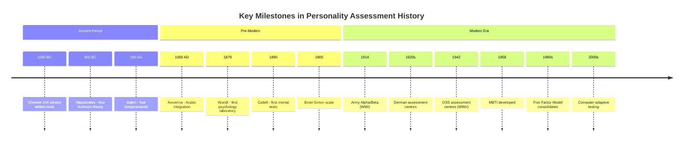
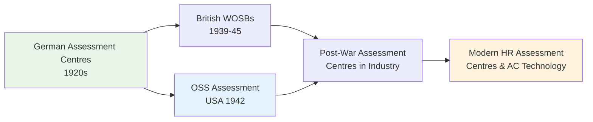

# History of Personality Assessment: From Ancient Humours to Modern Science

## Overview

The quest to understand individual differences in human behaviour stretches back thousands of years. From the earliest attempts by Chinese civil servants in 1000 BC to today's computerised adaptive assessments, personality assessment has evolved from folk wisdom and pseudo-science into a rigorous empirical discipline. This unit traces that extraordinary journey, highlighting the key figures, institutions, and intellectual breakthroughs that shaped how we assess personality today.

Understanding this history is not merely academic — it reveals how cultural, military, and industrial pressures shaped the tools we use, and it helps us critically evaluate the validity and limitations of current methods.

---

## 1. Ancient and Pre-Scientific Roots

### 1.1 Chinese Civil Service Testing (1000 BC)

One of the earliest documented uses of systematic assessment for selection appeared in ancient China. Written examinations were introduced around **1000 BC** to fill civil service positions — a remarkably early recognition that performance on standardised tasks could predict real-world competence. This tradition continued for millennia and influenced Western notions of merit-based selection.

### 1.2 Hippocrates and the Four Humours (c. 400 BC)

Greek physician **Hippocrates** proposed one of the first theories of personality rooted in biology rather than spirituality. He theorised that every person contains four bodily fluids — **blood, phlegm, yellow bile, and black bile** — and that the balance of these humours determines temperament and personality.

In **190 AD**, the Roman physician **Galen** elaborated this framework, identifying four temperamental types:

| Humour | Temperament | Characteristics |
|--------|-------------|-----------------|
| Blood | Sanguine | Warm, optimistic, confident, sociable |
| Phlegm | Phlegmatic | Sluggish, apathetic, calm, indifferent |
| Yellow Bile | Choleric | Violent, angry, aggressive, hot-tempered |
| Black Bile | Melancholic | Sad, depressive, anxious, melancholy |

Galen believed that food, climate, geography, and life stages could alter these humoral balances, and that a healthy personality emerged from their equilibrium. While entirely wrong by modern standards, this framework persisted for nearly 1,500 years and introduced the enduring idea that personality has biological foundations.

**Avicenna** (Ibn Sina), the great Muslim physician and philosopher of the 11th century, brought the four humours to the Arab world and extended them to analyse diverse causes of human illness and behaviour.

---

## 2. The Transition to Scientific Psychology

### 2.1 Wilhelm Wundt and the Psychological Turn (1879)

A decisive conceptual shift came with **Wilhelm Wundt**, who founded the first psychology laboratory in Leipzig, Germany in **1879**. Wundt was the first to draw a clear distinction between purely physical body characteristics and personality as a psychological construct. He reinterpreted Galen's four temperaments — sanguine, phlegmatic, choleric, and melancholic — as **four dimensions of human personality** rather than physical body states, giving them psychological meaning. This was the moment personality assessment began its transformation from folk knowledge to scientific inquiry.

### 2.2 Eduard Spranger's Value Attitudes (1905)

German philosopher **Eduard Spranger** proposed a classification of four attitudes toward ethical values — artistic, religious, theoretic, and economic — extending the idea that enduring personal orientations could be measured and compared.

### 2.3 Hugo Munsterberg and Industrial Selection

**Hugo Munsterberg**, a professor at Harvard University, conducted surveys of business executives to identify the qualities they most valued in employees. He then developed what may be considered the **first deliberately designed personality test for workplace selection**, aiming to help employers make better hiring decisions. This prefigured the entire field of industrial-organisational psychology.

### 2.4 Ernest Kretschmer's Character Styles (1920)

German physician **Ernst Kretschmer** (1920) proposed four character styles — hypomanic, depressive, hyperesthetic, and anesthetic — linked to body types, continuing the tradition of seeking physiological anchors for personality.

### 2.5 Erich Fromm's Human Orientations

Philosopher and psychoanalyst **Erich Fromm** proposed four fundamental human character orientations — **exploitative, hoarding, receptive, and marketing** — emerging from how people relate to the social and economic world. This prefigured later social-cognitive approaches.

---

## 3. Early 20th Century: Formal Testing Emerges

### 3.1 The Binet-Simon Scale (1905)

The first **standardised scale of mental development** was developed by **Alfred Binet and Théodore Simon** in France in **1905** to classify intellectually disabled children for educational placement. Binet had been influenced by Galton's work on individual differences and began with diverse experimental tasks — word knowledge, reasoning, numerical ability, inkblot identification, and picture storytelling. These latter tasks directly foreshadowed the **projective tests** of personality that would follow.

### 3.2 James McKeen Cattell and Mental Testing (1890)

In the United States, **James McKeen Cattell** developed a battery of mental tests in **1890** to assess college students' strength, resistance to pain, and reaction time. Although primitive by modern standards, these tests established the principle of **standardised individual difference measurement** in American psychology.

### 3.3 Army Alpha and Beta Tests (1914/1917)

World War I created an urgent practical need: rapidly classify hundreds of thousands of military recruits. The **Army Alpha** (verbal) and **Army Beta** (non-verbal, for illiterates) tests were developed to meet this need. This represented the first large-scale application of psychological testing, demonstrating that systematic assessment could inform high-stakes decisions at a massive scale.

### 3.4 The IQ Era: Terman and the Stanford-Binet (1916)

**Lewis Terman** introduced the term **Intelligence Quotient (IQ)** in 1916 with his development of the Stanford-Binet test. This period (1920–1940) saw an explosion of personality tests using factor analysis, projective techniques, and inventories.

---

## 4. Carl Jung and the Myers-Briggs Tradition

### 4.1 Jung's Personality Types (1922)

Swiss psychologist **Carl Jung** (1922) made a landmark contribution by theorising that people consistently prefer certain identifiable behaviours when given free choice, and that these preferences can be used to classify personality types. His framework included:

- **Extraversion vs. Introversion** (preferred source of energy)
- **Sensing vs. Intuition** (preferred mode of perception)
- **Thinking vs. Feeling** (preferred decision-making)
- **Judgment vs. Perception** (preferred lifestyle structure)

### 4.2 The Myers-Briggs Type Indicator (1958)

Two American psychologists, **Isabel Briggs Myers and Katherine Cook Briggs**, applied Jung's framework in **1958** to develop the **Myers-Briggs Type Indicator (MBTI)**, based on four questions:

1. Preferred source of energy — Internal or external?
2. Preferred perception mode — Senses or intuition?
3. Preferred decision system — Logic or feelings?
4. Preferred lifestyle — Ordered or adaptable?

From these, they derived **16 personality types** combining four dichotomous preferences.

### 4.3 Keirsey's Temperament Sorter

Building on the MBTI, **David Keirsey** identified four broad personality temperaments and developed his **Temperament Sorter**:

| Temperament | Core Values | Key Traits |
|-------------|-------------|-----------|
| Guardian | Responsibility, service, security | Dutiful, systematic, organised |
| Rational | Knowledge, skill, competence | Analytical, theoretical, strategic |
| Idealist | Self-development, meaning, authenticity | Empathetic, visionary, growth-oriented |
| Artisan | Action, freedom, variety | Spontaneous, impulsive, sensation-seeking |

:::info **MBTI in Modern Practice**
The MBTI remains one of the most widely used personality assessment tools globally, particularly in organisational settings. However, researchers have raised concerns about its **test-retest reliability** (individuals often receive different types on retesting) and its artificial dichotomisation of continuous traits. The **Big Five (OCEAN) model** is generally considered more scientifically robust for research purposes.
:::

---

## 5. Military Psychology and the Rise of Assessment Centres

### 5.1 German Assessment Centres (1920s–1936)

The most sophisticated pre-war development in personality assessment came from Germany. The German military established a program for officer candidate selection in the **1920s**. By **1936**, they operated **15 psychological laboratories** employing **84 psychologists** evaluating over **40,000 candidates per year**. Their method — the **modern assessment centre** — involved:

- Intensive 2-day evaluation of 4–5 candidates simultaneously
- Structured interviews and realistic job simulations
- Committee-based holistic judgment of "total personality"
- Evaluation of suitability for military leadership

This was a revolutionary combination of systematic observation, standardised tasks, and expert judgment that would influence all subsequent selection methodology.

### 5.2 British War Office Selection Boards (WOSBs)

The British had traditionally selected military officers through interviews focused heavily on social class. When upper-class supply was exhausted at the start of World War II, they adopted the German assessment centre model, creating **War Office Selection Boards (WOSBs)**. Comparisons showed that **assessment centres were substantially superior** to traditional interviews in identifying effective combat leaders.

### 5.3 The OSS Assessment Programme (1942)

The United States entered World War II unprepared for systematic personnel selection. Congress created the **Office of Strategic Services (OSS)** in **1942** under director William Donovan to enhance intelligence capabilities. Donovan and psychologist **Henry Murray** adapted the German assessment centre approach to screen OSS applicants.

Three landmark features of the OSS programme:

1. **Competence-based selection** — candidates were evaluated on actual competencies, not merely absence of psychopathology
2. **Systematic validity evaluation** — researchers consistently studied whether the process actually predicted later performance
3. **Economy discovery** — Eysenck (1953) demonstrated that **one hour of paper-and-pencil testing** yielded results comparable to the full 2.5-day assessment centre

The **Assessment of Men** (1948) documented the effectiveness of this process and became a foundational text in applied psychology.

---

## 6. The Five Factor Model: Bringing Order to Personality

From the 1920s through the 1980s, an enormous proliferation of personality tests created a confusing landscape. The convergence of factor-analytic research by Tupes and Christal (1961), Norman (1963), and later Costa and McCrae produced the **Five Factor Model (FFM)**, which demonstrated surprising order beneath the diversity of personality constructs.

**Murray Barrick and Michael Mount** showed in landmark meta-analytic research that the Five Factor Model predicted **occupational performance across a wide range of jobs and industries**, establishing personality assessment as a legitimate and valuable tool for applied prediction.

---

## 7. Related (and Pseudo-Scientific) Fields

### 7.1 Astrology

Predicting personality and future events from planetary positions at birth. Originated approximately 2,500 years ago in Mesopotamia. Despite enduring popular appeal, astrology has **no empirical support** — systematic studies consistently show birth signs do not predict personality or behaviour beyond chance.

### 7.2 Biorhythms

Developed by **Wilhelm Fliess** and promoted by George Thommen (1973). Three cycles — physical (23 days), emotional (28 days), and mental (33 days) — are claimed to be fixed at birth. Empirical testing has found no support.

### 7.3 Palmistry

Inferring character from hand lines. Documented in China as early as **3000 BC**. No empirical validation.

### 7.4 Humoral Theory

Ancient framework of four bodily fluids determining personality — historically important but completely superseded by modern biology.

### 7.5 Somatotype Theory (Sheldon)

Body build determines personality — ectomorph (thin = cerebrotonic), mesomorph (muscular = somatotonic), endomorph (round = viscerotonic). Methodologically flawed; not supported by independent research.

---

## Timeline Summary

| Period | Key Developments |
|--------|-----------------|
| 1000 BC | Chinese civil service written tests |
| 400 BC–200 AD | Hippocrates/Galen four humours |
| 1879 | Wundt's psychology laboratory |
| 1890 | Cattell's mental tests |
| 1905 | Binet-Simon scale |
| 1914–1918 | Army Alpha/Beta (WWI) |
| 1916 | IQ concept (Terman/Stanford-Binet) |
| 1920–1940 | Factor analysis, projective tests |
| 1920s | German assessment centres |
| 1922 | Jung's personality types |
| 1942 | OSS assessment programme |
| 1958 | MBTI developed |
| 1980–present | Computer tests, Five Factor Model |

---

## External Resources

### Wikipedia Articles
- [History of Psychological Testing](https://en.wikipedia.org/wiki/Psychological_testing)
- [Myers–Briggs Type Indicator](https://en.wikipedia.org/wiki/Myers%E2%80%93Briggs_Type_Indicator)
- [Office of Strategic Services](https://en.wikipedia.org/wiki/Office_of_Strategic_Services)
- [Humorism](https://en.wikipedia.org/wiki/Humorism)
- [Assessment Centre](https://en.wikipedia.org/wiki/Assessment_centre)

### Educational Videos
- [The History of Intelligence Testing – Crash Course Psychology](https://www.youtube.com/watch?v=NsTCGDDRBFE)
- [Jung's Theory of Personality – Academy of Ideas](https://www.youtube.com/watch?v=7-lSCq5jcpA)
- [MBTI: Scientifically Valid or Not? – Psych2Go](https://www.youtube.com/watch?v=gN2aWhP2U4g)

### Research Papers (2020–2024)
- Furnham, A. & Crump, J. (2021). The dark side of MBTI types. *Consulting Psychology Journal*, 73(2). 
- Soto, C. J. (2021). Do links between personality and life outcomes generalise? *Personality Science*, 2. DOI: 10.5964/ps.4
- Loehlin, J. C. & Martin, N. G. (2022). The nature of personality: A behavior genetics perspective. *Annual Review of Psychology*, 73, 233–256.

---

## Self-Assessment Questions

**Recall**
1. What were the four humours proposed by Hippocrates and Galen, and what personality types did they correspond to?
2. What is the OSS, and what was its significance for personality assessment methodology?
3. Who developed the MBTI, and on whose theory was it based?

**Application**
4. A company wants to select managers using personality assessment. Drawing on the history of assessment centres, describe three methodological principles that should guide their approach.
5. Why is it important to distinguish between scientific personality assessment and pseudo-scientific approaches like astrology or biorhythms?

**Analysis**
6. Analyse why the German assessment centre method proved superior to traditional interviews, drawing on its specific features.
7. Eysenck (1953) found that one hour of paper-and-pencil testing matched 2.5 days of assessment centre evaluation. What are the implications of this finding?

**Critical Thinking**
8. The MBTI is widely used in organisations despite scientific criticism. Based on validity and reliability criteria, what specific concerns would you raise?

---

## Memory Aids

**Mnemonic: MBTI Four Dimensions — "ESAP"**
- **E**nergy source (I/E)
- **S**ensing or Intuition
- **A**nalysis or Affect (T/F)
- **P**lanning style (J/P)

**Mnemonic: Four Humours — "BSY-M"**
- **B**lood → Sanguine (bright)
- **S**ecretions (phlegm) → Phlegmatic (slow)
- **Y**ellow bile → Choleric (hot)
- **M**elancholic (black bile) → Sad

**Keirsey's Temperaments — "GRIA"**
Guardian · Rational · Idealist · Artisan

---

## Indian Context

India's **Ayurvedic tradition** classifies personality through three doshas — **Vata** (air/space), **Pitta** (fire/water), and **Kapha** (earth/water) — paralleling the Western humoral tradition in seeking biological anchors for personality. Contemporary researchers have explored correlations between Ayurvedic psychotypes and Big Five personality traits with some meaningful findings. India's long civil service examination tradition (formalised under the Mughals and British Raj) also parallels the Chinese assessment history, reflecting a universal recognition that systematic testing improves selection.

---

**Source PDFs**:
- 📄 [Block-4/Unit-1.pdf - Pages 5-11](/pdfs/MPC-003%20Personality%20Theories%20and%20Assessment/Block-4/Unit-1.pdf)
- 📚 MPC-003 Personality Theories and Assessment
