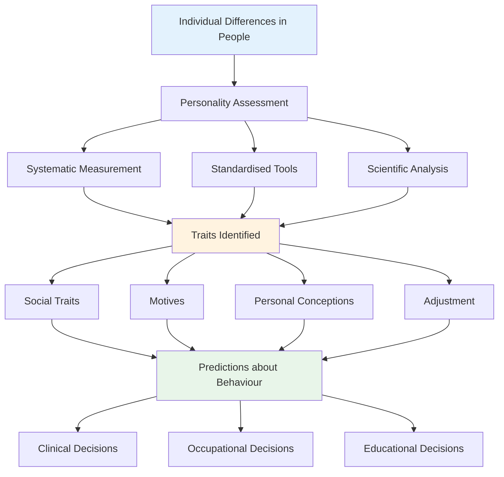
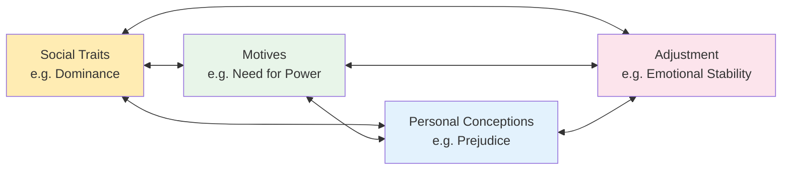

# Meaning and Purpose of Personality Assessment

## Overview

Why do we assess personality? What exactly are we measuring when we administer a personality test? This module answers these foundational questions — exploring how psychologists define personality assessment, what traits and dimensions it seeks to capture, and how the scientific study of individual differences gave rise to the entire field. Understanding purpose is essential before mastering methods: every assessment tool makes implicit assumptions about what personality is and what aspects of it matter most.

---

## 1. What Is Personality Assessment?

**Personality assessment** refers to systematic efforts to understand, describe, and predict individual differences in people's behaviour and experience. It is a formal process that makes it possible to:

1. Obtain information about individual differences in a **meaningful and exact manner**
2. **Communicate** this information to others in a clear and unambiguous way
3. **Predict** behaviour in real-world contexts (clinical, occupational, educational)

The term **personality** itself refers to the total functions of an individual as they interact with their environment. This automatically encompasses all enduring traits as the primary subject matter of assessment. A **trait** is defined as an **observed consistency of behaviour** — not something directly observed, but inferred from consistent patterns of action. The most general cues to traits are what a person does, how they do it, and how well they perform tasks.

:::tip **Key Distinction**
Traits are not directly observed — they are **inferred** from consistent patterns of behaviour across situations and over time. This is why personality assessment requires multiple methods and sources of evidence rather than single observations.
:::

---

## 2. The Influence of Psychological Science on Assessment

The roots of modern personality assessment lie in the **study of individual differences** — the scientific question of how and why people differ from one another. This inquiry received enormous impetus from Charles Darwin's theory of evolution, which raised the question of how individual variation was inherited and whether it could be systematically measured.

### 2.1 Sir Francis Galton (1822–1911)

**Sir Francis Galton**, Darwin's cousin and one of the most influential figures in 19th-century science, became deeply interested in the inheritance of individual differences. He devoted the latter part of his life to their study, pioneering:

- **Statistical methods** for studying variation (correlation, regression)
- **Direct behavioural samples** in real-life situations
- The principle of measuring intelligence and other psychological attributes objectively

Galton's methods were refined by his followers **Karl Pearson** and **Charles Spearman**, who developed the statistical tools (correlation coefficients, factor analysis) that would become essential to personality measurement.

### 2.2 James McKeen Cattell (1860–1944)

The study of individual differences in the United States was pioneered by **James McKeen Cattell**, whose interests in psychophysics, perception, and reaction time led to the development of systematic measurement methods. Though his specific tests had limited validity, Cattell's insistence on **objective measurement** strongly influenced the development of personality tests.

### 2.3 Alfred Binet (1857–1911)

**Alfred Binet** in France, inspired by Galton's work, conducted studies of eminent artists and scientists using standardised experimental tasks. His investigations into mental functioning — employing word knowledge, reasoning, numerical ability, picture-story telling, and inkblot identification — led to the Binet Tests of intelligence. Crucially, the picture-story and inkblot tasks **directly foreshadowed projective personality testing**, linking intelligence measurement to personality assessment.

---

## 3. The Four Core Purposes: What Personality Assessment Measures

The most influential framework for understanding what personality assessment aims to measure comes from psychologist **J.C. Nunnally (1979)**, who identified four broad types of traits as the primary targets of personality measurement:

### 3.1 Social Traits

**Social traits** are enduring characteristics that determine how persons interact with others in society. They represent the **interpersonal dimension** of personality — the patterns of behaviour that emerge in social contexts.

Examples of social traits:
- Friendliness / hostility
- Dominance / submission
- Honesty / deception
- Responsibility / irresponsibility
- Shyness / boldness

Social traits encompass both **temperament** (innate emotional reactivity and regulation) and **character** (moral and ethical dimensions of behaviour). Within the Big Five framework, social traits map primarily onto **Extraversion** (sociability, assertiveness) and **Agreeableness** (cooperativeness, trust).

### 3.2 Motives

**Motives** in personality assessment refer specifically to **non-biological drives** — the socially acquired needs and goals that energise and direct behaviour. These are distinguished from basic biological drives (hunger, thirst, sex) and represent what are sometimes called **personality dynamics** — the motivational engine of personality.

Key categories of motives in personality psychology:
- **Need for Achievement (nAch)** — desire to excel and succeed
- **Need for Affiliation (nAff)** — desire for close relationships and belonging
- **Need for Power (nPow)** — desire to influence and control others
- **Need for Academic Achievement** — drive for intellectual mastery
- **Need for Money and Prestige** — status-oriented motivation
- **Aggression drives** — hostile motivational patterns

Henry Murray's **need theory** and David McClelland's achievement motivation research established the scientific measurement of motives as a major branch of personality assessment.

### 3.3 Personal Conceptions

**Personal conceptions** include all the cognitive structures and beliefs that determine how people understand themselves and the world around them. This category includes:

- **Attitudes** toward self and others
- **Values** — what the person considers important and worthwhile
- **Interests** — patterns of engagement and preference
- **Beliefs and worldview**
- **Self-concept** — the beliefs a person holds about their own characteristics
- **Self-esteem** — evaluative component of self-concept

Personal conceptions represent the **cognitive-evaluative dimension** of personality — the interpretive lens through which people make sense of their experience. Kelly's **Personal Construct Theory** and Beck's work on cognitive schemas are major contributions to this domain.

### 3.4 Adjustment

**Adjustment** refers to the individual's capacity to establish a satisfactory relationship with their environment — a **dynamic balance** between personal needs and environmental demands. It is not a static endpoint but an ongoing process:

> "Adjustment is the process by which a living organism maintains a balance between its needs and the circumstances that influence the satisfaction of those needs." (IGNOU, MPC-003)

Components of adjustment:
- Freedom from excessive emotional distress or instability
- Effective coping with life challenges
- Realistic appraisal of self and situation
- Ability to maintain satisfying relationships
- Productive engagement with work and goals

**Maladjustment** manifests as extreme social traits, eccentric motives, and dysfunctional personal conceptions. In clinical assessment, adjustment is the primary focus — determining how well an individual is functioning across life domains.

---

## 4. The Interconnection of the Four Trait Types

A crucial insight in Nunnally's framework is that these four types of traits are **not independent** — they are substantially correlated with one another. Changes in one domain inevitably ripple through the others:

**Concrete Example — The Prejudiced Individual:**

Consider a person who holds extreme prejudice against a particular social group (personal conception). This cognitive-evaluative stance will:
- Affect **social traits** — hostile, avoidant, or aggressive interpersonal behaviour toward out-group members
- Influence **motives** — potentially increasing power-seeking drives or threat-based motivation
- Impair **adjustment** — creating chronic interpersonal conflict and psychological distress

**Conversely**, a person with good general adjustment typically shows:
- Positive social traits (warm, cooperative)
- Balanced, constructive motives
- Realistic, flexible personal conceptions

**Clinical Implication:** This interconnection is why comprehensive personality assessment must examine all four domains. Assessing only social traits while ignoring motives or adjustment gives an incomplete picture. Multi-method, multi-domain assessment is the gold standard.

---

## 5. Two Key Steps in Personality Assessment

The IGNOU curriculum identifies two important preliminary steps before any personality assessment:

### Step 1: Stipulate the Agenda

Clearly define what you are trying to predict or understand. The **agenda** concerns:
- Are you predicting **interpersonal effectiveness** (getting along)?
- Are you predicting **occupational advancement** (getting ahead)?
- Are you assessing **person-culture fit** in an organisation?
- Are you conducting a **clinical evaluation** for treatment planning?

The agenda determines everything — which traits to measure, which tools to use, and how to interpret results.

### Step 2: Decide Which Aspect of Personality to Measure

Personality can be assessed from two fundamentally different vantage points:

| Vantage Point | What It Captures | Best Uses |
|---------------|-----------------|-----------|
| **Inside-out** (Identity) | Values, inner experiences, self-perception | Person-culture fit, personal development |
| **Outside-in** (Reputation) | Observer ratings, 360-degree feedback, behavioural data | Occupational performance prediction |

Self-report measures (MMPI-2, NEO-PI-R, 16PF) primarily capture **identity** — how people see themselves. Observer ratings and behavioural assessments capture **reputation** — how others perceive the person. Research suggests that reputation-based measures often predict occupational performance more strongly than self-reports alone.

---

## 6. What Makes Personality Assessment Scientifically Useful?

A scientifically useful personality assessment must produce information that is:

1. **Reliable** — consistent and repeatable across occasions and raters
2. **Valid** — actually measuring what it claims to measure
3. **Standardised** — administered and scored under uniform procedures
4. **Norm-referenced** — interpretable relative to known reference groups

These technical requirements are covered in detail in the next module (Testing and Measurement Concepts). However, it is worth noting here that the **practical utility** of personality assessment is ultimately judged by its ability to predict real-world outcomes — clinical prognosis, occupational performance, educational achievement, interpersonal functioning.

---

## External Resources

### Wikipedia Articles
- [Psychological Assessment](https://en.wikipedia.org/wiki/Psychological_assessment) — overview of the field
- [Individual Differences Psychology](https://en.wikipedia.org/wiki/Individual_differences_psychology) — scientific study of how people differ
- [Francis Galton](https://en.wikipedia.org/wiki/Francis_Galton) — founder of differential psychology
- [Alfred Binet](https://en.wikipedia.org/wiki/Alfred_Binet) — pioneer of mental testing
- [Personality Trait](https://en.wikipedia.org/wiki/Personality_trait) — conceptual foundations

### Educational Videos
- [What Is Personality? – Crash Course Psychology #19](https://www.youtube.com/watch?v=wGiG8SjMEWk) — excellent introduction to personality psychology
- [Personality Assessment – Psych2Go](https://www.youtube.com/watch?v=jfRq1FLXBSM) — overview of assessment methods
- [How Psychologists Measure Personality – TED-Ed](https://www.youtube.com/watch?v=Y2GQQyVJSQo) — accessible introduction

### Research Papers (2020–2024)
- Funder, D. C. (2021). Personality. *Annual Review of Psychology*, 72, 423–450. DOI: 10.1146/annurev-psych-070920-111518 — authoritative overview of the field
- Anglim, J. et al. (2020). Predicting psychological and subjective well-being from personality: A meta-analysis. *Psychological Bulletin*, 146(4), 279–323. — personality and wellbeing outcomes
- Woods, S. A. & Hampson, S. E. (2022). Personality assessment: The current state of the art. *Annual Review of Organizational Psychology and Organizational Behavior*, 9. — workplace applications

---

## Self-Assessment Questions

**Recall**
1. How does Nunnally (1979) define the four broad types of traits that personality assessment aims to measure?
2. What is the difference between social traits and motives in the context of personality assessment?
3. What role did Francis Galton play in the development of personality assessment?

**Application**
4. A clinical psychologist is assessing a patient referred for anger management. Which of the four trait types (social traits, motives, personal conceptions, adjustment) would be most relevant, and why?
5. An organisation wants to improve its employee selection process. Should they use identity-based or reputation-based assessment? Justify your answer.

**Analysis**
6. Nunnally argues that the four types of traits are correlated rather than independent. Using a concrete example (not the one in the text), illustrate how a deficit in one domain affects the others.
7. How does the concept of "adjustment" in personality psychology differ from the everyday sense of the word? What specific aspects does it encompass?

**Critical Thinking**
8. Is personality assessment more useful for understanding the past (why someone behaved a certain way) or predicting the future (how they will behave)? Draw on the concepts of identity and reputation in your answer.

---

## Memory Aids

### The Four Trait Types — "SMPA"
- **S**ocial traits — how you interact with others
- **M**otives — what drives you (non-biological needs)
- **P**ersonal conceptions — how you think about yourself and the world
- **A**djustment — how well you balance needs and environment

### Galton → Pearson → Spearman: The Statistical Chain
Galton (individual differences) → Pearson (correlation methods) → Spearman (factor analysis) → Modern personality measurement

### Inside-Out vs. Outside-In
- **I**dentity (inside-out) → self-report → person-culture fit
- **R**eputation (outside-in) → observer ratings → occupational performance

---

## Indian Context

Indian psychology has long grappled with the relationship between individual traits and social functioning. The concept of **Guna** in Vedantic philosophy describes three fundamental qualities — **Sattva** (clarity, harmony), **Rajas** (passion, activity), and **Tamas** (inertia, darkness) — that combine in different proportions in each individual to produce characteristic personality patterns. This ancient classification maps loosely onto modern personality dimensions:

- Sattva corresponds to aspects of Conscientiousness and Openness
- Rajas to Extraversion and Neuroticism (activity-related)
- Tamas to low Conscientiousness and passivity

Research by Indian psychologists including **Ajit Dalal** and colleagues has explored whether Indian samples show the same Big Five structure found in Western research — generally finding support but with some cross-cultural variations, particularly in the Agreeableness and Openness dimensions.

The **Joint Family System** and **collectivist culture** of India also mean that adjustment norms differ from Western individualist societies. What constitutes healthy adjustment in Indian contexts often involves prioritising family harmony over individual self-expression — a consideration that culturally sensitive personality assessment must accommodate.

---

**Source PDFs**:
- 📄 [Block-4/Unit-1.pdf - Pages 11-14](/pdfs/MPC-003%20Personality%20Theories%20and%20Assessment/Block-4/Unit-1.pdf)
- 📚 MPC-003 Personality Theories and Assessment
