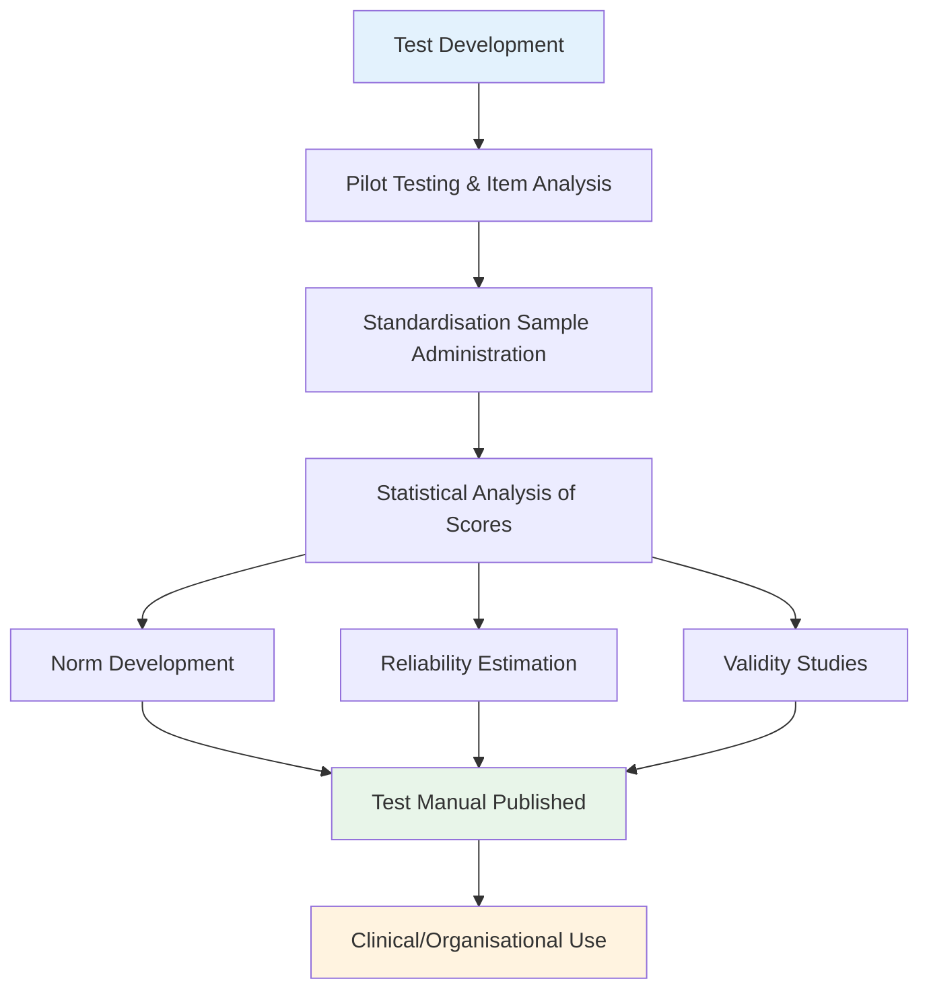
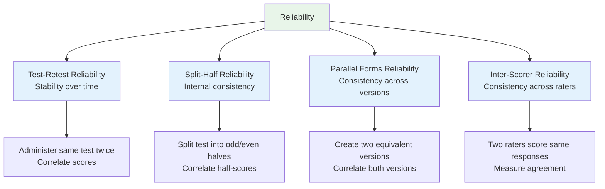
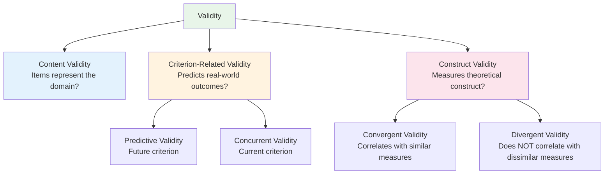

# Testing and Measurement Concepts: Standardisation, Norms, Reliability, and Validity

## Overview

Any personality assessment technique must meet four fundamental technical criteria before it can be considered a **scientifically acceptable measure** of individual differences. These four criteria — **standardisation, norms, reliability, and validity** — constitute the psychometric foundation of all legitimate psychological testing. Understanding these concepts is essential not only for exam purposes but for critically evaluating the quality of any assessment tool you encounter in clinical, organisational, or research contexts.

This module provides a comprehensive treatment of each criterion, including its conceptual definition, practical implementation, different types, and clinical/applied significance.

---

## 1. Standardisation

### 1.1 Definition

**Standardisation** refers to the use of **uniform procedures** in the administration and scoring of an assessment tool. It is the foundational criterion that makes comparison across individuals, settings, and occasions possible.

A standardised assessment ensures that:
- All participants receive **identical instructions**
- The assessment is administered under **identical conditions**
- Scoring follows **consistent, objective rules**
- The same **time limits** (if any) apply to all

### 1.2 What Standardisation Includes

Standardisation encompasses more than just consistent administration. A fully standardised test manual specifies:

1. **Administration conditions** — physical environment, time of day constraints, examiner behaviour
2. **Target population** — who should (and should not) take the test
3. **Scoring procedures** — explicit rules for assigning numerical scores
4. **Interpretive guidelines** — what various score ranges mean

### 1.3 Why Standardisation Matters

Without standardisation, scores are meaningless for comparison. If one person takes a personality test in a quiet room with a supportive examiner, while another takes the same test under time pressure with a dismissive examiner, any score difference could reflect the conditions rather than genuine personality differences.

:::info **Real-World Application**
In high-stakes settings like clinical diagnosis, court-ordered evaluation, or employment selection, standardisation is legally and ethically mandatory. Violations of standardised procedure can invalidate results and expose practitioners to professional liability.
:::

### 1.4 Standardisation Sample

A critical component of standardisation is the **standardisation sample** — the group whose performance is used to establish norms. This sample must:
- Be **representative** of the target population (age, sex, ethnicity, education, geography)
- Be **sufficiently large** to provide stable estimates (typically thousands of participants)
- Be **clearly described** so users can judge comparability to their own clients



---

## 2. Norms

### 2.1 Definition

**Test norms** are established standards of performance that allow individual scores to be interpreted relative to a known reference group. Norms answer the practical question: "Is this person's score high, average, or low **compared to whom**?"

Norms are essential because raw scores on personality tests are inherently uninterpretable without reference points. A raw score of 45 on a social anxiety scale means nothing without knowing the distribution of scores in the relevant population.

### 2.2 Types of Norms

**Percentile Norms**: The most common format. Indicate the percentage of people in the reference group who scored **at or below** a particular score. A percentile rank of 75 means the person scored higher than 75% of the normative sample.

**Standard Score Norms**: Transform raw scores to a standard scale with a fixed mean and standard deviation. Common formats include:
- **T-scores** (M=50, SD=10) — used in MMPI-2
- **Stanines** (M=5, SD=2) — used in some educational tests
- **Standard Scores** (M=100, SD=15) — used in intelligence tests

**Age/Grade Norms**: Indicate performance relative to age or educational level — common in developmental and educational assessment.

### 2.3 The Critical Importance of Norm Group Selection

The meaning of a personality score **depends entirely on the norm group chosen**. This is one of the most important and most frequently overlooked aspects of test interpretation:

| Norm Group Choice | Implication |
|-------------------|-------------|
| General population norms | Compare to average adults |
| Clinical sample norms | Compare to people with psychological disorders |
| Occupational norms | Compare to people in a specific profession |
| Cross-cultural norms | Compare within one cultural group vs. another |

Misapplying norms can lead to serious errors. For example, using general population norms to interpret the aggressiveness score of a professional boxer could pathologise normal occupational behaviour.

### 2.4 Norm Obsolescence

Norms become outdated over time as populations change. The **Flynn Effect** — the documented rise in IQ scores over decades — illustrates how normative benchmarks drift. Personality norms require periodic re-standardisation to remain accurate.

---

## 3. Reliability

### 3.1 Definition

**Reliability** refers to the **consistency or stability** of an assessment technique. A reliable test yields similar results when administered to the same person under similar conditions on different occasions. Without reliability, a test is useless — it cannot measure anything meaningfully if its scores fluctuate randomly.

Reliability is quantified using **correlation coefficients**, with values ranging from 0.00 (no reliability) to +1.00 (perfect reliability). Most psychological tests set a minimum acceptable reliability of **+0.70**, though higher is better.

### 3.2 The Four Types of Reliability



#### Type 1: Test-Retest Reliability

**Definition**: The correlation between scores obtained from the **same test** given to the **same group on two different occasions** (Anastasi, 1968).

**Procedure**: Administer the test at Time 1 and Time 2. Correlate the two sets of scores. The resulting correlation coefficient is the test-retest reliability coefficient.

**Key Considerations**:
- The time interval between administrations is critical. Too short (days) → **memory effects** inflate reliability. Too long (years) → **genuine personality change** deflates reliability
- Optimal intervals for personality tests: typically **2–6 weeks**
- Acceptable coefficients: **≥ +0.70**

**Limitation**: Cannot separate true score variance from memory/practice effects at short intervals, or true change at long intervals.

#### Type 2: Split-Half Reliability (Internal Consistency)

**Definition**: The correlation between two halves of the same test (typically odd-numbered vs. even-numbered items).

**Procedure**: Administer the full test. Split into two halves. Correlate the sum of odd items with the sum of even items. Apply **Spearman-Brown correction** to estimate full-test reliability.

**What It Measures**: Whether all items on the test are consistently measuring the **same underlying construct**. A high split-half reliability means someone who scores high on odd items also scores high on even items.

**Coefficient Alpha (Cronbach's Alpha)**: A generalisation of split-half reliability that considers all possible ways of splitting the test. Now the standard measure of internal consistency. Widely reported in research using α ≥ 0.70 as the minimum standard.

#### Type 3: Parallel Forms Reliability

**Definition**: The correlation between two different versions of the same test (containing equivalent but not identical items), administered to the same group.

**Purpose**: Demonstrates that different item sets measuring the same construct yield equivalent scores. Important when test security requires multiple forms (e.g., large-scale examinations where different versions prevent cheating).

**Practical Challenge**: Developing genuinely parallel forms requires extensive item analysis and equating studies — expensive and time-consuming.

#### Type 4: Inter-Scorer Reliability (Inter-Rater Reliability)

**Definition**: The degree of agreement between two or more **independent judges** scoring the same assessment responses.

**When Essential**: Any assessment involving **subjective interpretation**:
- Projective tests (Rorschach, TAT)
- Clinical interviews
- Behavioural observation systems
- Essay-based response formats
- Dream reports and open-ended narratives

**Quantification**: Agreement between raters is measured using **Cohen's Kappa** (for categorical ratings) or **Intraclass Correlation Coefficient (ICC)** (for continuous ratings). Simple percentage agreement is insufficient — it inflates reliability by ignoring chance agreement.

**Critical Issue**: Inter-scorer reliability tends to be **especially problematic with qualitative data**. Projective test scoring, in particular, has historically shown low inter-scorer reliability, raising questions about the validity of these instruments when scoring is not strictly controlled.

**Solution**: Explicit scoring manuals with detailed rules, examples, and anchor descriptions consistently improve inter-scorer reliability. Training and regular calibration sessions also help.

---

## 4. Validity

### 4.1 Definition

**Validity** is the most fundamental psychometric property. It addresses whether a test **measures what it claims to measure** or **predicts what it is supposed to predict**.

A test can be highly reliable (consistent) yet completely invalid (not measuring what it claims). A thermometer placed in someone's armpit is reliable — it gives consistent readings — but it is not a valid measure of personality. Validity is always the ultimate criterion.

### 4.2 The Three Main Types of Validity



---

#### 4.3 Content Validity

**Definition**: The degree to which a test's items adequately **represent the full domain** of the construct being measured.

**Key Question**: "Are all important facets of the construct represented in the item pool, in appropriate proportions?"

**Example**: A personality test measuring **shyness** should include items reflecting:
- **Personal discomfort** ("Is your shyness a major source of personal discomfort?")
- **Social behaviour** ("Do you get embarrassed when speaking in front of a large group?")
- **Cognitive patterns** ("Do you believe others are always judging you?")

A test that only asks about social avoidance but ignores cognitive patterns has incomplete content coverage — it has poor content validity for a comprehensive shyness construct.

**How It Is Established**: Primarily through **expert judgment**. A panel of domain experts reviews each item and rates whether it represents an aspect of the construct. **Item-content validity ratios** (Lawshe, 1975) provide a quantitative estimate.

**Limitation**: Content validity cannot be established statistically — it depends entirely on expert consensus about the theoretical definition of the construct. Different theoretical definitions lead to different content validity judgments.

---

#### 4.4 Criterion-Related Validity

**Definition**: The degree to which test scores **correlate with an independently measured criterion** — a real-world outcome that the test is designed to predict or relate to.

**The Criterion Problem**: Selecting an appropriate criterion is itself challenging. The criterion must be:
- **Relevant** to the construct
- **Reliably measured** (an unreliable criterion cannot correlate highly with anything)
- **Practically obtainable**
- **Free from criterion contamination**

**Criterion Contamination**: A serious threat to validity studies — when raters who score the criterion measure are aware of the person's test scores. Their ratings may be biased by this knowledge, artificially inflating validity estimates.

**Two Types of Criterion-Related Validity**:

##### Predictive Validity

**Definition**: The degree to which a test accurately **forecasts a criterion measured in the future**.

**Procedure**: Administer test at Time 1. Measure criterion at Time 2 (often months or years later). Correlate test scores with future criterion scores.

**Examples**:
- Does an undergraduate personality assessment predict therapy outcome?
- Do hiring-stage personality scores predict managerial performance one year later?
- Does an adolescent risk assessment predict delinquency in the following three years?

**Gold Standard**: Predictive validity is the strongest evidence for an assessment tool's applied usefulness, but it requires longitudinal follow-up — expensive and time-consuming.

##### Concurrent Validity

**Definition**: The degree to which a test correlates with another criterion measure **assessed at the same time**.

**Procedure**: Administer the new test. Simultaneously (or nearly simultaneously) administer an established, validated criterion measure. Correlate the two.

**Example**: A new self-report measure of paranoid tendencies is administered. Clinical psychologists simultaneously rate patients' paranoia in unstructured interviews (without knowledge of test scores). High correlation between test scores and clinical ratings demonstrates concurrent validity.

**Limitation vs. Predictive Validity**: Concurrent validity is easier to establish but has less applied value — it shows the test agrees with current measures, not that it can predict future outcomes.

---

#### 4.5 Construct Validity

**Definition**: The degree to which a test actually measures the **hypothetical psychological construct** it is intended to measure (Cronbach & Meehl, 1955).

Construct validity is the **most theoretically fundamental** type of validity because it addresses the deepest question: does the test measure a meaningful, real psychological construct, or merely surface behaviour?

**The Challenge**: Psychological constructs like **self-actualisation, ego identity, social interest, repression, or emotional intelligence** are hypothetical — they cannot be directly observed. Construct validity requires gathering **converging evidence** across multiple studies that the test behaves as theory predicts.

**The Process of Construct Validation**:
1. Define the construct theoretically
2. Derive empirical predictions from the theory ("if X measures construct Y, then X should correlate with Z, and not correlate with W")
3. Conduct studies testing these predictions
4. Accumulate evidence across multiple studies

This is a **laborious, ongoing process** — no single study establishes construct validity. It requires decades of research examining the test's network of relationships with other variables.

##### Convergent Validity

**Definition**: The degree to which a test **correlates with other measures that purportedly assess the same construct** (Campbell & Fiske, 1959).

**Logic**: If our new self-esteem scale truly measures self-esteem, it should correlate positively with established, validated self-esteem measures (Rosenberg Self-Esteem Scale, RSES; Self-Perception Profile).

**Example**: A new implicit self-esteem measure correlates r = .52 with the Rosenberg Scale, r = .48 with the RSES, and r = .61 with therapist ratings of self-esteem — strong convergent evidence.

**Limitation**: High convergence alone doesn't prove validity — multiple measures could all be measuring the same *wrong* thing.

##### Divergent (Discriminant) Validity

**Definition**: The degree to which a test **does NOT correlate with measures of conceptually unrelated constructs** (Campbell & Fiske, 1959).

**Logic**: If our self-esteem scale truly measures self-esteem specifically, it should **not** correlate highly with measures of entirely different constructs like reaction time, colour preference, or mathematical ability.

**The Multitrait-Multimethod Matrix (MTMM)**: Campbell and Fiske's landmark methodological contribution — a framework for simultaneously evaluating convergent and discriminant validity by measuring multiple constructs with multiple methods.

**Example**: Our new self-esteem scale correlates r = .12 with a measure of verbal fluency and r = .09 with a measure of extraversion — demonstrating that it is measuring something distinct from these other constructs (good discriminant validity).

**Why Both Are Needed**: 
- **High convergent + high discriminant** = valid, specific measure
- **High convergent + low discriminant** = not measuring the specific construct; too broad
- **Low convergent** = not measuring the target construct at all

---

## 5. The Relationship Between Reliability and Validity

A critical insight in psychometrics is the **asymmetrical relationship** between reliability and validity:

- **High reliability does NOT guarantee high validity** — a test can be very consistent without measuring the right thing
- **Low reliability sets an upper limit on validity** — a test cannot be more valid than it is reliable (because unreliable measurements contain too much error to predict anything)

**The Formula**:

```
r_validity ≤ √(r_reliability)
```

This means: the maximum possible validity coefficient is the square root of the reliability coefficient. A test with reliability of .49 cannot have validity above .70. **Reliability is a necessary but not sufficient condition for validity.**

---

## 6. Summary Comparison of All Criteria

| Criterion | Core Question | How Established | Key Limitations |
|-----------|--------------|-----------------|-----------------|
| **Standardisation** | Are conditions uniform? | Procedural protocols | Hard to enforce in natural settings |
| **Norms** | How does this score compare? | Standardisation sample | Norms become outdated; group choice matters |
| **Test-Retest Reliability** | Consistent over time? | Correlation of two administrations | Memory effects; real change |
| **Split-Half Reliability** | Internally consistent? | Odd/even item correlation | Single-occasion bias |
| **Parallel Forms Reliability** | Consistent across versions? | Correlation of two forms | Expensive to develop |
| **Inter-Scorer Reliability** | Consistent across raters? | Cohen's Kappa, ICC | Training required; subjectivity |
| **Content Validity** | Items cover the domain? | Expert judgment | Theory-dependent |
| **Predictive Validity** | Predicts future outcomes? | Longitudinal correlation | Time-consuming; criterion contamination |
| **Concurrent Validity** | Correlates with current criterion? | Simultaneous correlation | Less practical utility than predictive |
| **Convergent Validity** | Agrees with similar measures? | Multi-measure correlation | High convergence ≠ correct construct |
| **Divergent Validity** | Differs from unrelated measures? | Low correlation with dissimilar measures | Hard to define "unrelated" |

---

## External Resources

### Wikipedia Articles
- [Psychometrics](https://en.wikipedia.org/wiki/Psychometrics) — comprehensive overview of test theory
- [Reliability (Statistics)](https://en.wikipedia.org/wiki/Reliability_(statistics)) — statistical foundations
- [Validity (Statistics)](https://en.wikipedia.org/wiki/Validity_(statistics)) — conceptual and empirical validity
- [Cronbach's Alpha](https://en.wikipedia.org/wiki/Cronbach%27s_alpha) — the standard internal consistency measure
- [Multitrait–Multimethod Matrix](https://en.wikipedia.org/wiki/Multitrait%E2%80%93multimethod_matrix) — Campbell & Fiske's landmark framework

### Educational Videos
- [Reliability and Validity – Crash Course Statistics #37](https://www.youtube.com/watch?v=q7sgzDH1QBA) — clear visual explanation
- [Types of Validity – Research Methods in Psychology](https://www.youtube.com/watch?v=Hq5nQ1c0ZsA) — content, criterion, construct
- [Cronbach's Alpha Explained – Statistics How To](https://www.youtube.com/watch?v=Otp71b-LZSY) — practical walkthrough

### Research Papers (2020–2024)
- Flake, J. K. & Fried, E. I. (2020). Measurement schmeasurement: Questionable measurement practices and how to avoid them. *Advances in Methods and Practices in Psychological Science*, 3(4), 456–465. DOI: 10.1177/2515245920952393 — measurement best practices
- McNeish, D. (2021). Reconsidering how to evaluate reliability of scales with ordinal item responses. *Psychological Methods*, 26(3), 273–289. — modern reliability approaches
- Hussey, I. & Hughes, S. (2020). Hidden invalidity among 15 commonly used measures in social and personality psychology. *Advances in Methods*, 3(2), 166–184. — real-world validity problems

---

## Self-Assessment Questions

**Recall**
1. Define standardisation and explain why it is necessary for personality assessment.
2. What is the difference between test-retest reliability and split-half reliability?
3. Distinguish between predictive validity and concurrent validity with examples.
4. What is construct validity, and why is it considered the most theoretically fundamental type?

**Application**
5. You are developing a new scale to measure social anxiety. Describe the specific steps you would take to establish: (a) content validity, (b) convergent validity, and (c) divergent validity.
6. A clinical psychologist administers the Rorschach Inkblot Test and finds wide disagreement between her ratings and a colleague's ratings of the same protocols. Which type of reliability is being violated? What steps should be taken?

**Analysis**
7. Explain, with a formula or conceptual explanation, why reliability is a necessary but not sufficient condition for validity.
8. A test has a test-retest reliability of .36. What is the maximum validity coefficient this test can have? What does this imply for its use in clinical decision-making?

**Critical Thinking**
9. Campbell and Fiske (1959) argued that both convergent and divergent validity are needed to establish construct validity. Why is neither alone sufficient? Create a concrete example illustrating what happens when only one of these is demonstrated.
10. Norms are described as establishing the "meaning" of raw scores. In what ways can poorly constructed norms lead to harmful assessment decisions in clinical or educational contexts?

---

## Memory Aids

### The Four Criteria — "SNRV"
**S**tandardisation → **N**orms → **R**eliability → **V**alidity  
*(Sequential: each builds on the previous)*

### Reliability Types — "TSPI"
**T**est-retest · **S**plit-half · **P**arallel forms · **I**nter-scorer

### Validity Types — "CCC-DD"
**C**ontent → **C**oncurrent → **C**onstruct *(includes)* **Co**nvergent + **Di**vergent

### Reliability-Validity Relationship
"**Reliable but wrong** vs. **Valid and consistent**"
- Consistent bathroom scale reading 5kg over = reliable but invalid
- Good personality test = both reliable AND valid

---

## Indian Context

**NIMHANS (National Institute of Mental Health and Neurosciences)** in Bengaluru has produced important work on standardising psychological tests for Indian populations. Researchers have found that Western tests often require **linguistic adaptation, cultural modification of items, and separate Indian norms** to function validly in Indian contexts. For example:

- The **MMPI** required significant item revision for Indian use because many items reflected culturally specific American references
- **Intelligence tests** standardised on Western samples significantly underestimate the abilities of rural Indian children if applied without Indian norms
- The **Big Five personality measures** show some structural differences when applied to Indian samples, particularly around the Agreeableness dimension, which is more culturally nuanced in collectivist contexts

This illustrates concretely why **standardisation sample selection** and **cross-cultural norm development** are not merely technical concerns but ethical imperatives in personality assessment.

---

**Source PDFs**:
- 📄 [Block-4/Unit-1.pdf - Pages 14-19](/pdfs/MPC-003%20Personality%20Theories%20and%20Assessment/Block-4/Unit-1.pdf)
- 📚 MPC-003 Personality Theories and Assessment
