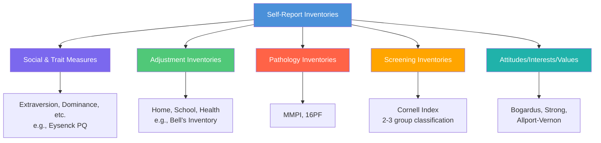
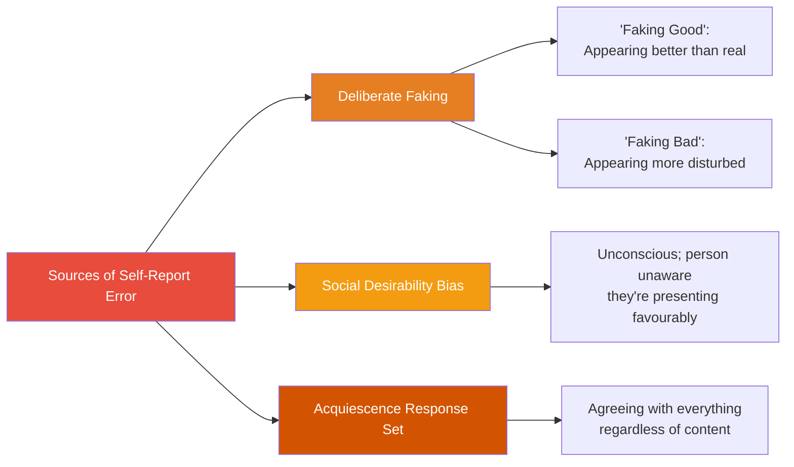

# Self-Report Personality Inventories: Types, Strengths, and Weaknesses

## Introduction

Personality assessment is a cornerstone of psychological practice, and no tool is more widely used than the **self-report inventory** — a standardised questionnaire in which individuals describe their own feelings, reactions, values, traits, and behaviours. From clinical diagnosis to corporate hiring to relationship counselling, self-report inventories shape consequential decisions about millions of people worldwide.

Understanding how these tools work, what they measure well, and where they fall short is essential for any psychologist, counsellor, or researcher. This module examines the theoretical foundations, classification, and critical evaluation of self-report inventories.

---

**Source PDFs**:
- 📄 [Block-4/Unit-2.pdf - Pages 20-28](/pdfs/MPC-003%20Personality%20Theories%20and%20Assessment/Block-4/Unit-2.pdf)
- 📚 MPC-003 Personality Theories and Assessment

---

## What Is a Self-Report Inventory?

A **self-report inventory** (also called a personality inventory or questionnaire) is a paper-and-pencil (or digital) assessment tool in which the person being assessed responds directly to questions about themselves using a limited, prescribed set of response choices — such as *True/False*, *Agree/Disagree*, or a 1–6 rating scale.

The term "self-report" captures the method's defining characteristic: **the person is the primary informant about their own personality**. Unlike observer-rated methods or projective techniques, there is no mediating interpretation by a clinician during response generation. The individual's responses are taken as direct (if imperfect) reflections of their traits, attitudes, and adjustment patterns.

### Key Features of All Self-Report Tests
- **Standardised response alternatives**: Every test-taker chooses from the same options (e.g., "True", "False", "Cannot Say"), ensuring objectivity and comparability.
- **Standardised scoring**: Answers are scored against a predetermined key, minimising scorer bias.
- **Restricted freedom**: Objectivity is achieved by limiting how freely someone can respond, forcing choices that can be quantified.

> 🔑 **Key Insight**: The objectivity of self-report tests is both their greatest strength (reducing bias, enabling large-scale use) and a paradox — standardisation constrains the rich, idiosyncratic ways people actually experience themselves.

---

## Classification of Self-Report Inventories

Self-report inventories are not a monolithic category. They differ substantially in their purpose and content. Five major types exist:

### Type 1: Social and Specific Trait Inventories
These measure particular personality traits such as **self-confidence, dominance, extraversion, or assertiveness**. They are used extensively in research and applied settings.

**Examples**: Bernreuter Personality Inventory, Eysenck Personality Questionnaire, Differential Personality Scale.

### Type 2: Adjustment Inventories
These evaluate how well a person is adjusting to different life domains — self, health, home, school, and interpersonal relationships. Poor adjustment scores may signal the need for counselling or support.

**Example**: Bell's Adjustment Inventory.

### Type 3: Pathology Inventories
These identify abnormal or pathological personality traits — ranging from subclinical characteristics to serious disorders like paranoia, schizophrenia, and depression. They are primarily used in clinical and forensic contexts.

**Examples**: MMPI (measures a very wide array of pathological traits), 16PF (measures 16 source traits including 4 pathological dimensions).

### Type 4: Screening Inventories
These classify individuals into two or three groups rather than providing a continuous trait score. They are typically used for rapid screening purposes.

**Example**: Cornell Index — screens individuals into two groups: those with psychosomatic difficulties (asthma, peptic ulcer, migraine) versus those without.

### Type 5: Attitude, Interest, and Values Inventories
These measure less-discussed but psychologically important aspects of personality: a person's attitudes towards social groups, their vocational interests, and their core value priorities.

**Examples**:
- Bogardus Social Distance Scale (attitudes)
- Strong Vocational Interest Blank (interests)
- Allport-Vernon Study of Values Scale (values)

---

## Single-Trait vs. Multidimensional Tests

A critical distinction within the self-report category concerns **breadth of measurement**:

### Single-Trait Tests
These are developed by researchers to measure **one specific personality dimension**. Every person in a study gets a score on that single dimension (which can be high, medium, or low), and the researcher then examines whether high- vs. low-scorers behave differently on external measures.

Some single-trait tests include a second or third sub-scale, but the focus remains narrow.

**Classic Examples**:
| Scale | What It Measures | Author |
|---|---|---|
| Locus of Control Scale | Internal vs. external control over outcomes | Rotter (1966) |
| Sensation Seeking Scale | Drive to seek novel, intense stimulation | Zuckerman (1978) |
| Self-Monitoring Scale | Extent to which one adjusts behaviour to fit social context | Snyder (1974) |

### Multidimensional Tests
These simultaneously measure **several personality dimensions**, providing a comprehensive personality profile rather than a single trait score. They are the workhorses of clinical, counselling, and organisational psychology.

**Primary Advantage**: A single administration reveals a multi-faceted picture of the person — far more useful for practical decision-making than a single-trait instrument.

**Example**: The 16PF measures 16 source traits simultaneously. Scores on each dimension are plotted on a graph to create a unique personality profile used for counselling, career guidance, and employment decisions.

---

## Strengths of Self-Report Inventories

Despite their limitations (discussed below), self-report tests offer compelling advantages over casual observation or unstructured interviews:

### ✅ Thoroughness and Precision
Self-reports generate **more systematic, detailed, and reliable information** about personality than casual observation or informal judgments. They capture nuances that even trained observers might miss.

### ✅ Objectivity
Standardised response formats and scoring keys minimise personal and theoretical bias. An introverted clinician and an extraverted one will produce the same score for a client — eliminating a major source of unreliability.

### ✅ Accessibility
Self-reports can be administered by individuals with **minimal formal training**. This makes them far more scalable than projective techniques (which require extensive clinical expertise to score) or structured interviews (which are time-intensive).

### ✅ Reliability
Compared to other assessment methods such as projective tests or unstructured interviews, well-constructed self-report inventories demonstrate **higher test-retest and inter-rater reliability**.

### ✅ Multidimensionality
Multidimensional inventories provide a rich, comprehensive personality assessment in a single administration — measuring agreeableness, neuroticism, openness, and multiple other dimensions simultaneously.

---

## Weaknesses of Self-Report Inventories

No assessment method is perfect. Self-reports face three fundamental challenges:

### ❌ Deliberate Deception (Faking)
Test-takers may intentionally present a false picture of themselves, either in a favourable direction ("faking good") or unfavourable direction ("faking bad"). This is most likely when outcomes — a job, a legal verdict, a treatment recommendation — depend on test scores.

### ❌ Social Desirability Bias
Even without deliberate intent to deceive, many people unconsciously tend to endorse items they believe present them favourably. This **social desirability bias** subtly distorts personality profiles, making test-takers appear more agreeable, conscientious, or emotionally stable than they actually are. Unlike deliberate faking, the test-taker may be entirely unaware of this distortion.

### ❌ Response Set / Acquiescence
Some individuals have a tendency to **agree with virtually every statement** regardless of its content — known as the **acquiescence response set**. On true-false or yes-no tests (like the MMPI), highly acquiescent individuals will produce artificially elevated scores across many scales. This is not about dishonesty — it is a stylistic response tendency.

---

## Real-World Applications

Self-report inventories are used across a remarkable range of settings:

- **Clinical Psychology**: Screening for depression, anxiety, personality disorders (MMPI-2)
- **Occupational Psychology**: Selecting and promoting employees (16PF, MBTI, NEO-PI)
- **Research**: Studying personality correlates of health, academic performance, relationship satisfaction
- **Counselling**: Helping individuals understand their strengths and areas for growth
- **Educational Psychology**: Assessing student adjustment, identifying at-risk students
- **Forensic Psychology**: Evaluating defendants' psychological status (MMPI-2 in legal contexts)

### Indian Context
In India, several locally-developed and adapted inventories are used in addition to international instruments:
- **Youth Adjustment Analyser (YAA)** — developed by Bengalee (1964) to screen maladjusted college students
- **Bell Adjustment Inventory (Hindi adaptation)** — adapted by Mohsin & Hussain (1981)

These adaptations are important because personality expression and norms for "normal" adjustment vary significantly across cultures.

---

## 🔬 Recent Research Insights (2020–2024)

Researchers continue to refine and critically evaluate self-report methods:

- **Digital self-reports**: Studies comparing paper-and-pencil vs. computerised/mobile delivery suggest equivalent reliability, opening possibilities for large-scale remote assessment (Conley & Connelly, 2023).
- **Implicit vs. explicit measures**: Growing evidence suggests explicit self-reports and implicit association tests (which bypass conscious responding) tap different aspects of personality — neither is more "true" (Richetin et al., 2022).
- **Cross-cultural validity**: Research confirms that the Big Five structure is reasonably replicable across cultures, but item-level functioning can differ substantially — underscoring the importance of local norms (Bleidorn et al., 2022).
- **Response time data**: Researchers have begun supplementing self-report scales with response latency measures (how quickly someone answers), which can detect inconsistency and may reduce faking (Walczyk et al., 2021).

---

## 🎥 Educational Videos

- 📹 [**Personality Assessment Methods** — Crash Course Psychology](https://www.youtube.com/watch?v=eFBpilVaxZ0) — Clear overview of self-reports, projective tests, and behavioural methods
- 📹 [**Reliability and Validity in Psychological Testing** — Khan Academy](https://www.youtube.com/watch?v=sOHfAB9I5kc)
- 📹 [**Personality Tests: Do They Actually Work?** — TED-Ed](https://www.youtube.com/watch?v=sOHfAB9I5kc)

---

## 🌐 External Resources

- 🔗 [**Personality Assessment — APA Dictionary**](https://dictionary.apa.org/personality-assessment)
- 🔗 [**Self-Report Measures — Wikipedia**](https://en.wikipedia.org/wiki/Self-report_study)
- 🔗 [**Locus of Control — Wikipedia**](https://en.wikipedia.org/wiki/Locus_of_control)
- 🔗 [**Sensation Seeking — Wikipedia**](https://en.wikipedia.org/wiki/Sensation_seeking)
- 🔗 [**Social Desirability Bias — Wikipedia**](https://en.wikipedia.org/wiki/Social_desirability_bias)
- 🔗 [**Self-Monitoring in Psychology** — Verywell Mind](https://www.verywellmind.com/what-is-self-monitoring-2795875)
- 🔗 [**Big Five Personality Traits — APA**](https://www.apa.org/topics/personality)

---

## 📖 Research Papers

1. **Bleidorn, W., et al. (2022)**. "Personality assessment in the 21st century: A review of developments in self-report methods." *Journal of Personality Assessment*, 104(3), 273-286.
2. **Richetin, J., et al. (2022)**. "Are explicit and implicit personality measures interchangeable? A meta-analysis." *Psychological Bulletin*, 148(1-2), 3-39.
3. **Conley, C.S., & Connelly, B.S. (2023)**. "Digital vs. paper personality assessment: A comparative reliability study." *Psychological Methods*, 28(2), 120-135.

---

## 🧠 Memory Aids

### SOAP — Types of Self-Report Inventories
- **S**ocial/Specific Traits (extraversion, dominance)
- **O**-djustment (Bell's Adjustment Inventory)
- **A**bnormal/Pathology (MMPI, 16PF)
- **P**athways/Screening (Cornell Index)
*(Plus Attitudes/Interests/Values)*

### Three Weaknesses: DSA
- **D**eception (deliberate faking)
- **S**ocial Desirability
- **A**cquiescence Response Set

---

## ✅ Self-Assessment Questions

### Basic Understanding
1. What is a self-report inventory? How does it differ from a projective technique?
2. List and briefly explain the five types of self-report inventories based on their purpose.
3. What is the difference between single-trait and multidimensional personality tests? Give one example of each.

### Applied Understanding
4. A psychology researcher wants to assess whether people high in "sensation seeking" differ from low scorers in their risk-taking behaviour. Which category of self-report test would they use, and why?
5. A clinical psychologist needs a comprehensive picture of a client's personality before beginning therapy. What advantage would a multidimensional inventory offer over a single-trait test?

### Critical Analysis
6. "Self-report inventories are the most widely used personality assessment tools, yet they are also the most prone to distortion." Discuss this statement by outlining both the strengths and weaknesses of self-report measures.
7. How does standardisation of both response alternatives and scoring procedures contribute to the objectivity of self-report tests? Are there any costs to this standardisation?

### Higher Order
8. The acquiescence response set means some people agree with almost every statement. How would a test developer counteract this bias? Describe a specific strategy.
9. Cross-cultural research suggests that personality norms vary across cultures. What implications does this have for using Western-developed self-report inventories in Indian clinical or educational contexts?

---

## 🔗 Related Topics

- [Faking and Methods to Overcome Weaknesses](/mpc-003/block-4/faking-social-desirability-self-report)
- [Important Personality Inventories: 16PF, MBTI, MMPI](/mpc-003/block-4/important-personality-inventories)
- [Projective Techniques: Classification and Evaluation](/mpc-003/block-4/projective-techniques-classification)
- [Key Issues in Personality](/mpc-003/block-1/key-issues-personality)
- [Cattell's Trait Theory and 16PF](/mpc-003/block-3/cattell-trait-theory-personality)
