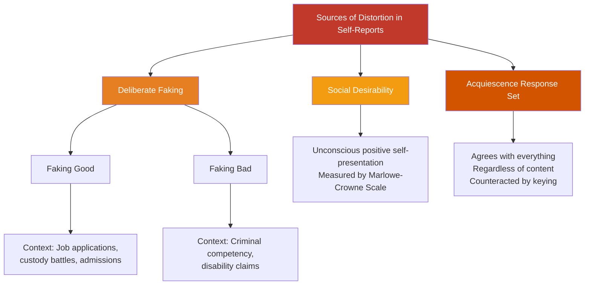
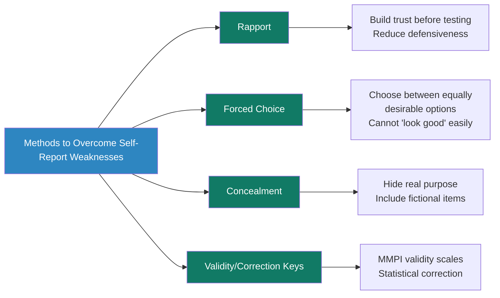

# Faking, Social Desirability, and Overcoming Weaknesses in Self-Report Tests

## Introduction

The power of a personality inventory depends entirely on one assumption: that respondents answer honestly. Yet this assumption is regularly violated. Job applicants want to appear competent; defendants want to appear disturbed; students want to appear well-adjusted. Even when no deception is intended, psychological forces subtly pull responses away from truth.

This module examines the **mechanisms of distortion** in self-report personality testing and the **strategies** psychologists have devised to detect, counteract, and minimise them.

---

**Source PDFs**:
- 📄 [Block-4/Unit-2.pdf - Pages 23-26](/pdfs/MPC-003%20Personality%20Theories%20and%20Assessment/Block-4/Unit-2.pdf)
- 📚 MPC-003 Personality Theories and Assessment

---

## Types of Faking in Personality Inventories

### Faking Good
The most common form of deliberate distortion. The respondent intentionally endorses items they believe will create a **favourable impression**.

**When does it occur?** Most frequently in high-stakes contexts:
- Job applications
- Child custody evaluations
- College or academic program admissions
- Parole hearings

**Example**: On an item like "I frequently feel angry and irritable", a job applicant might answer "False" regardless of their actual experience, believing that admitting irritability reduces their chances of being hired.

### Faking Bad
Less common, but clinically significant. The respondent intentionally presents themselves as **more psychologically disturbed** than they actually are.

**When does it occur?**
- Criminal proceedings where the goal is to appear incompetent to stand trial
- Claiming a disability or psychological impairment for legal or financial benefits
- Seeking admission to a psychiatric facility or avoiding responsibilities

**Example**: A defendant facing serious charges might endorse bizarre or paranoid statements to appear psychologically unfit for trial.

### Social Desirability Bias
A subtler, often **unconscious** form of distortion. The respondent endorses items that present them in a socially acceptable light — not out of deliberate deception, but due to a natural psychological tendency to project a positive image.

**Key distinction from deliberate faking**: The person displaying social desirability bias may genuinely believe their distorted responses are accurate. They are not lying so much as perceiving themselves through a flattering lens.

**Consequences**: Social desirability distorts personality profiles across all assessment methods, not just self-reports. Measures of agreeableness, conscientiousness, and emotional stability are especially susceptible.

**Measuring it**: The **Marlowe-Crowne Social Desirability Scale** (Crowne & Marlowe, 1964) was specifically designed to measure individual differences in the tendency to give self-flattering responses.

### Acquiescence Response Set
A third, often overlooked source of bias. Some individuals have a strong tendency to **agree with virtually every statement** on a test, regardless of content. This "yea-saying" tendency is not about personality — it is a stable response style.

**Example**: A highly acquiescent person answering the MMPI might agree with contradictory statements like "I am usually happy" and "I often feel sad and hopeless" simply because they tend to say "True" to everything.

**Consequence**: Highly acquiescent respondents score artificially high on almost every scale, masking their true personality profile.

---

## Detecting Faking: Validity Scales

Well-constructed personality inventories include **validity scales** — special sets of items designed not to measure personality traits but to detect dishonest, inconsistent, or defensive responding.

### MMPI Validity Scales
The MMPI (Minnesota Multiphasic Personality Inventory) is the gold standard for validity scale design, incorporating **four validity scales**:

| Scale | Abbreviation | Purpose |
|---|---|---|
| Cannot Say | ? | Counts unanswered or double-answered items |
| Lie Scale | L | Detects naive, implausible claims of virtue |
| Infrequency Scale | F | Detects random responding or rare endorsements |
| Correction Scale | K | Detects defensiveness and subtle test-taking attitude |

**How the L scale works**: The L scale contains statements about minor faults that almost everyone has but most people deny (e.g., "I always tell the truth"). Someone scoring very high on L is probably presenting an implausibly rosy picture of themselves.

**How the F scale works**: The F scale contains items endorsed by fewer than 10% of normal respondents. Endorsing many F items may suggest random responding, poor reading comprehension, severe psychopathology, or deliberate faking bad.

**Repeated Items as Faking Detection**: The MMPI includes certain items that appear twice in slightly different forms. Anyone attempting to fake will have difficulty responding consistently to these paired items.

---

## Four Methods to Overcome Self-Report Weaknesses

### Method 1: Establishment of Rapport
Distortions often arise from discomfort, suspicion, or adversarial feelings towards the testing situation. The solution is for the assessor to build **genuine rapport** with the respondent before testing begins — creating a warm, cooperative, and psychologically safe environment.

When test-takers feel understood and trust that their responses will be handled responsibly, they are more likely to answer honestly and less likely to feel defensive or threatened.

**Practical implications**:
- Take time to explain the purpose of the assessment
- Assure confidentiality (within legal limits)
- Address any concerns about how results will be used
- Avoid bureaucratic or cold test administration settings

### Method 2: Forced-Choice Technique
A powerful technique for controlling socially desirable responding. In **forced-choice items**, the respondent must choose between **two or more statements that are equally desirable (or equally undesirable)** — they cannot simply select the "good-sounding" one.

**How it works**: Because both options are matched for social desirability, the person cannot easily identify the "right" answer. They are forced to choose based on genuine self-description.

**Example**: Instead of "Are you a good listener? Yes/No", a forced-choice item might be:
> Choose which describes you better:
> A. "I am a patient listener who rarely interrupts"
> B. "I am an enthusiastic, energetic contributor to conversations"

Both options are socially acceptable, so the respondent's choice genuinely reflects their self-perception rather than social pressure.

### Method 3: Concealing the Test's Purpose
If respondents don't know what trait the test is measuring, it becomes harder to fake in a targeted way.

**Two forms of concealment**:
1. **Misrepresenting purpose**: Describe the test as measuring one thing (e.g., "reasoning ability") while it actually measures personality traits. Reduces deliberate faking because respondents don't know which answers to distort.
2. **Inserting false items**: Include fictitious items (e.g., fake book titles in a "reading list" item set) among genuine ones. A respondent who claims to have read books that don't exist is revealing a pattern of falsification.

**Example from CEI**: Hartshorne, May & Shuttleworth's Character Education Inquiry (1930) used "duplicating technique" — secretly duplicating children's test papers, then asking them to self-score. Comparing their self-scoring against the duplicate revealed which children had altered their answers (i.e., cheated).

### Method 4: Use of Verification and Correction Keys
Statistical methods can identify and correct for distorted response patterns.

- **Validity scales** (as in MMPI) indicate when a pattern of responses is implausible or internally inconsistent
- **Correction keys** apply statistical adjustments to scores based on an individual's validity scale profile — compensating for the degree to which defensiveness has artificially suppressed scores on clinical scales
- **Acquiescence correction**: Items are phrased so that endorsing either "true" or "false" is equally likely to indicate the measured trait — any response bias from saying "yes" to everything is then mathematically cancelled out

---

## Why This Matters: The Stakes of Distorted Personality Profiles

The consequences of undetected faking or distortion are not trivial:

- A **hiring decision** based on a faked personality profile may place an unsuitable or even dangerous individual in a sensitive role
- A **forensic assessment** that fails to detect faking bad may lead to incorrect legal rulings
- A **clinical diagnosis** based on socially desirable responding may miss genuine psychopathology
- A **custody evaluation** skewed by faking good may harm a child's welfare

This is why the field's consensus is clear: **personality assessment should never rest on a single self-report instrument alone**. Important decisions require converging evidence from multiple methods — self-reports, clinical interviews, behavioural observation, informant reports, and where appropriate, neuropsychological testing.

---

## 🔬 Recent Research Insights (2020–2024)

Research on deception and validity in self-report testing continues to advance:

- **Response time validity indicators**: Extremely fast or slow response times flag inconsistency and are increasingly used alongside validity scales in computerised testing (Walczyk et al., 2021)
- **Machine learning detection**: AI models trained on response patterns can detect faking with greater accuracy than traditional validity scales in some contexts (Niessen et al., 2022)
- **Forced-choice revival**: A surge of psychometric research is developing sophisticated forced-choice formats (like Thurstonian IRT models) that maintain trait validity while reducing faking (Brown & Maydeu-Olivares, 2021)
- **Cultural variation in social desirability**: The strength of socially desirable responding varies across cultures — individualistic cultures show weaker effects than collectivist cultures (Stöber et al., 2023)

---

## 🎥 Educational Videos

- 📹 [**Why Personality Tests Are Unreliable** — Vox](https://www.youtube.com/watch?v=BYRmpD2Fy8w)
- 📹 [**Psychological Testing: Validity and Reliability** — Psych Hub](https://www.youtube.com/watch?v=KAGjNJ3-GbU)
- 📹 [**How the MMPI Works** — Simply Psychology](https://www.youtube.com/watch?v=sOHfAB9I5kc)

---

## 🌐 External Resources

- 🔗 [**Social Desirability Bias — Wikipedia**](https://en.wikipedia.org/wiki/Social_desirability_bias)
- 🔗 [**Response Bias in Psychology — Wikipedia**](https://en.wikipedia.org/wiki/Response_bias)
- 🔗 [**MMPI — Wikipedia**](https://en.wikipedia.org/wiki/Minnesota_Multiphasic_Personality_Inventory)
- 🔗 [**Acquiescence Bias — Statistics How To**](https://www.statisticshowto.com/acquiescence-bias/)
- 🔗 [**Forced Choice Format — APA**](https://dictionary.apa.org/forced-choice-format)
- 🔗 [**Validity Scales — APA Dictionary**](https://dictionary.apa.org/validity-scale)

---

## 📖 Research Papers

1. **Brown, A., & Maydeu-Olivares, A. (2021)**. "Forced-choice personality measurement: A Thurstonian IRT approach to overcoming the faking problem." *Psychological Assessment*, 33(2), 167–181.
2. **Niessen, A.S.M., et al. (2022)**. "Detecting faking with machine learning: Comparison with validity scales." *Journal of Applied Psychology*, 107(8), 1231–1244.
3. **Walczyk, J.J., et al. (2021)**. "Response latency as a measure of test-taking honesty." *Educational and Psychological Measurement*, 81(4), 712–730.

---

## 🧠 Memory Aids

### Four Methods: RFCV (Remember: "**R**eally **F**ix **C**onstant **V**ariance")
- **R**apport — Build trust
- **F**orced Choice — Both options equally desirable
- **C**oncealment — Hide the purpose
- **V**erification Keys — MMPI validity scales, statistical correction

### Three Faking Types: GBA
- **G**ood — Present favourably
- **B**ad — Present as disturbed
- **A**cquiescence — Agree with everything (unintentional faking)

---

## ✅ Self-Assessment Questions

### Basic Understanding
1. Distinguish between "faking good" and "faking bad" with a real-world example of each.
2. What is the acquiescence response set, and how does it distort self-report scores?
3. How does social desirability bias differ from deliberate faking?

### Applied Understanding
4. A forensic psychologist suspects that a criminal defendant is "faking bad" on the MMPI-2. Which specific validity scales would they examine, and what patterns would indicate malingering?
5. A test developer wants to construct an employee selection inventory that is resistant to faking. Which of the four methods would be most practical in that context, and why?

### Critical Analysis
6. "No self-report inventory can fully eliminate faking." Evaluate this claim. What evidence supports it, and what counter-arguments exist?
7. Describe the forced-choice technique in detail. What are its advantages over traditional self-report formats? Does it introduce any new problems?

### Higher Order
8. If you were designing a multi-method personality assessment for a high-stakes context (e.g., selection of nuclear facility operators), how would you integrate self-report measures alongside other assessment methods to maximise accuracy and minimise distortion?

---

## 🔗 Related Topics

- [Self-Report Personality Inventories: Types & Strengths](/mpc-003/block-4/self-report-personality-inventories)
- [Important Personality Inventories: 16PF, MBTI, MMPI](/mpc-003/block-4/important-personality-inventories)
- [History and Meaning of Personality Assessment](/mpc-003/block-4/history-personality-assessment)
- [Testing and Measurement Concepts](/mpc-003/block-4/testing-measurement-concepts-personality)
