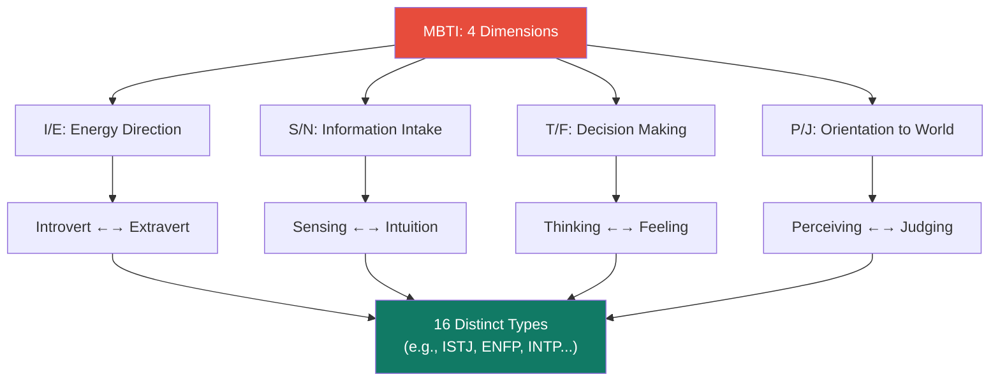
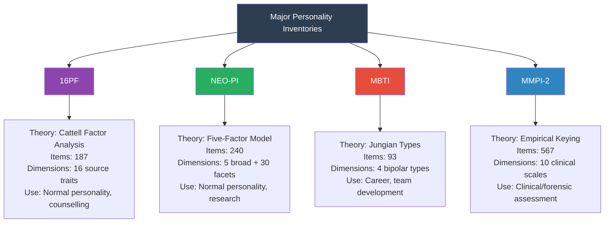

# Important Personality Inventories: 16PF, NEO-PI, MBTI, and MMPI

## Introduction

From the first systematic personality questionnaire developed by Galton in 1880, through Woodworth's Personal Data Sheet during World War I, to the digital assessments of the 21st century, personality inventories have evolved into sophisticated, rigorously validated instruments. Four inventories stand above the rest in terms of research evidence, clinical utility, and global influence: **Cattell's 16PF**, **the NEO-PI**, **the MBTI**, and **the MMPI-2**.

Each is grounded in a distinct theoretical tradition, serves different purposes, and has different strengths and limitations. Mastering all four is essential for any psychologist working in clinical, organisational, or research settings.

---

**Source PDFs**:
- 📄 [Block-4/Unit-2.pdf - Pages 25-28](/pdfs/MPC-003%20Personality%20Theories%20and%20Assessment/Block-4/Unit-2.pdf)
- 📚 MPC-003 Personality Theories and Assessment

---

## Brief History of Personality Inventories

The history of systematic personality assessment begins with **Francis Galton (1880)**, who developed the first questionnaire to study mental imagery — the inner world of perception and feeling. The enterprise was driven by his broader interest in measuring individual differences.

The first personality inventory proper was **Woodworth's Personal Data Sheet (1918)** — 116 items, all relating to neurotic tendencies — developed during World War I to screen out emotionally unfit soldiers before deployment. It asked about symptoms like nightmares, excessive worrying, and feelings of persecution.

Since then, test development has been shaped by three major approaches:
1. **Theoretical/rational construction**: Items derived from a theory (e.g., MBTI based on Jungian types)
2. **Empirical keying**: Items selected because they differentiate known groups (e.g., MMPI's criterion-keying)
3. **Factor analytic**: Items selected through statistical analysis to maximise trait measurement (e.g., 16PF, NEO-PI)

---

## 1. The Sixteen Personality Factor Questionnaire (16PF)

### Theoretical Foundation
The 16PF is rooted in **Raymond Cattell's factor-analytic theory of personality**. Using a statistical technique called **factor analysis** — which identifies clusters of correlated variables — Cattell derived **16 primary (source) traits** that he believed captured the fundamental structure of normal personality. Later work suggested up to 23 source traits, but the 16PF questionnaire retained its focus on the original 16.

### Structure
Cattell's 16 source traits are conceived as **bipolar continua** — each dimension has two opposing poles with a range of degrees between them. For example:

| Low Score | Trait Dimension | High Score |
|---|---|---|
| Reserved, impersonal | **Warmth (A)** | Warm, outgoing |
| Concrete thinking | **Reasoning (B)** | Abstract thinking |
| Reactive, emotionally variable | **Emotional Stability (C)** | Emotionally stable |
| Deferential, submissive | **Dominance (E)** | Dominant, forceful |
| Serious, restrained | **Liveliness (F)** | Enthusiastic, spontaneous |
| Expedient | **Rule-Consciousness (G)** | Conscientious |
| Shy, timid | **Social Boldness (H)** | Bold, venturesome |
| Utilitarian, objective | **Sensitivity (I)** | Sensitive, aesthetic |
| Trusting | **Vigilance (L)** | Suspicious, skeptical |
| Practical | **Abstractedness (M)** | Imaginative |
| Forthright, direct | **Privateness (N)** | Private, discreet |
| Self-assured | **Apprehension (O)** | Apprehensive, self-doubting |
| Traditional | **Openness to Change (Q1)** | Open to change |
| Group-oriented | **Self-Reliance (Q2)** | Self-reliant |
| Tolerates disorder | **Perfectionism (Q3)** | Perfectionist |
| Relaxed | **Tension (Q4)** | Tense, driven |

### Scoring and Use
Scores on each of the 16 dimensions are plotted on a **personality profile graph**, providing a visual "fingerprint" of the individual. This profile is used by psychologists for:
- **Career counselling** (identifying suitable occupations)
- **Clinical counselling** (understanding personality dynamics)
- **Employment decisions** (selection, promotion)
- **Relationship counselling**

### Critical Evaluation
✅ **Strengths**: Comprehensive assessment of normal personality; strong factor-analytic foundation; profiles facilitate nuanced, individualised interpretation
❌ **Weaknesses**: 187 items make it relatively long; some source traits have low reliability; overlap with Big Five dimensions raises questions about parsimony

---

## 2. NEO Personality Inventory (NEO-PI)

### Theoretical Foundation
The NEO-PI is based on the **Five-Factor Model (FFM)** of personality, developed by **Paul Costa and Robert McCrae**. The FFM emerged from decades of factor-analytic research suggesting that human personality can be comprehensively described by five broad dimensions, remembered by the acronym **OCEAN**:

| Factor | Dimension | High Scorers | Low Scorers |
|---|---|---|---|
| **O** | Openness to Experience | Curious, creative, imaginative | Practical, conventional |
| **C** | Conscientiousness | Organised, dependable, disciplined | Easygoing, disorganised |
| **E** | Extraversion | Sociable, assertive, energetic | Reserved, quiet, introverted |
| **A** | Agreeableness | Cooperative, trusting, empathetic | Competitive, suspicious |
| **N** | Neuroticism | Anxious, emotionally unstable | Calm, emotionally stable |

### Structure
The NEO-PI-R (revised version) contains **240 items** measuring the five broad domains and **30 facets** (six per domain), providing both an overview and fine-grained assessment. A shorter version, the NEO-FFI, has 60 items measuring only the five domains.

### Why the FFM Matters
The Five-Factor Model has become the dominant framework in personality psychology for several reasons:
- **Replicability**: The five factors emerge consistently across multiple research methods, cultures, and age groups
- **Heritability**: All five factors show substantial genetic contributions
- **Predictive validity**: The factors predict important life outcomes — mental health, relationship quality, career success, longevity

### Critical Evaluation
✅ **Strengths**: Strong theoretical foundation; excellent cross-cultural replicability; predicts a wide range of outcomes
❌ **Weaknesses**: Does not assess psychopathology; long administration time; criticized for being atheoretical (descriptive rather than explanatory)

---

## 3. Myers-Briggs Type Indicator (MBTI)

### Theoretical Foundation
The MBTI is based on **Carl Jung's theory of psychological types**, elaborated by Isabel Briggs Myers and Katharine Cook Briggs. Unlike the trait-dimensional approach of the 16PF and NEO-PI, the MBTI uses a **typological approach** — categorising people into discrete types rather than placing them on continuous dimensions.

### Four Dimensions, Sixteen Types
The MBTI assesses four bipolar dimensions:

**1. Introversion (I) vs. Extraversion (E)**
- Classic Jungian distinction: where does one draw energy?
- **Extraverts**: Energised by social interaction, action-oriented
- **Introverts**: Energised by solitude, reflection-oriented

**2. Sensing (S) vs. Intuition (N)**
- How one takes in information
- **Sensing types**: Prefer concrete, factual, detail-oriented information; trust what they can directly observe
- **Intuitive types**: Look for patterns, possibilities, and abstract meanings; trust hunches and metaphors

**3. Thinking (T) vs. Feeling (F)**
- How one makes decisions
- **Thinking types**: Prefer logic, analysis, and objective criteria
- **Feeling types**: Make decisions based on personal values, empathy, and concern for others

**4. Perceiving (P) vs. Judging (J)**
- One's orientation to the outer world
- **Perceiving types**: Flexible, spontaneous, open to new information; keep options open
- **Judging types**: Decisive, organised, action-oriented; prefer closure and settled decisions

### The 16 MBTI Types
The four binary dimensions (each with 2 possibilities) yield **2 × 2 × 2 × 2 = 16 distinct personality types**, each with a four-letter code:

| | Sensing-Thinking | Sensing-Feeling | Intuitive-Feeling | Intuitive-Thinking |
|---|---|---|---|---|
| **I + J** | ISTJ | ISFJ | INFJ | INTJ |
| **I + P** | ISTP | ISFP | INFP | INTP |
| **E + J** | ESTJ | ESFJ | ENFJ | ENTJ |
| **E + P** | ESTP | ESFP | ENFP | ENTP |

**Primary uses**: Career counselling, team development, leadership training, and self-awareness. "Which MBTI type would suit this career?" is among the most common questions in occupational psychology.

### Critical Evaluation
✅ **Strengths**: Widely used in organisational settings; intuitive and accessible; stimulates productive self-reflection; cross-cultural use
❌ **Weaknesses**: Controversial among researchers — low test-retest reliability (up to 50% of test-takers receive a different type on re-testing within weeks); the binary categorisation ignores that most people fall near the middle of dimensions; limited predictive validity compared to dimensional models

---

## 4. Minnesota Multiphasic Personality Inventory (MMPI-2)

### Theoretical Foundation and Purpose
The MMPI-2 is the **most widely used and researched personality inventory in clinical psychology**. It was empirically derived — not from theory but from the ability of items to differentiate between clinical groups (e.g., depressed patients vs. normal controls).

Its primary purpose is to **assess abnormal personality patterns** — detecting psychopathology in clinical, forensic, and medical settings.

### Structure
The MMPI-2 consists of **567 statements** to which the respondent answers "True", "False", or "Cannot Say".

It contains:
- **10 Clinical Scales**
- **Multiple Validity Scales** (discussed below)
- **Numerous Subscales** for more nuanced clinical interpretation

### The 10 Clinical Scales

| Scale | Name | What It Measures |
|---|---|---|
| 1 (Hs) | Hypochondriasis | Excessive bodily concerns, somatic complaints |
| 2 (D) | Depression | Depressed mood, pessimism, withdrawal |
| 3 (Hy) | Hysteria | Physical symptoms without organic basis, denial |
| 4 (Pd) | Psychopathic Deviate | Social deviance, impulsivity, authority conflicts |
| 5 (Mf) | Masculinity-Femininity | Interests and attitudes associated with gender |
| 6 (Pa) | Paranoia | Suspiciousness, sensitivity to perceived slights |
| 7 (Pt) | Psychasthenia | Anxiety, obsessive-compulsive symptoms, phobias |
| 8 (Sc) | Schizophrenia | Bizarre thinking, social alienation |
| 9 (Ma) | Hypomania | Elevated mood, increased energy, impulsivity |
| 0 (Si) | Social Introversion | Social withdrawal, shyness |

### The Validity Scales
The MMPI-2's validity scales are its most famous technical feature:

| Scale | Abbreviation | Detects |
|---|---|---|
| Cannot Say | ? | Omissions or double-marked items |
| Lie Scale | L | Naive, unsophisticated faking good |
| Infrequency | F | Random responding, faking bad, severe psychopathology |
| Correction | K | Subtle defensiveness |
| Back-F | Fb | Careless responding in the latter half of the test |
| Superlative Self-Presentation | S | Sophisticated faking good |
| Symptom Validity Scale | FBS | Exaggeration of symptoms, often in legal contexts |

### Indian Adaptations
The MMPI tradition has inspired Indian assessment efforts:
- **Youth Adjustment Analyser (YAA)** — developed by Bengalee (1964) to screen maladjusted college students in India
- **Bell Adjustment Inventory (Hindi)** — adapted by Mohsin & Hussain (1981)

---

## Comparative Overview

---

## 🔬 Recent Research Insights (2020–2024)

- **MMPI-3**: A new, shorter (335-item) version of the MMPI was released in 2020, restructuring the clinical scales to improve validity and reduce item redundancy (Ben-Porath & Tellegen, 2020)
- **MBTI reliability controversy**: A 2021 meta-analysis confirmed that while MBTI type stability across testing occasions is modest, its dimensions predict organisational behaviour with similar validity to the Big Five (Pittenger, 2021)
- **NEO-PI cross-cultural applicability**: Research in 50+ countries confirms that while the Big Five structure is broadly replicable, some facets show poor cross-cultural equivalence — cautioning against direct score comparisons across cultures (Bleidorn et al., 2022)
- **Digital administration**: Online and mobile delivery of the MMPI-2 and 16PF has shown equivalent reliability to paper-and-pencil formats (Forbey et al., 2020)

---

## 🎥 Educational Videos

- 📹 [**The Big Five Personality Traits** — Crash Course Psychology](https://www.youtube.com/watch?v=DuRRRQBzSCE)
- 📹 [**Understanding the MBTI** — Simply Psychology](https://www.youtube.com/watch?v=ZNJqFxC2KCw)
- 📹 [**The MMPI Explained** — Dr. Todd Grande, YouTube](https://www.youtube.com/watch?v=MMPI_explained)
- 📹 [**Personality Testing in the Workplace** — TED Talk](https://www.youtube.com/watch?v=BYRmpD2Fy8w)

---

## 🌐 External Resources

- 🔗 [**16PF Questionnaire — Wikipedia**](https://en.wikipedia.org/wiki/16PF_Questionnaire)
- 🔗 [**Big Five Personality Traits — Wikipedia**](https://en.wikipedia.org/wiki/Big_Five_personality_traits)
- 🔗 [**Myers-Briggs Type Indicator — Wikipedia**](https://en.wikipedia.org/wiki/Myers%E2%80%93Briggs_Type_Indicator)
- 🔗 [**MMPI — Wikipedia**](https://en.wikipedia.org/wiki/Minnesota_Multiphasic_Personality_Inventory)
- 🔗 [**NEO Personality Inventory — APA**](https://dictionary.apa.org/neo-personality-inventory)
- 🔗 [**Personality Assessment Overview — Simply Psychology**](https://www.simplypsychology.org/personality-tests.html)

---

## 📖 Research Papers

1. **Ben-Porath, Y.S., & Tellegen, A. (2020)**. "Minnesota Multiphasic Personality Inventory-3: Technical manual." University of Minnesota Press.
2. **Bleidorn, W., et al. (2022)**. "Personality assessment across cultures: Current challenges and future directions." *Psychological Assessment*, 34(5), 401-419.
3. **Pittenger, D.J. (2021)**. "Reconsidering MBTI validity: A meta-analytic review." *Journal of Personality Assessment*, 103(4), 472-485.

---

## 🧠 Memory Aids

### Remember the 4 Inventories: **CNMM**
- **C**attell — 16PF (16 source traits)
- **N**EO-PI — Five-Factor Model (OCEAN)
- **M**BT I — Jungian types (4 bipolar)
- **M**MPI — Clinical/forensic (10 clinical scales + validity scales)

### MBTI Dimensions: **STEP-IJ** (Sensing, Thinking, Extraversion/Perceiving vs. Intuition, Judging)
Or simply remember **4 binary dimensions = 16 types**

### OCEAN for Big Five
- **O**penness
- **C**onscientiousness
- **E**xtraversion
- **A**greeableness
- **N**euroticism

---

## ✅ Self-Assessment Questions

### Basic Understanding
1. What is the theoretical basis of the 16PF? What are the 16 source traits measuring?
2. How does the NEO-PI differ from the 16PF in its theoretical foundations?
3. Describe the four dimensions of the MBTI and explain how they combine to produce 16 personality types.
4. What is the primary purpose of the MMPI-2? How does it differ from the 16PF and NEO-PI in terms of what it assesses?

### Applied Understanding
5. A school counsellor wants to help a student choose a career. Which inventory would be most appropriate, and why?
6. A forensic psychologist assessing a defendant's fitness for trial would most likely use which inventory? What specific features make it suitable?
7. Why does the MMPI-2 include validity scales when the 16PF and NEO-PI do not emphasise them as strongly?

### Critical Analysis
8. The MBTI is hugely popular in organisations but controversial among researchers. What evidence suggests it is useful? What evidence suggests it is flawed?
9. Compare and contrast the typological approach (MBTI) with the dimensional approach (16PF, NEO-PI). What are the theoretical and practical implications of each?

### Higher Order
10. If you had to choose just one personality inventory for use across clinical, occupational, and research contexts, which would you choose and why? Consider comprehensiveness, validity, reliability, and practicality.
11. The MMPI was developed in the United States. What challenges arise when using it in India, and how might these challenges be addressed?

---

## 🔗 Related Topics

- [Self-Report Inventories: Types and Strengths](/mpc-003/block-4/self-report-personality-inventories)
- [Faking and Response Biases](/mpc-003/block-4/faking-social-desirability-self-report)
- [Projective Techniques](/mpc-003/block-4/projective-techniques-classification)
- [Cattell's Trait Theory and 16PF](/mpc-003/block-3/cattell-trait-theory-personality)
- [Big Five OCEAN Dimensions](/mpc-003/block-3/big-five-personality-dimensions)
- [Type Approaches to Personality](/mpc-003/block-1/type-approaches-personality)
