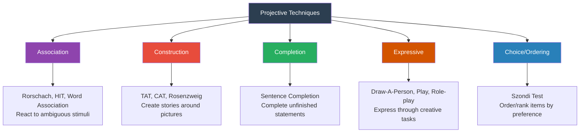

# Projective Techniques: Classification, Strengths, and Weaknesses

## Introduction

Deep within every human personality lies a layer that formal questioning cannot easily reach — unconscious conflicts, hidden anxieties, repressed desires, and personal meanings. **Projective techniques** attempt to access this hidden layer by presenting individuals with ambiguous, unstructured stimuli and observing what they "project" onto them.

Unlike self-report inventories that ask direct questions with structured responses, projective tests operate on the principle that when faced with ambiguity, a person will impose their own psychological reality — their fears, wishes, conflicts, and ways of seeing the world — onto neutral material.

This module examines the theoretical foundations of projective assessment, the five major categories of projective techniques, and their considerable strengths alongside their significant limitations.

---

**Source PDFs**:
- 📄 [Block-4/Unit-2.pdf - Pages 29-32](/pdfs/MPC-003%20Personality%20Theories%20and%20Assessment/Block-4/Unit-2.pdf)
- 📚 MPC-003 Personality Theories and Assessment

---

## The Theory of Projection

The conceptual foundation of projective testing derives from **Sigmund Freud's psychoanalytic theory**, which holds that:
1. **Unconscious processes** significantly influence behaviour, emotion, and thought
2. The **ego's defenses** — particularly repression and projection — keep threatening material out of conscious awareness
3. Personality pathology reflects unconscious conflicts that the individual cannot directly report

**Projection as a defense mechanism**: Freud described projection as attributing one's own unacceptable impulses, feelings, or characteristics to others or to external objects. A person with unconscious hostility might perceive others as hostile; someone with sexual anxieties might see sexuality in neutral images.

**Frank's Contribution (1939)**: L.K. Frank coined the term *projective technique* to describe assessment methods that present people with ambiguous stimuli for which there are no "correct" culturally defined answers. By responding freely, individuals project their inner psychological world onto the neutral material — thereby revealing what direct questioning might never uncover.

### Shared Features of All Projective Techniques
All projective tests share these features:
- **Ambiguous or unstructured stimuli**: No obvious "correct" interpretation
- **Purpose concealment**: Test-takers are never told how responses will be scored or interpreted
- **Permissive instructions**: Emphasis that there are no right or wrong answers; the person can respond however they wish
- **Subjective interpretation**: Scoring relies heavily on the clinician's expertise and judgment

> 🔑 **Key Principle**: The less structure the stimulus provides, the more the person's response must come from within — making ambiguity the essential tool of projective assessment.

---

## Classification of Projective Techniques (Lindzay, 1959)

G. Lindzay provided the foundational classification of projective techniques in 1959, organising them into **five categories** based on the nature of the required response:

### 1. Association Techniques

**Nature**: The person responds with the first association — thought, image, or word — that comes to mind after seeing or hearing stimulus material. The response (and sometimes the reaction time — how quickly the person responds) are analysed.

**Key instruments**:
- **Rorschach Inkblot Test** — 10 standardised inkblots; person describes what they see. Responses scored for content, location, determinants (form, colour, movement)
- **Holtzman Inkblot Technique (HIT)** — 45 inkblots; standardised scoring; better psychometric properties than Rorschach
- **Word Association Test** — A list of stimulus words is read aloud; the person says the first word that comes to mind; long reaction times or unusual responses are noted

**What they reveal**: Unconscious associations, emotional conflicts, cognitive organisation, and the richness/poverty of inner life.

### 2. Construction Techniques

**Nature**: The person is given stimulus material (usually a picture) and must **construct a story** around it — with a beginning, middle, and end, and descriptions of characters' thoughts, feelings, and outcomes.

**Key instruments**:
- **Thematic Apperception Test (TAT)** — 30 pictures of ambiguous social scenes; person creates stories for each
- **Children's Apperception Test (CAT)** — TAT adapted for children (ages 3-10), using animal figures
- **Rosenzweig Picture Frustration Test** — Cartoon scenes of frustrating situations; person fills in what the protagonist says
- **The Blacky Pictures** — Cartoon dog family used to explore psychosexual development
- **Object Relations Technique** — Assesses relational themes and object representations

**What they reveal**: Themes of achievement, power, affiliation, and aggression; dominant concerns; relationship patterns; coping styles.

### 3. Completion Techniques

**Nature**: The person is given **incomplete sentences** or stories and asked to complete them in any way they choose.

**Examples of sentence stems**:
- "My sex life is..."
- "I feel tense when..."
- "My ambition in life is..."
- "I often get nervous when..."
- "What I most want from life is..."

**Key instruments**:
- **Sachs Sentence Completion Test** — 60 incomplete sentences covering family, sex, interpersonal relations, self-concept
- **Madeline Thomas Completion Stories Test** — Short stories with missing endings; used with children

**What they reveal**: Conscious and near-conscious attitudes, self-concept, interpersonal concerns, areas of psychological conflict.

**Limitation**: Lack of standardised scoring systems — different clinicians may interpret the same responses very differently.

### 4. Expressive Techniques

**Nature**: The person expresses their personality through **manipulative, creative, or play-based tasks** — drawing, painting, finger-painting, role-playing, puppet play, or sand-tray scenarios.

**Focus**: The examiner pays close attention to **the process** — how the person engages with the materials — rather than the end product alone.

**Examples**:
- **Draw-A-Person Test** — Person draws a human figure; content, size, placement, and quality are analysed
- **House-Tree-Person (HTP) Test** — Person draws a house, tree, and person; interpreted symbolically
- **Kinetic Family Drawing** — Person draws their family doing something together; relational dynamics are interpreted
- **Play Therapy Assessment** — Child's play patterns with dolls or toys are observed for themes and emotional content
- **Psychodrama / Role-Playing** — Person acts out scenarios; affects and interpersonal patterns are observed

**What they reveal**: Especially valuable with children, people with limited verbal skills, and in cross-cultural settings where language barriers are present.

### 5. Choice / Ordering Techniques

**Nature**: The person is presented with a set of items — pictures, objects, or statements — and asked to **choose, rank, or order** them according to preference. The pattern of choices becomes the basis for personality inference.

**Note**: Lindzay (1973) considered choice techniques a step toward objectifying projective methods — they are less fully "projective" because they are more constrained.

**Key instrument**:
- **Szondi Test** — The person is presented with sets of photographs of psychiatric patients and asked which they find most and least attractive. Choice patterns are interpreted in terms of underlying drive states (Szondi's theory of fate psychology).

---

## Strengths of Projective Techniques

### ✅ Circumvents Conscious Defenses
The indirect, ambiguous nature of projective stimuli is their greatest strength. Because test-takers don't know what the test is measuring or how their responses will be interpreted, they **cannot easily fake**. Unlike self-reports where a job applicant knows that "agreeable" answers are desirable, there is no obvious "right answer" to a Rorschach card.

This makes projective techniques uniquely valuable for:
- Uncovering unconscious conflicts that the person cannot (or would not) directly report
- Bypassing ego defenses that suppress anxiety-provoking material
- Revealing personality dynamics in individuals who are defensively guarded

### ✅ Access to the Unconscious
Drawing on psychoanalytic principles, projective tests are specifically designed to tap deeper psychological processes — fantasies, repressed wishes, unconscious fears — that are inaccessible to direct questioning. They provide a window into the unconscious that self-reports cannot open.

### ✅ Depth and Richness
Projective tests yield qualitative, clinically rich data that goes far beyond numerical scores. The stories told to TAT cards, the themes that pervade Rorschach responses, the figures drawn in HTP — all provide nuanced, individual material for the skilled clinician to explore.

### ✅ Clinical Utility in Therapeutic Dialogue
Survey data from the Society for Personality Assessment found the Rorschach and TAT ranked **2nd and 4th** among all psychometric instruments in clinical usage. Many clinicians value them as **starting points for therapeutic exploration** — the stories clients tell reveal concerns worth discussing in therapy.

---

## Weaknesses of Projective Techniques

### ❌ Poor Standardisation
Projective tests lack **standardised administration, scoring, and interpretation** procedures. Different clinicians may administer the same test differently, score the same response differently, and draw entirely different clinical conclusions from the same data.

This is the fundamental reason for their low reliability.

### ❌ Low Reliability
Because scoring relies heavily on the **skill, training, and clinical intuition** of the examiner, reliability is problematic. Different examiners examining the same protocol may arrive at different personality portraits (low inter-rater reliability); the same examiner re-assessing the same person may produce different results at different times (low test-retest reliability).

*Note*: Comprehensive scoring systems like **Exner's Comprehensive System for the Rorschach** have substantially improved inter-rater reliability among trained scorers — but this improvement comes at the cost of requiring extensive specialised training.

### ❌ Questionable Validity
Evidence for the **validity** of projective tests — that they actually measure what they claim to measure — is inconsistent. Research has not convincingly demonstrated that Rorschach scores predict personality traits or psychopathology beyond what other measures can achieve.

### ❌ Heavy Dependence on Clinician Skill
The quality of interpretation depends entirely on the examiner's expertise. This makes projective assessment non-scalable, expensive, and subject to the idiosyncratic biases of individual clinicians.

### ❌ Cultural Bias
The normative databases for most projective tests were developed in Western cultures. Cultural differences in storytelling conventions, visual interpretation, and the symbolic meanings of common images mean that protocols from non-Western respondents may be misinterpreted.

---

## Clinical Consensus: Use in Context, Never Alone

Given both the genuine insights and the genuine limitations of projective methods, the field's consensus is clear: **projective tests should never be the sole basis for a diagnosis or high-stakes clinical decision**. They should be used as one component of a **multi-method assessment battery** including:
- Structured diagnostic interviews
- Self-report inventories (e.g., MMPI-2)
- Case history review
- Behavioural observation
- Informant reports

Projective tests remain most valuable when:
1. A client is highly defensive or resistant to direct questioning
2. The clinician seeks to understand underlying personality dynamics rather than surface symptoms
3. They are used to generate hypotheses that are then tested with other methods

---

## 🔬 Recent Research Insights (2020–2024)

- **Rorschach Performance Assessment System (R-PAS)**: A major update to Rorschach scoring developed to improve reliability and international norms (Meyer et al., 2022)
- **TAT narrative analysis**: Research confirms that TAT story themes reliably predict implicit motives (achievement, affiliation, power) — supporting their use for motivational assessment (Schultheiss & Strasser, 2022)
- **Cultural applicability**: Studies of the TAT in India show that culture-specific pictures (depicting Indian family structures) yield richer, more valid narratives than Western stimuli (Kumar & Mehta, 2021)
- **Children's projective assessment**: Meta-analyses confirm moderate validity for children's projective drawings in identifying trauma and emotional disturbance (Groth-Marnat, 2022)

---

## 🎥 Educational Videos

- 📹 [**The Rorschach Test Explained** — Psych Hub](https://www.youtube.com/watch?v=LywkBBFxfr4)
- 📹 [**Projective Tests: TAT and Rorschach** — Crash Course Psychology](https://www.youtube.com/watch?v=eFBpilVaxZ0)
- 📹 [**How Psychologists Use the TAT** — Dr. Todd Grande, YouTube](https://www.youtube.com/watch?v=TAT_explained)

---

## 🌐 External Resources

- 🔗 [**Projective Tests — Wikipedia**](https://en.wikipedia.org/wiki/Projective_test)
- 🔗 [**Rorschach Test — Wikipedia**](https://en.wikipedia.org/wiki/Rorschach_test)
- 🔗 [**Thematic Apperception Test — Wikipedia**](https://en.wikipedia.org/wiki/Thematic_apperception_test)
- 🔗 [**Sentence Completion Test — Wikipedia**](https://en.wikipedia.org/wiki/Sentence_completion_tests)
- 🔗 [**Projection (Defense Mechanism) — Wikipedia**](https://en.wikipedia.org/wiki/Psychological_projection)
- 🔗 [**APA Dictionary: Projective Technique**](https://dictionary.apa.org/projective-technique)
- 🔗 [**House-Tree-Person Test — Simply Psychology**](https://www.simplypsychology.org/house-tree-person-test.html)

---

## 📖 Research Papers

1. **Meyer, G.J., et al. (2022)**. "Rorschach Performance Assessment System: Updated norms and validity evidence." *Journal of Personality Assessment*, 104(4), 401-420.
2. **Schultheiss, O.C., & Strasser, A. (2022)**. "Implicit motives via TAT narrative: Validity evidence." *Journal of Research in Personality*, 96, 104168.
3. **Kumar, S., & Mehta, A. (2021)**. "Cultural adaptation of the TAT for Indian populations." *Psychological Studies*, 66(2), 145-158.

---

## 🧠 Memory Aids

### Five Types: **ACCEC**
- **A**ssociation — React (Rorschach, Word Association)
- **C**onstruction — Create stories (TAT, CAT)
- **C**ompletion — Complete sentences
- **E**xpressive — Express through drawing/play
- **C**hoice/Ordering — Select/rank (Szondi)

### Strengths vs. Weaknesses: **UNCAP** vs. **PRSDC**
**Strengths** (UNCAP):
- **U**nconscious access
- **N**eutralises deliberate faking
- **C**linically rich data
- **A**mbiguity reduces response sets
- **P**sychodynamic depth

**Weaknesses** (PRSDC):
- **P**oor standardisation
- **R**eliability is low
- **S**ubjectivity of interpretation
- **D**epends on clinician skill
- **C**ultural bias

---

## ✅ Self-Assessment Questions

### Basic Understanding
1. What is the theoretical basis of projective techniques? How does Freud's concept of projection justify their use?
2. Describe the five categories of projective techniques according to Lindzay's classification with one example from each.
3. What features are shared by all projective techniques?

### Applied Understanding
4. A child has been referred for suspected trauma exposure. Which category of projective technique would be most appropriate for assessment, and why?
5. A forensic psychologist wants to assess unconscious aggressive impulses in a defendant who is being cooperative on self-report tests. Which projective instrument would be most useful, and what would the examiner look for?

### Critical Analysis
6. "Projective tests are less valid but more therapeutically useful than self-report inventories." Evaluate this statement with reference to the strengths and weaknesses of each approach.
7. Why is poor reliability considered a more serious problem for projective tests than for self-report inventories? What steps has the field taken to improve projective reliability?

### Higher Order
8. A colleague argues that projective tests should be abandoned in clinical practice because of their low validity. You disagree. Construct the strongest possible argument for retaining them in a comprehensive assessment battery.
9. Discuss how cultural factors might influence responses on the Rorschach and TAT, with specific reference to Indian cultural contexts. How might test administration be adapted?

---

## 🔗 Related Topics

- [Self-Report Personality Inventories](/mpc-003/block-4/self-report-personality-inventories)
- [Faking and Response Biases](/mpc-003/block-4/faking-social-desirability-self-report)
- [Behavioural Assessment Methods](/mpc-003/block-4/behavioural-assessment-methods)
- [Personality Assessment Methods Overview](/mpc-003/block-1/personality-assessment-methods)
- [Freud's Psychoanalytic Theory](/mpc-003/block-2/freud-psychoanalytic-theory)
