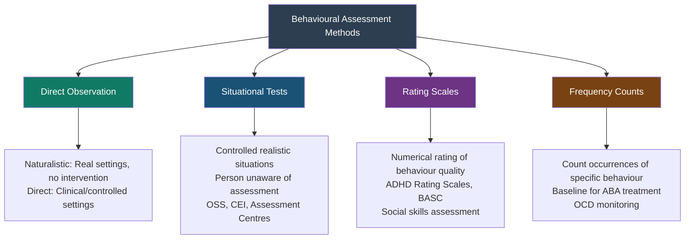

# Behavioural Assessment: Observation, Situational Tests, and Limitations

## Introduction

While self-report inventories ask people what they are like, and projective tests infer personality from responses to ambiguous stimuli, **behavioural assessment** takes a radically different approach: it watches what people actually do. 

Grounded in behavioural psychology's skepticism toward inferences about inner states, behavioural assessment rests on the premise that **personality is best understood through observable behaviour in real-world contexts**. Rather than asking someone "Are you honest?", behavioural assessment places them in a situation where honesty is tested — and records what they do.

This module examines the theoretical foundations, specific methods, and important limitations of behavioural personality assessment.

---

**Source PDFs**:
- 📄 [Block-4/Unit-2.pdf - Pages 32-38](/pdfs/MPC-003%20Personality%20Theories%20and%20Assessment/Block-4/Unit-2.pdf)
- 📚 MPC-003 Personality Theories and Assessment

---

## Theoretical Foundation: The Behaviourist Perspective

Behaviourists reject the notion that personality consists of stable inner traits that need to be "discovered" through self-reports or projective tests. Instead, they argue that:

1. **Personality is learned behaviour**: What we call "personality" is actually a collection of learned responses to specific environmental stimuli
2. **Behaviour is situationally determined**: The same person may behave very differently in different contexts — a finding that challenges the notion of stable traits
3. **Observable behaviour is the only legitimate data**: Inferences about unconscious processes, inner traits, or self-reports are unreliable; only what can be directly observed should be the basis for assessment

This perspective was championed by behaviourists like **B.F. Skinner** and **John Watson**, and is applied in assessment by clinical behaviour therapists who focus on specifying target behaviours, measuring their frequency and context, and tracking changes during treatment.

---

## Method 1: Direct Observation

### Nature and Rationale
Direct observation involves the psychologist **observing the client engaging in everyday behaviour**, ideally in natural settings such as home, school, or the workplace. The observer records specific behaviours, noting their frequency, context, antecedents, and consequences.

**Core principle**: "Observation is the *sine qua non* (the indispensable element) of any approach to personality study." Even theoretical work begins with unsystematic observation — a researcher noticing a pattern that stimulates a research question.

### Example in Practice
A therapist observing a child's classroom behaviour who notices that **tantrum behaviour occurs exclusively when the child is asked to perform tasks involving fine motor skills** (drawing, writing) might hypothesise that the child has an underlying motor difficulty and throws tantrums to avoid it. This observation guides the clinical formulation and treatment in ways that a questionnaire never could.

### Naturalistic Observation
A more systematic form of direct observation is **naturalistic observation** — observing and carefully recording behaviour as it naturally occurs in real-life settings, without intervention.

**Areas studied via naturalistic observation**:
- Play and friendship patterns in children
- Antisocial behaviour in adolescents
- Eating behaviours in people with obesity
- Leadership styles of effective managers
- Parenting behaviour and child-parent interaction

**What it offers**: Rich, ecologically valid data about what people actually do in their natural environments — not what they say they do, not how they respond to imaginary scenarios.

### Limitations of Naturalistic Observation

1. **Uncontrollable events**: Observers cannot control what happens in natural settings. The behaviour of interest may not occur during the observation window.

2. **Observer bias and expectations**: Observers bring their own expectations and theories, which influence what they notice, attend to, and remember. Training helps but does not eliminate this.

3. **Generalisability**: Observations based on small samples of people and situations may not generalise to different populations or contexts.

4. **Reactivity (Observer Effect)**: When people know they are being observed, they may change their behaviour. A parent may be more patient; a student may work harder. The act of observation alters the phenomenon being studied.

---

## Method 2: Situational Tests

### Nature and Rationale
A **situational test** is a structured behavioural assessment that creates a controlled but realistic situation and observes how individuals respond. Unlike pure naturalistic observation, the situation is designed or selected to elicit the specific behaviour or trait under assessment.

The key feature is that **the person being assessed usually does not know they are being studied**, which reduces the observer effect.

### Historical Origins
The first systematic use of situational testing was by the **United States Office of Strategic Services (OSS)** during World War II. The OSS developed elaborate multi-day assessment programs to identify suitable candidates for high-stakes military intelligence assignments — individuals who could operate effectively under stress, resist interrogation, maintain cover stories, and work in teams.

This tradition evolved into modern **assessment centres** used in corporate and military selection worldwide.

### Character Education Inquiry (CEI): A Classic Example
One of the earliest psychological applications of situational testing was **Hartshorne, May & Shuttleworth's Character Education Inquiry (1930)** — a landmark study designed to measure character traits (honesty, altruism, self-control) in schoolchildren.

**The Duplicating Technique for measuring honesty**:
1. Children took a test (e.g., arithmetic reasoning)
2. Their answer sheets were secretly duplicated
3. They were given back their original sheets and asked to score their own responses using an answer key
4. Comparing their self-scored sheets against the secret duplicates revealed whether they had altered their answers (i.e., cheated)

The child had no idea their papers had been duplicated — making the observation naturalistic and reducing the observer effect.

**Findings**: Hartshorne and May found that honesty was highly **situationally specific** — children who were honest in one situation often cheated in another. This was a significant challenge to trait theories that assumed honesty was a stable inner disposition.

### Traits Well-Suited to Situational Assessment
Situational tests are especially valuable for measuring:
- Leadership and dominance
- Stress tolerance and decision-making under pressure
- Cooperation and teamwork
- Honesty and ethical behaviour
- Extraversion/introversion in social contexts
- Problem-solving style

---

## Method 3: Rating Scales

### Nature
In a **rating scale**, a numerical value is assigned to specific behaviours — either by the observer/assessor or by the client themselves. Rather than counting behaviour occurrences, the rater makes a holistic judgment about the frequency, intensity, or quality of specific behavioural characteristics.

**Examples**:
- A teacher rates a student on a 1–5 scale for "completes work on time", "works cooperatively with peers", "demonstrates emotional self-control"
- A parent completes a Conners Rating Scale assessing ADHD symptoms across different behavioural domains
- A supervisory rater assesses a manager's leadership behaviours for performance review

### Uses in Psychological Assessment
- **ADHD diagnosis**: Rating scales (e.g., Conners, BASC) completed by parents and teachers are essential components of ADHD assessment
- **Social skills assessment**: Measuring the degree to which individuals across grade levels demonstrate age-appropriate social skills
- **Treatment monitoring**: Tracking changes in specific target behaviours over the course of therapy

---

## Method 4: Frequency Counts

### Nature
In a **frequency count**, the assessor literally **counts how many times a specific behaviour occurs** within a defined time period. The result is a raw behavioural frequency — objective, quantifiable, and easily tracked over time.

**Examples**:
- Counting the number of times a child leaves their seat without permission during a 30-minute observation period
- Recording how many aggressive incidents occur in a school playground over a week
- Tallying the frequency of a specific compulsive ritual in OCD treatment monitoring

### Uses
Frequency counts are fundamental in **applied behaviour analysis (ABA)** — the systematic application of behavioural principles to change behaviour. They provide baseline measurements against which treatment outcomes can be evaluated.

---

## Limitations of Behavioural Assessment

### General Limitations

**1. Observer Effect (Reactivity)**
The most fundamental problem: **when people know they are being observed, they change their behaviour**. The "observed" behaviour is therefore not identical to "natural" behaviour. This threat to validity can be reduced (e.g., through one-way mirrors, covert observation, technology-assisted monitoring) but rarely eliminated entirely.

**2. Observer Bias**
Even trained observers are not neutral recording devices. Their prior knowledge, expectations, and theoretical commitments shape what they notice and how they interpret it. This can be partially controlled by using **multiple observers** and computing inter-observer reliability (correlating their independent observations with each other).

**3. No Control over External Environment**
Unlike laboratory experiments, behavioural observation in natural settings does not control for confounding variables. The target behaviour may not occur during the observation window; situational variables outside the observer's control may influence the behaviour.

**4. Temporal Sampling Problem**
A person observed for a limited period may simply not display the behaviour of interest during that time — not because they lack the characteristic, but due to sampling chance. Multiple observation sessions are needed to ensure adequate sampling of behaviour.

### Specific Limitations of Situational Tests

1. **Time-consuming, costly, laborious**: Creating realistic situations requires trained observers, significant preparation, and extended observation periods (often hours).

2. **Subjectivity of interpretation**: Even in controlled situational tests, observers bring biases. Objective scoring of complex social behaviour is difficult.

3. **Isolated behaviour problem**: Situational tests focus on specific behavioural units. Attaching psychological meaning to a specific behaviour taken out of its broader behavioural context requires interpretation that may be unreliable.

4. **Deciding "what to observe"**: Not all behaviour can be observed simultaneously; selection of which behaviours to record involves theoretical assumptions that may bias findings.

5. **Observer visibility**: In small groups, an observer's physical presence may change the group's dynamics. Being invisible is technically difficult; being visible alters the very behaviour being studied.

---

## Integration with Other Methods

The important conclusion from examining all three major personality assessment methods — self-reports, projective techniques, and behavioural assessment — is that **each method has unique strengths that compensate for the others' weaknesses**:

| Method | Best For | Main Weakness |
|---|---|---|
| Self-Report | Trait measurement, wide range of traits, efficiency | Faking, social desirability |
| Projective | Unconscious dynamics, defensively guarded clients | Low standardisation, reliability |
| Behavioural | What people actually do; avoids verbal reporting | Observer effect, time cost, decontextualisation |

**The field consensus**: Important psychological conclusions should be based on **multiple methods converging on the same findings** — a principle known as **multi-method assessment** or **multi-trait multi-method validation**.

---

## 🔬 Recent Research Insights (2020–2024)

- **Ecological momentary assessment (EMA)**: Technology now allows real-time, in-context behavioural sampling via smartphones — people report their behaviour and emotions multiple times daily in natural settings, revolutionising naturalistic assessment (Trull & Ebner-Priemer, 2020)
- **Wearable sensors**: Accelerometers, galvanic skin response sensors, and voice analysis tools can now collect continuous, passive behavioural data — moving behavioural assessment toward complete objectivity (Insel et al., 2021)
- **Virtual reality assessment**: VR scenarios create standardised situational tests that are ecologically valid while maintaining experimental control — combining the best of lab and naturalistic methods (Park et al., 2022)
- **Assessment centres in India**: Systematic research on assessment centres for managerial selection in Indian organisations confirms predictive validity for leadership effectiveness (Sharma et al., 2023)

---

## 🎥 Educational Videos

- 📹 [**Behavioural Assessment in Psychology** — Psych Hub](https://www.youtube.com/watch?v=behavioural_assess)
- 📹 [**Naturalistic Observation in Psychology** — Simply Psychology](https://www.youtube.com/watch?v=naturalistic_obs)
- 📹 [**Personality: Crash Course Psychology #22** — CrashCourse](https://www.youtube.com/watch?v=DuRRRQBzSCE) — Covers multiple assessment methods

---

## 🌐 External Resources

- 🔗 [**Behavioural Assessment — APA Dictionary**](https://dictionary.apa.org/behavioral-assessment)
- 🔗 [**Naturalistic Observation — Wikipedia**](https://en.wikipedia.org/wiki/Naturalistic_observation)
- 🔗 [**Assessment Centre — Wikipedia**](https://en.wikipedia.org/wiki/Assessment_centre)
- 🔗 [**Applied Behaviour Analysis — Wikipedia**](https://en.wikipedia.org/wiki/Applied_behavior_analysis)
- 🔗 [**Ecological Momentary Assessment — Wikipedia**](https://en.wikipedia.org/wiki/Experience_sampling_method)
- 🔗 [**Character Education Inquiry (Hartshorne & May) — Simply Psychology**](https://www.simplypsychology.org/hartshorne-may.html)

---

## 📖 Research Papers

1. **Trull, T.J., & Ebner-Priemer, U. (2020)**. "Ambulatory assessment in psychopathology research: A review of converging and divergent findings and future directions." *Journal of Abnormal Psychology*, 129(1), 56-73.
2. **Park, S., et al. (2022)**. "Virtual reality-based situational assessment of personality: Validity and feasibility." *Psychological Assessment*, 34(7), 601-615.
3. **Sharma, R., et al. (2023)**. "Assessment centres for managerial selection in India: Predictive validity review." *Journal of Applied Psychology*, 108(4), 512-528.

---

## 🧠 Memory Aids

### Methods: **DRSF** (Direct observation, Ratings, Situational tests, Frequency counts)
Or: **"Do Real Students Follow?"**

### Situational Test Limitations: **TSIOW**
- **T**ime-consuming
- **S**ubjectivity of interpretation
- **I**solated behaviour problem
- **O**bserver visibility dilemma
- **W**hat to observe — selection problem

### Three Main Personality Assessment Methods Compared:
- **Self-report**: What you **say** you are
- **Projective**: What you **project** you are (unconsciously)
- **Behavioural**: What you **do**

---

## ✅ Self-Assessment Questions

### Basic Understanding
1. Why do behaviourists prefer observation over self-reports for personality assessment?
2. What is naturalistic observation? Give two examples of personality-relevant phenomena that have been studied using this method.
3. Describe the situational test and explain how the Character Education Inquiry used behavioural methods to study honesty in children.
4. Distinguish between a rating scale and a frequency count with an example of each.

### Applied Understanding
5. A clinical psychologist is assessing a child with suspected ADHD. How would they use behavioural assessment methods — specifically observation, rating scales, and frequency counts — as part of a comprehensive evaluation?
6. Why was the OSS assessment program during World War II considered a landmark in situational testing? What principles did it establish for modern assessment centres?

### Critical Analysis
7. The observer effect (reactivity) is described as the most fundamental problem in behavioural assessment. Suggest three strategies a researcher or clinician could use to minimise this problem. What are the trade-offs?
8. Hartshorne and May found that honesty was situationally specific — children honest in one situation were not necessarily honest in another. What implications does this finding have for (a) trait theories of personality and (b) behavioural assessment methods?

### Higher Order
9. New technologies (EMA, wearables, VR) are transforming behavioural assessment. What advantages do these technologies offer over traditional observation? What new ethical challenges do they raise?
10. Construct a comprehensive behavioural assessment plan for evaluating a manager's leadership effectiveness in an Indian corporate setting. Which specific methods would you use, what would you observe, and how would you minimise biases?

---

## 🔗 Related Topics

- [Self-Report Personality Inventories](/mpc-003/block-4/self-report-personality-inventories)
- [Projective Techniques: Classification and Evaluation](/mpc-003/block-4/projective-techniques-classification)
- [History and Meaning of Personality Assessment](/mpc-003/block-4/history-personality-assessment)
- [Testing and Measurement Concepts](/mpc-003/block-4/testing-measurement-concepts-personality)
- [Skinner's Operant Conditioning](/mpc-003/block-2/skinner-operant-conditioning-personality)
