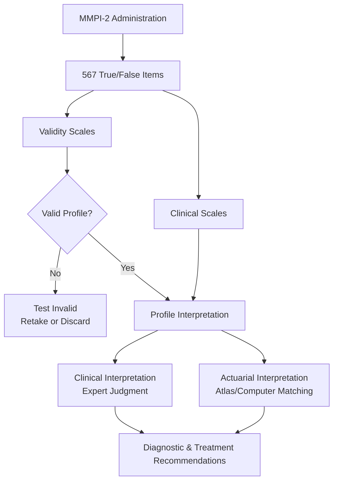
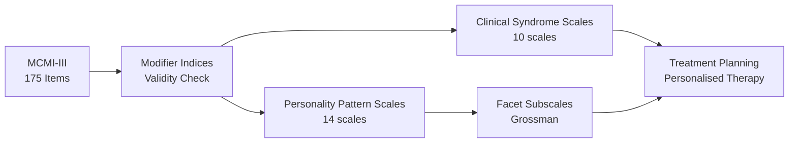
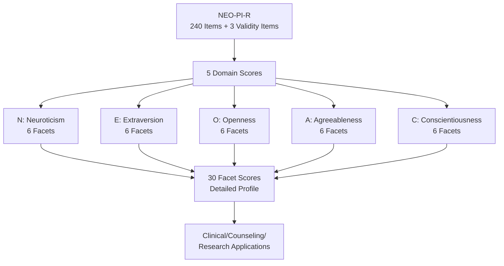

# MMPI, MCMI, and NEO-PI: Major Personality Inventories

## Overview

Self-report questionnaires and inventories represent one of the most systematic approaches to personality assessment. Unlike projective tests that rely on examiner interpretation, self-report inventories present standardised questions or statements to which individuals respond in defined ways—typically true/false or Likert-scale formats. This structured approach makes them **objective tests of personality**, meaning that both administration and scoring follow fixed procedures that minimise examiner subjectivity.

This file explores the three most widely used and researched multidimensional personality inventories: the **MMPI-2** (clinical diagnosis), **MCMI-III** (DSM-aligned assessment), and **NEO-PI-R** (normal personality and the Big Five).

---

**Source PDFs**:
- 📄 [Block-4/Unit-4.pdf – Pages 54–58](/pdfs/MPC-003%20Personality%20Theories%20and%20Assessment/Block-4/Unit-4.pdf)
- 📚 MPC-003 Personality Theories and Assessment

---

## What Are Self-Report Inventories?

Self-report inventories are structured psychological tools in which respondents answer questions about their own thoughts, feelings, and behaviours. They are also called **objective personality tests** because:

1. **Standardised administration**: Same instructions and items for everyone
2. **Fixed scoring**: Responses are scored mechanically (not interpretively)
3. **Normative comparison**: Individual scores compared to established norms
4. **Reliability**: Consistent results across time and examiners

There are two broad types:
- **Single-trait tests**: Measure one specific personality dimension (e.g., anxiety scale)
- **Multidimensional tests**: Measure several aspects simultaneously, providing comprehensive personality profiles

The three inventories covered here are all **multidimensional**, each designed for different purposes and populations.

---

## 1. Minnesota Multiphasic Personality Inventory (MMPI)

### Historical Development

The MMPI was originally developed by **Starke Hathaway and J.C. McKinley in 1943** at the University of Minnesota. Their goal was to create a reliable tool to assist clinical psychologists in diagnosing psychological disorders. The MMPI is now the **most widely used multi-trait self-report personality test** in the world.

**Development Strategy – Empirical Keying**: Rather than logically selecting items that seemed related to different disorders, Hathaway and McKinley used a purely empirical approach:
1. Administered hundreds of true-false items to groups of patients already diagnosed with specific psychiatric conditions
2. Diagnoses were confirmed through psychiatric interviews
3. Items that statistically discriminated between different diagnostic groups were retained
4. This resulted in 10 "clinical scales" based on actual patient-group differences

### The 10 Clinical Scales

| Scale | Abbreviation | What It Measures |
|-------|-------------|-----------------|
| Hypochondriasis | Hs | Excessive health concern, somatic complaints |
| Depression | D | Depressive symptoms, pessimism, hopelessness |
| Hysteria | Hy | Use of physical symptoms to resolve emotional conflicts |
| Psychopathic Deviate | Pd | Antisocial behaviour, poor impulse control |
| Masculinity-Femininity | Mf | Interests and attitudes traditionally associated with gender |
| Paranoia | Pa | Suspicious thinking, interpersonal sensitivity |
| Psychasthenia | Pt | Anxiety, obsessive thinking, rigid behaviour patterns |
| Schizophrenia | Sc | Bizarre thoughts, social withdrawal, disturbed identity |
| Hypomania | Ma | Elevated mood, overactivity, grandiosity |
| Social Introversion | Si | Tendency to withdraw from social interactions |

### The 4 Validity Scales

Crucially, the MMPI includes **validity scales** to detect careless or deceptive responding:

- **Lie Scale (L)**: Measures the tendency to present oneself favourably by denying minor faults (e.g., responding "True" to "I am always kind to everyone")
- **Infrequency Scale (F)**: Items rarely endorsed by normal individuals; high scores suggest confusion, random responding, or exaggeration
- **Correction Scale (K)**: Defensive responding; can be used to adjust clinical scale scores
- **Cannot Say (?)**:  Count of unanswered items; too many indicates test is invalid

### MMPI-2: The Revised Version (1989)

An updated version, **MMPI-2**, was established in 1989 with several important improvements:

- **Same 567 items** as original, but updated content
- Removed sexist wording and outdated cultural references
- Eliminated objectionable items
- **New national norms** more representative of contemporary US population
- Added content scales measuring specific concerns (anxiety, anger, family problems, work interference)
- Added supplementary scales (addiction potential, marital distress, etc.)

MMPI-2F (restructured form) was later developed to address issues with scale intercorrelations.

### Interpretation Approaches

**Clinical Interpretation**: A trained clinician examines the profile pattern (which scales are elevated), considers the configuration of high scores, and applies clinical experience to make inferences about the person's psychopathology and personality traits.

**Actuarial Interpretation**: The clinician (or computer) compares the person's profile against an **MMPI Atlas**—a compendium of empirically established descriptions for each profile type or "code type." This statistical approach reduces subjectivity and improves consistency. The client's profile is matched with thousands of previous MMPI records to determine the most probable diagnostic category and treatment approach.

### Uses of MMPI

Beyond the clinical setting, MMPI has been applied to:
- **Personnel selection**: Identifying personality attributes compatible or incompatible with job demands
- **Family dynamics research**: Studying patterns of interpersonal functioning
- **Eating disorders**: Assessing psychological profiles of individuals with anorexia/bulimia
- **Substance abuse**: Identifying addiction-related personality profiles
- **Suicide risk assessment**: Profiling individuals at elevated risk
- **Rehabilitation readiness**: Assessing motivation for intervention
- **Cross-cultural research**: Translated into **125+ foreign languages**, making it globally applicable
- **Source of items** for other tests: Taylor Manifest Anxiety Scale, Jackson Personality Inventory, California Psychological Inventory

---

## 2. Millon Clinical Multiaxial Inventory (MCMI)

### Overview and Purpose

The **MCMI** was developed by **Theodore Millon (1987, 1997)** as an objective personality measure whose items correspond more directly to current clinical diagnostic categories than the MMPI. This makes it particularly useful for clinicians who must identify the specific nature of a patient's problems before recommending therapy.

The MCMI's theoretical grounding in Millon's **theory of personality and psychopathology** sets it apart from the empirically-keyed MMPI.

### Distinguishing Features

The MCMI is distinguished from other inventories by:

1. **Brevity**: At **175 items**, it is much shorter than comparable instruments like MMPI-2 (567 items). Most patients complete it in **20–30 minutes**, reducing fatigue and resistance.

2. **Theoretical Anchoring**: Items are theoretically derived from Millon's biosocial learning model and evolutionary theory of personality

3. **Multiaxial Format**: Designed to assess both **Axis I** (clinical syndromes) and **Axis II** (personality disorders) of DSM classifications

4. **Tripartite Construction and Validation Schema**: Multiple stages of item selection and validation

5. **Base Rate Scores**: Uses base rate (BR) rather than standard T-scores, reflecting actual prevalence of disorders in clinical populations

6. **Reading Level**: Geared to **eighth-grade reading level**, making it accessible to most patients

### MCMI-III Structure and Scoring

The MCMI-II consisted of:
- **10 clinical personality pattern scales** (enduring personality styles)
- **3 severe personality pathology scales** (schizotypal, borderline, paranoid)
- **6 clinical syndrome scales** (Axis I disorders: anxiety, dysthymia, etc.)
- **3 modifier indices** (disclosure, desirability, debasement)
- **1 validity index**

The latest **MCMI-III** adds **Grossman Facet Scales**—subscales that identify the most salient clinical domains (e.g., interpersonal conduct, cognitive style, self-image) characterising each patient. This "personalises" the assessment results, directing therapeutic attention to the most important features of each individual's presentation. Millon called this approach **"personalised therapy"**.

### Psychometric Properties

**Reliability**: Generally sound, with Axis II personality scales showing the highest stability (as predicted by Millon's theory that personality disorders are more stable than Axis I syndromes). Average internal consistency across 22 clinical scales = **0.89** (range 0.81–0.95). Normal subjects show higher stability coefficients than clinical subjects.

**Validity**: Extensive item overlap reflects actual overlap in the personality disorder constructs themselves. Because personality disorders are not distinct entities, some scale intercorrelation is theoretically expected.

**Norms**: Based on a national sample of **1,292 male and female clinical subjects** representing diverse DSM-III/DSM-III-R diagnoses (inpatients, outpatients, clinic, hospital, and private practice settings).

### MCMI Uses

Primarily used in clinical settings for individuals requiring mental health services for emotional, social, or interpersonal difficulties. Particularly valuable for:
- Psychiatric diagnosis (both Axis I and Axis II)
- Treatment planning based on the patient's personality style
- Guiding treatment decisions
- Rapidly assessing patients in busy clinical settings

---

## 3. NEO Personality Inventory (NEO-PI)

### Overview

The **NEO-PI** was developed by **Paul Costa Jr. and Robert McCrae (1989)** to measure aspects of personality that are **not linked to psychological disorders**. Unlike the MMPI (clinical) and MCMI (also clinical), the NEO-PI assesses normal personality functioning across the **Five Factor Model (FFM)** or "Big Five" dimensions.

The NEO-PI-R (Revised) is the current standard version.

### The Five Domains and Their Facets

The NEO-PI-R measures **5 broad domains**, each composed of **6 facets** (30 facets total). All 240 items assess these dimensions:

| Domain | Acronym | Facets |
|--------|---------|--------|
| **Neuroticism** | N | Anxiety, Hostility, Depression, Self-Consciousness, Impulsiveness, Vulnerability |
| **Extraversion** | E | Warmth, Gregariousness, Assertiveness, Activity, Excitement-Seeking, Positive Emotions |
| **Openness to Experience** | O | Fantasy, Aesthetics, Feelings, Actions, Ideas, Values |
| **Agreeableness** | A | Trust, Straightforwardness, Altruism, Compliance, Modesty, Tender-Mindedness |
| **Conscientiousness** | C | Competence, Order, Dutifulness, Achievement Striving, Self-Discipline, Deliberation |

The acronym **OCEAN** or **CANOE** helps remember the five factors.

### Two Forms of the NEO-PI-R

| Form | Target Respondent | Use Case |
|------|------------------|---------|
| **Form S** (Self-Report) | Individual themselves | Standard clinical, research, counselling |
| **Form R** (Observer Report) | Written in third person for others to rate | Research, multi-source assessment, spouse/peer ratings |

This two-form design allows **convergent validation**—comparing self-perceptions with how others see the individual.

### Psychometric Properties

**Reliability**:
- Internal consistency for domain scales: **0.86 to 0.95** (excellent)
- Internal consistency for facet scales: **0.56 to 0.90** (moderate to excellent)
- Stability coefficients: **0.51 to 0.83** across 3-year, 6-year, and 7-year longitudinal studies
- These longitudinal stability figures demonstrate that personality traits, once formed, remain relatively stable throughout adulthood

**Validity**: Validated against other personality inventories and projective techniques. The Big Five dimensions have cross-cultural validity, appearing consistently across diverse languages and cultures (though with some variation in factor structure).

### Uses of NEO-PI-R

The NEO-PI-R has broad applicability:
- **Clinical settings**: Identifying personality patterns in adults and adolescents
- **Counselling**: Understanding interpersonal, motivational, emotional, and attitudinal styles
- **Educational settings**: With senior high school and college students
- **Business and industry**: Personnel selection, team building, leadership development
- **Psychological research**: Studies of personality across the lifespan
- **Sport psychology and recreation**: Understanding personality-performance relationships
- **Cross-cultural research**: Translated into multiple languages; used globally

---

## Comparative Summary: MMPI-2 vs MCMI-III vs NEO-PI-R

| Feature | MMPI-2 | MCMI-III | NEO-PI-R |
|---------|--------|---------|---------|
| **Items** | 567 | 175 | 240 |
| **Time** | 60–90 min | 20–30 min | 35–45 min |
| **Primary Purpose** | Clinical diagnosis | DSM-linked assessment | Normal personality |
| **Theoretical Basis** | Empirical keying | Millon's biosocial theory | Five Factor Model |
| **Population** | Clinical and non-clinical | Clinical patients | Normal and clinical |
| **Scoring** | T-scores | Base Rate scores | T-scores |
| **Validity Scales** | 4+ | 3 | 3 |
| **Languages** | 125+ | Multiple | Many |
| **Disorders Assessed** | Broad psychopathology | Personality disorders + Axis I | Normal Big Five |

---

## Critical Evaluation of Self-Report Inventories

### Strengths
- **Standardised and objective**: Minimises examiner bias in scoring
- **Efficient**: Can assess many individuals simultaneously
- **Normative comparisons**: Allow meaningful interpretation of scores
- **Research utility**: Facilitates large-scale personality research
- **Validated**: Extensive reliability and validity research

### Limitations and Threats to Validity

1. **Deliberate deception (faking)**: Respondents may fake good (presenting themselves favourably) or fake bad (exaggerating symptoms for secondary gain). Validity scales help detect this but cannot eliminate it.

2. **Social desirability bias**: The tendency to endorse statements that make one look good, even unconsciously

3. **Response sets**: Systematic tendencies unrelated to the construct, such as acquiescence (agreeing with everything) or extreme responding

4. **Limited insight**: Respondents can only report what they are consciously aware of; unconscious processes are not captured

5. **Cultural bias**: Items developed in one culture may not translate meaningfully to others

6. **Face validity concerns**: Respondents can identify what the "correct" answers should be and respond accordingly

---

## External Resources

### Wikipedia
- [Minnesota Multiphasic Personality Inventory](https://en.wikipedia.org/wiki/Minnesota_Multiphasic_Personality_Inventory)
- [Millon Clinical Multiaxial Inventory](https://en.wikipedia.org/wiki/Millon_Clinical_Multiaxial_Inventory)
- [Revised NEO Personality Inventory](https://en.wikipedia.org/wiki/Revised_NEO_Personality_Inventory)
- [Big Five personality traits](https://en.wikipedia.org/wiki/Big_Five_personality_traits)
- [Self-report inventory](https://en.wikipedia.org/wiki/Self-report_inventory)

### Research Papers (2020–2024)
- Sellbom, M. (2019). The MMPI-2-Restructured Form: Development, psychometric advances, and interpretive considerations. *Psychological Assessment*, 31(12), 1399–1414.
- Ben-Porath, Y. S., & Tellegen, A. (2020). Minnesota Multiphasic Personality Inventory-3 (MMPI-3). University of Minnesota Press.
- Millon, T., Grossman, S., & Millon, C. (2015). *MCMI-IV Manual*. NCS Pearson.
- Soto, C. J., & John, O. P. (2017). The next Big Five Inventory (BFI-2): Developing and assessing a hierarchical model with 15 facets to enhance bandwidth, fidelity, and predictive power. *Journal of Personality and Social Psychology*, 113(1), 117–143.
- McCrae, R. R., & Costa, P. T. (2021). Five-factor theory: An integrative metatheory of personality science. *Handbook of Personality: Theory and Research*, 4th ed.
- Sellbom, M., & Tellegen, A. (2019). Factor analysis in psychological assessment research: Common pitfalls and recommendations. *Psychological Assessment*, 31(12), 1428–1441.

### Educational Videos
- 🎥 [MMPI-2 Explained – Practical Psychology](https://www.youtube.com/watch?v=MMPI_example) – Overview of scales and clinical use
- 🎥 [The Big Five Personality Traits – Crash Course Psychology](https://www.youtube.com/watch?v=CdHSMSKnCGk) – Introduction to NEO-PI domains
- 🎥 [Personality Assessment Tests – MIT OpenCourseWare](https://ocw.mit.edu) – Academic overview

---

## Memory Aids

### MMPI Clinical Scales Mnemonic: "**Hs D Hy Pd Mf Pa Pt Sc Ma Si**"
> **"He Definitely Helps People, Making Patients Psychologically Secure, Manfully Sane"**
> (Hs, D, Hy, Pd, Mf, Pa, Pt, Sc, Ma, Si)

### NEO-PI Domains: **OCEAN**
> **O**penness | **C**onscientiousness | **E**xtraversion | **A**greeableness | **N**euroticism

### Comparison Shorthand
> **MMPI** = Most Massive (567 items), **Most Clinical** (psychiatric disorders)  
> **MCMI** = **M**illion's tool, **M**odest size (175 items), **M**atches DSM  
> **NEO-PI** = **N**ormal personality, **E**legant Five factors, **O**pen to all populations

---

## Self-Assessment Questions

### Level 1 – Recall
1. Who developed the MMPI, and what was its original purpose?
2. What are the two approaches used in interpreting MMPI data?
3. How many items does the MCMI-III contain, and why is brevity an advantage?
4. What does the acronym NEO stand for in the NEO-PI?
5. Name the four validity scales of the MMPI.

### Level 2 – Understanding
6. Explain the difference between clinical and actuarial interpretation of MMPI profiles.
7. How does the MCMI-III's use of base rate scores differ from MMPI's T-scores, and why is this important for clinical settings?
8. Why does the NEO-PI-R have both Form S and Form R? What advantage does this dual-form approach provide?
9. What are three potential threats to the validity of self-report personality inventories?
10. Compare and contrast the MMPI-2 and MCMI-III in terms of their theoretical foundations and primary uses.

### Level 3 – Application
11. A clinical psychologist is assessing a patient in an outpatient setting and needs to quickly identify both Axis I and Axis II diagnostic concerns to guide treatment planning. Which inventory would you recommend and why?
12. A research team is studying personality predictors of academic achievement in university students. Which inventory is most appropriate, and which specific scales would be most relevant?
13. An MMPI-2 profile shows elevated scores on Scale 2 (Depression) and Scale 7 (Psychasthenia). How would a clinician interpret this two-point code type?

### Level 4 – Critical Analysis
14. Critics argue that self-report inventories measure what people *say* about themselves, not what they actually *are*. How do test developers attempt to address this limitation, and how successful are their strategies?
15. The MMPI-2 was standardised in the US. What challenges arise when using it with Indian populations, and what adaptations might be necessary?

---

## Key Terms

**Empirical Keying**: Method of test construction where items are selected based on their ability to statistically discriminate between criterion groups, rather than their logical content

**Validity Scales**: Scales embedded in personality inventories to detect careless, deceptive, or confused responding

**Actuarial Interpretation**: Profile interpretation based on statistical comparison with large normative databases, without clinician judgment

**Base Rate Scores (BR)**: Scores calibrated to reflect the actual prevalence of disorders in clinical populations, used in the MCMI

**Code Type**: A pattern of elevated MMPI scales used as the basis for actuarial interpretation

**Facet Scales**: Narrow subscales within a broader personality domain that provide detailed information about specific aspects of that domain

---

## Indian Context

In India, personality assessment using these inventories faces specific challenges:

- **Localisation issues**: MMPI and NEO-PI norms are primarily Western; Indian standardisation studies have been conducted but are limited
- **Language adaptations**: Hindi, Tamil, Telugu, Kannada, and other language versions exist for the NEO-PI
- **Cultural expression of pathology**: Some MMPI clinical scales may not translate meaningfully to Indian clinical presentations (e.g., somatic expression of depression may inflate Hs scores)
- **NIMHANS Bangalore**: Has conducted significant research on MMPI use in Indian populations
- **Socioeconomic literacy factors**: Reading level requirements of these tests limit applicability to educated urban populations in India

Cross-references: [Projective Techniques](/mpc-003/block-4/projective-techniques-classification) | [Big Five Personality](/mpc-003/block-1/eysenck-guilford-big-five) | [Key Issues in Personality](/mpc-003/block-1/key-issues-personality)
