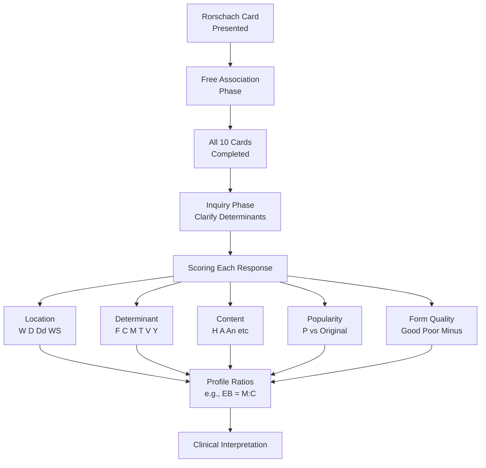

# Inkblot Tests: Rorschach and Holtzman (HIT)

## Overview

Inkblot tests belong to the category of **projective techniques**—psychological assessment methods that present ambiguous stimuli and ask respondents to impose structure or meaning on them. The premise is that in interpreting ambiguous material, individuals inevitably "project" their own personality characteristics, unconscious needs, conflicts, and defences onto the stimulus.

This file covers the two most important inkblot tests in clinical psychology: the **Rorschach Psychodiagnostic Test** (the most widely used projective instrument worldwide) and the **Holtzman Inkblot Technique (HIT)**, developed to overcome Rorschach's psychometric limitations.

---

**Source PDFs**:
- 📄 [Block-4/Unit-4.pdf – Pages 59–63](/pdfs/MPC-003%20Personality%20Theories%20and%20Assessment/Block-4/Unit-4.pdf)
- 📚 MPC-003 Personality Theories and Assessment

---

## What Are Inkblot Tests?

Inkblot tests are psychological instruments in which a subject's **interpretations of symmetrical inkblot images** are analysed to assess personality structure, psychodynamics, and psychological functioning.

Key features:
- Used in clinical psychology and psychiatry
- Ambiguous stimuli allow for free projection of personality material
- Useful when direct questioning (interviews) fails due to inhibitions, defensiveness, or lack of insight
- Capture aspects of personality that are **not accessible through self-report**—including unconscious processes, affective responses, and perceptual styles

The theoretical foundation draws from **psychoanalytic theory**—the idea that unconscious motives shape perception, and that ambiguous stimuli "bypass" conscious defences, revealing deeper aspects of the psyche.

---

## Part 1: The Rorschach Psychodiagnostic Test

### Historical Background

**Hermann Rorschach** (1884–1922) was a Swiss psychiatrist who developed the inkblot test published in 1921. His path to this innovation is fascinating:

- Born in Zurich, Switzerland on November 8, 1884
- As a child, earned the nickname **"Kleck"** (German for "inkblot") due to his love of **klecksography**—a popular Swiss game involving dropping ink on paper and folding it to create symmetrical designs
- Trained as a physician and studied psychiatry under **Eugen Bleuler** (who coined the term "schizophrenia") and **Carl Jung** (the famous psychoanalyst)
- Worked at various psychiatric institutions in Switzerland and Russia
- By 1911, he noticed that children playing klecksography showed **wide individual differences in their inkblot interpretations**
- This observation sparked his systematic investigation into how inkblot interpretation could reveal personality

While others (Leonardo da Vinci, Justinus Kerner, Alfred Binet) had experimented with inkblots, **Rorschach was the first to develop a systematic scoring system** for psychological analysis.

His work was published in **"Psychodiagnostik" (1921)**. Tragically, he died in 1922 at age 37—just one year after publishing his seminal work—and never witnessed its global impact.

### The Stimulus Materials (The Plates)

The Rorschach consists of **10 cards** (5½ × 9½ inches each), each containing one bilaterally symmetrical inkblot:

| Cards | Characteristics |
|-------|----------------|
| Cards I, IV, V, VI, VII | Black and white only |
| Cards II, III | Black/grey with red accents |
| Cards VIII, IX, X | Multicoloured |

Cards are presented **individually**, viewed at arm's length. The respondent is permitted to turn the card in any direction.

### Administration Procedure

The Rorschach is administered in two phases:

**Phase 1 – Free Association (Performance Phase)**:
- Each card is presented in sequence
- The examiner says: "Tell me what you see, or what this might be"
- The examiner records all responses verbatim and notes response time, card position, and behavioural observations
- No limit on number of responses per card

**Phase 2 – Inquiry (Clarification Phase)**:
- After all 10 cards have been presented, the examiner reviews the responses card by card
- For each response, the examiner asks what features of the inkblot (shape, colour, shading, texture, movement) determined the response
- This clarifies the **determinants** used

**Phase 3 – Testing the Limits**:
- Optional additional phase to discover whether the examinee can see certain things they initially missed (e.g., popular responses they did not give)

### Scoring Categories (Exner's Comprehensive System)

After Rorschach's death, multiple scoring systems were developed, leading to confusion. In the late 1950s, American psychologist **John Exner** developed the **Comprehensive System (CS)**, published in 1991/1993, which consolidated all approaches into a single universal procedure.

Each response is scored on multiple categories:

**1. Location** – Where on the blot was the response seen?
- **W** (Whole): Used the entire blot
- **D** (Common Detail): A commonly used area
- **Dd** (Unusual Detail): A rarely used area
- Combinations with **S** (White Space): WS, DS, DdS

**2. Determinant** – What aspect of the blot determined the response?
- **F** – Form (shape only)
- **C** – Chromatic colour
- **C'** – Achromatic colour (black/grey/white)
- **T** – Texture (shading-based)
- **V** – Vista/dimension (depth or dimensionality)
- **Y** – Diffuse shading
- **M** – Human movement
- **FM** – Animal movement
- **m** – Inanimate movement

**3. Content** – What category does the response represent?
- **H** (Human), **Hd** (Human detail), **A** (Animal), **Ad** (Animal detail)
- **An** (Anatomy), **Bl** (Blood), **Cl** (Clouds), **Fi** (Fire)
- **Ge** (Geography), **Na** (Nature), and many others

**4. Popularity/Originality**
- **P** (Popular): Responses given by ≥ 1 in 3 people; indicates conventional perception
- **O** (Original): Unusual responses; may indicate creative thinking or pathology

**5. Form Quality**
- Whether the form of the response accurately fits the actual contours of the blot (Good, Ordinary, Weak, Minus)
- Poor form quality suggests perceptual distortions

### Interpretation Principles

The pattern of scores across categories guides interpretation:

| Score Pattern | Interpretation |
|-------------|---------------|
| Many good whole (W) responses | Integrated, organised thinking |
| Colour (C) responses | Emotionality, impulsivity |
| Many detailed (D/Dd) responses | Compulsivity, perfectionism |
| White space (S) responses | Oppositional tendencies, negativism |
| Movement (M) responses | Imagination, fantasy life |
| High M:C ratio (Experience Balance) | Thought-minded rather than action-oriented |
| High F:C ratio | Cognitively controlled rather than emotionally driven |
| Delayed reaction times | Anxiety |
| Few colour and movement responses | Depression |
| Several shading responses | Anxiety, caution |
| Many original responses with poor form | Psychotic process |

**Content Interpretation** (more subjective):
- Ghosts/clowns: Difficulty identifying with real people
- Masks: Role-playing to avoid exposure
- Food: Dependency needs, emotional hunger
- Death imagery: Loneliness, depression
- Eyes: Sensitivity to criticism, paranoid concerns

**Total number of responses** (R) is a rough index of cognitive productivity and mental ability.

### Reliability and Validity

**Major challenges**:
- After Rorschach's death, at least **4 competing standardisation systems** emerged, causing inconsistency
- Exner's Comprehensive System (CS) improved standardisation significantly
- **Inter-rater reliability** varies; trained examiners show acceptable agreement on scoring but less so on interpretation
- Scoring of form quality and special scores is complex and requires extensive training
- **Validity research** is mixed: some studies show predictive validity for certain conditions (schizophrenia, depression), others show poor validity for general personality description

**Current status**: Despite controversy, the Rorschach remains the **most popular projective test** globally. Defenders argue that with proper training, it provides unique clinical information not available through self-report. Critics argue its reliability and validity are insufficient for high-stakes decisions.

---

## Part 2: Holtzman Inkblot Technique (HIT)

### Development and Purpose

The **Holtzman Inkblot Technique** was developed by **Wayne Holtzman and colleagues** and introduced in **1961**. It was specifically designed to **overcome the psychometric deficiencies of the Rorschach**—particularly its variable number of responses per card, lack of standardised administration, and limited psychometric properties.

The HIT assesses:
- **Personality structure** (its primary purpose)
- Diagnostic patterns, particularly **schizophrenia, depression, addiction, and personality disorders**

It is appropriate for individuals aged **5 years and above**. Requires a clinically trained examiner.

### Key Improvements Over Rorschach

| Aspect | Rorschach | HIT |
|--------|-----------|-----|
| Number of cards | 10 | 45 (+2 practice) |
| Responses per card | Unlimited | **Only 1** |
| Parallel forms | No | **Yes (Form A and B)** |
| Standardisation | Multiple competing systems | **One standardised system** |
| Psychometric properties | Limited | **More psychometrically sound** |
| Norms | Limited | **8 normative groups** |

### Materials and Administration

The HIT consists of **47 cards**:
- 2 practice cards
- **45 test cards** (in Form A or Form B)

**Individual Administration**: The examiner hands each card to the subject and requests **only one response per inkblot**. Occasionally, the examiner may ask the subject to clarify or elaborate. The HIT typically takes **50–80 minutes** to administer.

**Group Administration**: 30–45 inkblots are **projected onto a screen** and subjects provide written responses to each. This makes it useful for research settings requiring large sample assessment.

### The HIT Blots

The HIT inkblots are more varied than the Rorschach:
- Some are asymmetrical (unlike the bilateral symmetry of Rorschach cards)
- Colours vary more widely
- Different visual textures are represented
- Each blot was selected on the basis of:
  1. **High split-half reliability** (responses are consistent across the two halves of the test)
  2. **Ability to differentiate** between normal and pathological responses

### Scoring

The HIT is scored on **22 personality-related characteristics** determined by computer analysis of hundreds of test protocols. These include dimensions analogous to Rorschach categories (location, determinant, content, form appropriateness) but standardised more rigorously.

**Normative Database**: Percentile norms for all 22 scores are based on **8 normative groups** ranging in age from 5 years to adulthood, including both normal and pathological populations.

### Psychometric Superiority

Because the HIT was constructed using **procedures more similar to those for personality inventories** than traditional projective techniques:
- **Reliability is higher** than the Rorschach
- The one-response-per-card requirement eliminates the confound of response quantity affecting scores
- Parallel Forms A and B allow for test-retest reliability studies without memory contamination
- The standardised administration and scoring reduces examiner-introduced variability

---

## Comparison: Rorschach vs HIT

| Dimension | Rorschach (1921) | HIT (1961) |
|-----------|-----------------|-----------|
| **Developer** | Hermann Rorschach | Wayne Holtzman |
| **Number of blots** | 10 | 45 |
| **Responses per blot** | Unlimited | 1 only |
| **Parallel forms** | No | Yes (A & B) |
| **Administration time** | 45–90 min | 50–80 min |
| **Group testing** | Limited | Yes (projected) |
| **Scoring categories** | 5+ dimensions | 22 characteristics |
| **Norms** | Age/clinical groups | 8 normative groups |
| **Reliability** | Moderate | Higher |
| **Psychometric basis** | Projective tradition | Inventory-like construction |
| **Clinical acceptance** | Very high | Moderate |

---

## Strengths and Limitations of Inkblot Tests

### Strengths
1. **Bypass defences**: Respondents cannot easily guess what "correct" responses look like
2. **Low likelihood of faking**: Ambiguous stimuli make deliberate distortion difficult
3. **Sensitive to unconscious processes**: Capture personality dynamics not available through self-report
4. **Rich clinical data**: Provide information about perceptual style, emotional regulation, and thought organisation
5. **Useful for those with limited self-insight**: Children, individuals with psychosis, highly defensive clients

### Limitations
1. **Subjectivity of interpretation**: Even with standardised scoring, interpretation involves clinical judgment
2. **Time-intensive**: Administration, scoring, and interpretation require significant expertise and time
3. **Training requirements**: Cannot be used by untrained practitioners
4. **Psychometric concerns**: Reliability and validity are lower than self-report inventories
5. **Unsatisfactory by conventional psychometric criteria**: Despite popularity, the Rorschach especially fails many standard psychometric benchmarks
6. **Cultural factors**: Responses influenced by cultural background, making cross-cultural interpretation challenging

---

## External Resources

### Wikipedia
- [Rorschach test](https://en.wikipedia.org/wiki/Rorschach_test)
- [Holtzman Inkblot Technique](https://en.wikipedia.org/wiki/Holtzman_Inkblot_Technique)
- [Projective test](https://en.wikipedia.org/wiki/Projective_test)
- [Hermann Rorschach](https://en.wikipedia.org/wiki/Hermann_Rorschach)
- [Exner's Comprehensive System](https://en.wikipedia.org/wiki/Exner%27s_Comprehensive_System)

### Research Papers (2020–2024)
- Meyer, G. J., & Eblin, J. J. (2012). An overview of the Rorschach Performance Assessment System (R-PAS). *Psychological Injury and Law*, 5(2), 107–121.
- Mihura, J. L., Meyer, G. J., Dumitrascu, N., & Bombel, G. (2013). The validity of individual Rorschach variables: Systematic reviews and meta-analyses of the Comprehensive System. *Psychological Bulletin*, 139(3), 548–605.
- Viglione, D. J., & Hilsenroth, M. J. (2001). The Rorschach: Facts, fictions, and future. *Psychological Assessment*, 13(4), 452–471.
- Wood, J. M., Lilienfeld, S. O., Nezworski, M. T., Garb, H. N., Allen, K. H., & Wildermuth, J. L. (2010). Validity of Rorschach Inkblot scores for discriminating psychopaths from nonpsychopaths in forensic populations. *Psychological Assessment*, 22(2), 336–345.
- Tibon-Czopp, S., & Weiner, I. B. (2016). *Rorschach Assessment of Adolescents: Theory, Research, and Practice*. Springer.

### Educational Videos
- 🎥 [What Does the Rorschach Test Actually Tell Us? – Vox](https://www.youtube.com/watch?v=9g0pn4p3pTM)
- 🎥 [Projective Tests in Psychology – Crash Course Psychology](https://www.youtube.com/watch?v=aI-5JGDXPAs)
- 🎥 [History of the Rorschach Test – Psychology Today](https://www.youtube.com/watch?v=Rorschach_history)

---

## Memory Aids

### Rorschach Scoring Categories: **"L DCCP"**
> **L**ocation | **D**eterminant | **C**ontent | **C**ount of responses | **P**opularity/Form Quality

### Key Interpretation Links
- **W** (Whole) → **W**ell-integrated thinking
- **C** (Colour) → **C**onflict/emotion
- **S** (Space) → **S**tubborn/opposition
- **M** (Movement) → iMagination
- **Dd** (Unusual Details) → **D**etail-oriented, compulsive

### HIT vs Rorschach: "**HIT has MORE**"
> HIT has **MORE** cards (45 vs 10), but **ONE** response each; **MORE** reliable; **MORE** normative groups

---

## Self-Assessment Questions

### Level 1 – Recall
1. Who developed the Rorschach test and when was it published?
2. What are the three phases of Rorschach administration?
3. How many cards are in the HIT, and how many responses per card are permitted?
4. Who developed the Comprehensive System for scoring the Rorschach?
5. What does the "determinant" category in Rorschach scoring measure?

### Level 2 – Understanding
6. Why are inkblot tests considered projective tests? What is being "projected"?
7. How does the Experience Balance (M:C ratio) in the Rorschach inform the examiner about the respondent?
8. Why was the HIT developed? What specific limitations of the Rorschach was it designed to address?
9. What is the clinical significance of many "white space" (S) responses on the Rorschach?
10. Compare the psychometric properties of the Rorschach with the HIT.

### Level 3 – Application
11. A therapist finds that a patient gives many colour-dominated responses with poor form quality on the Rorschach. What personality characteristics might this suggest, and how would the therapist incorporate this information into treatment planning?
12. You are conducting research with a large sample (N=200) and want to include an inkblot measure of personality. Which test would you choose and why?

### Level 4 – Critical Analysis
13. The Rorschach continues to be widely used despite psychometric criticisms. What factors contribute to its persistence in clinical practice despite the availability of more reliable alternatives?
14. Critics argue that Rorschach interpretation is too subjective to be scientifically valid. How do proponents respond to this criticism, and do you find their arguments convincing?

---

## Key Terms

**Projective Test**: A personality assessment method using ambiguous stimuli to elicit responses reflecting unconscious personality characteristics

**Klecksography**: The art of creating patterns from ink drops, the childhood hobby that inspired Rorschach

**Bilateral Symmetry**: Mirror-image symmetry around a central axis, a feature of all Rorschach and most HIT cards

**Determinant**: In Rorschach scoring, the aspect of the blot (form, colour, shading, movement) that drove the response

**Experience Balance (EB)**: The ratio of human movement (M) to colour (C) responses; reflects thought vs. emotion orientation

**Comprehensive System**: John Exner's unified Rorschach scoring and interpretation system

**Split-half Reliability**: A measure of internal consistency; applied to HIT blot selection

**Parallel Forms**: Two equivalent versions of a test (HIT Form A and Form B) that can be used for test-retest studies

Cross-references: [Projective Techniques Classification](/mpc-003/block-4/projective-techniques-classification) | [TAT and Apperception Tests](/mpc-003/block-4/tat-cat-sat-apperception-tests) | [Personality Assessment Methods](/mpc-003/block-1/personality-assessment-methods)
