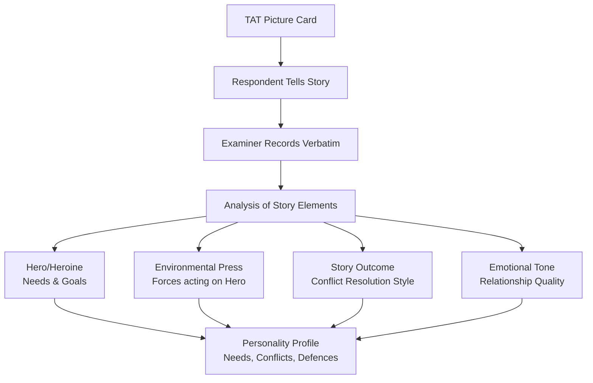
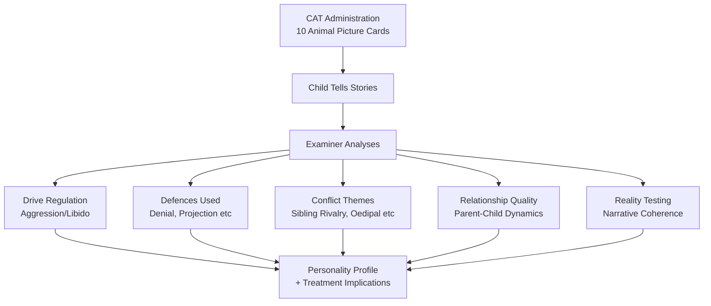

# Apperception Tests: TAT, CAT, and SAT

## Overview

Apperception tests represent a distinct family of projective techniques in which respondents are shown **pictures** (of people, animals, or social situations) and asked to **tell stories** about what they see. The term *apperception* refers to the psychological process by which we interpret and make sense of new experiences by relating them to our existing knowledge and inner life—thereby projecting our own needs, conflicts, and personality characteristics into our interpretations.

This file covers the three major apperception tests: the **Thematic Apperception Test (TAT)** for adults, the **Children's Apperception Test (CAT)** for children, and the **Senior Apperception Technique (SAT)** for older adults.

---

**Source PDFs**:
- 📄 [Block-4/Unit-4.pdf – Pages 63–68](/pdfs/MPC-003%20Personality%20Theories%20and%20Assessment/Block-4/Unit-4.pdf)
- 📚 MPC-003 Personality Theories and Assessment

---

## Understanding Apperception

### The Concept of Apperception

**Apperception** refers to the **conscious perception with full awareness**—it is the process of understanding by which newly observed qualities of an object are related to past experience. When we apperceive, we do not passively receive sensory information; we actively interpret it through the lens of our prior experiences, emotions, and inner world.

The term was introduced by **Leibniz** for the mind's reflective apprehension of its own states. **Immanuel Kant** distinguished two types:

| Type | Description |
|------|-------------|
| **Empirical Apperception** | Ordinary consciousness; the changing, subjective self |
| **Transcendental Apperception** | The consciousness that unifies all experience as belonging to one subject; the foundation of experience and thought |

In clinical psychology, apperception is the key mechanism underlying apperception tests: when faced with an ambiguous picture, individuals project their inner experiences—needs, fears, relationships, conflicts—onto the neutral stimulus, making the stimulus meaningful in terms of their own psyche.

### The Family of Apperception Tests

Apperception tests occupy a middle ground among projective techniques:
- **More structured than** inkblot tests (which use abstract shapes)
- **Less structured than** word associations and incomplete sentences (which use verbal stimuli)
- Most use pictures of **people or animals in ambiguous social situations**
- Respondents are asked to **tell a complete story** about the picture

Variations include:
- **Hand Test**: Pictures of hands
- **Auditory Apperception Test**: Auditory stimuli instead of pictures
- **Iowa Picture Interpretation**: Uses multiple-choice format instead of open-ended stories

Nearly all apperception tests use the same core instruction: "Tell me a story about this picture—what is happening now, what led up to it, and how will it turn out?"

---

## Part 1: Thematic Apperception Test (TAT)

### Historical Development

The TAT was developed by **Christiana Morgan and Henry A. Murray (1935)** at the Harvard Psychological Clinic. It is theoretically grounded in **Murray's Need-Press Theory of Personality**—the view that behaviour is a function of internal needs and environmental press (external forces).

Murray's framework made the TAT particularly sensitive to:
- **Dominant needs** of the individual (achievement, power, affiliation, nurturance, etc.)
- **Environmental press** (the pressures the individual perceives from their environment)
- **Thema** (the recurring need-press interactions that constitute the story of a person's life)

### Stimulus Materials

The TAT consists of **30 black-and-white picture cards** depicting people in ambiguous situations. The cards are divided into four overlapping sets of 19 cards, each appropriate for:
- Boys
- Girls
- Men
- Women

Additionally, there is **one blank card**—the subject must generate a picture entirely from their own imagination, revealing their most personal themes.

**Selection for individual assessment**: Typically 10–20 cards are selected as appropriate for the individual's age, sex, and presenting concerns.

### Administration Procedure

1. The examiner selects approximately **10 appropriate picture cards**
2. Each card is presented individually
3. The respondent is asked to tell a **complete story** about the picture, addressing:
   - What is **happening right now**?
   - What **thoughts and feelings** do the people in the picture have?
   - What **events led up** to the situation depicted?
   - How will the situation **turn out**?
4. The respondent is asked to devote approximately **5 minutes per story**
5. The examiner records stories verbatim and notes behavioural observations

### Sample Story (Illustrative)

One TAT picture shows a young woman in the foreground and an older woman with a shawl over her head grimacing in the background. A typical response told by a college woman:

> *"This is a woman who has been troubled by memories of a mother she was resentful towards. She has feelings of sorrow for the way she treated her mother; her memories plague her. These feelings seem to be increasing as she grows older and sees her own children treating her the same way she treated her mother. She tries to convey the feeling to her children but does not succeed. She is living her past in her present, because the feeling of sorrow and guilt is reinforced by the way her children are treating her."*

**Analysis**: This story reveals themes of guilt, unresolved mother-daughter conflict, intergenerational transmission of relationship patterns, and helplessness. The protagonist (hero/heroine) represents the storyteller.

### Interpretation Framework

**Core Assumption**: Respondents **project their own needs, desires, and conflicts** into the stories they tell and the characters they create.

**Focus of Interpretation**:
- **The Hero/Heroine**: The main character is presumed to represent the examinee; the examiner analyses the hero's needs, emotions, and goals
- **Environmental Forces (Press)**: The forces in the story environment that help or hinder the hero; reflects the subject's perception of their environment
- **Outcomes**: How stories end reflects the subject's typical resolution of conflicts

**Dimensions Analysed**:
- **Frequency, intensity, and duration** of particular themes across the set of stories
- Recurring patterns in how relationships are portrayed
- Quality of interpersonal representations (warm/hostile, trusting/suspicious)

**Indicators of Specific Psychopathology**:

| Story Feature | Clinical Interpretation |
|--------------|------------------------|
| Slowness or delays in responding | Depression |
| Stories by men involving negative comments about women | Sexual conflict or confusion |
| Affection for other men in stories | May indicate homosexual identification |
| Overcautiousness and preoccupation with details | Obsessive-compulsive tendencies |
| Confusion, disorganisation in stories | Psychotic processes |
| Themes of abandonment | Attachment issues, borderline features |
| Themes of control and domination | Power needs, aggression |

### Scoring and Interpretation

Murray's original scoring system focused on systematically cataloguing needs and press. Later systems have been developed for specific purposes:

- **Winter's (1994) coding system**: For achievement motivation, power motivation, and affiliation motivation
- **Westen's (1991) Social Cognition and Object Relations Scale (SCORS)**: For quality of object relations (interpersonal functioning)
- **Bellak's (1993) system**: More systematic interpretation with normative data

When more systematic scoring procedures are used, scores show **reasonable reliability and validity**—particularly for motivation and interpersonal themes.

### Uses and Applications

The TAT has been used with:
- **Diverse ethnic groups**: Various modifications exist for different cultural contexts
- **Wide age range**: Adolescents to adults
- **Special populations**: Modifications for Black populations (Thompson TAT), older adults (SAT), and children (CAT)

Key clinical applications:
1. **Understanding parent-child relationships**: TAT is particularly useful for exploring family dynamics
2. **Assessing achievement motivation**: McClelland's n-Achievement research used TAT extensively
3. **Power motivation research**: Winter's coding for power motivation in political psychology
4. **Treatment planning**: Understanding implicit relationship models
5. **Forensic contexts**: Assessing criminal motivation, threat assessment

### Critical Evaluation

**Strengths**:
- Rich, idiographic data about individual personality functioning
- Sensitive to implicit (non-conscious) personality processes
- Difficult to fake
- Clinically meaningful, particularly for relational and motivational functioning

**Limitations**:
- Content of stories is influenced by the environmental context of the testing situation
- Does not always differentiate between normal and disordered individuals
- Interpretation is highly impressionistic without systematic scoring
- Limited standardisation compared to objective tests
- Long administration and interpretation time

---

## Part 2: Senior Apperception Technique (SAT)

### Overview

The **Senior Apperception Technique (SAT)** was developed specifically for **older adults**. It modifies the TAT format to present scenes relevant to the experiences of the elderly.

### Stimulus Content

The SAT contains **16 stimulus pictures** specifically designed to reflect themes central to old age:
- **Loneliness** and social isolation
- **Uselessness** and loss of productive role
- **Illness** and physical decline
- **Helplessness** and dependency
- **Lowered self-esteem** and loss of identity
- **Positive and happier situations** (to avoid entirely negative stimulus set)

This content validity makes the SAT more ecologically relevant than the standard TAT for older adult assessment.

### Clinical Themes Revealed

Research using the SAT and similar instruments (like the **Gerontological Apperception Test** by Wolk and Wolk, 1971) reveals that older adults' responses frequently reflect:
- Serious concerns about **health and physical limitations**
- Anxiety about **getting along with others** (family, caregivers)
- Fears about **being placed in a nursing or retirement home**
- Grief over **loss of independence**
- Concerns about **purpose and legacy**

These themes are clinically important in gerontological psychology and can guide therapeutic interventions.

### Criticisms

Both the SAT and the Gerontological Apperception Test have been criticised for:
1. **Inadequate norms**: Limited normative data for comparison
2. **Potential stereotyping of the elderly**: Pictures may reflect cultural stereotypes about ageing rather than representing the diversity of older adult experience
3. **Limited validation research**: Fewer validity studies compared to the TAT

---

## Part 3: Children's Apperception Test (CAT)

### Overview

The **Children's Apperception Test (CAT)** is a projective personality assessment designed for children, developed by **Leopold and Sonya Bellak in 1949**. It is based on the adult TAT but adapted for the developmental level of children.

**Age range**: 3–10 years (primary use)  
**Administration time**: 20–45 minutes  
**Administered by**: Trained psychologist in clinical, research, or educational settings

### Theoretical Foundation

The CAT is grounded in **Freudian projective hypothesis**: unconscious motives control much of behaviour, and projection is a psychological mechanism by which a person unconsciously places inner feelings onto the external world.

Like the TAT, it assumes that children will project their own:
- **Dominant drives** and motivations
- **Emotions** and emotional conflicts
- **Sentiments** and attachment patterns
- **Complexes** and anxieties
- **Coping mechanisms** and defences

### Why Animals Instead of Humans?

The original CAT used **animal figures** instead of human figures (as in the TAT) because researchers assumed that children aged 3–10 would **identify more easily with animal characters** than human ones. Animals are less threatening and allow children to project feelings they might not directly admit about human relationships.

### The Three Versions of CAT

| Version | Figures | Purpose |
|---------|---------|---------|
| **CAT-A** (Animal) | 10 cards with animal figures | Original version; most commonly used |
| **CAT-H** (Human) | Human figures replacing animals | For children who identify better with humans |
| **CAT-S** (Supplement) | Children in family situations | Elicits specific family-related responses |

Research has not consistently shown that children identify more with animals than humans. The CAT-H was developed when this assumption was questioned.

### What the CAT Assesses

The CAT provides information about multiple dimensions of child personality:

1. **Reality Testing and Judgment**: How accurately does the child's narrative reflect the actual picture?
2. **Drive Regulation**: How does the child handle aggressive or libidinal themes?
3. **Defences**: What psychological defences appear in the stories (denial, projection, rationalisation)?
4. **Conflicts**: What recurring themes suggest unresolved internal conflicts?
5. **Level of Autonomy**: How does the child depict independence vs. dependence?
6. **Interpersonal Relationships**: How are relationships with parents, siblings, and peers depicted?
7. **Psychological Maturity**: The sophistication and integration of stories

### Interpretation Principles

The CAT examiner analyses stories for:
- **Main character identification**: Who is the child protagonist in the story?
- **Needs and drives**: What does the main character want?
- **Environmental forces**: What obstacles or supports does the character encounter?
- **Resolution**: How is conflict resolved? Adaptive or maladaptive?
- **Psychological themes**: Recurring themes across the 10 cards

The examiner summarises and interprets stories in terms of **common psychological themes**, identifying patterns that reveal the child's inner world.

### Clinical Applications

The CAT is used in:
- **Child psychotherapy**: Understanding the child's internal world and guiding therapeutic focus
- **Child psychiatry**: Diagnostic assessment of emotional and behavioural disorders
- **Educational psychology**: Understanding learning difficulties with emotional underpinnings
- **Custody evaluations**: Understanding children's perceptions of family relationships (though with caution)
- **Research**: Studying childhood personality development

---

## Comparison: TAT vs CAT vs SAT

| Dimension | TAT | CAT | SAT |
|-----------|-----|-----|-----|
| **Developers** | Morgan & Murray (1935) | Bellak & Bellak (1949) | Bellak (1975) |
| **Age group** | Adults | Children 3–10 | Older adults |
| **Stimulus figures** | Humans | Animals (or humans) | Humans in elderly situations |
| **Number of cards** | 30 (10–20 used) | 10 | 16 |
| **Theoretical basis** | Murray's Need-Press | Freudian projection | TAT adaptation |
| **Normative data** | Limited | Limited | Very limited |
| **Primary use** | Adult personality, motivation | Child personality, family dynamics | Gerontological assessment |

---

## Apperception Tests vs Inkblot Tests

| Dimension | Apperception Tests | Inkblot Tests |
|-----------|-------------------|---------------|
| **Stimuli** | Pictures of people/animals | Abstract inkblots |
| **Response format** | Story narratives | Descriptions of what seen |
| **Structure** | More structured | Less structured |
| **Content** | Interpersonal situations | Ambiguous shapes |
| **Best for** | Motivational and relational assessment | Perceptual style, thought organisation |
| **Face validity** | Higher (pictures are recognisable) | Lower (shapes are abstract) |
| **Faking potential** | Somewhat higher | Lower |

---

## External Resources

### Wikipedia
- [Thematic Apperception Test](https://en.wikipedia.org/wiki/Thematic_Apperception_Test)
- [Children's Apperception Test](https://en.wikipedia.org/wiki/Children%27s_Apperception_Test)
- [Henry A. Murray](https://en.wikipedia.org/wiki/Henry_A._Murray)
- [Projective test](https://en.wikipedia.org/wiki/Projective_test)
- [Apperception](https://en.wikipedia.org/wiki/Apperception)

### Research Papers (2020–2024)
- Hibbard, S., Porcerelli, J., Kamoo, R., Schwartz, M., & Bhatt, M. (2010). Defense and object relational maturity on Thematic Apperception Test scales indicates levels of personality organization. *Journal of Personality Assessment*, 92(3), 241–253.
- Morgan, C. D., & Murray, H. A. (1935). A method for investigating fantasies: The Thematic Apperception Test. *Archives of Neurology and Psychiatry*, 34, 289–306. (foundational)
- Westen, D., Muderrisoglu, S., Fowler, C., Shedler, J., & Koren, D. (1997). Affect regulation and affective experience: Individual differences, group differences, and measurement using a Q-sort procedure. *Journal of Consulting and Clinical Psychology*, 65(3), 429–439.
- Jenkins, S. R. (2008). *A Handbook of Clinical Scoring Systems for Thematic Apperceptive Techniques*. Lawrence Erlbaum.
- McClelland, D. C., Koestner, R., & Weinberger, J. (1989). How do self-attributed and implicit motives differ? *Psychological Review*, 96(4), 690–702. (classic TAT-motivation study)
- Bellak, L., & Abrams, D. M. (1997). *The Thematic Apperception Test, the Children's Apperception Test, and the Senior Apperception Technique in Clinical Use* (6th ed.). Allyn & Bacon.

### Educational Videos
- 🎥 [The Thematic Apperception Test Explained – Practical Psychology](https://www.youtube.com/watch?v=TAT_psychology)
- 🎥 [Projective Personality Tests – CrashCourse Psychology](https://www.youtube.com/watch?v=projective_tests)
- 🎥 [Henry Murray and the TAT – Historical Psychology](https://www.youtube.com/watch?v=murray_tat)

---

## Memory Aids

### TAT Interpretation: "**N-P-O-T**"
> **N**eed (of the hero) | **P**ress (environment's force) | **O**utcome (how it ends) | **T**heme (recurring pattern)

### The Three Apperception Tests: "**Adults-Children-Seniors**"
> **TAT** → Adults (human pictures, Murray's needs)  
> **CAT** → Children (animal pictures, Bellak, 3–10 years)  
> **SAT** → Seniors (elderly themes, loneliness, health)

### CAT-A, CAT-H, CAT-S
> **A**nimal | **H**uman | **S**upplement (family situations)

### Apperception = "See + Understand Through Your Own Experience"
> New stimulus → interpreted through your past experiences → personality projected

---

## Self-Assessment Questions

### Level 1 – Recall
1. What does "apperception" mean, and who introduced the term?
2. Who developed the TAT and what theory is it based on?
3. How many cards does the TAT contain, and how many are typically used?
4. Why does the original CAT use animal figures instead of human figures?
5. What themes are specifically represented in the SAT pictures?

### Level 2 – Understanding
6. Explain the concept of "projection" as it applies to apperception tests. How does this mechanism enable personality assessment?
7. What are the three aspects a respondent is asked to include in a TAT story? Why is each aspect clinically relevant?
8. How do the CAT-A, CAT-H, and CAT-S versions differ from each other, and when would you choose each?
9. What does an overemphasis on detail and cautious responding in TAT stories suggest about the respondent?
10. Compare and contrast the theoretical assumptions underlying the TAT and inkblot tests.

### Level 3 – Application
11. A 35-year-old male patient consistently tells TAT stories in which men are betrayed by women and ultimately succeed alone. What personality patterns might this suggest, and how would you explore this further in therapy?
12. You are assessing an 8-year-old child who refuses to talk about family problems directly. How would you use the CAT, and what clinical themes might you look for?
13. A clinician is working with an 80-year-old patient in a geriatric care setting. Justify the use of the SAT rather than the standard TAT in this case.

### Level 4 – Critical Analysis
14. Critics argue that TAT interpretation is "clinician art, not science" due to its subjective nature. How do systematic scoring methods like SCORS attempt to address this criticism, and how successful are they?
15. The CAT assumes that children aged 3–10 identify more with animals than humans. How would you design a study to empirically test this assumption, and what would the results imply for CAT validity?
16. Cultural context significantly influences the stories people tell to TAT pictures. What adaptations would be needed to use the TAT validly with Indian populations?

---

## Key Terms

**Apperception**: The process of understanding new experiences by consciously relating them to past experience; the mechanism underlying apperception tests

**Projection**: The unconscious mechanism by which inner feelings, needs, and conflicts are attributed to external stimuli

**Need-Press Theory**: Murray's personality theory in which behaviour is a function of internal needs and environmental press (external forces)

**Hero/Heroine**: In TAT interpretation, the main character who represents the examinee and whose needs and goals are analysed

**Press**: In Murray's system, the environmental forces (real or perceived) that help or hinder the individual in meeting their needs

**Thema**: The recurring need-press interaction patterns that characterise an individual's life story

**Empirical apperception**: Kant's term for ordinary, subjective consciousness associated with the changing self

**Transcendental apperception**: Kant's term for the consciousness that unifies all experience as belonging to one subject

---

## Indian Context

Apperception tests have been adapted for use in India in several ways:

- **Bhatia Battery**: An Indian intelligence and personality test battery developed for the Indian context
- **Hindi TAT**: Hindi-language administration of the TAT with culturally relevant stimulus modifications
- **Cultural themes**: Indian TAT responses often reflect joint family concerns, filial duty, gender role expectations, and caste/class dynamics
- **NIMHANS TAT Studies**: Research at the National Institute of Mental Health and Neurosciences has examined TAT validity in Indian populations
- **Indian motives**: McClelland's n-Achievement research has been extended to Indian populations using modified TAT procedures, showing different achievement motivation profiles between urban and rural Indians

**Clinical Relevance in India**: The indirect, projective format of the TAT may be particularly valuable in Indian clinical settings where direct expression of familial conflict, sexual concerns, or authority issues may be culturally inhibited. Patients who are reluctant to discuss family tensions directly may express them through TAT narratives.

Cross-references: [Rorschach & HIT Inkblot Tests](/mpc-003/block-4/rorschach-holtzman-inkblot-tests) | [Personality Assessment Methods](/mpc-003/block-1/personality-assessment-methods) | [Projective Techniques Classification](/mpc-003/block-4/projective-techniques-classification)
