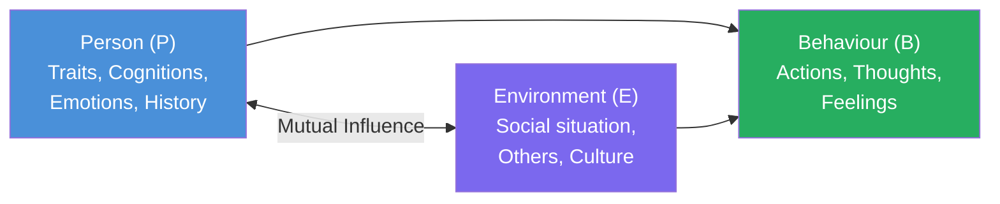
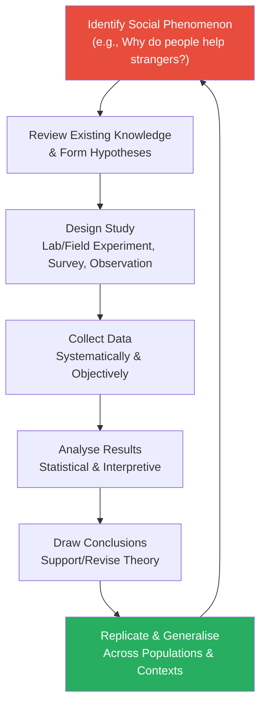
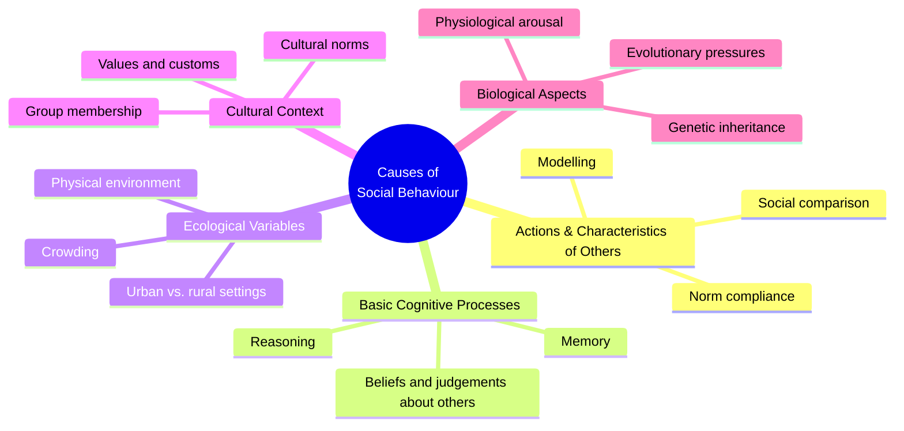

import Tabs from '@theme/Tabs';
import TabItem from '@theme/TabItem';

# Nature and Concept of Social Psychology

> *"We can barely be distinguished from our social situations, for they form us and decide our possibilities."* — Jean-Paul Sartre

Social psychology stands at the crossroads of the individual mind and collective life. It is the science that answers perhaps the most compelling human questions: Why do we conform? Why do we help strangers? How do situations shape who we become? This unit introduces the foundational concepts, definitions, scientific nature, and scope of social psychology.

---

**Source PDF**: 📄 [MPC-004 Block-1, Unit-1](/pdfs/MPC-004%20Advanced%20Social%20Psychology/Block-1/Unit-1.pdf)  
**Course**: MPC-004 Advanced Social Psychology

---

## 1. Defining Social Psychology

Social psychology emerged at the interface of psychology and sociology in the early 20th century. While psychology analyses the nature of humans and sociology analyses the nature of society, **social psychology analyses the relationship of the individual to society**.

Two landmark definitions frame the discipline:

| Scholar | Year | Definition |
|---------|------|------------|
| **Floyd Allport** | 1924 | "The scientific study of the experience and behaviour of individuals in relation to other individuals, groups and culture." |
| **Gordon W. Allport** | 1968 | A discipline "that attempts to understand and explain how the thought, feeling and behaviour of an individual are influenced by the actual, imagined or implied presence of others." |

The key elements embedded in these definitions are:
- **Scientific study** — employs rigorous methodology
- **Experience and behaviour** — encompasses both observable acts and internal states
- **Individual** — the unit of analysis is the person
- **Group and culture** — the context is always social

### The B = f(P, E) Formula

Kurt Lewin's (1951) elegant heuristic captures the essence of social psychology:

> **B = f(P, E)**  
> Behaviour is a function of the Person and the Environment.

A person is never studied in isolation — their behaviour is always the product of an interaction between their internal characteristics and the social environment surrounding them.

---

## 2. Social Psychology is Scientific in Nature

One of the most critical features distinguishing social psychology from folk wisdom and common sense is its **scientific methodology**. Everyone has intuitions about social behaviour — why people fall in love, why crowds behave irrationally, why some leaders inspire and others repel. Social psychology tests these intuitions rigorously.

McDavid and Harari (1994) outlined the **three-step scientific process** used in social psychology:

1. **Collection of observations** — Carefully gathering information about phenomena of interest, with an attitude of healthy scepticism
2. **Integration and generalisation** — Organising observations and formulating general principles
3. **Prediction** — Using these principles to predict future observations and behaviours

This scientific stance means social psychologists do not simply accept what seems obvious. Many findings in the field are **counterintuitive**:
- People do NOT necessarily help more when they are in larger groups (bystander effect)
- Rewarding people for activities they enjoy can actually reduce their intrinsic motivation
- Being exposed to someone repeatedly tends to make us like them more, even without meaningful interaction (mere exposure effect)

### What Makes Social Psychological Research Scientific?

---

## 3. What Social Psychology Studies: Experience AND Behaviour

Social psychology is distinctive in studying **both observable behaviours and internal states** — the full spectrum of human social experience.

**Observable Behaviours (Overt):**  
Actions that can be directly seen and measured — helping a stranger, voting, conforming to group pressure, acting aggressively.

**Internal States (Covert):**  
Emotions, cognitions, and attitudes that cannot be observed directly — jealousy, love, prejudice, cognitive dissonance.

The **stimulus situations** social psychology investigates include:

| Level | Description | Example |
|-------|-------------|---------|
| **Dyadic** | Two-person interaction | Couple conflict |
| **Group** | Individual within a collective | Peer pressure, team dynamics |
| **Cultural** | Broad cultural norms and contexts | Gender role expectations, cultural values |

### Individual as Both Respondent and Creator

A critical insight from McDavid and Harari (1995) is that the individual bears a **reciprocal relationship** with their social environment. The person is both:
- A **respondent** who reacts to social situations
- An **active creator** who shapes and modifies those same situations

This bidirectionality — that people both influence and are influenced by their social worlds — is fundamental to the social psychological perspective.

---

## 4. The Five Causes of Social Behaviour and Thought

Baron and Byrne (1995) identified five major **causal factors** that have been most intensively studied in social psychology research:

### Applied Example: Understanding Urban Violence

To illustrate how these five factors work together, consider the question: *Why is violent crime more prevalent in certain urban areas?*

| Causal Factor | Application |
|---------------|-------------|
| **Actions of others** | Peer groups normalise violence; gang membership |
| **Cognitive processes** | Attribution of hostile intent to ambiguous acts |
| **Ecological** | High density, heat, noise increase aggression |
| **Cultural** | Sub-cultural codes of honour and respect |
| **Biological** | Testosterone levels, neurological factors |

Social psychology's contribution is to systematically study these factors, weigh their relative importance, and develop evidence-based interventions.

---

## 5. Scope of Social Psychology

Social psychology attempts to understand the relationship between minds, groups, and behaviours in **three interconnected directions**:

### Direction 1: How Groups Influence Individuals
How do the thoughts, feelings, and behaviours of individuals get shaped by the actual, imagined, or implied presence of others?

This covers:
- **Social perception** — how we form impressions of others
- **Social influence** — conformity, obedience, persuasion
- **Trust and power dynamics**
- Impact of small group membership on cognition and emotion

### Direction 2: How Individuals Influence Groups
What is the impact of individual perceptions and behaviours on group functioning?

This covers:
- Group productivity in the workplace
- Group decision making and groupthink
- Conformity, diversity, and deviance within groups

### Direction 3: Intergroup Relations
How do different groups relate to one another? What makes some groups hostile and others cooperative?

This covers:
- Prejudice and discrimination
- Intergroup conflict and cooperation
- Social identity and ingroup/outgroup dynamics

### The European Fourth Level: Ideological Analysis
European social psychology textbooks recognise a **fourth level of scope** — the ideological dimension — studying societal forces (power structures, economic systems, cultural ideologies) that shape the human psyche collectively.

---

## 6. Real-World Applications of Social Psychology

Social psychology is not purely academic. Its insights have direct practical value across many domains:

| Domain | Applications |
|--------|-------------|
| **Health** | Health behaviour change, doctor-patient communication, public health campaigns |
| **Law and Justice** | Eyewitness testimony reliability, jury decision-making, interrogation methods |
| **Education** | Classroom climate, stereotype threat, teacher expectancy effects |
| **Industry** | Workplace motivation, leadership, organisational behaviour |
| **Public Policy** | Nudge theory, pro-environmental behaviour, reducing discrimination |
| **Sports** | Team cohesion, home advantage, choking under pressure |
| **Mass Communication** | Propaganda, social media influence, persuasion effects |

### Indian Context
In India, social psychology has particular relevance for understanding:
- **Casteism and prejudice** — how centuries of hierarchical social structures shape intergroup attitudes
- **Collectivism vs. individualism** — Indian society's predominantly collectivist orientation affects conformity, helping behaviour, and group dynamics differently than Western samples
- **Rural-urban migration** — the psychological impacts of rapid urbanisation and social upheaval
- **Religious pluralism and intergroup conflict** — the psychology of communal harmony and conflict

---

## 7. External Resources for Deeper Learning

### 📺 Educational Videos
- [What is Social Psychology? — Crash Course Psychology](https://www.youtube.com/watch?v=nXCSfuZBiUw) — An engaging 10-minute overview
- [Social Psychology Explained — SciShow Psych](https://www.youtube.com/watch?v=uqWWz8Ou3aI) — Key concepts and landmark studies
- [Kurt Lewin: Father of Social Psychology — Psychology Archives](https://www.youtube.com/watch?v=social-lewin) — Historical contribution of field theory

### 📚 Wikipedia Articles
- [Social Psychology (Wikipedia)](https://en.wikipedia.org/wiki/Social_psychology) — Comprehensive overview
- [Floyd Allport (Wikipedia)](https://en.wikipedia.org/wiki/Floyd_Henry_Allport) — Pioneer who wrote the first experimental textbook
- [Kurt Lewin (Wikipedia)](https://en.wikipedia.org/wiki/Kurt_Lewin) — Father of applied social psychology and field theory
- [B = f(P,E) (Wikipedia)](https://en.wikipedia.org/wiki/Lewinian_formula) — Lewin's famous equation

### 🔬 Recent Research Papers (2020–2024)
- Baumeister, R. F., & Twenge, J. M. (2022). "Social psychology in the 21st century: New directions and challenges." *Annual Review of Psychology*, 73, 23–47.
- Haslam, S. A., et al. (2021). "The social identity approach to social psychology." *Nature Reviews Psychology*, 1(2), 84–93.
- Van Bavel, J. J., et al. (2020). "Using social and behavioural science to support COVID-19 pandemic response." *Nature Human Behaviour*, 4, 460–471. — A landmark paper showing social psychology's practical power in crisis
- Heine, S. J. (2021). "Cultural psychology and the study of social behaviour." *Psychological Science*, 32(4), 512–525. — Cross-cultural perspectives

### 🏫 Academic Resources
- [APA Division 8: Society for Personality and Social Psychology](https://www.spsp.org/)
- [Social Psychology Network — Wesleyan University](https://www.socialpsychology.org/) — Free resources, researchers, textbooks
- [MIT OpenCourseWare: Social Psychology](https://ocw.mit.edu/courses/brain-and-cognitive-sciences/) — Open lecture materials

---

## 8. Memory Aids and Mnemonics

### The "BASIC" Framework for Causes of Social Behaviour
> **B**ehaviour of others → **A**ction and characteristics  
> **S**ituation (ecological) → physical environment  
> **I**deas (cognitive) → memory, reasoning, judgment  
> **C**ulture → norms, values, group membership  

*(Plus biological factors — making it BASIC + Bio)*

### The Three Scopes: GIG
> **G**roups influence individuals (conformity, social influence)  
> **I**ndividuals influence groups (leadership, deviance)  
> **G**roups interact with groups (prejudice, intergroup conflict)

### Lewin's Formula Remembered
> **"B-P-E" = Behaviour, Person, Environment**  
> Think: *"Before Performing Examine your Environment"*

### Floyd vs. Gordon Allport
> **Floyd Allport (1924)**: Focused on **experimental** social psychology — studied groups in labs  
> **Gordon Allport (1968)**: Focused on **imagined** presence — even thinking about others shapes us

---

## 9. Self-Assessment Questions

<Tabs>
  <TabItem value="basic" label="📗 Basic Level" default>

**1.** Define social psychology according to Floyd Allport (1924) and Gordon W. Allport (1968). What are the key elements shared by both definitions?

**2.** What is meant by saying social psychology is "scientific in nature"? Describe the three-step scientific process outlined by McDavid and Harari (1994).

**3.** Explain Kurt Lewin's formula B = f(P, E). What does each component represent? Give a real-life example.

**4.** List the five major causes of social behaviour identified by Baron and Byrne (1995). Briefly explain each.

  </TabItem>
  <TabItem value="intermediate" label="📘 Intermediate Level">

**5.** Social psychology studies both "overt behaviour" and "covert internal states." Distinguish between these with examples. Why is studying both necessary?

**6.** Describe the three directions that social psychology investigates (how groups influence individuals, vice versa, and intergroup relations). Provide one research example for each direction.

**7.** Social psychology occupies the space between psychology and sociology. How does it differ from both parent disciplines while borrowing from each?

**8.** What is the "European fourth level" of social psychological scope? Why might an ideological level of analysis be particularly relevant in developing countries like India?

  </TabItem>
  <TabItem value="advanced" label="📕 Advanced & Exam Level">

**9.** Critically examine the statement: "Social psychology is the scientific study of the individual in social context." In your answer, discuss the tension between individualism and social determinism in defining the discipline.

**10.** Apply the B = f(P, E) framework and the five causal factors to analyse a contemporary social problem (e.g., mob lynching, online hate speech, vaccine hesitancy). What would a social psychological research programme on this issue look like?

**11.** "Common sense is a poor substitute for scientific knowledge about social behaviour." Evaluate this claim using examples from social psychology that demonstrate counterintuitive findings.

**12.** How have the practical needs of society shaped the scope of social psychology? Discuss with reference to at least four applied domains.

  </TabItem>
</Tabs>

---

## 10. Key Terms Glossary

| Term | Definition |
|------|-----------|
| **Social Psychology** | The scientific study of the experience and behaviour of individuals in relation to other individuals, groups, and culture |
| **B = f(P, E)** | Kurt Lewin's formula: Behaviour is a function of the Person and their Environment |
| **Social facilitation** | Improved performance on tasks in the presence of others (first studied by Triplett, 1897) |
| **Hedonism** | People act to secure pleasure and avoid pain (underlying many social theories) |
| **Utilitarianism** | Doctrine advocating the greatest happiness for the greatest number |
| **Overt behaviour** | Observable, directly measurable actions |
| **Covert behaviour** | Internal states (emotions, attitudes, cognitions) not directly observable |
| **Dyadic situation** | Two-person interaction |
| **Middle range theory** | Focused theory explaining a specific aspect of social behaviour, not all of social life |

---

## 11. Connections to Other Units

- **Unit 2** → Historical development of social psychology in more detail (mass psychology, instinct theory)
- **Unit 3** → Social psychology's related disciplines: sociology, anthropology, sociolinguistics
- **Unit 4** → Current trends: evolutionary social psychology, neurocognitive perspectives, technology

Cross-course connections:
- [MPC-003: Personality Theories](/mpc-003/block-1/definition-concept-personality) — Personality psychology overlaps with social psychology in explaining individual differences in social behaviour
- [MPC-002: Life Span Psychology](/mpc-002/block-1/concept-development-growth) — Socialisation across the life span shapes personality and social behaviour

---

*📄 Source: MPC-004 Advanced Social Psychology, Block-1, Unit-1, Pages 5–24*
