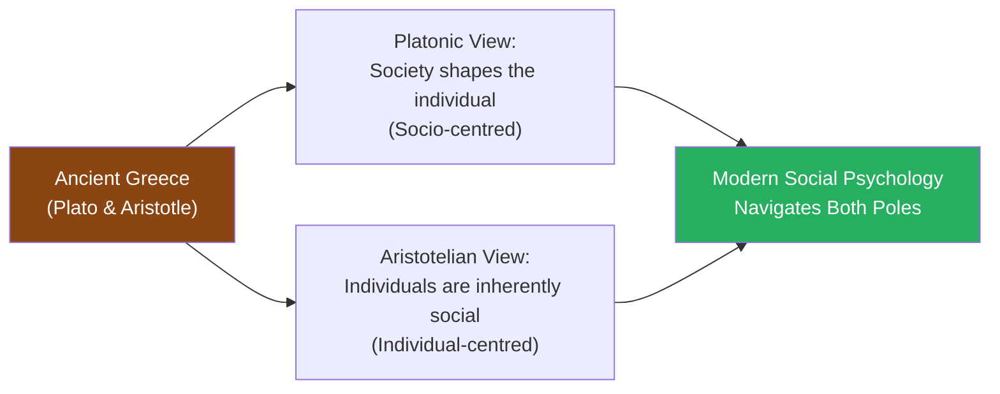
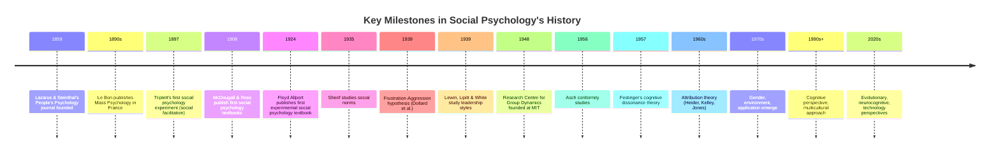

import Tabs from '@theme/Tabs';
import TabItem from '@theme/TabItem';

# Historical Development of Social Psychology

> *"Nothing is more practical than a good theory."* — Kurt Lewin

The history of social psychology is the history of humanity trying to understand itself — why we form societies, why we obey authority, why we help or harm strangers. This history spans from ancient philosophical debates about human nature to cutting-edge neuroscience laboratories. Understanding these origins illuminates why social psychology looks the way it does today.

---

**Source PDF**: 📄 [MPC-004 Block-1, Unit-1](/pdfs/MPC-004%20Advanced%20Social%20Psychology/Block-1/Unit-1.pdf)  
**Course**: MPC-004 Advanced Social Psychology

---

## 1. Social Thought Before the Advent of Social Science

Long before social psychology existed as a discipline, philosophers grappled with the fundamental question: **What is the relationship between the individual and society?**

Two dominant traditions emerged from ancient Greece:

### The Platonic Tradition (Socio-Centred Approach)
Platonic thought emphasised the **primacy of the state over the individual**. The individual's purpose was to be educated and shaped into a properly social being. Society and its structures determine who we are and what we become.

In modern terms, this became the **socio-centred approach**: social structures (systems, institutions, groups) determine individual experience and behaviour.

### The Aristotelian Tradition (Individual-Centred Approach)
Aristotle held that **human beings are social by nature** — the polis (city-state) emerges naturally from human sociability, not imposed upon it. Individuals naturally form families, then tribes, then states.

In modern terms, this became the **individual-centred approach**: social systems can be explained in terms of individual processes and psychological functions.

### The Concept of Group Mind: Hegel
Georg Hegel (1770–1831) introduced the notion that the state is not only the ultimate form of society but the **incarnation of the objective social mind**, of which individual minds are active participants. This gave rise to the concept of **Group Mind** — the idea that collectives have a psychological life beyond the sum of their individuals.

### Individualism in Two Forms
Two dominant strands of individualism shaped early social thought:
- **Hedonism**: People act to secure and maintain pleasure and avoid pain
- **Utilitarianism**: People act to achieve the greatest happiness for the greatest number

These principles echo through most modern theories of social motivation — reinforcement, cognitive dissonance reduction, social exchange theory all carry traces of hedonic and utilitarian thinking.

### Power from Machiavelli and Hobbes
The concepts of **social power and influence** entered social thought through Machiavelli (1513) and Hobbes (1651). Power later became a central construct in Lewin's field theory and social exchange theory — studied in aggression, conformity, and obedience to authority.

---

## 2. Stage 2: Social Psychology Emerges as a Discipline

By the mid-19th century, three conditions were ripe for a new scientific discipline to emerge (Andreyeva, 1990):

1. **Practical need**: Other sciences (linguistics, anthropology, ethnography) generated socio-psychological problems requiring specialised tools
2. **Internal development**: Socio-psychological problems became recognisable within psychology and sociology
3. **First independent forms**: Preliminary socio-psychological theories began to appear

Three early theoretical movements were most important:

### 2.1 People's Psychology (Völkerpsychologie)
Developed in **Germany** in the mid-19th century by **Moritz Lazarus (1824–1903)** and **Heymann Steinthal (1823–1893)**.

Their 1859 article "Introductory Thoughts on People's Psychology" (in the journal *People's Psychology and Linguistics*) argued that:
- The main force of history is **"the spirit of the people" (Volksgeist)** — visible in art, religion, language, myths, customs
- Individual consciousness is merely a product of this collective spirit
- The task of social psychology: uncover the psychological essence of the people's spirit and the laws governing spiritual activity

**Wilhelm Wundt (1832–1920)** extended this tradition, arguing psychology has two parts:
- **Physiological psychology** — experimental, for lower mental processes
- **People's psychology (Völkerpsychologie)** — non-experimental, for higher mental processes (language, thinking, customs, art)

**Lev Vygotsky's critique** was devastating: He opposed studying "crystals of ideology" (language, myths) and instead argued for studying the *mental processes themselves*. He also insisted that even individual personality is social and therefore a valid object of social psychology. His cultural-historical theory of higher mental functions (attention, memory, reasoning) grounded in social conditions was a critical counterpoint.

### 2.2 Mass Psychology
Developed in **France** in the latter half of the 19th century by:
- **Scipio Sighele** (1868–1913) — Italian lawyer
- **Gustave Le Bon** (1841–1931) — French sociologist

Both built on **Gabriel Tarde's** (1843–1904) ideas about the role of imitation and irrational movements in social behaviour.

**Le Bon's core argument**: When people aggregate into a crowd (mass), there is:
- **Depersonalisation** — loss of individual identity
- **Predominance of emotions over intellect** — rational thought collapses
- **General loss of sense of personal responsibility**
- Crowd mind is qualitatively different from — and inferior to — individual minds

While mass psychology captured something real (the irrationality of crowds had been witnessed during the French Revolution and later revolutionary events), it suffered from:
- Lack of empirical grounding
- Developed outside academic psychology
- No significant methodological consequences for the field

### 2.3 Theory of Instincts of Social Behaviour
Both people's psychology and mass psychology implicitly relied on instinctual explanations. This was formalised by **William McDougall (1871–1938)** in the first textbook era.

---

## 3. The First Textbooks: 1908 — Birth of Social Psychology as a Discipline

**1908 is celebrated as the year social psychology emerged as an independent scientific discipline.** Two books with the title "Social Psychology" appeared simultaneously:

| Book | Author | Discipline | Key Argument |
|------|--------|------------|--------------|
| *An Introduction to Social Psychology* | William McDougall | Psychology | Social behaviour stems from **inborn instincts** — imitation and suggestion rooted in biological nature |
| *Social Psychology* | Edward A. Ross | Sociology | Social uniformities in feeling, belief, and action explained by **imitation and suggestion** operating collectively |

**James Mark Baldwin** had earlier (1897) published *Social and Ethical Interpretation in Mental Development* in New York, considered one of the first systematic manuals.

**The problem with McDougall's instinct theory**: Recognising instincts as the motive force behind social behaviour gave undue importance to irrational and unconscious motives. Rational human thought processes were undervalued. Overcoming instinct theory became an important milestone in developing scientific social psychology.

---

## 4. The Beginning of Experimental Research: Early 20th Century

The transformation of social psychology into an **experimental science** is one of the most important developments in the field.

### Norman Triplett's 1897 Study — The First Social Psychology Experiment
Triplett studied "the dynamogenic effects of pace-making" — comparing cyclists' speeds when racing alone vs. competing with others. He found performance improved with others present. This was the **first study of social facilitation**.

### Floyd Allport and Walter Moede
- **Walter Moede** (Europe) and **Floyd Allport** (USA) conducted systematic experimental investigations
- Allport compared performance of individuals working alone vs. before an audience or alongside others doing the same task
- Found the **social facilitation effect**: the presence of others often **improved performance**
- In **1924**, Allport published the **first social psychology textbook based on experimental research** — a landmark that directed the field toward empiricism

### The 1920s–1940s: Systematic Investigation
After Allport's publication, social psychology expanded rapidly into:
- **Attitude measurement** — how do we assess social attitudes scientifically?
- **Social norms** — Muzafer Sherif (1935) studied how social norms emerge and their impact on behaviour
- **Aggression** — Dollard, Doob & Miller (1939): the **frustration-aggression hypothesis** — frustration always produces instigation to aggression
- **Leadership** — Kurt Lewin, Lipitt, and White (1939): styles of leadership (autocratic, democratic, laissez-faire) and group processes

### Kurt Lewin: The Father of Applied Social Psychology
**Kurt Lewin (1890–1947)** is arguably the most important figure in 20th-century social psychology. He:
- Established the **Research Centre for Group Dynamics at MIT (1948)** — the birthplace of experimental social group research
- Believed **significant social problems could be investigated in the laboratory**
- Developed **field theory** — behaviour understood as resulting from the dynamic field of forces surrounding the person
- Championed **action research** — using research to solve real social problems
- Famously said: *"Nothing is more practical than a good theory"*

---

## 5. Social Psychology's Youth and Maturation: 1940s–1980s

### The 1940s–1960s: Revolution Toward Cognitive Psychology
A major shift occurred: social psychology moved from viewing behaviour as driven by instincts to seeing it as **thoughtful, purposive, and cognitively mediated**.

Key developments:
- **Solomon Asch (1956, 1958)**: Classic conformity studies — showed how powerfully social pressure shapes judgements, even against obvious evidence
- **Leon Festinger (1950, 1954, 1957)**: **Cognitive dissonance theory** — people are motivated to maintain consistency between their beliefs and behaviours; inconsistency creates psychological tension
- **Attribution theory**: Fritz Heider, Harold Kelley, and E. E. Jones studied how people explain the causes of others' (and their own) behaviour

### The 1970s–1980s: Expanding Application
Rapid social change accelerated the scope of social psychology:
- **Attribution theory** — inferring causes of others' behaviours
- **Gender differences** — systematic study of how gender shapes social experience
- **Environmental psychology** — how physical environments (crowding, noise, temperature) affect social behaviour
- **Applications** — personal health, legal processes, work settings, education

### Middle Range Theories
Robert Merton's concept of **middle range theories** — focused, testable theories about specific social phenomena rather than grand unified theories — became the dominant model for social psychological theorising.

Examples of middle range theories:
- Frustration-aggression theory
- Cognitive dissonance theory
- Social exchange theory
- Attribution theory
- Social identity theory

These theories cluster around four major psychological traditions:

| Tradition | View of the Individual | Social Psychology Contribution |
|-----------|----------------------|-------------------------------|
| **Psychoanalytic** | Homo valence — the striving man; product of unconscious drives | Personality development, socialisation, aggression, family interaction |
| **Cognitive** | Homo Sapiens — the thinking man; society represented in experience | Attitudes, values, language, group dynamics, action research |
| **Behaviouristic** | Homo Mechanicus — the reactive man; society = stimuli and reinforcers | Socialisation, social reward and punishment, experimental methodology |
| **Interactionist** | The social self — shaped through symbolic interaction | Role theory, reference group theory, social determinants of behaviour |

---

## 6. Current Trends in Social Psychology (1990s–Present)

Two trends from the 1990s continued and intensified:

1. **Growing influence of cognitive perspective** — Social cognition, implicit attitudes, dual-process theories
2. **Increasing interest in application** — Real-world problems demand social psychological expertise

**Additional contemporary trends:**

### Evolutionary Social Psychology
Applies Darwinian principles to explain social behaviour — why do we cooperate, compete, form pair bonds, exhibit altruism? Mechanisms evolved because they were adaptive for our ancestors.

### Neurocognitive Perspective
Social neuroscience — studying the neural underpinnings of social behaviour using fMRI, EEG, and related technologies. How does the brain process social information? What happens neurologically during prejudice, empathy, or social exclusion?

### Technology and Human Social Behaviour
How does social media, smartphones, and digital connectivity reshape social influence, identity formation, relationships, and political behaviour?

### Multicultural Perspective
Growing recognition that most social psychology research was conducted on Western, Educated, Industrial, Rich, Democratic (WEIRD) samples. Cross-cultural and multicultural research examines universal versus culturally-specific social behaviours.

---

## 7. External Resources for Deeper Learning

### 📺 Educational Videos
- [History of Social Psychology — Crash Course Psych #36](https://www.youtube.com/watch?v=UGxGDdQnuLo) — Accessible 12-minute overview
- [Kurt Lewin's Field Theory Explained](https://www.youtube.com/watch?v=field-theory-lewin) — Visual explanation of the B=f(P,E) concept
- [Milgram Obedience Experiment — Original Footage](https://www.youtube.com/watch?v=yr5cjyokVUs) — A landmark moment in social psychology's history
- [Solomon Asch Conformity Experiment](https://www.youtube.com/watch?v=NyDDyT1lDhA) — Classic conformity demonstrations

### 📚 Wikipedia Articles
- [History of Social Psychology (Wikipedia)](https://en.wikipedia.org/wiki/History_of_social_psychology)
- [Gustave Le Bon (Wikipedia)](https://en.wikipedia.org/wiki/Gustave_Le_Bon) — Father of mass psychology
- [Wilhelm Wundt (Wikipedia)](https://en.wikipedia.org/wiki/Wilhelm_Wundt) — Founder of experimental psychology, contributor to Völkerpsychologie
- [Kurt Lewin (Wikipedia)](https://en.wikipedia.org/wiki/Kurt_Lewin) — Father of social psychology, field theory, action research
- [Leon Festinger (Wikipedia)](https://en.wikipedia.org/wiki/Leon_Festinger) — Cognitive dissonance theory

### 🔬 Recent Research Papers (2020–2024)
- Forsyth, D. R. (2021). "The history and historiography of social psychology." *Social Psychology Quarterly*, 84(3), 201–219.
- Henrich, J., et al. (2020). "WEIRD minds: How western education reshapes social psychology's foundations." *Psychological Science*, 31(7), 888–901.
- Haslam, S. A. (2023). "The social identity approach: Theoretical and applied perspectives." *Annual Review of Psychology*, 74, 405–432.
- Dovidio, J. F., & Gaertner, S. L. (2022). "Intergroup bias: Four decades of progress and challenge." *Psychological Bulletin*, 148(1-2), 3–37.

### 🏫 Academic Resources
- [Society for Personality and Social Psychology](https://www.spsp.org/) — Leading professional organisation
- [European Association of Social Psychology](https://www.easp.eu/) — European traditions, including ideological level
- [Classics in the History of Psychology](http://psychclassics.yorku.ca/) — Original texts from foundational figures

---

## 8. Memory Aids and Mnemonics

### Timeline Mnemonic: "PETE Lasts After Cognitive Maturity"
> **P**eople's & mass psychology (1859–1890s)  
> **E**xperimental era begins (1897, Triplett; 1924, Allport)  
> **T**heoretical expansion (1940s–1960s: Lewin, Asch, Festinger)  
> **E**xpansion of application (1970s–1980s)  
> **L**ate 20th century: Cognitive & multicultural  
> **A**pplication intensifies (1990s–present)  
> **C**urrent: Evolutionary, neurocognitive, technology  
> **M**ulticultural and cross-cultural focus

### The Three Early Movements: PIM
> **P**eople's psychology (Germany, Lazarus & Steinthal, Wundt)  
> **I**nstinct theory (McDougall — social behaviour from innate instincts)  
> **M**ass psychology (France, Le Bon & Sighele — crowd irrationality)

### Remembering 1908
> **1908 = Two Books, One Birthday**  
> McDougall (psychology) + Ross (sociology) = Social Psychology born!

### Lewin's Legacy: 4 "F"s
> **F**ield theory — behaviour = field of forces  
> **F**ather of applied social psychology  
> **F**ounded Research Centre for Group Dynamics at MIT  
> **F**ormula: B = f(P, E)

---

## 9. Self-Assessment Questions

<Tabs>
  <TabItem value="basic" label="📗 Basic Level" default>

**1.** Distinguish between the Platonic (socio-centred) and Aristotelian (individual-centred) traditions in social thought. How do these traditions continue to be relevant in social psychology?

**2.** What is "People's Psychology" (Völkerpsychologie)? Who were its main creators, and what did they argue?

**3.** What is "Mass Psychology"? Who were its principal theorists, and what was Le Bon's core argument about crowd behaviour?

**4.** Why is 1908 considered the birth year of social psychology as an independent discipline? Who published the first textbooks?

  </TabItem>
  <TabItem value="intermediate" label="📘 Intermediate Level">

**5.** Describe the development of experimental social psychology. What was Norman Triplett's contribution? How did Floyd Allport's 1924 textbook mark a turning point?

**6.** What was the "revolutionary change" in social psychology that took place around 1948? Who was central to this change, and what did he contribute?

**7.** Explain the four major theoretical orientations (psychoanalytic, cognitive, behaviouristic, interactionist) in social psychology. How does each view the individual's relationship to society?

**8.** What are "middle range theories"? Who proposed the concept, and why did this type of theorising become dominant in social psychology?

  </TabItem>
  <TabItem value="advanced" label="📕 Advanced & Exam Level">

**9.** Critically evaluate the three early forms of social psychological theory (people's psychology, mass psychology, instinct theory). What did each get right? Where did each fall short? What problems did Vygotsky identify with People's Psychology?

**10.** Trace the shift in social psychology from viewing behaviour as instinct-driven to seeing it as cognitively mediated. Reference specific theorists and studies that drove this shift.

**11.** "The field of social psychology has always been shaped by the social problems of its time." Evaluate this claim with reference to at least three specific historical periods.

**12.** How have current trends (evolutionary social psychology, neurocognitive perspective, technology, multiculturalism) changed the questions social psychologists ask? What new methodological challenges do these trends introduce?

  </TabItem>
</Tabs>

---

## 10. Comparative Summary: Historical Phases

| Period | Major Trend | Key Figures | Key Concepts |
|--------|-------------|-------------|--------------|
| Pre-1900 | Social philosophy | Plato, Aristotle, Hegel, Le Bon | Group mind, instincts, imitation |
| 1900–1924 | Emergence as discipline | McDougall, Ross, Triplett | Instinct theory, social facilitation |
| 1924–1940 | Experimental foundation | Floyd Allport, Sherif, Lewin | Social norms, leadership, frustration-aggression |
| 1940–1970 | Cognitive revolution | Kurt Lewin, Asch, Festinger, Heider | Cognitive dissonance, conformity, attribution |
| 1970–1990 | Application and expansion | Multiple | Gender, environment, law, health |
| 1990–present | Integration | Multiple | Evolutionary, neurocognitive, multicultural |

---

*📄 Source: MPC-004 Advanced Social Psychology, Block-1, Unit-1, Pages 10–18*
