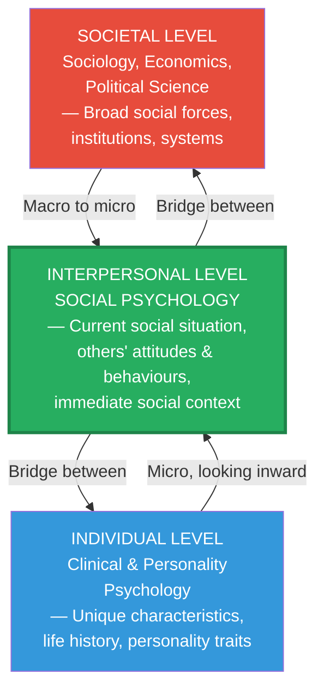
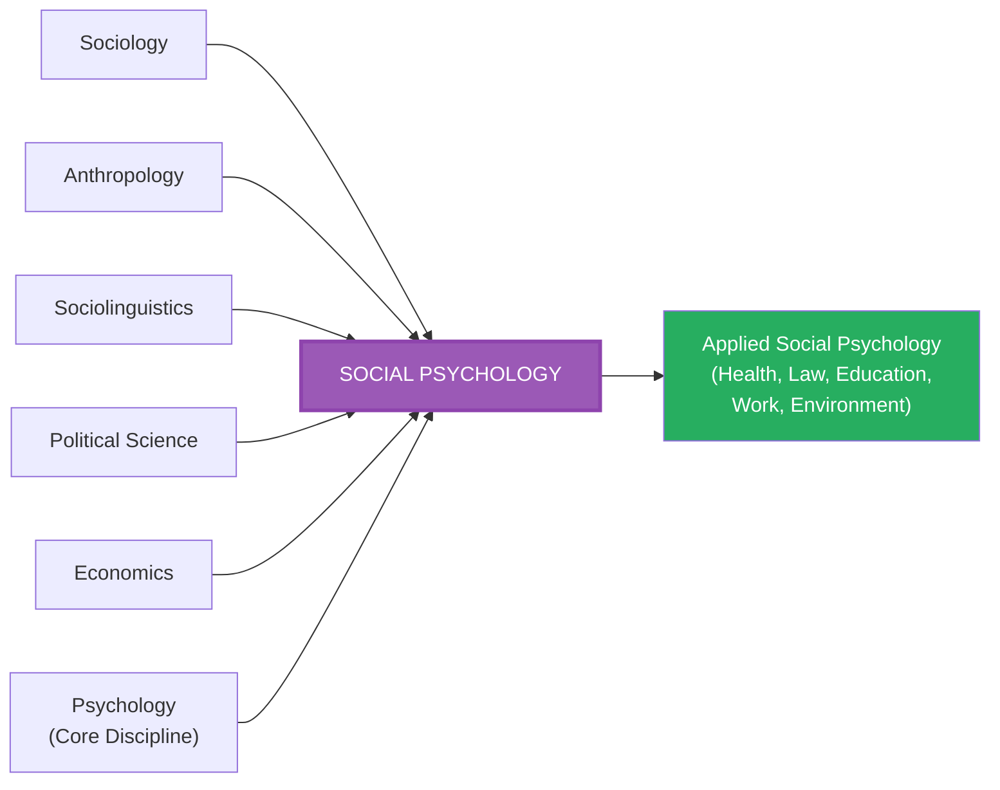

import Tabs from '@theme/Tabs';
import TabItem from '@theme/TabItem';

# Social Psychology and Related Disciplines

> *"Social psychology is delineated from other areas of social study by both its method and its approach."* — McDavid & Harari (1994)

Social psychology does not exist in isolation. It inhabits an intellectual neighbourhood alongside sociology, anthropology, political science, economics, and sociolinguistics. Understanding where social psychology draws boundaries — and where it shares territory — is essential for grasping what makes the discipline distinctive.

---

**Source PDF**: 📄 [MPC-004 Block-1, Unit-1](/pdfs/MPC-004%20Advanced%20Social%20Psychology/Block-1/Unit-1.pdf)  
**Course**: MPC-004 Advanced Social Psychology

---

## 1. The Central Task and Its Overlaps

The **central task of social psychology** is the systematic study of the relation between the individual and collective phenomena. This task inevitably overlaps with other social sciences that also study social behaviour:

- **Sociology** — studies large-scale social systems, groups, institutions, and societies
- **Anthropology** — studies human biological and cultural variation across peoples and time
- **Economics** — studies resource allocation and decision-making behaviour
- **Political science** — studies power, governance, and political behaviour
- **Sociolinguistics** — studies the relationship between language and social life

The key distinction: Social psychology differs from these fields by its **method** (typically experimental and empirical) and its **approach** (focus on the individual's experience within the social context).

---

## 2. Three Levels of Analysis

Different social science disciplines approach social behaviour from **different levels of analysis**. Recognising these levels clarifies both what unifies and what differentiates these fields.

### 2.1 Societal Level Analysis

**Who uses it**: Sociologists, economists, political scientists

**Goal**: Identify links between broad social forces and general patterns of social behaviour.

Social behaviour is explained by factors like economic conditions, class conflicts, industrialisation, immigration patterns, or legal systems.

**Example — Understanding urban violence:**
- A sociologist might look at poverty rates, social inequality, unemployment, or immigration patterns to explain crime rates.

**Strengths**: Captures large-scale patterns, policy relevance, historical and comparative scope.  
**Limitations**: Cannot explain why specific individuals within the same social conditions behave differently.

### 2.2 Individual Level Analysis

**Who uses it**: Clinical psychologists, personality psychologists

**Goal**: Explain behaviour in terms of a person's **unique personality characteristics and life history**.

Focus is on individual differences in childhood experiences, ability, motivation, and personality traits.

**Example — Understanding urban violence:**
- A personality psychologist might focus on the criminal's unique childhood trauma, low impulse control, or narcissistic personality features.

**Strengths**: Explains individual differences, clinically applicable, provides depth.  
**Limitations**: Cannot explain why many people with similar individual characteristics behave very differently in different social situations.

### 2.3 Interpersonal Level Analysis (Social Psychology's Home)

**Who uses it**: Social psychologists

**Goal**: Understand behaviour in terms of a person's **current social situation** — the other people present, their attitudes and behaviours, and their relationship to the individual.

The core social psychological principle: **"Change the social context, and the individual will change."**

**Example — Understanding urban violence:**
- A social psychologist might examine interpersonal dynamics: frustrating social interactions that trigger anger, dehumanising intergroup relations, or bystander effects that reduce individual intervention in conflicts.

**Strengths**: Demonstrates the power of situation over behaviour, explains conformity, social influence, group dynamics.  
**Limitations**: Sometimes underestimates stable personality differences.

### Comparing the Three Levels

| Level | Focus | Discipline | Key Question |
|-------|-------|------------|--------------|
| Societal | Broad social forces | Sociology, Economics | Why are crime rates higher in certain neighbourhoods? |
| Individual | Personality and history | Clinical/Personality Psychology | Why does this particular person commit crimes? |
| Interpersonal | Current social situation | Social Psychology | How does the immediate social context trigger aggressive behaviour? |

---

## 3. The Amalgamation of Sociology and Psychology

Social psychology is sometimes described as the offspring of both psychology and sociology. These two parent disciplines have different **units of analysis**:

- **Sociology**: The basic unit is the **social system** (groups, institutions, cultures, families)
- **Psychology**: The basic unit is the **individual**

But individual and social system are **mutually constitutive** — you cannot fully understand either without reference to the other. The individual is *contained within* social systems, and social systems only exist through the actions of individuals.

This has produced **two distinct forms** of social psychology:

### Psychological Social Psychology (PSP)
- Emphasis upon the subject's **mental processes, dispositions, experiences, and immediate social situation**
- Tends to be experimental, laboratory-based
- Primarily practiced in psychology departments
- Topics: social cognition, attitudes, persuasion, social influence on individuals

### Sociological Social Psychology (SSP)
- Emphasis upon the subject's **place in social order, socialised roles, and historical social context**
- Uses qualitative and survey methods more frequently
- Practiced in sociology departments
- Topics: social identity, role theory, symbolic interactionism, labelling theory

### A Third Synthesis
Some scholars advocate for a synthesis: social psychology as studying **both mass mental phenomena and the position of individuals in groups** — encompassing:
- Social psychology of the individual
- Communities and communication
- Social relations
- Forms of cultural activities

---

## 4. Social Psychology and Sociology

### What Sociology Studies
Sociology is the social science dealing with **social systems and structures, relationships, institutions, and entire societies**. A sociologist begins with society and moves toward the individual.

### Historical Influence
The emergence of sociology in the 19th century was critical to social psychology's development:
- **John Stuart Mill** and **Auguste Comte** argued human social cognition and behaviour should be studied scientifically
- This scientific aspiration became foundational for social psychology

### The Fuzzy Boundary
The boundary between social psychology and sociology is notoriously unclear — both invest heavily in overlapping questions:
- Group behaviour
- Social norms
- Attitude formation and change
- Social inequality and prejudice

The differences lie in **angle of approach**: social psychology privileges the individual's experience and experimental method; sociology privileges the social structure and uses ethnography, surveys, and qualitative research.

**Growing convergence**: Social psychology now increasingly adopts methods popular in sociology (ethnography, qualitative research, discourse analysis), especially as applied social psychology has expanded.

---

## 5. Social Psychology and Anthropology

### What Anthropology Studies
Broadly, anthropology is the scientific study of human beings — their biology, behaviour, and culture. It emerged from the Darwinian revolution of the mid-19th century.

**Main concerns**:
- Primitive societies and cultural evolution
- Cultural relativism — understanding practices within their cultural context
- Human diversity and unity
- Archaeology, linguistics, physical anthropology

### The Contribution to Social Psychology
Anthropology offers social psychology:
- Theories about **cultures and societies** that explain why the same social stimulus can produce different behaviours in different cultural contexts
- **Cross-cultural data** that tests whether social psychological findings are universal or culturally specific
- Rich descriptions of the **cultural and social context** within which social behaviour occurs

**Classic example**: The frustration-aggression relationship may not operate the same way across all cultures. Some cultures have different norms about expressing aggression; anthropological data helps reveal this.

### The WEIRD Problem
A critical contribution of anthropological thinking to contemporary social psychology is recognising that most research has been conducted on **WEIRD samples**:
- **W**estern
- **E**ducated
- **I**ndustrialised
- **R**ich
- **D**emocratic

These samples are not representative of global human diversity. Anthropological research demands social psychology broaden its empirical base.

---

## 6. Social Psychology and Sociolinguistics

### What Sociolinguistics Studies
Sociolinguistics connects **language with society**, using theories and methods from psychology, sociology, and anthropology to understand language in social contexts.

It is firmly grounded in the observation of **actual, preferably spontaneous speech behaviour**.

### The Reciprocal Exchange
**Sociolinguistics → Social Psychology**:
- Understanding how language reflects and shapes social identities, relationships, and group memberships
- Rich linguistic data contributes to building theories about social behaviour
- Studies of code-switching, accent, dialect, and sociolinguistic variation inform social psychological theories of identity and group dynamics

**Social Psychology → Sociolinguistics**:
- Social psychological theories of identity, intergroup relations, and social influence are used to draw inferences from linguistic data
- Attitudes toward languages and dialects are studied using social psychological methods

### Practical Examples
- **Language and prejudice**: Research on how speaking in a regional dialect affects judgements of competence and social status
- **Language and power**: How politicians use language to exercise social influence
- **Code-switching in India**: Why bilingual Indians (e.g., switching between Hindi and English) switch languages in different social situations — a sociolinguistic and social psychological question simultaneously

---

## 7. Interdisciplinary vs. Intradisciplinary Approaches

### The Interdisciplinary Approach
Emphasises **incorporating significant elements from various disciplines**. This incorporation is found especially in content:
- Social psychology borrows theories, methods, and data from sociology, anthropology, linguistics, economics, and political science
- All recent developments in social psychology "transcend a narrow definition" and require fluency in neighbouring disciplines

### The Intradisciplinary Approach
Conceptualises social psychology as a **specialty branch within psychology**. The focus remains:
- Individual level
- Experimental method
- Psychological explanation of social phenomena

From this perspective, social psychological phenomena are explained at four levels:
1. **Personal attributes** of the individual
2. **Actual situations** in which psychological phenomena are studied
3. **People's social position** (reference to social structures)
4. **Ideologies and belief systems** they adhere to

### Navigating Both Approaches

The tension between these approaches remains unresolved. As the IGNOU text notes: "Whether the debate among them will lead to a more unified social psychology or to a greater separateness only the time will tell."

---

## 8. Summary: How Social Psychology Differs from Related Disciplines

| Discipline | Unit of Analysis | Primary Method | Relation to Social Psychology |
|------------|------------------|----------------|-------------------------------|
| **Sociology** | Social system | Surveys, ethnography | SP occupies the individual end; overlaps significantly |
| **Anthropology** | Human beings (bio & cultural) | Ethnography, observation | Provides cross-cultural context |
| **Sociolinguistics** | Language in social context | Observation of speech | Mutual exchange of theories and data |
| **Clinical Psychology** | Individual psychopathology | Case studies, therapy | SP more situational; clinical more dispositional |
| **Personality Psychology** | Stable individual traits | Psychometric testing | SP emphasises situation; personality emphasises traits |
| **Political Science** | Power and governance | Historical, comparative | SP contributes psychology of voting, leadership, persuasion |

---

## 9. External Resources for Deeper Learning

### 📺 Educational Videos
- [Sociology vs. Social Psychology — What's the Difference?](https://www.youtube.com/watch?v=sociology-vs-sp) — Clear comparative explanation
- [WEIRD Psychology Problem — Explained](https://www.youtube.com/watch?v=weird-psychology) — Cross-cultural challenges to psychology
- [Language and Social Identity — Sociolinguistics Introduction](https://www.youtube.com/watch?v=sociolinguistics-identity)

### 📚 Wikipedia Articles
- [Social Psychology (Wikipedia)](https://en.wikipedia.org/wiki/Social_psychology)
- [Sociology (Wikipedia)](https://en.wikipedia.org/wiki/Sociology) — For contrast and comparison
- [Anthropology (Wikipedia)](https://en.wikipedia.org/wiki/Anthropology)
- [Sociolinguistics (Wikipedia)](https://en.wikipedia.org/wiki/Sociolinguistics)
- [Levels of Analysis (Wikipedia)](https://en.wikipedia.org/wiki/Level_of_analysis)

### 🔬 Recent Research Papers (2020–2024)
- Heine, S. J., & Norenzayan, A. (2022). "Cross-cultural psychology in the WEIRD age." *Perspectives on Psychological Science*, 17(4), 1037–1055.
- Greenwald, A. G., & Banaji, M. R. (2021). "Implicit social cognition: Attitudes, self-esteem, and stereotypes." *Psychological Review*, 128(5), 742–758.
- Turner, J. C. (2021). "Social psychology and sociology: Boundaries and bridges." *British Journal of Sociology*, 72(3), 421–438.
- Labov, W., & colleagues (2022). "Language and social stratification: New evidence from urban communities." *Language in Society*, 51(2), 201–229.

### 🏫 Academic Resources
- [American Sociological Association](https://www.asanet.org/) — For sociological perspective
- [American Anthropological Association](https://www.americananthro.org/)
- [International Sociolinguistics Association](https://www.sociolinguistics.net/)

---

## 10. Memory Aids and Mnemonics

### The Three Levels: "SIS"
> **S**ocietal level — big picture, systems (sociology)  
> **I**ndividual level — unique person, traits (clinical/personality psych)  
> **S**ocial situation (interpersonal) level — current context (social psychology)

### PSP vs. SSP: "PSP Inside, SSP Outside"
> **P**sychological Social Psychology: looks **inside** the individual (mental processes, dispositions)  
> **S**ociological Social Psychology: looks **outside** to social structure and roles

### Related Disciplines: "SPAS" (Social Psychology's Academic Siblings)
> **S**ociology — social systems  
> **P**olitical science — power and governance  
> **A**nthropology — culture and human variation  
> **S**ociolinguistics — language in social context

### Interdisciplinary vs. Intradisciplinary
> **Inter** = Between disciplines (borrowing from sociology, anthropology, etc.)  
> **Intra** = Within psychology (staying inside the psychological tradition)  
> Think: **"Intra" is Interior (inside psychology), "Inter" is International (across fields)**

---

## 11. Self-Assessment Questions

<Tabs>
  <TabItem value="basic" label="📗 Basic Level" default>

**1.** What are the three levels of social analysis? Name the disciplines primarily associated with each level.

**2.** Distinguish between the societal level and the interpersonal level of analysis. Why does social psychology primarily operate at the interpersonal level?

**3.** What is the difference between Psychological Social Psychology (PSP) and Sociological Social Psychology (SSP)?

**4.** How does social psychology relate to sociology? In what ways are they similar, and how do they differ?

  </TabItem>
  <TabItem value="intermediate" label="📘 Intermediate Level">

**5.** Explain the interdisciplinary and intradisciplinary approaches to social psychology. What are the advantages of each?

**6.** "Sociology and social psychology overlap so much that it is difficult to distinguish them." Evaluate this claim and explain where the distinction lies.

**7.** How does anthropology contribute to social psychology? What is the "WEIRD problem" and why is it significant?

**8.** What is sociolinguistics? Describe two ways in which social psychology and sociolinguistics exchange theories and methods.

  </TabItem>
  <TabItem value="advanced" label="📕 Advanced & Exam Level">

**9.** Using the three levels of analysis, construct a comprehensive multi-level explanation for a contemporary Indian social problem (e.g., communal violence, gender-based violence, caste discrimination). What would each discipline contribute?

**10.** Critically evaluate the claim that "social psychology is best understood as an intradisciplinary specialty within psychology rather than a genuinely interdisciplinary enterprise." What are the strongest arguments for and against this position?

**11.** "The unit of analysis determines the kind of explanation you can offer." Apply this insight to compare and contrast sociological and social psychological explanations of social problems.

**12.** How does the boundary between individual level analysis (personality psychology) and interpersonal level analysis (social psychology) affect how we explain individual behaviour? Use Stanley Milgram's obedience studies as an example.

  </TabItem>
</Tabs>

---

## 12. Key Terms Glossary

| Term | Definition |
|------|-----------|
| **Societal level analysis** | Identifying links between broad social forces and general patterns of social behaviour |
| **Individual level analysis** | Explaining behaviour in terms of a person's unique personality characteristics and life history |
| **Interpersonal level analysis** | Focus on a person's current social situation as the primary explanation for behaviour |
| **Psychological Social Psychology (PSP)** | Emphasis on mental processes, dispositions, and immediate social situation |
| **Sociological Social Psychology (SSP)** | Emphasis on social order, socialised roles, and historical social context |
| **Interdisciplinary approach** | Incorporating significant elements from multiple disciplines |
| **Intradisciplinary approach** | Defining social psychology as a specialty within psychology |
| **WEIRD samples** | Western, Educated, Industrialised, Rich, Democratic — the narrow population base of most psychology research |
| **Sociolinguistics** | The study of language in social contexts, connecting language with society |

---

## 13. Connections to Other Units

- **Unit 2** (next in Block 1) → How social psychology methods differ from those of related disciplines
- **Unit 4** → Current trends including the multicultural perspective that bridges social psychology and anthropology

Cross-course connections:
- [MPC-003: Personality Theories](/mpc-003/block-1/key-issues-personality) — The person-situation debate directly relates to the tension between individual and interpersonal levels of analysis
- [MPC-002: Life Span Psychology](/mpc-002/block-1/life-span-perspectives-understanding) — Development is shaped by social contexts, connecting lifespan and social psychology

---

*📄 Source: MPC-004 Advanced Social Psychology, Block-1, Unit-1, Pages 18–24*
