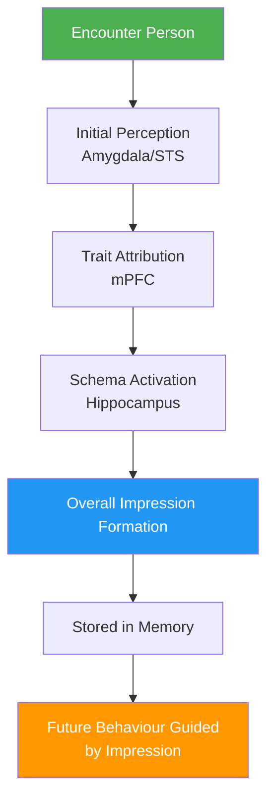
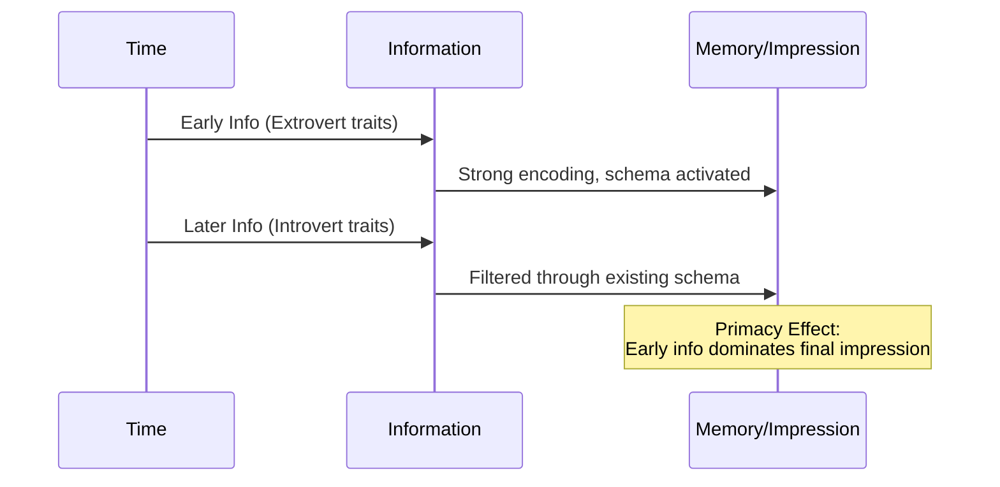
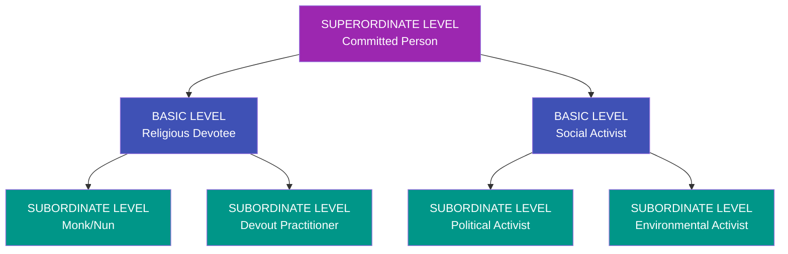

# Person Perception and Social Cognition: How We Understand Others

## Introduction

Every day, within moments of meeting someone, we form judgments about who they are. A potential employer decides in the first few minutes of an interview whether a candidate is competent. A student walks into a new class and immediately begins forming impressions of the professor. A child meets a stranger and senses warmth or coldness. These rapid, often unconscious evaluations are the domain of **person perception** and **social cognition** — two of the most fundamental processes in social psychology.

Understanding how people perceive, interpret, and remember information about others is not merely an academic exercise. These processes shape every human relationship, from intimate friendships to cross-cultural diplomacy. They explain why first impressions are so powerful, why stereotypes persist, and how therapy, education, and conflict resolution can succeed or fail based on how people mentally represent one another.

This unit explores the cognitive machinery behind our social perceptions, drawing on classic studies from Solomon Asch, Harold Kelley, and Norman Anderson, as well as contemporary neuroscience and cross-cultural research.

---

**Source PDFs:**
- 📄 [Block-1/Unit-2.pdf - Pages 25-46](/pdfs/MPC-004%20Advanced%20Social%20Psychology/Block-1/Unit-2.pdf)
- 📚 MPC-004 Advanced Social Psychology, IGNOU

---

## 2.1 Person Perception: Forming Impressions of Others

**Person perception** refers to the cognitive processes through which individuals focus on specific traits and characteristics to form an overall impression of another person. It is the study of how we make sense of other people — what they are like, why they behave as they do, and what we can expect from them in the future.

The classic demonstration of person perception comes from Harold Kelley's (1950) landmark experiment. Kelley told students they were about to meet a guest lecturer. One group was told the lecturer was "a rather warm person, industrious, critical, practical and determined." Another group received an identical description but with one crucial change — "warm" was replaced with "cold." The results were dramatic: students who expected a warm lecturer rated him far more positively after the discussion than those who expected a cold lecturer, even though the lecturer behaved identically in both conditions.

This experiment illustrates the power of **central traits** — characteristics that play an unusually large role in organising our overall impression of a person. According to Solomon Asch (1946), central traits provide a framework through which all other information is interpreted and given meaning. The word "determined," for example, means something entirely different in the context of a warm person versus a cold one.

### The Role of Central Traits

Central traits function as cognitive anchors. Once established, they colour our interpretation of every subsequent piece of information we receive about a person. Research has consistently shown that:

- Warmth/coldness is among the most powerful central traits in Western cultures
- Intellectual ability is central in academic contexts
- Trustworthiness is central in professional relationships

### What is Social Cognition?

**Social cognition** is the broader study of how people process, store, and apply information about other people and social situations. While person perception focuses on the product (our impression of someone), social cognition examines the entire cognitive process — how we encode, organise, retrieve, and use social information.

Social cognition involves several key processes:
- **Encoding**: How we initially notice and record information about others
- **Storage**: How social information is organised in memory
- **Retrieval**: How we access stored impressions when needed
- **Application**: How we use our stored impressions to guide behaviour

:::info Key Distinction
Person perception is concerned with *what* we conclude about someone. Social cognition is concerned with *how* we arrive at and use those conclusions.
:::

### Social Cognition and the Social Brain

Modern neuroscience has identified a network of brain regions specifically dedicated to processing social information — often called the "social brain." Key areas include:

- **Medial prefrontal cortex (mPFC)**: Active when thinking about other people's mental states
- **Temporoparietal junction (TPJ)**: Involved in understanding others' perspectives and intentions
- **Superior temporal sulcus (STS)**: Processes biological motion and gaze direction
- **Amygdala**: Processes emotional and social threat information rapidly

---

## 2.2 Cognitive Algebra: Additive and Averaging Models

Once we begin receiving information about a person, how do we combine it into an overall judgment? Norman Anderson (1965, 1974) proposed mathematical models to describe this process — what he called **cognitive algebra**.

### The Additive Model (Anderson, 1965)

The additive model proposes that when forming an impression, we simply **sum up** the values of the traits we observe. Each trait is assigned a value on a hypothetical scale, and these values are added together.

**Example:**
- Adventurous = 4
- Bold = 5  
- Caring = 9
- **Total impression = 4 + 5 + 9 = 18**

A key implication: according to the additive model, adding more positive traits *always* improves our overall impression of someone. The more positive information we receive, the better the impression.

### The Averaging Model (Anderson, 1974)

The averaging model proposes that we don't simply add trait values — we **divide by the number of traits** to calculate an average.

**Example:**
- Adventurous (4) + Bold (5) + Caring (9) = 18 ÷ 3 = **Average = 6**

Now here's the critical difference: if we add a mildly positive trait (e.g., Neat = 2):
- 4 + 5 + 9 + 2 = 20 ÷ 4 = **Average = 5** (the impression actually *worsens*)

The averaging model predicts something counterintuitive: adding a moderately positive trait can actually *lower* our overall impression of someone if that trait is below the current average.

### Which Model is More Accurate?

Research has largely supported the **averaging model**. In real social situations, when people learn that a previously highly-rated person has a moderate quality, their overall evaluation often decreases — exactly as the averaging model predicts.

| Feature | Additive Model | Averaging Model |
|---------|---------------|-----------------|
| More positive traits | Always better impression | Depends on trait value |
| More information | Always improves impression | Can improve or worsen |
| Empirical support | Limited | Strong |
| Intuitive appeal | High | Moderate |

### Limitations of Cognitive Algebra

Despite its insights, cognitive algebra research has been criticised for:

1. **Restricted information**: Real social perception involves far richer, contextual information than a simple list of traits
2. **Neglect of social richness**: Human interaction involves non-verbal cues, emotional context, and relationship history that numbers cannot capture
3. **Static model**: Impressions change dynamically over time in ways a simple formula cannot represent
4. **Cultural variation**: Different cultures weight traits very differently

Nevertheless, cognitive algebra research has made an important contribution by demonstrating that impression formation follows at least partially systematic, quantifiable rules.

---

## 2.3 Impression Formation: How Impressions Take Shape

### The Classic Luchins Study: Primacy vs. Recency

Abraham Luchins (1957) conducted one of the most influential studies on impression formation. He gave subjects a two-paragraph description of a boy named Jim. One paragraph portrayed Jim as an extrovert (socialising, walking to school with others, joining activities). The other portrayed him as an introvert (doing everything alone).

When subjects read the extrovert paragraph first, they rated Jim as significantly more extraverted. When they read the introvert paragraph first, they rated him as more introverted — even though both groups received exactly the same information.

This is the **primacy effect**: **early information exerts a stronger influence on impressions than later information**.

### Why Does Primacy Occur?

Several explanations have been proposed:

1. **Attention decrements**: We pay more attention to the first information because our attention wanes over time
2. **Schema formation**: Early information activates a schema that then filters subsequent information
3. **Change-of-meaning effect** (Asch): Early traits change the meaning of later traits, so that "determined" after "warm" means something very different than "determined" after "cold"
4. **Confirmatory processing**: We look for evidence confirming our initial impression and discount contradicting evidence

### When Do Recency Effects Occur?

**Recency effects** — where later information is given more weight — reliably occur under three conditions:

1. When people are explicitly asked to make a second evaluation after receiving new information
2. When there is a long time gap between initial information and the new information
3. When the task involves practice-based improvement (e.g., learning a new skill)

:::tip Exam Tip
The distinction between primacy and recency effects is frequently tested. Remember: primacy = first information matters more (most common); recency = last information matters more (specific conditions).
:::

---

## 2.4 Schemas: The Filing System for Social Information

Given the vast amount of social information we encounter daily, how do we avoid being overwhelmed? The answer lies in **schemas** — mental structures that help us organise, store, and use social information efficiently.

### What Are Schemas?

**Schemas** are organised bodies of information stored in memory that represent our knowledge about a particular domain. A schema provides:

- A representation of how the social world typically operates
- A framework for categorising and interpreting new information
- A template for making predictions about future behaviour

We hold schemas for:
- **Specific people**: Your mother, best friend, teacher
- **Classes of people**: Doctors, politicians, athletes
- **Situations**: What typically happens at a job interview, a first date, a funeral
- **Social roles**: What a "good student" or "good parent" does

### How Schemas Function

Schemas operate as cognitive short-cuts that allow us to process social information quickly and efficiently:

1. **Selection**: Schemas direct our attention to schema-consistent information
2. **Interpretation**: Ambiguous information is interpreted in schema-consistent ways
3. **Memory**: Schema-consistent information is more easily remembered
4. **Inference**: Schemas allow us to fill in gaps with expected information

**Example**: If you have a schema for "used car salesperson," you might automatically assume they are pushy and deceptive, even without direct evidence. This schema will guide how you interpret everything they say.

### The Double-Edged Nature of Schemas

Schemas are powerful tools but can also be sources of bias:

**Benefits:**
- Allows rapid processing of complex social situations
- Frees cognitive resources for other tasks
- Enables predictions and planning

**Risks:**
- Can lead to stereotyping and prejudice
- May cause us to ignore information that contradicts the schema
- Can create self-fulfilling prophecies
- May lead to false memories consistent with the schema

---

## 2.5 Prototypes: The Ideal Social Types

Within person perception, schemas about personality types are organised into **prototypes** — schemas that organise a cluster of personality traits into a coherent, meaningful personality type.

Nancy Cantor and Walter Mischel (1979) described a hierarchical organisation of prototypes using the example of "committed person":

### The Three Functions of Prototypes

1. **Enhanced information processing**: Prototypes allow people to recall, recognise, and categorise information about others more readily. By matching a person to a prototype, we instantly access a rich store of expectations.

2. **Social world organisation**: By observing relatively few traits or behaviours, we can categorise people and form expectations about their future behaviour.

3. **Behaviour planning**: Prototypes help us plan how to interact with others, because we have expectations about what they will do and how they will respond.

### Cultural Variation in Prototypes

Prototypes are not universal — they vary significantly across cultures:

- **Collectivist cultures** (India, Japan, China): Prototypes emphasise social roles, group membership, and relational traits (loyal, respectful, cooperative)
- **Individualist cultures** (USA, Western Europe): Prototypes emphasise personal traits, autonomy, and achievement (confident, independent, ambitious)

Research in India has found that personality prototypes often include social context as a core feature — people are described in terms of their relationships and roles, not just their individual traits.

---

## 🎯 Self-Assessment Questions

### Basic Level
1. Define **person perception** and explain how central traits influence the formation of overall impressions, using Kelley's (1950) warm/cold experiment as an example.

2. Compare the **additive model** and the **averaging model** of impression formation. Why does the averaging model sometimes predict that adding positive information can worsen an impression?

3. Explain the **primacy effect** using the Luchins (1957) experiment on Jim. Under what three conditions do **recency effects** occur instead?

### Intermediate Level
4. How do **schemas** function as cognitive tools in social perception? Describe both their advantages (efficiency, prediction) and disadvantages (bias, stereotyping).

5. Explain the **hierarchical structure of prototypes** proposed by Cantor and Mischel (1979), using the example of "committed person" and its superordinate, basic, and subordinate levels.

### Advanced Level
6. Compare person perception and social cognition as theoretical frameworks. How do they complement each other in explaining how we understand others?

7. How does the **social brain network** (mPFC, TPJ, amygdala) support the cognitive processes of person perception and social cognition? What does neuroscience add to the purely behavioural account?

---

## 🧠 Memory Aids

### CAPS: Key Elements of Social Cognition
- **C**entral traits anchor impressions (Kelley/Asch)
- **A**dding and averaging models (cognitive algebra)
- **P**rimacy effect (early info wins most of the time)
- **S**chemas and prototypes organise social knowledge

### Primacy vs. Recency: When Does Each Win?
- **PRIMACY dominates** when: information is processed continuously without interruption
- **RECENCY wins** when: there's a long gap, explicit re-evaluation, or practice-based tasks

---

## 📚 External Resources

### Wikipedia
- [Social cognition](https://en.wikipedia.org/wiki/Social_cognition)
- [Person perception](https://en.wikipedia.org/wiki/Person_perception)
- [Primacy effect](https://en.wikipedia.org/wiki/Serial-position_effect)
- [Schema (psychology)](https://en.wikipedia.org/wiki/Schema_(psychology))

### Educational Videos
- 🎥 [Crash Course Psychology: Social Thinking](https://www.youtube.com/watch?v=MmE7HKuXFiQ) — covers impression formation and attribution
- 🎥 [Social Cognition: How We Think About Others](https://www.youtube.com/watch?v=UXY_QLMqPzU) — MIT OpenCourseWare-style overview

### Research Papers (2020-2024)
- Dang, J., et al. (2020). [The primacy effect in impression formation: A meta-analysis](https://doi.org/10.1177/1368430219888145). *Group Processes & Intergroup Relations*, 23(4), 487-504.
- Freeman, J. B., & Johnson, K. L. (2024). [The social perception of faces: A dimensional model](https://doi.org/10.1177/1745691619896745). *Perspectives on Psychological Science*.
- Stolier, R. M., Hehman, E., & Freeman, J. B. (2022). [Trait knowledge informs the representations underlying person impressions](https://doi.org/10.1093/scan/nsac038). *Social Cognitive and Affective Neuroscience*.

### Foundational Reading
- Asch, S. E. (1946). [Forming impressions of personality](https://psycnet.apa.org/doi/10.1037/h0055756). *Journal of Abnormal and Social Psychology*, 41(3), 258-290.
- Anderson, N. H. (1974). Cognitive algebra: Integration theory applied to social attribution. *Advances in Experimental Social Psychology*, 7, 1-101.

---

## 🔗 Related Topics

- [Attribution Theory and Errors](/mpc-004/block-1/attribution-theory-errors) — How we explain behaviour
- [Social Comparison Theory](/mpc-004/block-1/self-perception-social-comparison) — How we understand ourselves
- [Personality Trait Theories](/mpc-003/block-1/allport-cattell-trait-theories) — How traits are measured
- [Self and Identity](/mpc-004/block-2/self-identity-social-psychology) — The social self

---

> **Quick Summary:** Person perception focuses on how we form overall impressions using central traits. Social cognition examines the full cognitive process of encoding, storing, and using social information. The additive and averaging models describe mathematically how trait information is combined. Primacy effects occur because early information forms schema anchors; recency effects occur under specific conditions. Schemas are organised knowledge structures; prototypes are hierarchically organised personality schemas that guide social interaction.
