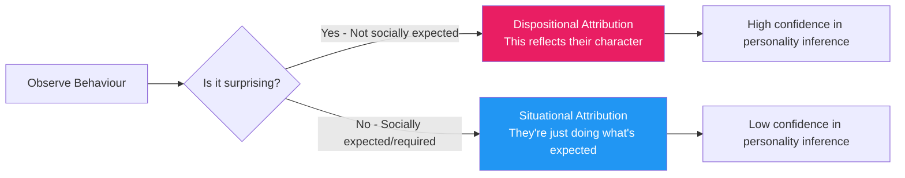
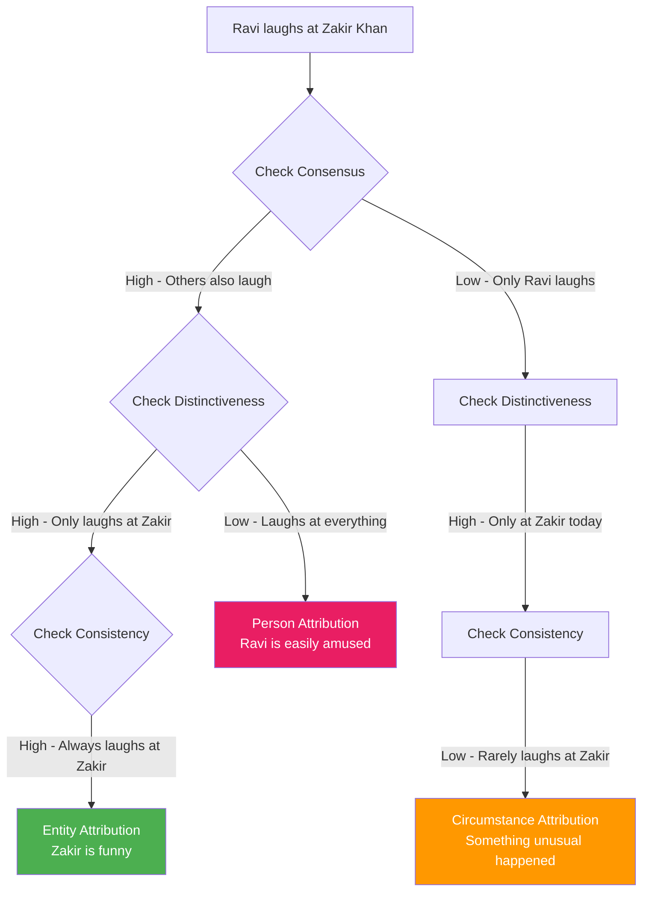

# Attribution Theory: Explaining the Causes of Behaviour

## Introduction: Why Do We Seek Causes?

Imagine you are sitting in a café when you see a man suddenly shout at a waiter. What goes through your mind? Do you think "that man is rude and aggressive"? Or do you think "something terrible must have just happened to him"? Your answer reveals your attribution style — the way you explain the causes of other people's behaviour.

**Attribution** refers to an individual's understanding of the reasons behind people's behaviour. Attribution theory is concerned with how individuals interpret events and how these interpretations relate to their thinking and behaviour. We make attributions constantly and automatically — about why our friend seems cold, why our employee made an error, why a politician voted a certain way, why we ourselves succeeded or failed.

The first systematic psychological theory of attribution was proposed by Fritz Heider (1958), who argued that people function like "naive scientists" — constructing implicit theories of cause and effect to understand the social world. Bernard Weiner, Edward Jones, Keith Davis, and Harold Kelley subsequently developed the formal theoretical frameworks that became central to social psychology research.

---

**Source PDFs:**
- 📄 [Block-1/Unit-2.pdf - Pages 30-33](/pdfs/MPC-004%20Advanced%20Social%20Psychology/Block-1/Unit-2.pdf)
- 📚 MPC-004 Advanced Social Psychology, IGNOU

---

## 2.1 Situational vs. Dispositional Causes

The most fundamental question in attribution theory is: **Is this behaviour caused by something about the person (dispositional) or something about the situation (situational)?**

**Dispositional attributions** explain behaviour in terms of the person's internal characteristics — their personality, traits, attitudes, abilities, or intentions. "She is late because she is irresponsible."

**Situational attributions** explain behaviour in terms of external factors — circumstances, environment, social pressure, luck. "She is late because of a traffic accident."

### The Jones, Gergen and Davis Experiment (1961)

A classic demonstration of situational vs. dispositional attribution: Subjects were asked to rate the personality of a job applicant who presented himself as either having or not having the traits required for the job.

- When the applicant displayed traits **expected** by the job (high social desirability), subjects were uncertain about their true personality — the behaviour could be explained by the situation (trying to get the job)
- When the applicant displayed traits **contrary** to job requirements (low social desirability), subjects were confident they were seeing the person's true character — no situational explanation

**Key insight**: We attribute behaviour to a person's disposition most confidently when that behaviour is surprising, non-normative, or low in social desirability. Expected, socially appropriate behaviour is harder to use for dispositional inference.

---

## 2.2 Kelley's Covariation Principle

Harold Kelley (1967) introduced one of the most influential models in attribution theory: **the covariation principle**. Kelley proposed that people identify causes by looking for factors that *covary* with an effect — that is, factors that are present when the behaviour occurs and absent when it does not occur.

**The core principle**: The cause selected to explain an effect is the cause that is **present when the effect is present** and **absent when the effect is absent** — like a detective identifying the suspect who was always at the scene of the crime.

### The Three Sources of Information

Kelley argued that observers consider three types of information to determine whether behaviour should be attributed to the **actor** (person), the **entity** (target), or the **circumstances** (situation):

1. **Consensus**: Do other people behave similarly in the same situation?
   - *High consensus* = Many people react this way → suggests something about the situation/entity
   - *Low consensus* = Only this person reacts this way → suggests something about the person

2. **Consistency**: Does this person behave this way across different occasions?
   - *High consistency* = Always behaves this way → stable cause
   - *Low consistency* = Sometimes behaves this way → transient/circumstantial cause

3. **Distinctiveness**: Does this person behave this way only in relation to this particular entity/target?
   - *High distinctiveness* = Only in this situation → suggests something about the entity
   - *Low distinctiveness* = In all situations → suggests something about the person

### The Attribution Patterns Table

| Attribution | Consensus | Distinctiveness | Consistency |
|-------------|-----------|-----------------|-------------|
| **Entity/Object** (something about the target) | High | High | High |
| **Person/Actor** (something about the person) | Low | Low | High |
| **Circumstances** (something about the situation) | Low | High | Low |

### Worked Example: Ravi Laughs at a Comedian

Imagine Ravi is laughing hysterically at comedian Zakir Khan.

- **Entity attribution** (the comedian is funny): *High consensus* (everyone laughs) + *High distinctiveness* (Ravi only laughs at Zakir) + *High consistency* (Ravi always laughs at Zakir)
- **Person attribution** (Ravi is easily amused): *Low consensus* (only Ravi laughs) + *Low distinctiveness* (Ravi laughs at everything) + *High consistency* (Ravi always laughs at Zakir)
- **Circumstance attribution** (something unusual today): *Low consensus* + *High distinctiveness* + *Low consistency* (Ravi rarely laughs at Zakir)

### Research Support and Criticisms

Kelley's covariation model has received substantial research support. However:

- **Sillars (1982)** argued that the model works best when information about consensus, distinctiveness, and consistency is provided explicitly. In real situations where people must *infer* this information, the model's predictions are less accurate
- People often have limited information about consensus (what others do in the same situation)
- The model assumes rational, systematic information processing — but people often use mental shortcuts

---

## 2.3 Jones and Davis: Correspondent Inference Theory

While Kelley's model addresses the general question of dispositional vs. situational attribution, Edward Jones and Keith Davis (1965) developed a theory specifically about how we make inferences about a person's underlying **dispositions** from their observed behaviour.

**Correspondent inference** refers to the degree to which an observer concludes that an overt behaviour or action reflects a specific underlying intention, trait, or disposition. The greater the correspondence between behaviour and disposition, the stronger the inference.

### The Role of Non-Common Effects

Jones and Davis argued that we learn the most about others' dispositions from behaviours that produce **non-common effects** — consequences that the chosen behaviour produces, but that alternative behaviours would not have produced.

**Example**: If a student chooses to study engineering rather than medicine, and the key difference is that engineering offers higher creativity while medicine offers higher prestige, observing this choice tells us something important: this student values creativity over prestige. That's a non-common effect that helps us infer a disposition.

### The Role of Social Desirability

The **social desirability** of an action also influences the correspondent inference:

- **Low social desirability actions** → strong correspondent inference (the behaviour reveals the person)
- **High social desirability actions** → weak correspondent inference (anyone might do this in this situation)

If someone helps a disaster victim, we can't conclude they are particularly altruistic — almost anyone would do the same. But if someone helps a victim while personally suffering hardship themselves, we make a strong inference about their character.

### Comparison: Kelley vs. Jones and Davis

| Feature | Kelley's Covariation Model | Jones and Davis Correspondent Inference |
|---------|---------------------------|------------------------------------------|
| **Focus** | General direction of attribution (dispositional vs. situational) | Specific traits/dispositions underlying behaviour |
| **Time frame** | Considers behaviour over time (consistency) | Single action analysis |
| **Key concept** | Consensus, distinctiveness, consistency | Non-common effects, social desirability |
| **Strength** | Temporal perspective on causes | Identifies specific personal characteristics |
| **Weakness** | Requires information people may not have | Does not consider situational attributions over time |

Both theories agree that people are **logical, rational processors of information** — though as we will see in the next section, this rational picture is incomplete.

---

## 2.4 Scripts: When We Don't Think at All

An important challenge to the "rational scientist" model of attribution comes from the concept of **scripts** — well-learned patterns of behaviour that allow people to move through daily activities without conscious deliberation.

Scripts were formalised by Abelson (1981) following Schank and Abelson's (1977) work on everyday understanding. When we go to a restaurant, we don't consciously think about each step — we follow a script (enter, get seated, order, eat, pay, leave). In the realm of attribution, scripts mean that for mundane, familiar situations, people often do not engage in careful causal analysis.

This connects to the concept of **mindlessness** — a state in which people simply do not think carefully about what they are doing or why. Attribution errors (discussed in the next unit) often occur precisely because people resort to scripted, automatic processing rather than careful covariation analysis.

---

## 🎯 Self-Assessment Questions

### Basic Level
1. Define **attribution** and explain the difference between **dispositional** and **situational** attributions. Why is this distinction fundamental to attribution theory?

2. Describe Kelley's **covariation principle**. What three types of information do people use to make attributions, and how does the combination of high/low consensus, distinctiveness, and consistency determine what is attributed?

3. What are **correspondent inferences** in Jones and Davis's theory? Why do behaviours with **low social desirability** and **non-common effects** allow stronger correspondent inferences?

### Intermediate Level
4. Using the worked example format, apply Kelley's covariation model to the following: "Priya cries every time she watches the film 'Taare Zameen Par'." What attribution would you make if (a) only Priya cries, she cries at all films, and always cries at this film, and (b) everyone cries, only at this film, and Priya always cries at it?

5. Compare and contrast **Kelley's covariation model** and **Jones and Davis's correspondent inference theory**. What does each model contribute to our understanding of the attribution process? What are each theory's limitations?

### Advanced Level
6. Both Kelley's and Jones and Davis's theories assume people are rational information processors. Discuss the role of **scripts and mindlessness** as challenges to this rational model. How do scripts explain why attribution in real life differs from laboratory predictions?

7. How might attribution processes differ in **Indian collectivist contexts** compared to Western individualist contexts? Consider how cultural norms around social desirability, consensus, and situational vs. dispositional thinking might vary.

---

## 🧠 Memory Aid: KELLEY'S CCC

Remember Kelley's three sources of information with **CCC**:
- **C**onsensus — Do others react the same way?
- **C**onsistency — Does this person always react this way?
- **C**ontrast (Distinctiveness) — Does this person react differently in other situations?

**High-High-High = Entity (something about the target)**
**Low-Low-High = Person (something about the actor)**
**Low-High-Low = Circumstances (situational factors)**

---

## 📚 External Resources

### Wikipedia
- [Attribution (psychology)](https://en.wikipedia.org/wiki/Attribution_(psychology))
- [Attribution theory](https://en.wikipedia.org/wiki/Attribution_theory)
- [Correspondent inference theory](https://en.wikipedia.org/wiki/Correspondent_inference_theory)
- [Covariation model](https://en.wikipedia.org/wiki/Covariation_model)
- [Naive realism (psychology)](https://en.wikipedia.org/wiki/Naive_realism_(psychology))

### Educational Videos
- 🎥 [Attribution Theory: Crash Course Psychology](https://www.youtube.com/watch?v=NdJMmkqGWHo) — excellent overview of Kelley and Jones-Davis
- 🎥 [Social Psychology: Attribution](https://ocw.mit.edu/courses/9-00sc-introduction-to-psychology-fall-2011/) — MIT OpenCourseWare
- 🎥 [Kelley's Covariation Model Explained](https://www.youtube.com/watch?v=RSSsOJFjIV8)

### Research Papers (2020-2024)
- Malle, B. F. (2021). [Attribution theories: How people make sense of behaviour](https://doi.org/10.1016/B978-0-12-804001-2.00030-4). In *Theories in Social Psychology* (pp. 72-95).
- Quiamzade, A., et al. (2022). [Covariation model of attribution: Revisiting Kelley's legacy](https://doi.org/10.1016/j.copsyc.2022.101289). *Current Opinion in Psychology*.
- Hamid, P. N., & Cheng, S. T. (2023). [Cross-cultural patterns in causal attribution: A systematic review](https://doi.org/10.1007/s40304-023-00342-7). *Journal of Cross-Cultural Psychology*.

### Foundational Papers
- Kelley, H. H. (1967). Attribution theory in social psychology. *Nebraska Symposium on Motivation*, 15, 192-238.
- Jones, E. E., & Davis, K. E. (1965). From acts to dispositions: The attribution process in person perception. *Advances in Experimental Social Psychology*, 2, 219-266.
- Heider, F. (1958). *The psychology of interpersonal relations*. Wiley.

---

## 🔗 Related Topics

- [Attribution Errors and Biases](/mpc-004/block-1/attribution-errors-biases) — Fundamental attribution error, halo effect, positivity bias
- [Attribution in Education and Self-Perception](/mpc-004/block-1/attribution-education-self-perception) — Weiner's theory and self-perception
- [Person Perception](/mpc-004/block-1/person-perception-social-cognition) — How we form impressions

---

> **Quick Summary:** Attribution theory explains how we identify the causes of behaviour. Kelley's covariation model uses consensus, consistency, and distinctiveness to determine whether behaviour is attributed to the person, the entity, or circumstances. Jones and Davis's correspondent inference theory explains how we infer specific dispositions from behaviour, especially when effects are non-common and social desirability is low. Both models assume rational processing, but scripts and mindlessness reveal that real-world attribution is often more automatic.
