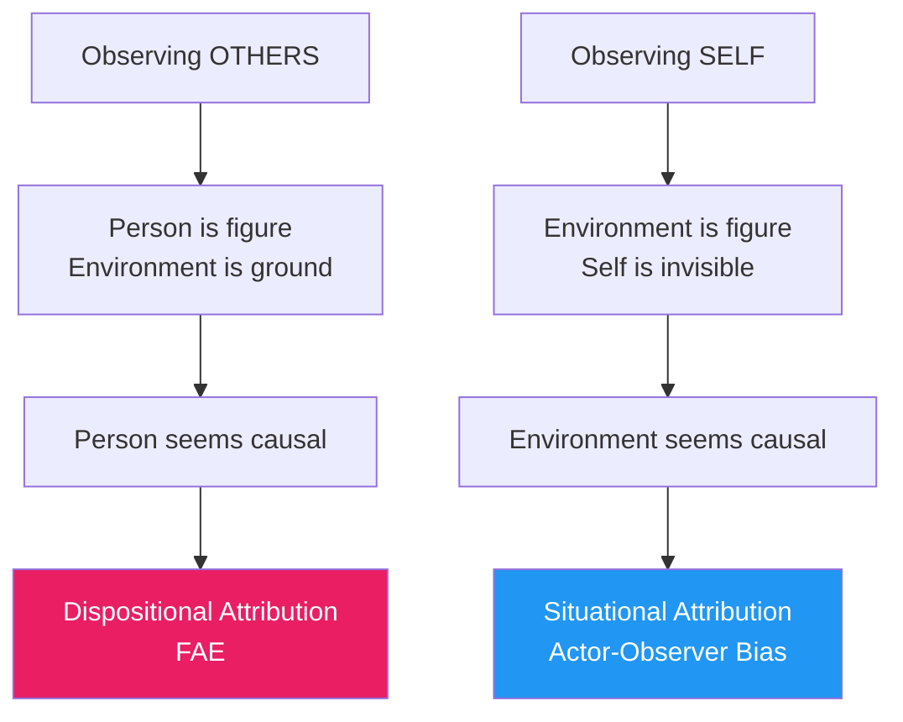
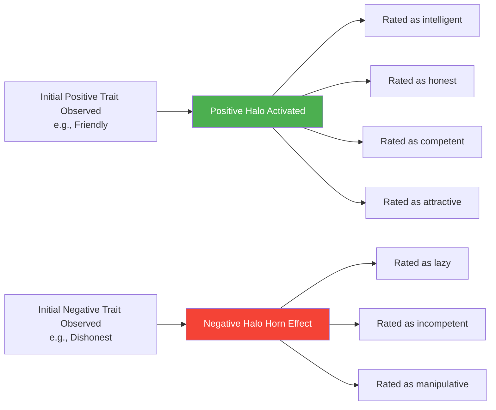

# Errors in Attribution: FAE, Halo Effect, and Positivity Bias

## Introduction: The Imperfect Social Scientist

Both Kelley's covariation model and Jones and Davis's correspondent inference theory paint a picture of human beings as thoughtful, systematic processors of social information — rational scientists who carefully weigh evidence before drawing conclusions. Yet everyday observation suggests something different: people regularly make systematic, predictable errors in how they explain behaviour.

Fritz Heider (1958) himself acknowledged that the "naive scientist" model had limitations — that despite our capacity for rational analysis, we are susceptible to characteristic biases. Subsequent research has identified several pervasive and consequential attribution errors that distort our understanding of ourselves and others.

Understanding these errors is not merely an academic exercise. The fundamental attribution error affects courtroom judgments, employer evaluations, and international diplomatic misunderstandings. Halo effects shape hiring decisions and political voting. Positivity bias colours our social communities. These biases have profound practical implications.

---

**Source PDFs:**
- 📄 [Block-1/Unit-2.pdf - Pages 33-36](/pdfs/MPC-004%20Advanced%20Social%20Psychology/Block-1/Unit-2.pdf)
- 📚 MPC-004 Advanced Social Psychology, IGNOU

---

## 2.1 The Fundamental Attribution Error (FAE)

The **fundamental attribution error** (FAE), also called the *actor-observer bias*, is the tendency for people, when evaluating others' behaviour, to:

- **Overestimate** the role of internal, dispositional factors (personality, character, ability)
- **Underestimate** the role of external, situational factors (circumstances, context, pressure)

The error is called "fundamental" because of its pervasiveness — it appears across cultures, domains, and contexts, and because it touches on a fundamental aspect of person perception: the tendency to see people as the primary cause of their own behaviour.

### The Classic Demonstration

Consider this scenario: You see someone acting friendly towards another person. Your immediate inclination is to conclude that they are a genuinely friendly, outgoing person. Yet that same person may actually consider themselves introverted and shy — attributing their friendliness to the particular social situation (the other person's gregarious behaviour drew them out).

**From the observer's perspective**: "They are friendly" (dispositional)  
**From the actor's perspective**: "The situation made me act friendly" (situational)

This asymmetry — observers attributing to disposition, actors attributing to situation — is the core pattern of the FAE.

### Why Does the FAE Occur?

Two major explanations have been proposed:

**1. Perceptual Salience Explanation:**
When we observe someone else's behaviour, our attention naturally focuses on *the person* — they are the figure against a static environmental background. The person moves, speaks, and acts; the environment is relatively fixed and unchanging. This perceptual salience makes the person feel like the "cause" of events.

When we observe *our own* behaviour, however, we cannot see ourselves easily — we look outward and see the environment. Environmental changes are most salient to us, making situational factors feel like the primary influence.

**2. Predictability and Control Explanation:**
A second account argues that the FAE serves a psychological function. When predicting and interacting effectively with other people, it is useful to think of them as having stable, predictable dispositions. "She is reliable" is more useful for future planning than "she happened to be on time yesterday due to circumstances."

For self-understanding, however, we benefit more from attending to environmental factors that we can potentially control or change. "I failed because of bad lighting in the exam hall" points to something that could be remedied; "I failed because I am stupid" does not.

### Real-World Consequences of the FAE

The FAE has profound practical implications:

| Domain | FAE Manifestation | Consequence |
|--------|-------------------|-------------|
| **Law** | Judges and juries attribute crime to criminal character | Harsher sentences; neglect of social/systemic causes |
| **Medicine** | Blaming patients for their illnesses | Underestimation of social determinants of health |
| **Management** | Attributing employee failure to laziness | Structural/systemic problems remain unaddressed |
| **Poverty** | Blaming the poor for their poverty | Neglect of economic and structural factors |
| **International Relations** | Enemy actions attributed to evil character | Diplomatic solutions seen as impossible |

### Cultural Variation in the FAE

Importantly, the FAE is not universal. Cross-cultural research (Choi, Nisbett & Norenzayan, 1999; Morris & Peng, 1994) has shown:

- **East Asian cultures** (China, Japan, Korea) show *weaker* FAE effects — they are more likely to consider situational context
- **Western individualist cultures** (USA, Western Europe) show *stronger* FAE effects — they focus more on individual traits
- **Indian psychology**: Collectivist framing leads to more situational attributions, though the FAE is still observed

This cultural variation is consistent with the idea that the FAE is a cognitive habit that is shaped by cultural values and norms, not a universal perceptual necessity.

:::tip Exam Alert
The FAE is one of the most frequently tested concepts in social psychology. Remember: observers → dispositional attribution; actors → situational attribution. This asymmetry IS the FAE.
:::

---

## 2.2 Halo Effects: Assuming Consistency Within a Person

The **halo effect** is the tendency for an initial positive (or negative) evaluation of a person on one dimension to spill over and influence evaluations on completely unrelated dimensions.

**Positive halo**: If we discover a person is friendly and clear-headed, we tend to assume they are also helpful, sociable, honest, and competent — even without any evidence for these latter traits.

**Negative halo** (sometimes called the "horn effect"): If we observe one negative trait (e.g., someone is dishonest), we tend to infer other negative characteristics (lazy, unreliable, manipulative).

### The Implicit Personality Theory

The halo effect reflects our **implicit personality theory** — our personal beliefs about which traits co-occur in individuals. We implicitly believe that good traits cluster together, and bad traits cluster together. This belief is only partially supported by evidence.

The implicit personality theory is:
- **Culturally shared**: Most people in a culture share similar beliefs about trait co-occurrence
- **Functionally useful**: It allows rapid person perception with limited information
- **Often inaccurate**: The actual correlations between traits are much lower than people assume

### Examples in Everyday Life

1. **Physical attractiveness halo**: Physically attractive people are rated as more intelligent, kind, and competent — the "what is beautiful is good" effect (Dion, Berscheid & Walster, 1972)

2. **Academic halo**: Students who write excellent essays on one topic are often assumed to be excellent on completely unrelated topics

3. **Celebrity halo**: Celebrities' opinions are weighted heavily on topics (politics, medicine, economics) where they have no expertise

4. **First impression halo in employment**: A candidate who performs well in the first 5 minutes of an interview tends to be rated positively on all dimensions, even where performance was average

### Minimising Halo Effects

Research suggests several strategies:
- Evaluate people on specific, concrete criteria before forming overall impressions
- Blind evaluation where possible (remove identifying information)
- Rate all candidates on one criterion before moving to the next
- Use structured assessment tools with pre-defined rating scales

---

## 2.3 Person-Positivity Bias: Looking for the Good in Others

A third systematic bias is the **person-positivity bias** — the general tendency to rate individual persons more positively than groups, institutions, or abstract categories.

Research across many domains has shown that:
- People receive more favourable ratings as individuals than when evaluated as members of groups
- Even when a group is made up of individually well-liked people, the group as a whole tends to receive less positive ratings than its individual members
- Public figures are generally evaluated positively

**Example**: College professors receive more favourable ratings when evaluated as individuals than when evaluated collectively as "college professors." And professors are rated more highly than their courses.

### David Sears's Explanation

David Sears (1982) proposed that the positivity bias reflects **perceived similarity**. When we evaluate another individual person (as opposed to a group), we tend to assume they are somewhat similar to ourselves. Since we generally have positive self-perceptions, this assumed similarity leads us to rate others positively.

When evaluating groups, this perceived similarity breaks down — a group contains diverse people, many of whom may not be like us, so the positivity effect weakens.

### The Pollyanna Principle

An alternative explanation invokes the **Pollyanna principle** — the general human tendency to perceive and remember positive information more readily than negative information. Applied to person perception, this principle suggests we simply find it easier (and more pleasant) to think well of others.

However, the positivity bias has clear limits — not every person or institution is rated favourably. Outgroup members (people from other social groups), authority figures who have behaved badly, and people associated with harm are often rated quite negatively.

---

## 2.4 Assumed Similarity Bias

Closely related to the positivity bias is the **assumed similarity bias** — the tendency to assume that others are similar to ourselves, especially in attitudes, beliefs, values, and personality characteristics.

This predisposition is:
- Most pronounced when obvious features like sex, age, ethnicity, or social class are shared
- Still present, though weaker, even when there are obvious differences between the evaluator and the person being evaluated

### Consequences of Assumed Similarity

**Negative consequences:**
- Leads to **misperception** of people who are actually quite different from us
- Can lead to poor decisions in diverse teams and multicultural contexts
- May lead to projecting our own biases onto others ("I know they think the same way I do")

**Positive consequences:**
- Can actually lead to *accurate* judgments when the other person is in fact similar to us — not because of insightful evaluation, but because of correct categorisation

This means that the assumed similarity bias can make some people appear to be excellent judges of character — not because they have special insight, but simply because they are evaluating people who genuinely share their characteristics.

---

## 🎯 Self-Assessment Questions

### Basic Level
1. Define the **fundamental attribution error**. Using concrete examples, explain why observers tend to attribute others' behaviour to dispositional causes while actors tend to attribute their own behaviour to situational causes.

2. What is the **halo effect**? Explain how **implicit personality theory** relates to the halo effect, and give three examples from real-world contexts (employment, education, media).

3. Describe the **person-positivity bias**. According to David Sears, why do we rate individuals more positively than groups? How does the Pollyanna principle offer an alternative explanation?

### Intermediate Level
4. Apply the **FAE** to explain a real-world social problem — for example, public attitudes toward poverty, criminal justice, or health behaviour. How does understanding the FAE suggest interventions that could change these attitudes?

5. The FAE is stronger in Western individualist cultures than in East Asian collectivist cultures. What does this tell us about the nature of the FAE? Is it a universal perceptual bias or a culturally specific cognitive habit? What are the implications for cross-cultural psychology?

6. How might **halo effects** affect the evaluation of students from marginalised groups? Design a research study to test whether a particular intervention (e.g., blind grading) reduces halo effects in academic assessment.

### Advanced Level
7. Compare and critically evaluate the two main explanations for the FAE — the **perceptual salience** explanation and the **predictability/control** explanation. Which do you find more convincing, and why? What evidence would distinguish between them?

8. The FAE, halo effect, positivity bias, and assumed similarity all represent systematic errors in social perception. Discuss how these biases might **interact** in real social situations. For example, how might the FAE and the halo effect combine to distort evaluation of a job candidate from a different cultural background?

---

## 🧠 Memory Aids

### The FHAS Checklist of Attribution Errors
- **F** — Fundamental Attribution Error (overestimate disposition, underestimate situation in others)
- **H** — Halo Effect (one good trait = all good traits)
- **A** — Assumed Similarity (project ourselves onto others)
- **S** — Self-serving bias / positivity (rate individuals positively, groups less so)

### FAE Quick Memory Hook
**"They did it because of WHO they are; I did it because of WHERE I was."**
- Others: Disposition (who they are)
- Self: Situation (where I was)

---

## 📚 External Resources

### Wikipedia
- [Fundamental attribution error](https://en.wikipedia.org/wiki/Fundamental_attribution_error)
- [Halo effect](https://en.wikipedia.org/wiki/Halo_effect)
- [Actor-observer asymmetry](https://en.wikipedia.org/wiki/Actor%E2%80%93observer_asymmetry)
- [Implicit personality theory](https://en.wikipedia.org/wiki/Implicit_personality_theory)
- [Pollyanna principle](https://en.wikipedia.org/wiki/Pollyanna_principle)

### Educational Videos
- 🎥 [The Fundamental Attribution Error](https://www.youtube.com/watch?v=smiEQg_lPkA) — Crash Course Psychology clip
- 🎥 [The Halo Effect Explained](https://www.youtube.com/watch?v=lcIBsFDQnzs) — practical examples
- 🎥 [Bias and Attribution in Social Psychology](https://www.youtube.com/watch?v=_-s5SbzLsJc)

### Research Papers (2020-2024)
- Gawronski, B. (2022). [Six lessons for a cogent science of implicit bias and its criticism](https://doi.org/10.1177/17456916211055684). *Perspectives on Psychological Science*, 17(6), 1667-1678.
- Moran, J. M., et al. (2021). [Cultural variation in the fundamental attribution error: A meta-analytic review](https://doi.org/10.1177/01461672211062816). *Personality and Social Psychology Bulletin*, 48(5).
- Lorenzo, G. L., Biesanz, J. C., & Human, L. J. (2020). [What is beautiful is good and more accurately understood: Physical attractiveness and accuracy in first impressions of personality](https://doi.org/10.1177/0956797609357019). *Psychological Science*.

### Foundational Research
- Ross, L. (1977). The intuitive psychologist and his shortcomings: Distortions in the attribution process. *Advances in Experimental Social Psychology*, 10, 173-220.
- Dion, K., Berscheid, E., & Walster, E. (1972). What is beautiful is good. *Journal of Personality and Social Psychology*, 24(3), 285-290.

---

## 🔗 Related Topics

- [Attribution Theory Foundations](/mpc-004/block-1/attribution-theory-kelley-jones-davis) — Kelley's covariation model and correspondent inference
- [Person Perception and Social Cognition](/mpc-004/block-1/person-perception-social-cognition) — Impression formation processes
- [Attribution Theory in Education](/mpc-004/block-1/attribution-education-self-perception) — Academic motivation and learned helplessness

---

> **Quick Summary:** Attribution errors are systematic biases that distort how we explain behaviour. The fundamental attribution error (FAE) leads observers to over-attribute others' behaviour to dispositional causes while explaining their own through situational factors. The halo effect causes one observed trait to colour evaluations of completely unrelated characteristics. The person-positivity bias reflects a general tendency to evaluate individuals more favourably than groups. The assumed similarity bias causes us to project our own characteristics onto others. These errors are pervasive, have real-world consequences, and show cultural variation — especially the FAE, which is weaker in collectivist cultures.
