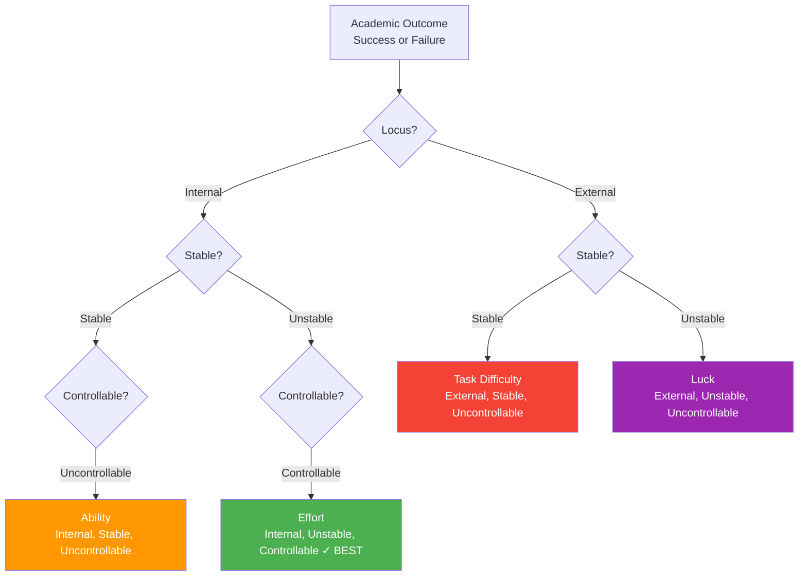
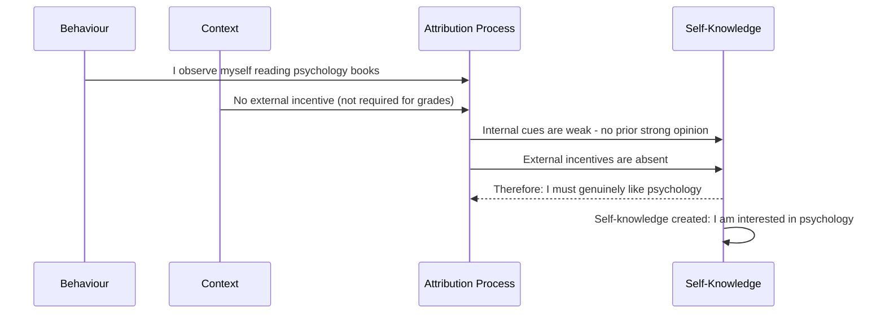

# Attribution in Education, Self-Perception Theory & Social Comparison

## Introduction: How We Understand Our Own Success and Failure

When students receive their exam results, a fascinating psychological drama unfolds. One student who failed thinks: "I failed because I'm just not smart enough" (ability attribution — internal, stable, uncontrollable). Another thinks: "I failed because the exam was unfair" (task difficulty — external, stable). A third thinks: "I failed because I didn't study enough this time" (effort — internal, unstable, controllable). And a fourth thinks: "I just had terrible luck with the questions" (luck — external, unstable).

These four students have had identical experiences — they all failed. But their attributions will drive wildly different future behaviours. The first may give up. The second may protest. The third may work harder. The fourth may try again, hoping for better luck. Understanding this process — how attributions determine motivation and behaviour — is one of the most practically important areas in social psychology.

This unit covers three interconnected topics: (1) **Weiner's attribution theory** applied to education and motivation, (2) understanding one's own behaviour through **social comparison** and **emotion recognition**, and (3) **Bem's self-perception theory** and its relationship to **cognitive dissonance**.

---

**Source PDFs:**
- 📄 [Block-1/Unit-2.pdf - Pages 36-44](/pdfs/MPC-004%20Advanced%20Social%20Psychology/Block-1/Unit-2.pdf)
- 📚 MPC-004 Advanced Social Psychology, IGNOU

---

## 2.1 Weiner's Attribution Theory and Academic Motivation

Bernard Weiner (1980, 1992) developed what is probably the most influential attribution theory with implications for academic motivation. Weiner argued that people are strongly motivated by the need to **feel good about themselves** and that their attributions for success and failure are shaped by this need.

### The Three Dimensions of Attributions

Weiner proposed that attributions can be classified along three independent dimensions:

**Dimension 1: Locus of Control (Internal vs. External)**
- *Internal*: The cause lies within the person (my ability, my effort)
- *External*: The cause lies outside the person (task difficulty, luck, teacher quality)

**Dimension 2: Stability (Stable vs. Unstable)**
- *Stable*: The cause is relatively permanent and unlikely to change (ability, task difficulty)
- *Unstable*: The cause varies from situation to situation (effort, luck, mood)

**Dimension 3: Controllability (Controllable vs. Uncontrollable)**
- *Controllable*: The person can deliberately change the factor (effort, study strategies)
- *Uncontrollable*: The person cannot easily change the factor (basic intelligence, weather, illness)

### The Four Attribution Factors in Education

| Factor | Locus | Stability | Controllability | Effect on Motivation |
|--------|-------|-----------|-----------------|---------------------|
| **Ability** | Internal | Stable | Uncontrollable | Can lead to helplessness if low |
| **Effort** | Internal | Unstable | Controllable | Most adaptive — can always try harder |
| **Task Difficulty** | External | Stable | Uncontrollable | Little motivation to change |
| **Luck** | External | Unstable | Uncontrollable | Persistent trying — hoping for better luck |

### Optimal Attribution Patterns for Academic Motivation

Weiner's research identified the attribution patterns most likely to promote sustained academic motivation:

**For Success:**
- Attributing success to **ability** (internal, stable): Builds confidence and sense of competence
- Attributing success to **effort** (internal, unstable, controllable): Best for motivation — "I succeeded because I worked hard"
- Ideal: "I am a competent person AND I worked hard" — combines both

**For Failure:**
- Attributing failure to **lack of effort** (internal, unstable, controllable): Most adaptive — "I can do better by trying harder next time"
- Avoid attributing failure to **lack of ability** (internal, stable, uncontrollable): Leads to learned helplessness
- Avoid attributing failure to **task difficulty** (external, stable, uncontrollable): Leads to passive acceptance

### Weiner's Guidelines for Educators (10 Principles)

The PDF presents 10 evidence-based guidelines for teachers based on attribution theory:

1. **Build competence beliefs**: Students must sincerely believe they are capable. Help them attribute occasional failures to controllable, unstable factors.

2. **Define effort correctly**: Effort means effective academic learning time — not simply trying harder with ineffective strategies. Teach students what productive effort looks like.

3. **Avoid ability attributions for failure**: When students fail after genuine effort, avoid attributing failure to lack of ability. This is the most damaging attribution.

4. **Structure tasks for success through effort**: Arrange tasks so that hard-working students can perceive themselves as successful.

5. **Help students develop an internal locus of control**: Research shows that successful students tend to believe their own behaviour (not external circumstances) determines outcomes.

6. **Minimise excessive competition**: Competitive grading systems reduce motivation for students who cannot win — no amount of effort guarantees success against a more talented competitor.

7. **Evaluate effort partly**: Grading systems should give some weight to effort, not only outcomes, to reinforce the effort-success connection.

8. **Address learned helplessness actively**: Students who believe they lack ability will dismiss their successes as "just luck." Changing this requires sustained effort to change self-concept.

9. **Encourage learning goals over performance goals**: Focus on mastery and competence, not on looking good in comparison to others.

10. **Model productive attributions**: Teachers should model attributing their own teaching successes and challenges to effort and strategy, not to fixed ability.

---

## 2.2 Additional Concepts in Attribution Theory

### Learning Goals vs. Performance Goals

**Learning goals** (also called *mastery goals*): Set by individuals who seek to increase their competence. People with learning goals tend to:
- Seek challenging tasks that will stretch their abilities
- Respond to failure by increasing effort
- Focus on improvement over time

**Performance goals**: Set by individuals who seek to gain favourable judgments or avoid unfavourable ones from others. People with performance goals tend to:
- Avoid challenges where failure is possible
- Respond to failure with feelings of learned helplessness and self-handicapping
- Compare themselves to others rather than to their own past performance

Educational research consistently shows that learning goals lead to better long-term academic outcomes.

### Learned Helplessness

**Learned helplessness** is the expectation, based on repeated past experience, that one's actions cannot possibly lead to success. It is the psychological state in which a person has learned that effort does not pay off.

Seligman and Maier (1967) first demonstrated learned helplessness in animals, but later research (Abramson, Seligman & Teasdale, 1978) developed an attributional model:
- Helplessness occurs when failures are attributed to **internal, stable, global** causes ("I am incapable")
- It is maintained by patterns that resist disconfirmation
- It is associated with depression, reduced motivation, and passive behaviour

In educational settings, learned helplessness develops when:
- Students fail repeatedly despite genuine effort
- Teachers attribute failures to ability rather than effort or strategy
- Grading systems make success impossible no matter how hard one works

### Self-Handicapping

**Self-handicapping** occurs when learners deliberately create impediments that make good performance *less likely* — as a protective strategy for self-esteem.

**Examples of self-handicapping:**
- Not studying before an important exam
- Staying out late the night before a performance
- Claiming to be ill before a presentation
- Engaging in alcohol or drug use before evaluation

**The psychological logic**: Self-handicapping protects self-esteem either way:
- If you *fail*: "I failed because of the impediment, not because I'm incompetent"
- If you *succeed*: "I succeeded *despite* the impediment — I must be really capable!"

Self-handicapping most commonly occurs among people with high ego-involvement and fear of failure. It is particularly prevalent during adolescence. Cultural/subcultural pressures can also promote self-handicapping — for example, peer cultures that equate studying hard with "uncool" conformity.

### Expectancy-Valence Models

**Expectancy-valence models** (Atkinson, 1964) propose that motivation is a product of:
- **Expectancy**: The person's estimation of the likelihood of success
- **Valence**: The value or importance of the goal

Importantly, motivation is not always highest when success is most likely. Research shows that motivation peaks at *moderate* probability of success (around 50%), not at very high or very low probability. An easily achieved goal offers little challenge; an impossible goal offers no hope. The sweet spot — where effort feels meaningful and success is possible but not certain — produces the highest motivation.

---

## 2.3 Social Comparison: Using Others to Understand Oneself

Attribution is not only about how we explain others' behaviour — it also shapes how we understand ourselves. Leon Festinger (1954) proposed the fundamental theory of **social comparison**: people have a basic drive to evaluate their own opinions and abilities by comparing themselves to others.

### Why Do We Need Social Comparison?

For many questions about ourselves, there is no objective standard. You can measure the distance from home to town with an odometer. But how do you measure how good a pianist you are? How funny? How intelligent? For these questions, we turn to **social reality** — understanding derived from how others think, feel, and perceive the world.

### Who Do We Compare With?

Festinger argued that we prefer to compare ourselves with people who are *similar* to us:
- Comparing with very superior others is discouraging and uninformative
- Comparing with very inferior others provides false comfort
- Similar others provide the most useful diagnostic information

In practice, people compare with:
- Peers (same age, similar background)
- Colleagues (same level and domain)
- Close friends (shared history and context)

### Types of Social Comparison

Research since Festinger has identified several distinct comparison directions:

**Upward comparison** (comparing to better-off others):
- Can inspire and motivate
- Can also deflate self-esteem and create envy

**Downward comparison** (comparing to worse-off others):
- Boosts self-esteem temporarily
- Can reduce motivation to improve

**Lateral comparison** (comparing to similar others):
- Most diagnostic for self-evaluation
- Can create healthy competition

### Social Comparison in Indian Context

In the Indian educational context, social comparison is particularly powerful and complex:
- Joint family systems create constant comparison among siblings and cousins
- Highly competitive entrance examinations (JEE, NEET, UPSC) foster intense social comparison
- Caste and class hierarchies shape who is considered a "relevant other" for comparison
- Social media has dramatically intensified social comparison, particularly among adolescents

---

## 2.4 Bem's Self-Perception Theory

Daryl Bem's (1972) **self-perception theory** offers a radical account of how people come to know their own attitudes, emotions, and beliefs:

> *"Individuals come to know their own attitudes, emotions and internal states by inferring them from observations of their own behaviour and circumstances in which they occur. When internal cues are weak, ambiguous, or uninterpretable, the individual is in the same position as the outside observer."* — Bem (1972)

### The Two Core Claims

**Claim 1**: People come to know their own attitudes and beliefs by *observing their own behaviour* — just as they would observe someone else's behaviour.

- A student who observes that they constantly read psychology books infers: "I must be interested in psychology"
- A person who notices they always choose vegetarian food infers: "I value health and animal welfare"

**Claim 2**: When internal cues (prior beliefs, feelings) are *weak or ambiguous*, people rely on their behaviour as the primary evidence for their inner states.

If a person has no strong prior opinion about jazz music, and they notice they frequently seek out jazz concerts and tap their feet when jazz plays, they will conclude: "I like jazz." This conclusion is not based on any pre-existing attitude — it's *constructed* from the behavioural observation.

### The Overjustification Effect

One of the most important applications of self-perception theory is the **overjustification effect**: when people who intrinsically enjoy an activity are given external rewards for doing it, their intrinsic motivation decreases.

The self-perception mechanism: When you add an external reward (e.g., paying children to read), they may observe their own behaviour and now attribute it to the reward: "I'm reading because they're paying me." This undermines the intrinsic attribution: "I read because I love books." When the reward is removed, the behaviour often decreases below its pre-reward baseline.

This has enormous implications for educational practice: excessive reliance on grades, prizes, and external incentives may undermine the intrinsic love of learning.

### Self-Perception vs. Cognitive Dissonance Theory

Bem's theory was developed partly as an alternative to the more established **cognitive dissonance theory** (Festinger, 1957). Understanding their similarities and differences is important:

| Feature | Self-Perception Theory (Bem) | Cognitive Dissonance Theory (Festinger) |
|---------|------------------------------|------------------------------------------|
| **Core mechanism** | Observing behaviour and inferring attitude | Motivational tension between inconsistent beliefs |
| **Motivational state required?** | No — purely inferential | Yes — dissonance is aversive; reduction is motivating |
| **When does it apply?** | When prior attitudes are weak/ambiguous | When prior attitudes are clear and conflict with behaviour |
| **Prior belief required?** | No — creates new knowledge | Yes — adjusts existing knowledge |
| **Type of change** | Creates new self-knowledge | Changes existing self-knowledge |

The resolution of this debate (Fazio et al., 1977; Zanna & Cooper, 1974) suggests:
- **Self-perception theory** best explains attitude formation in domains where people have no strong prior opinion
- **Cognitive dissonance** best explains attitude change when people act contrary to strong, existing beliefs

Both theories have been substantially supported by research, and they are now seen as complementary rather than competing.

---

## 🎯 Self-Assessment Questions

### Basic Level
1. Describe Weiner's **three dimensions** of attribution (locus, stability, controllability). Using the four factors of ability, effort, task difficulty, and luck, place each on these dimensions and explain the implications for academic motivation.

2. Define **learned helplessness** and **self-handicapping**. How does each protect (or fail to protect) a student's sense of self-competence? What attribution patterns underlie each phenomenon?

3. Explain **Bem's self-perception theory** using the two core claims. Give an original example (not from the text) of how a person might develop self-knowledge about their own personality through self-observation.

### Intermediate Level
4. Apply Weiner's **10 educational guidelines** to analyse the following scenario: A student who has consistently believed they are "bad at mathematics" is failing despite working hard. What attributional interventions would you recommend, and what outcomes would you expect?

5. Compare **learning goals** and **performance goals**. Using attribution theory, explain why performance goals are more likely to lead to learned helplessness and self-handicapping. Design a classroom environment that fosters learning goals.

6. Describe the **social comparison** theory of Festinger. Explain how social media has changed the landscape of social comparison for adolescents, and what attributional consequences you would predict.

### Advanced Level
7. The debate between **self-perception theory** and **cognitive dissonance theory** was eventually resolved by suggesting they apply to different conditions. Describe these conditions and explain how each theory's mechanism differs. What does this synthesis tell us about the nature of self-knowledge?

8. Self-handicapping is sometimes described as "rational irrationality" — a behaviour that is psychologically logical but practically harmful. Discuss this paradox using attribution theory, and explain how an educator might intervene to reduce self-handicapping behaviour.

---

## 🧠 Memory Aids

### ABILITIES Framework for Weiner's Dimensions

**AILS** — Attribution Influences Life Success:
- **A**bility (internal, stable, uncontrollable) — most damaging if attributed for failure
- **I**nner effort (internal, unstable, controllable) — BEST attribution for both success and failure
- **L**uck (external, unstable, uncontrollable) — benign but not empowering
- **S**tructure of task difficulty (external, stable, uncontrollable) — disempowering

### Bem's Self-Perception: The Mirror Test
- When your internal mirror is *foggy* (weak prior beliefs) → look at your behaviour as if from outside
- Your actions *are* your attitudes when internal cues are absent

---

## 📚 External Resources

### Wikipedia
- [Attribution theory](https://en.wikipedia.org/wiki/Attribution_theory)
- [Learned helplessness](https://en.wikipedia.org/wiki/Learned_helplessness)
- [Self-handicapping](https://en.wikipedia.org/wiki/Self-handicapping)
- [Self-perception theory](https://en.wikipedia.org/wiki/Self-perception_theory)
- [Social comparison theory](https://en.wikipedia.org/wiki/Social_comparison_theory)
- [Overjustification effect](https://en.wikipedia.org/wiki/Overjustification_effect)

### Educational Videos
- 🎥 [Weiner's Attribution Theory and Motivation](https://www.youtube.com/watch?v=iDxeq1PYnr8) — clear explanation with examples
- 🎥 [Bem's Self-Perception Theory](https://www.youtube.com/watch?v=8rnpMC2V7hg) — social psychology explainer
- 🎥 [Learned Helplessness: Seligman's Dogs](https://www.youtube.com/watch?v=Z4kh3l4KY5E) — classic research explained

### Research Papers (2020-2024)
- Murayama, K., Pekrun, R., & Fiedler, K. (2022). [Expectancy-value theory and academic outcomes](https://doi.org/10.1037/bul0000359). *Psychological Bulletin*, 148(7-8), 512-546.
- Wirthwein, L., Sparfeldt, J. R., & Steinmayr, R. (2023). [Achievement goals revisited: A meta-analysis](https://doi.org/10.1016/j.edurev.2023.100517). *Educational Research Review*, 39, 100517.
- Sisk, V. F., et al. (2021). [To what extent and under which circumstances are growth mindsets important? A systematic review and meta-analysis](https://doi.org/10.1177/0956797618797298). *Psychological Science*.
- Levy, M. D., et al. (2024). [Self-handicapping in educational settings: A review and directions for future research](https://doi.org/10.1016/j.edurev.2024.100570). *Educational Research Review*.

### Foundational Works
- Weiner, B. (1992). *Human motivation: Metaphors, theories, and research*. Sage.
- Bem, D. J. (1972). Self-perception theory. *Advances in Experimental Social Psychology*, 6, 1-62.
- Festinger, L. (1954). A theory of social comparison processes. *Human Relations*, 7(2), 117-140.
- Seligman, M. E. P., & Maier, S. F. (1967). Failure to escape traumatic shock. *Journal of Experimental Psychology*, 74(1), 1-9.

---

## 🔗 Related Topics

- [Person Perception and Social Cognition](/mpc-004/block-1/person-perception-social-cognition) — Impression formation and schemas
- [Attribution Theory: Kelley and Jones-Davis](/mpc-004/block-1/attribution-theory-kelley-jones-davis) — Foundational attribution models
- [Attribution Errors and Biases](/mpc-004/block-1/attribution-errors-biases) — FAE, halo effect, positivity bias

---

> **Quick Summary:** Weiner's attribution theory shows that students' explanations for success and failure powerfully determine their future motivation. Effort attributions (internal, unstable, controllable) are most adaptive; ability attributions for failure lead to learned helplessness. Self-handicapping protects self-esteem by creating convenient excuses, but at the cost of actual performance. Social comparison theory shows we evaluate our abilities against similar others. Bem's self-perception theory argues that when internal cues are weak, people infer their attitudes from their own behaviour — just as they would infer another person's attitudes. This theory complements cognitive dissonance theory, which applies when clear prior beliefs conflict with freely chosen behaviour.
