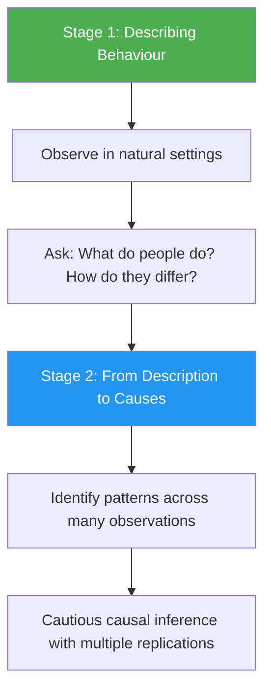
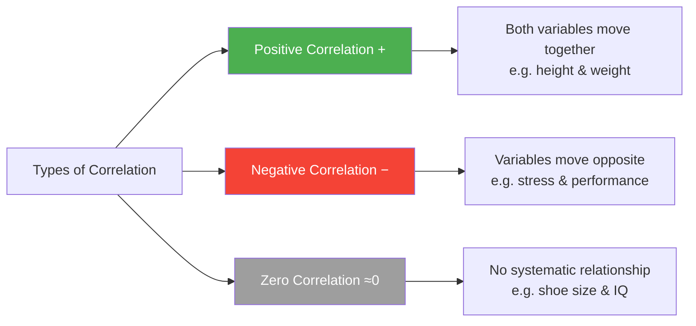

import Mermaid from '@theme/Mermaid';

# Research Methods in Social Psychology: Scientific Approach and Observational Methods

> *"The essence of the research should not be lost for the sake of scientific rigor."* — Andreyeva (1990)

Research methods are the backbone of social psychology. They transform everyday observations and intuitions about human behaviour into systematic, verifiable knowledge. Without rigorous methods, social psychology would remain a collection of folk wisdom—interesting but unverifiable.

---

**Source PDFs**:
- 📄 [Block-1/Unit-3.pdf - Pages 47-67](/pdfs/MPC-004%20Advanced%20Social%20Psychology/Block-1/Unit-3.pdf)
- 📚 MPC-004 Advanced Social Psychology

---

## 🎯 Learning Objectives

By the end of this unit, you will be able to:
- Define social psychology research and its methodology
- Distinguish between common sense and scientific explanations
- Differentiate between theoretical and applied research
- Understand the observational and correlational methods in depth
- Identify the limitations of each method

---

## 1. The Scientific Foundation: Why Methods Matter

### 1.1 What Are Research Methods?

Procedures for gathering information in any discipline are known as **methods**. The term **methodology** refers to all aspects of the implementation of methods — from conceptualising a research question to analysing the data and drawing conclusions.

Methodology in social psychology involves developing procedures for making observations that serve as building blocks for theories and generalisations about social behaviour.

### 1.2 Social Psychology as an Empirical Science

As a scientific discipline, social psychology embraces three core operations:

```
1. Careful collection of observations or data
2. Ordered integration of observations into hypotheses and theories
3. Testing hypotheses through predictions about future observations
```

Each step is indispensable for social psychology to achieve maturity as an empirical science. **Empiricism** advocates collection and evaluation of data guided by induction from observations rather than deduction from theoretical constructs alone.

:::info Key Concept: Induction vs. Deduction
**Induction** = reasoning from specific cases to general principles (e.g., observing 100 individuals and generalising to a population)

**Deduction** = reasoning from general principles to specific predictions (e.g., applying a theory to predict an individual's behaviour)

The experimental method is fundamentally **inductive** — conclusions about populations are drawn from observations of individuals and small groups.
:::

### 1.3 Problems with Non-Scientific Approaches

Social psychologists are acutely aware of the limitations of everyday reasoning:

**1. Reliance on Authority**
The validity of statements is often verified by relying on authorities. But experts can disagree, and authorities can be wrong. Galileo was considered an outcast by the scientific authorities of his time.

**2. Common Sense Fallibility**
Common sense is based on widely shared experiences, but it can be systematically wrong. Berkowitz (1986) famously illustrated this: common sense says a heavier ball dropped from a building will fall faster than a lighter one — but Stevin and Galileo proved this wrong in the late 16th century. Both balls fall at the same rate (ignoring air resistance).

**3. Distorted Perceptions**
Our perceptions of complex and ambiguous situations are coloured by preconceptions. Robert Rosenthal (1966) documented how even great scientists like Newton failed to see certain lines in the solar spectrum because his theory didn't anticipate them — "our assumptions define and limit what we see."

**4. The Replication Problem**
The validity of an abstract statement increases when independent researchers can reproduce the same observations. Reproducibility is the cornerstone of science, but it poses challenges in social psychology research.

---

## 2. Theoretical vs. Applied Research

Social psychology pursues two interconnected types of research:

| Dimension | Theoretical Research | Applied Research |
|-----------|---------------------|-----------------|
| **Aim** | Build basic knowledge about social world | Provide solutions to real-world problems |
| **Setting** | Mostly laboratories | Natural field settings |
| **Method** | Predominantly experimental | Varied, context-dependent |
| **Output** | Theory development | Practical interventions |

> *"There is nothing so practical as a good theory."* — Kurt Lewin (1951)

Despite their differences, theoretical and applied research are deeply intertwined. Even the most applied studies have implications for theory; and theories suggest new approaches to social problems.

---

## 3. Observational Method

### 3.1 What Is Observation?

Observation is one of the oldest methods in social psychology. It involves **observing phenomena under study as they occur naturally** (Hilgard and Atkinson, 2003). Different researchers use different terms:
- **Systematic observation** (Morgan and King)
- **Direct observation** (Hilgard and Atkinson)
- **Field study** (Feldman)

The method plays a crucial role in collecting data on **overt behaviour** and the actions of individuals.

### 3.2 Key Questions in Observational Research

When designing an observational study, researchers must address:
- **What to observe?** — which behaviours are relevant?
- **How to record observations?** — categories, coding, timing
- **How to structure observation?** — formal or informal?
- **What are the units of observation?** — individual acts, sequences, durations?
- **What is the time interval?** — continuous or sampled?

### 3.3 Two Stages of Observational Method



**Stage 1 — Describing Behaviour**: Observation starts in natural settings relevant to the research question. What do people do? Can behaviours be classified systematically? How do people differ?

**Stage 2 — From Description to Causes**: Once patterns are identified, researchers carefully examine results across many observations to infer causes. This requires caution because:
- A behaviour may have many causes
- The temporal precedence of an event does not establish it as the cause
- Establishing likely causes of complex behaviour requires multiple observations

### 3.4 Types of Observation

#### Participant Observation
The researcher **joins and participates** in the ongoing activities of the people being studied. A classic example is Festinger, Riecken, and Schachter's (1956) study of cognitive dissonance — researchers joined a religious sect that predicted a catastrophic flood on a specific date, observing what happened when the prediction failed to materialise.

#### Non-Participant Observation
**Observers record people's behaviour without participating**. The researcher remains detached, simply watching and recording.

#### Structured/Formal Observation
Uses a **predetermined category system** for scoring behaviours. Bales' (1950) Interaction Process Analysis (IPA) is a well-known example — verbal exchanges in groups are coded into 12 categories to determine leadership patterns.

### 3.5 Advantages and Limitations of Observational Method

| Advantages | Limitations |
|------------|-------------|
| Can be made without disturbing naturally occurring behaviour | Some behaviours are impossible to observe directly (past events, private contexts) |
| People may be absorbed in their activity even when observed | Cannot directly assess perceptions, cognitions, or evaluations |
| Captures ecological validity — real-world context | Formal coding may oversimplify complex behaviour |
| Rich descriptive data | Risk of observer bias and reactivity |

### 3.6 Reactivity

**Reactivity** refers to observers' tendency to evoke reactive behaviour in those being observed — people change their behaviour when they know they're being watched. This is also known as the **Hawthorne Effect** (from studies at the Hawthorne Works in the 1920s-30s, where workers improved performance simply because they were observed).

---

## 4. Correlational Method

### 4.1 Definition

> *"Correlation is a relationship between two (or more) variables such that systematic increase or decrease in the magnitude of one variable is accompanied by systematic increase or decrease in the magnitude of the others."* — Reber & Reber (2001)

Correlational investigations ask: **What is the relationship among variables of interest?**

### 4.2 Types of Correlation



The **correlation coefficient** ranges from **+1.00** (perfect positive) to **−1.00** (perfect negative). The closer to ±1.00, the stronger the relationship.

### 4.3 The Classic Example: TV Violence and Aggression

A correlational study comparing the aggressive content of television programs watched by individuals with their aggressive behaviour might show a positive correlation. But this does **not** mean watching violent TV *causes* aggression. Three explanations are equally plausible:
1. Violent TV causes aggression
2. Aggressive people seek out violent content
3. A third variable (e.g., aggressive family environment) causes both

### 4.4 Comparing Correlational vs. Experimental Research

| Attribute | Correlational Research | Experimental Research |
|-----------|----------------------|----------------------|
| Independent Variable | Varies naturally | Controlled by researcher |
| Unambiguous causality | No | Yes |
| Exploratory nature | Often | Usually not |
| Random assignment | No | Yes |
| Theory testing | Often | Usually |
| Tests many relationships | Usually | Usually not |

---

## 5. Methods of Data Collection vs. Analysis

Social psychological research methods can be organised into two categories:

**Methods of Data Collection:**
- Observations
- Study of documents
- Questionnaires
- Interviews
- Testing
- Experiments

**Methods of Analysis:**
- Statistical: correlational, factor analysis
- Logical/theoretical: typology construction, various forms of explanation

---

## 6. Real-World Applications

### In Indian Psychology Research

Observational and correlational methods are particularly important in Indian cultural contexts where experimental control may be difficult to achieve:

- **Studying caste-based discrimination**: Researchers cannot randomly assign people to caste groups; correlational studies measure associations between caste variables and outcomes
- **Community mental health**: Observational ethnographic methods capture help-seeking behaviour in diverse cultural contexts
- **Educational settings**: Systematic observation of classroom dynamics in government schools has shaped policy on teacher-student ratios and pedagogical approaches

### Clinical Applications

In clinical psychology, observational methods are foundational:
- Behavioural assessment involves systematic observation of client behaviour
- Structured observation tools like the Autism Diagnostic Observation Schedule (ADOS) follow Bales-style coding systems
- Naturalistic observation in psychiatric wards reveals treatment-seeking patterns

---

## 🧠 Memory Aids

### The 3 Scientific Operations — "COT"
- **C**ollect observations
- **O**rganise into hypotheses/theories
- **T**est predictions

### Correlation ≠ Causation — "The Third Variable Trap"
Remember: whenever two things correlate, ask: **"What else could explain both?"**

Classic trap: Ice cream sales and drowning deaths both rise in summer — but ice cream doesn't cause drowning; **summer heat** causes both.

### Observation Types — "PNF"
- **P**articipant (researcher joins in)
- **N**on-participant (researcher watches from outside)
- **F**ormal/structured (predetermined coding categories)

---

## 📚 External Resources

### Wikipedia Articles
- [Research methods in psychology](https://en.wikipedia.org/wiki/Research_methods_in_psychology) — Overview of psychological research methodology
- [Participant observation](https://en.wikipedia.org/wiki/Participant_observation) — History and applications of participant observation
- [Correlation and dependence](https://en.wikipedia.org/wiki/Correlation_and_dependence) — Statistical foundations of correlational research
- [Hawthorne effect](https://en.wikipedia.org/wiki/Hawthorne_effect) — Reactivity and observer effects
- [Ecological validity](https://en.wikipedia.org/wiki/Ecological_validity) — Research validity in natural contexts

### Educational Videos
- 🎥 [Research Methods in Psychology - Crash Course](https://www.youtube.com/watch?v=a-oWa2CS8jk) — Excellent overview of psychological research methods
- 🎥 [Correlation vs. Causation - Khan Academy](https://www.youtube.com/watch?v=ROpbdO-gRUo) — Visual explanation of the correlation-causation distinction
- 🎥 [Naturalistic Observation - Social Psychology](https://www.youtube.com/watch?v=4PuYLlRNKaU) — Observational methods in practice

### Research Papers
- Rosenthal, R. (1966). Experimenter effects in behavioral research. *Appleton-Century-Crofts*. — Classic analysis of observer bias
- Festinger, L., Riecken, H., & Schachter, S. (1956). *When prophecy fails*. University of Minnesota Press — Foundational participant observation study
- Podsakoff, P. M. et al. (2022). Common method biases in behavioral research: A critical review. *Journal of Applied Psychology*. — Contemporary assessment of methodological biases
- Judd, C. M., & Kenny, D. A. (2020). Estimating the effects of social interventions. *Cambridge University Press* — Modern perspectives on causal inference in social psychology
- Shadish, W. R., Cook, T. D., & Campbell, D. T. (2022). Experimental and quasi-experimental designs for generalised causal inference. *Houghton Mifflin* — Comprehensive methodology reference

---

## ✅ Self-Assessment Questions

### Level 1: Knowledge (Recall)
1. What are the three core operations of social psychology as an empirical science?
2. What does the correlation coefficient of +1.00 indicate?
3. Distinguish between participant and non-participant observation.

### Level 2: Understanding (Comprehension)
4. Why is the finding of a correlation between two variables insufficient to establish a causal relationship? Illustrate with the television violence example from the unit.
5. Compare and contrast theoretical and applied research in social psychology. Why did Kurt Lewin say "there is nothing so practical as a good theory"?
6. Explain the "distorted perceptions" problem in social psychology research. How did this affect even Isaac Newton?

### Level 3: Application (Critical Thinking)
7. A researcher finds a strong positive correlation between social media use and depression among teenagers in India. What are three possible causal explanations for this finding? How would you design a study to identify the true cause?
8. You want to study how students behave during group work in a classroom. Compare how you would conduct (a) formal structured observation and (b) informal participant observation. What are the trade-offs?
9. A sociologist claims that crime rates increase when ice cream sales rise, therefore ice cream consumption causes crime. Identify the logical error and propose a more likely explanation.

### Level 4: Synthesis (Exam-Oriented)
10. "Common sense is often more misleading than helpful in social psychology." Critically evaluate this statement using examples from the unit and your own knowledge.

---

## 🔗 Cross-References

- For attribution theory (cognitive aspects): [Attribution Theory and Errors](/mpc-004/block-1/attribution-theory-kelley-jones-davis)
- For person perception research context: [Person Perception and Social Cognition](/mpc-004/block-1/person-perception-social-cognition)
- For research methods in personality assessment: [Personality Assessment Methods](/mpc-003/block-1/personality-assessment-methods)
- For statistical analysis methods: MPC-006 Statistics in Psychology
