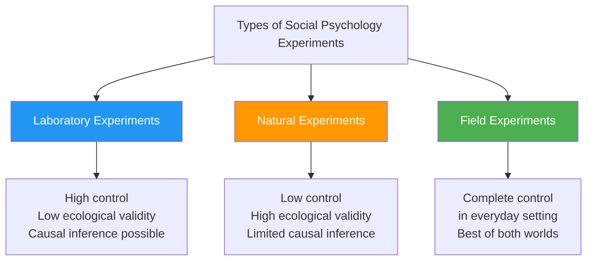
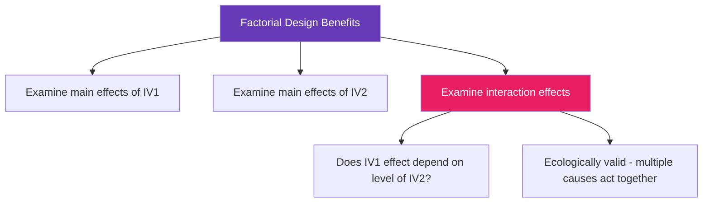
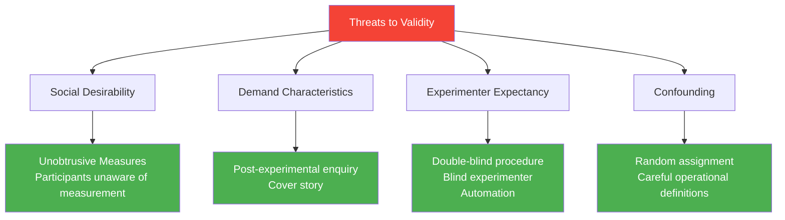

import Mermaid from '@theme/Mermaid';

# The Experimental Method in Social Psychology: Designs and Validity

> *"Experimentation has been the dominant research method in social psychology, mainly because it is without equal as a method for testing theories that predict causal relationships between variables."*

The experimental method represents social psychology's most powerful tool for understanding why people behave as they do. Unlike observation or correlation, the experiment can establish **causation** — a crucial distinction in science.

---

**Source PDFs**:
- 📄 [Block-1/Unit-3.pdf - Pages 54-60](/pdfs/MPC-004%20Advanced%20Social%20Psychology/Block-1/Unit-3.pdf)
- 📚 MPC-004 Advanced Social Psychology

---

## 🎯 Learning Objectives

After studying this section, you will be able to:
- Define the experimental method and its core terminology
- Distinguish between laboratory and field experiments
- Compare true experiments with quasi-experiments
- Explain different experimental designs
- Identify threats to validity and strategies to minimise them

---

## 1. The Experimental Method: Core Concepts

### 1.1 What Is an Experiment?

An experiment is **a well-controlled test of hypotheses about cause and effect**. The goal is to observe what happens to a phenomenon when the researcher deliberately modifies some feature of the environment — if variable A is changed, does variable B change too?

### 1.2 Essential Terminology

| Term | Definition |
|------|------------|
| **Experiment** | A well-controlled test of a hypothesis about cause and effect |
| **Hypothesis** | A statement about cause and effect that can be tested |
| **Variable** | Something that can occur with different values and can be measured |
| **Independent Variable (IV)** | The hypothesised cause; precisely controlled by the experimenter |
| **Dependent Variable (DV)** | The hypothesised effect; varies depending on the IV |
| **Experimental Group** | Group in which the hypothesised cause (IV) is present |
| **Control Group** | Group in which the hypothesised cause is absent |
| **Statistics** | Mathematical techniques for drawing generalisations from sample data |
| **Measurement** | A system for assigning numbers to values of variables |
| **Random Assignment** | Assigning participants to groups so each has an equal chance |

*Source: Atkinson & Hilgard et al. (2003) Introduction to Psychology, 14th edition*

---

## 2. Types of Experiments in Social Psychology

### 2.1 Laboratory vs. Field Experiments



**Laboratory Experiments**: Conducted in controlled settings. The researcher manipulates the independent variable precisely.

**Natural Experiments**: Conducted in everyday life settings. Less control, but higher ecological realism.

**Field Experiments**: True randomised experiments conducted in everyday settings — the gold standard combining control with real-world applicability.

### 2.2 True Randomised Experiments vs. Quasi-Experiments

| Attribute | True Experiment | Quasi-Experiment |
|-----------|----------------|-----------------|
| Representativeness of data | Low | Low |
| Realism of setting | Low | High |
| Control over setting | High | Medium |
| Random assignment | Yes | No |
| Causal inference | Strong | Weaker |

---

## 3. Quasi-Experimental Method

### 3.1 Definition

A **quasi-experiment** is conducted in a natural, everyday life setting, over which the researcher has **less than complete control**. The lack of control arises precisely because it is an everyday setting — the researcher cannot randomly assign participants to conditions.

### 3.2 Illustrative Comparison: The TV Violence Studies

**True Experiment (Liebert and Baron, 1972):**
- Children **randomly allocated** to two conditions: violent TV program OR exciting athletics race
- Later given opportunity to harm another child
- Children who saw violent material were more likely to aggress
- Because of random assignment, differences can be confidently attributed to the type of material viewed

**Quasi-Experiment (Black and Bevan, 1992):**
- Participants approached in cinema queues — some waiting to see violent movie, others non-violent
- Found those waiting to see violent films had higher aggression scores
- BUT: participants were NOT randomly assigned, so self-selection bias cannot be ruled out (aggressive people may choose violent movies)

### 3.3 When Quasi-Experiments Are Necessary

Ethical and practical considerations **frequently make random assignment impossible**:
- To study effects of bereavement, researchers cannot assign people to "bereaved" and "non-bereaved" conditions
- Social interventions (new teaching methods, public health campaigns) — people cannot be randomly assigned
- Life events like divorce, job loss, trauma — ethical impossibility of random assignment

> *"Often the only way to conduct an experimental study of a social phenomenon is via a quasi-experiment."*

---

## 4. Experimental Designs

### 4.1 One-Shot Case Study

The simplest (and weakest) design:

```
X → O
```

Where X = manipulation, O = observation.

**Example**: A teacher introduces a new teaching method (X) and measures student comprehension (O). There is **no comparison group** — no way of knowing if the method made a difference.

**Limitation**: Without a control comparison, we cannot attribute the observed outcome to the manipulation.

### 4.2 Post-Test Only Control Group Design

A **true experimental design**:

```
Experimental Group:  R → X → O₁
Control Group:       R → − → O₂
                     Time →
```

Where R = random assignment.

- Participants randomly allocated to two groups
- Experimental group receives the IV; control group does not
- Both groups measured on the DV
- If O₁ and O₂ differ markedly, X is the likely cause

**Strength**: Random assignment rules out pre-existing differences between groups.

### 4.3 Factorial Experimental Design

The most common advanced design in social psychology — **two or more independent variables** manipulated simultaneously:

```
R → X₁Y₁ → O₁
R → X₁Y₂ → O₂
R → X₂Y₁ → O₃
R → X₂Y₂ → O₄
              Time →
```

A 2×2 factorial design contains all combinations: 4 conditions. Can be extended: 3×3, 2×2×2, etc.

**Key Concepts:**
- **Main effects**: The separate effect of each independent variable
- **Interaction effects**: When the combined effects of two or more IVs yield a pattern that differs from the sum of main effects alone



**Real-world Example**: Studying the effect of stress (low/high) AND social support (present/absent) on decision-making quality. Four conditions: low stress + support, low stress + no support, high stress + support, high stress + no support. The interaction might reveal that social support only matters under high stress conditions.

---

## 5. Threats to Validity in Experimental Research

Validity refers to the extent to which a measurement measures what it is supposed to measure. Experiments attempt to maximise three types:

1. **Internal validity**: Were changes in DV caused by IV?
2. **Construct validity**: Do operational definitions measure the intended constructs?
3. **External validity**: Can results be generalised beyond the study?

### 5.1 Confounding

**Confounding** occurs when two variables are not separated, making it impossible to independently determine their effects.

**Example**: In a study of memory and age, if all older participants are female and all younger participants are male, then sex and age are confounded — memory data cannot be properly interpreted as due to age (because sex differences may also exist).

### 5.2 Social Desirability

Participants are typically keen to be seen positively. They may be reluctant to provide honest reports of fears, anxieties, feelings of hostility, or prejudice that they believe would be negatively evaluated.

**Example**: In a study on racial prejudice, participants may underreport biased attitudes to appear socially acceptable.

### 5.3 Demand Characteristics

**Demand characteristics** are cues in the experimental setting that convey the experimenter's hypothesis to participants. Curious participants may try to provide "expected" responses to please the researcher.

**Example**: In a study on memory and mnemonics, if participants guess the study is about memory improvement, they may try harder than they naturally would.

### 5.4 Experimenter Expectancy Effect

The experimenter's own hypothesis or expectations can subtly influence participants' behaviour, increasing the likelihood of obtaining hypothesis-confirming results — even when the experimenter is not consciously trying to do so.

**The Clever Hans Example**: The famous horse that appeared to do arithmetic was actually responding to subtle cues from its trainer — a classic demonstration of experimenter expectancy effects in action.

### 5.5 Strategies to Reduce These Threats



**1. Post-Experimental Enquiry (Orne, 1962)**
Carefully interview participants after the experiment to elicit what they believed the study was about and how that affected their behaviour. This detects demand characteristics after the fact.

**2. Unobtrusive Measures (Non-Reactive Measures)**
Measures that participants are not aware of — they cannot modify behaviour in response to measurements they don't know are being taken.

**3. Cover Story**
A false but plausible explanation of the experiment's purpose. Limits demand characteristics. However, an unconvincing cover story can backfire — raising suspicions that wouldn't otherwise have arisen.

**4. Blind Experimenter / Double-Blind Procedure**
Keep the experimenter unaware of the condition a given participant has been allocated to. In a double-blind study, neither the experimenter nor the participant knows the condition.

**5. Minimise Experimenter-Participant Interaction**
Automate experiments as far as possible to reduce opportunities for the experimenter to communicate expectations.

---

## 6. Ethical Considerations in Social Psychological Experiments

Social psychological experiments have raised profound ethical questions:

**Milgram's Obedience Studies (1960s)**: Participants were led to believe they were administering electric shocks to a learner. The studies revealed disturbing truths about obedience to authority but caused significant participant distress. Today such studies would require extensive ethical review.

**Zimbardo's Stanford Prison Experiment (1971)**: The famous simulation where participants were assigned as "guards" or "prisoners" and had to be stopped early due to psychological harm. This became a landmark in research ethics.

Modern social psychological research must adhere to:
- **Informed consent**: Participants must agree to participate with knowledge of risks
- **Debriefing**: Full explanation of the study after participation (especially when deception was used)
- **Right to withdraw**: Participants can leave at any time
- **Minimisation of harm**: No lasting psychological or physical harm
- **Confidentiality**: Data protected and anonymised

---

## 7. Indian Context and Applications

Experimental social psychology in India faces unique challenges:
- **Cultural factors**: The **joint family system** and collectivist values make individual random assignment sometimes culturally inappropriate
- **Social hierarchies**: Experimenter-participant hierarchies based on caste, class, or gender can create demand characteristics particular to Indian contexts
- **Replication challenges**: Western-developed paradigms (e.g., Milgram's obedience studies) may show different results in Indian samples due to differing authority structures
- **Language diversity**: Experimental materials in English may disadvantage participants from non-English backgrounds

---

## 🧠 Memory Aids

### Types of Experimental Designs — "OSF Mnemonic"
- **O**ne-shot Case Study (weak — no comparison)
- **S**eparate groups with random assignment (post-test only control group)
- **F**actorial design (multiple IVs, interactions)

### Threats to Validity — "CSDEE"
- **C**onfounding
- **S**ocial desirability
- **D**emand characteristics
- **E**xperimenter expectancy
- **E**xternal validity limitations

### True vs. Quasi-Experiment Memory Hook
**True experiment** = CONTROL (the researcher controls all key variables)
**Quasi-experiment** = REALISTIC (set in the real world but less control)

---

## 📚 External Resources

### Wikipedia Articles
- [Experiment](https://en.wikipedia.org/wiki/Experiment) — General scientific experiment design
- [Quasi-experiment](https://en.wikipedia.org/wiki/Quasi-experiment) — Quasi-experimental designs explained
- [Factorial experiment](https://en.wikipedia.org/wiki/Factorial_experiment) — Factorial design in research
- [Demand characteristics](https://en.wikipedia.org/wiki/Demand_characteristics) — How participants guess study aims
- [Confounding](https://en.wikipedia.org/wiki/Confounding) — Statistical confounding in experiments

### Educational Videos
- 🎥 [The Experimental Method - CrashCourse Psychology](https://www.youtube.com/watch?v=ub7pMzTgaXY) — Excellent overview
- 🎥 [Research Designs - Quasi-Experiments](https://www.youtube.com/watch?v=rDGDRwZlKjU) — Distinguishing experiment types
- 🎥 [Milgram's Obedience Experiment - Social Psychology Classic](https://www.youtube.com/watch?v=yr5cjyokVUs) — Illustrates experimental ethics

### Research Papers
- Aronson, E., Wilson, T. D., & Akert, R. M. (2023). *Social Psychology* (10th ed.). Pearson — Standard textbook coverage of experimental methods
- Funder, D. C., & Ozer, D. J. (2019). Evaluating effect size in psychological research: Sense and nonsense. *Advances in Methods and Practices in Psychological Science* — On interpreting experimental results
- Open Science Collaboration. (2022). Estimating the reproducibility of psychological science. *Science* — Major study on replication crisis
- LeBel, E. P., et al. (2023). A unified framework to quantify the credibility of scientific findings. *Advances in Methods* — Contemporary perspectives on experimental validity
- Simmons, J. P., Nelson, L. D., & Simonsohn, U. (2021). False-positive psychology. *Psychological Science* — Threats to validity in modern research

---

## ✅ Self-Assessment Questions

### Level 1: Knowledge
1. Define independent variable and dependent variable with an example from social psychology.
2. What is random assignment and why is it crucial in experimental research?
3. Name the four experimental designs discussed in the unit.

### Level 2: Understanding
4. Explain why quasi-experiments are sometimes the only feasible option for studying certain social phenomena. Give two examples.
5. What is the difference between a main effect and an interaction effect in a factorial experiment? Illustrate with an example.
6. Describe the experimenter expectancy effect. How can it be minimised?

### Level 3: Application
7. Design a 2×2 factorial experiment to study the effect of (a) mood (positive/negative) and (b) social presence (alone/with others) on creative problem-solving. Identify the four conditions and predict a possible interaction effect.
8. A researcher studies whether a new anxiety-reduction intervention works by assigning 20 participants to the intervention and 20 to a control group based on whether they have anxiety disorders or not. What is wrong with this design? How would you improve it?
9. In a study on conformity, participants answer questions in front of confederates who give wrong answers. The participants are clearly aware of the research context. Which threats to validity are most relevant, and how could they be addressed?

### Level 4: Synthesis (Exam-Focused)
10. Compare and contrast the true randomised experiment and the quasi-experiment with respect to control, realism, and the strength of causal inference. Which is more appropriate for studying the psychological effects of natural disasters? Justify your answer.

---

## 🔗 Cross-References

- For context of experimental social psychology: [Nature and Concept of Social Psychology](/mpc-004/block-1/nature-concept-social-psychology)
- For observational and correlational methods: [Research Methods Overview](/mpc-004/block-1/research-methods-social-psychology-overview)
- For ethnography and meta-analysis: [Ethnography and Meta-Analysis in Social Psychology](/mpc-004/block-1/ethnography-meta-analysis-social-psychology)
- For personality assessment methods: [Personality Assessment Methods](/mpc-003/block-1/personality-assessment-methods)
