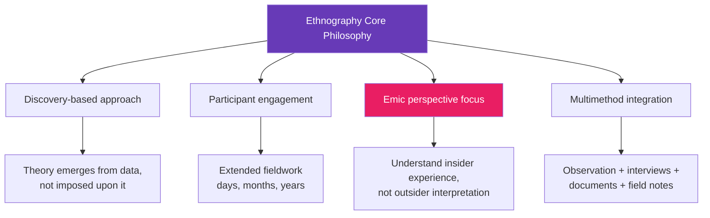
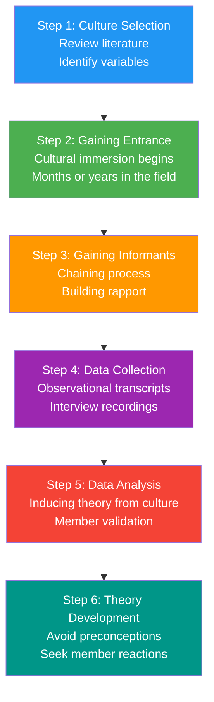
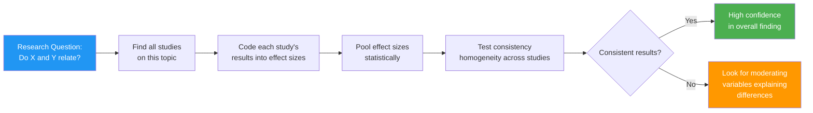
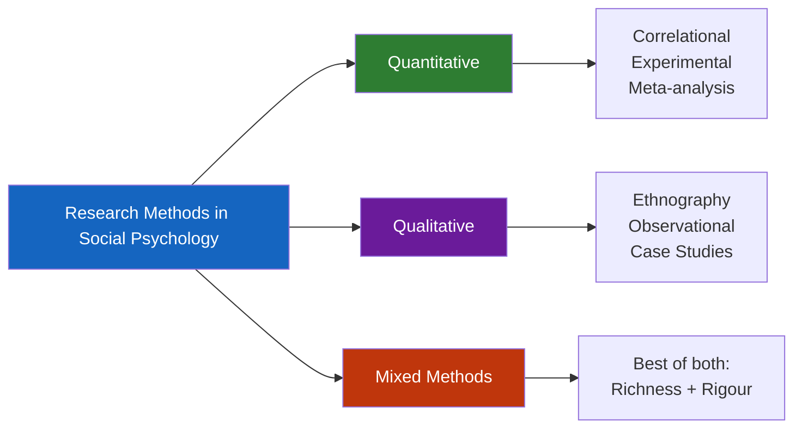

import Mermaid from '@theme/Mermaid';

# Ethnography and Meta-Analysis in Social Psychology Research

> *"Ethnography is concerned with the experience as it is felt or undergone."* — Banister et al. (1994)

When experimental methods cannot capture the richness of human social life — when we want to understand **how it feels to live in a particular culture**, what meanings people assign to their world, or how communities construct shared realities — ethnography steps in. It is one of the most human-centred approaches in social science.

---

**Source PDFs**:
- 📄 [Block-1/Unit-3.pdf - Pages 60-65](/pdfs/MPC-004%20Advanced%20Social%20Psychology/Block-1/Unit-3.pdf)
- 📚 MPC-004 Advanced Social Psychology

---

## 🎯 Learning Objectives

After studying this section, you will be able to:
- Define ethnography and explain its origins
- List characteristics of ethnographic method
- Describe the steps in conducting ethnographic research
- Explain specialised concepts: macro/micro ethnography, emic/etic perspectives
- Define meta-analysis and explain its importance in social psychological research
- Compare ethnographic and experimental approaches

---

## 1. Ethnography: Writing About Peoples

### 1.1 Etymology and Definition

The word **ethnography** comes from Greek:
- **Ethnos** = folk/people
- **Graphia** = writing

> *"Ethnography literally means 'a portrait of a people.' Ethnography is a written description of a particular culture — the customs, beliefs, and behaviour, based on information collected through fieldwork."* — Marvin Harris and Orna Johnson (2000)

> *"Ethnography is the art and science of describing a group or culture. The description may be of a small tribal group in an exotic land or a classroom in middle-class suburbia."* — David M. Fetterman (1998)

### 1.2 Roots and Position in Research

Ethnography is a **qualitative research method** with roots in:
- **Anthropology** (studying cultures through fieldwork)
- **Sociology** (studying social groups and institutions)

In recent years, it has become an influential model for social psychological research — particularly where laboratory methods cannot capture real-world complexity.

### 1.3 Core Philosophy

Ethnography is concerned with **experience as it is felt or undergone**. The ethnographer:
- Participates in people's daily lives for an extended period
- Watches what happens and listens to what is said
- Asks questions and studies documents
- Does not structure the research environment but actively participates in it

Its approach is **discovery-based**: the aim is to depict the activities and perspectives of social actors from the inside — from their own point of view.

---

## 2. Characteristics of Ethnography

Ethnographic research is characterised by:

**1. Multiple Data Sources**
Gathers data from a range of sources — interviews, observations, conversations, and documents — rather than relying on a single method.

**2. Natural Settings**
Studies behaviour in everyday contexts rather than experimental conditions. The context is treated as essential, not as a confound to be controlled.

**3. Unstructured Initial Approach**
Uses an unstructured approach to data gathering in the early stages, allowing key issues to emerge gradually through analysis rather than being predetermined by the researcher.

**4. In-Depth Focus**
Comprises an in-depth study of one or two situations (rather than superficially covering many). This depth is its defining strength.

**5. Multimethod Form**
Participant observation forms the base method, with interviewing and action research as later stages. The multimethod approach reduces risks from reliance on a single data type.

**6. Holistic Understanding**
Aims to help readers understand "what goes on in a society or social circumstance as well as the participants" — total immersion in context.

---

## 3. Steps in Ethnographic Research

**Step 1 — Culture Selection**: The ethnographer selects a culture, reviews relevant literature, and identifies variables of interest.

**Step 2 — Gaining Entrance**: The researcher enters the cultural setting. Cultural immersion begins — it is not unusual for ethnographers to live within the culture for months or even years.

**Step 3 — Gaining Informants**: Key participants (informants) are identified through a **chaining process** — each informant leads to others. Building trust is essential.

**Step 4 — Data Collection**: Collected as observational transcripts and interview recordings. The researcher strives to avoid imposing theoretical frameworks.

**Step 5 — Data Analysis**: Analysis and theory development occur at the end — though theories may emerge during immersion. Theories are induced from perspectives of cultural members, not imposed from outside.

**Step 6 — Validation**: The researcher may seek validation of induced theories by returning to cultural members for their reactions — a process called **member checking**.

---

## 4. Types and Special Concepts in Ethnography

### 4.1 Macro vs. Micro Ethnography

| Type | Scope | Example |
|------|-------|---------|
| **Macro-ethnography** | Broadly defined cultural groupings | "The Indians," "urban youth culture" |
| **Micro-ethnography** | Narrowly defined cultural groupings | "Young working-class women in Delhi," "Members of Parliament" |

### 4.2 Emic vs. Etic Perspectives

This distinction is fundamental to ethnographic epistemology:

**Emic Perspective**: The ethnographic approach that focuses on **how members of the culture perceive their own world**. The insider view. Usually the main focus of ethnography.

**Etic Perspective**: How **non-members (outsiders)** perceive and interpret behaviours and phenomena associated with a culture. The external, comparative view.

**Illustrative Example**: 
- Studying arranged marriages in India from an **emic** perspective means understanding the cultural values, family dynamics, and meanings that participants themselves assign to the practice.
- Studying it from an **etic** perspective might involve Western sociological frameworks about gender power, autonomy, and institutional control.

A complete ethnography often requires both — the insider's lived experience AND the outsider's analytical framework.

### 4.3 Key Ethnographic Concepts

**Situational Reduction**: The view that social structures and dynamics emerge from and can be reduced to accumulated effects of micro-situational interactions (Collins, 1988). In essence: to understand the cosmos, study the microcosm.

**Symbols**: Any material artefact of a culture — art, clothing, technology — that carries cultural meaning. The ethnographer strives to understand cultural connotations. For example, the sacred thread (janeu) in Hindu culture carries layered meanings about caste, gender, and spiritual status.

**Cultural Patterning**: The observation of patterns forming relationships among two or more symbols. Three methods:
- **Conceptual mapping** — using members' own terms to relate symbols
- **Learning processes** — how cultures transmit what they value across generations
- **Sanctioning processes** — which elements are formally prescribed/proscribed and which informally

**Tacit Knowledge**: Deeply embedded cultural beliefs assumed in a culture's worldview — so fundamental they are rarely discussed explicitly. Must be inferred by the ethnographer.

**Example of Tacit Knowledge**: In many Indian communities, the assumption that elders' decisions should be deferred to is rarely articulated — it simply shapes behaviour. An ethnographer must infer this from patterns of interaction, not from explicit statements.

### 4.4 The Ethnographer's Reflexivity

Ethnographic researchers recognise a fundamental truth: they are part of the social world they study. Their presence inevitably affects what they observe.

> *"Rather than engaging in futile attempts to eliminate the effects of the researcher, we should set about understanding them."* — Hammersley and Atkinson

This acceptance of the researcher's influence — **reflexivity** — is a strength of ethnography, not a limitation. It leads to more honest and nuanced accounts.

---

## 5. Meta-Analysis: Synthesising Research Findings

### 5.1 The Challenge of Accumulating Research

As research on any topic accumulates, a new problem emerges: **how to synthesise findings to arrive at general conclusions**. 

Eagly and Crowley (1986) identified **172 separate studies** examining male-female differences in helping behaviour. How are researchers to make sense of this volume of evidence? They had to turn to meta-analysis.

### 5.2 What Is Meta-Analysis?

**Meta-analysis** uses statistical techniques to **pool information from all available studies on the same topic** to arrive at an overall estimate of the size of a finding.

**Steps in Meta-Analysis:**
1. Find as many studies as possible on the same topic
2. Calculate **effect sizes** — standardised measures of the magnitude of results
3. Pool information statistically across all studies
4. Arrive at an overall estimate
5. Test for consistency (homogeneity) of findings
6. When results differ, look for moderating factors (e.g., cultural differences, age groups, time periods)

### 5.3 Advantages of Meta-Analysis

> *"Meta-analysis reviews can help counteract our tendency to be unduly influenced by the results of one or a few studies that are especially interesting or ingenious, since such reviews combine the findings of many studies by statistical formula."* — Myers (1991)

| Advantage | Explanation |
|-----------|-------------|
| Overcomes small samples | Combines many studies for greater statistical power |
| Identifies moderating variables | Reveals when effects are larger or smaller in different contexts |
| Tests robustness | Determines if a finding holds across many research contexts |
| Counteracts publication bias | Includes both published and unpublished studies ideally |
| Objective synthesis | Statistical formula reduces individual reviewer bias |

### 5.4 Limitations of Meta-Analysis

| Limitation | Explanation |
|-----------|-------------|
| "Garbage in, garbage out" | If individual studies are poorly designed, meta-analysis amplifies poor evidence |
| Publication bias | Studies with significant results are more likely to be published; meta-analyses may overestimate effect sizes |
| Apples and oranges problem | Combining studies that measured the concept slightly differently |
| Assumes independent studies | Studies from same lab or researcher may not be independent |

---

## 6. Evaluating Social Psychological Research Methods

### 6.1 The Broader Challenge

Strict adherence to scientific procedures sometimes creates problems for social psychology. Social psychology studies psychological characteristics of large groups and mass processes — and pure scientific methods alone may be insufficient.

Key issues in evaluation:
- Is information subjective or objective?
- How reliable is the data-collecting instrument?
- What degree of logic and content theory can the researcher include in interpretation?

### 6.2 Three Characteristics of Reliable Information

1. **Validity** — does the measure actually measure what it's supposed to?
2. **Stability** — does the measure produce consistent results over time?
3. **Precision** — is the measurement accurate and specific?

### 6.3 Synthesising the Methods

The complementary nature of methods is now well recognised:
- **Experimental methods** provide causal certainty but sacrifice ecological validity
- **Ethnographic methods** provide ecological richness but sacrifice causal certainty
- **Correlational methods** reveal relationships in natural settings
- **Meta-analysis** synthesises across all approaches

Researchers choose methods based on their **research questions**, not methodological preference.

---

## 7. Ethnography in Indian Social Psychology

Ethnographic methods have been particularly valuable in studying Indian social phenomena:

**Caste and Social Hierarchy**: Ethnographers have documented how caste operates in everyday interactions — the subtle ways hierarchy is maintained through speech patterns, seating arrangements, and food practices that would be invisible to an experimental study.

**Religious Behaviour**: Pilgrimage practices like the Kumbh Mela have been studied ethnographically to understand crowd dynamics, collective religious experience, and social solidarity in ways no laboratory can capture.

**Rural Communities**: Community development studies use ethnographic methods to understand local power structures, gender dynamics, and resource allocation in villages — essential for effective policy implementation.

**Clinical Settings**: Ethnographic observation in psychiatric hospitals in India has revealed how family involvement in treatment, traditional healing practices, and social stigma shape recovery outcomes.

---

## 🧠 Memory Aids

### Ethnography Characteristics — "MULTI"
- **M**ultiple data sources
- **U**nstructured initial approach
- **L**ong-term immersion
- **T**hick description (in-depth)
- **I**nsider perspective (emic focus)

### Meta-Analysis Steps — "FCASE"
- **F**ind all studies
- **C**alculate effect sizes
- **A**ggregate statistically
- **S**earch for consistency
- **E**xplain inconsistencies

### Emic vs. Etic — Easy Memory
- **Emic** = **E**xperience from inside (the culture members' view)
- **Etic** = **Ex**ternal view (the outsider's perspective — "Etic" like "Exotic")

---

## 📚 External Resources

### Wikipedia Articles
- [Ethnography](https://en.wikipedia.org/wiki/Ethnography) — Comprehensive overview of ethnographic research
- [Participant observation](https://en.wikipedia.org/wiki/Participant_observation) — Core ethnographic technique
- [Emic and etic](https://en.wikipedia.org/wiki/Emic_and_etic) — The insider/outsider distinction in anthropology
- [Meta-analysis](https://en.wikipedia.org/wiki/Meta-analysis) — Statistical synthesis of research
- [Reflexivity (social theory)](https://en.wikipedia.org/wiki/Reflexivity_(social_theory)) — Researcher's role in social research

### Educational Videos
- 🎥 [What is Ethnography? - Introduction](https://www.youtube.com/watch?v=qSxBD_JO_Ac) — Clear conceptual introduction
- 🎥 [Meta-Analysis Explained - Statistics Made Easy](https://www.youtube.com/watch?v=PjaR3cW1OeA) — Visual guide to meta-analysis
- 🎥 [Qualitative vs. Quantitative Research](https://www.youtube.com/watch?v=xkuKUNSYNkA) — Placing ethnography in context

### Research Papers
- Harris, M. (1976). History and significance of the emic/etic distinction. *Annual Review of Anthropology* — Foundational article on emic/etic perspectives
- Borenstein, M., et al. (2021). *Introduction to Meta-Analysis* (2nd ed.). Wiley — Leading textbook on meta-analysis
- Hammersley, M., & Atkinson, P. (2019). *Ethnography: Principles in Practice* (4th ed.). Routledge — Standard ethnography methodology text
- Eagly, A. H., & Wood, W. (2023). Bringing culture and evolution together to explain human nature. *Perspectives on Psychological Science* — Contemporary perspectives on cross-cultural research
- Blanchet-Cohen, N., et al. (2022). Participatory ethnography in community psychology. *American Journal of Community Psychology* — Modern applications of ethnographic methods

---

## ✅ Self-Assessment Questions

### Level 1: Knowledge
1. What does the word "ethnography" literally mean?
2. Distinguish between macro-ethnography and micro-ethnography with one example each.
3. What is meta-analysis and what problem does it solve?

### Level 2: Understanding
4. Explain the difference between the emic and etic perspectives in ethnographic research. Why is the emic perspective usually the primary focus?
5. What is tacit knowledge? Give an example from Indian culture that would require an ethnographer to infer, rather than directly observe, this knowledge.
6. Why is reflexivity considered a strength of ethnographic research rather than a limitation?

### Level 3: Application
7. You want to study how medical students in India develop professional identities during their training. Would you choose an experimental, correlational, or ethnographic approach? Justify your choice, discussing the strengths and limitations of your chosen method.
8. A review of 50 studies on mindfulness and stress reduction finds wildly inconsistent results. How would you conduct a meta-analysis to make sense of these findings? What moderating variables would you look for?
9. An ethnographer studying a tribal community in Odisha uses only English-language interviews and external scholarly frameworks to interpret the community's rituals. What methodological errors are being made, and how should the research be redesigned?

### Level 4: Synthesis (Exam-Focused)
10. Compare ethnography and experimental method as approaches to studying social behaviour. In what types of research questions is each approach superior? Illustrate your answer with concrete examples from social psychology research in India or internationally.

---

## 🔗 Cross-References

- For experimental method details: [Experimental Method in Social Psychology](/mpc-004/block-1/experimental-method-social-psychology)
- For observational and correlational methods: [Research Methods Overview](/mpc-004/block-1/research-methods-social-psychology-overview)
- For qualitative methods in personality: [Personality Assessment Methods](/mpc-003/block-1/personality-assessment-methods)
- For statistical concepts: MPC-006 Statistics in Psychology
