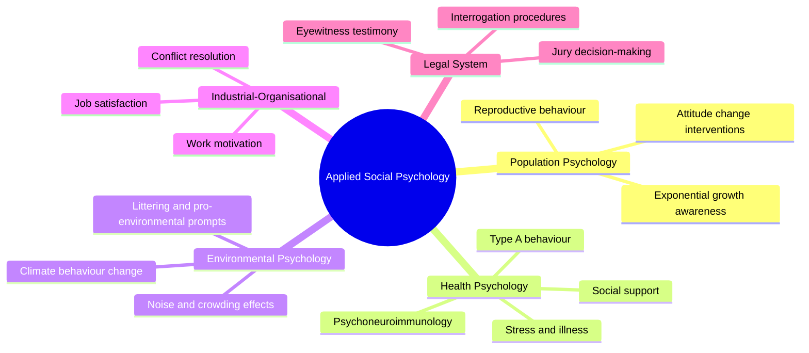
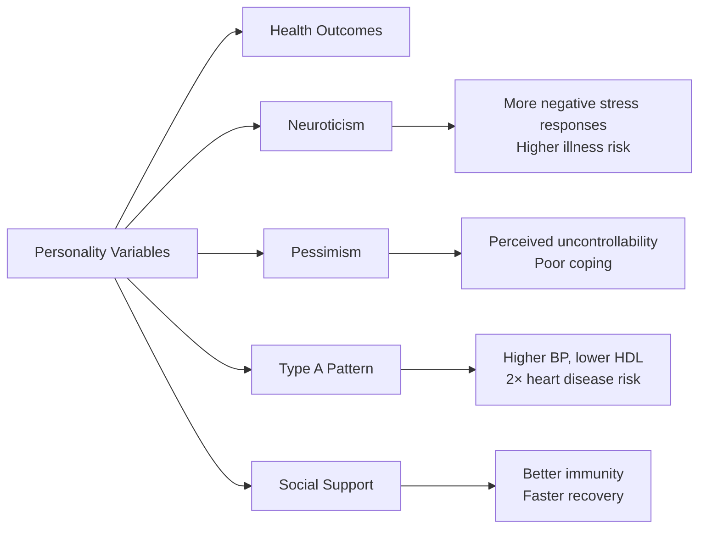

# Applications of Social Psychology: Population, Health, Environment, I/O, and Law

Applied social psychology bridges the gap between laboratory research and the real world. As James Weyant (1986) defined it, **applied social psychology is "the utilisation of social psychological principles and research methods in real world settings in an effort to solve a variety of individual and societal problems."** From managing population growth to improving workplace outcomes, social psychology's insights shape policies, practices, and interventions across virtually every domain of modern life.

---

**Source PDFs**:
- 📄 [Block-1/Unit-4.pdf – Pages 69–73](/pdfs/MPC-004%20Advanced%20Social%20Psychology/Block-1/Unit-4.pdf)
- 📚 MPC-004 Advanced Social Psychology

---

## 4.2 Social Psychology Applications: An Overview

Modern social psychology has dramatically expanded its repertoire of methods and its relevance to everyday life. During the 1970s and 1980s, there was a growing recognition that theoretical knowledge must be translated into actionable solutions. Dissonance and attribution theories generated enormous experimental work, but the practical demands of real-world problems far outpaced theoretical development.

Key features of contemporary applied social psychology:

- **Broadened methodology**: Moving beyond pure laboratory experiments to field studies, quasi-experiments, and mixed-methods research
- **Cultural sensitivity**: Recognising that findings must be tested across diverse social and cultural settings
- **Interdisciplinary reach**: Borrowing frameworks from economics, biology, law, and public health
- **Policy relevance**: Generating findings that directly inform government policy and organizational practice

---

## 4.2.1 Population Psychology

**Population psychology** concentrates on the psychological dimensions of rapid human population expansion and on efforts to manage it.

### The Persian Chessboard: Understanding Exponential Growth

Carl Sagan (1989) used the legend of the Persian Chessboard to explain exponential growth. According to legend, the inventor of chess asked for one grain of wheat on the first square, doubled for each subsequent square. By the 64th square, the reward would amount to **18.5 quintillion grains — approximately 75 billion metric tons of wheat**, more than all the granaries of Persia combined.

Human population grows similarly:
- It took **all of human history** to reach 1 billion people (around 1804)
- Only **123 years** to add the second billion (1927)
- **33 years** for the third billion (1960)
- By 2023, world population exceeded **8 billion**

### Psychological Barriers to Population Control

Social psychology identifies key cognitive barriers:

| Barrier | Description |
|---------|-------------|
| Arithmetic vs. geometric thinking | Humans intuitively think linearly, not exponentially |
| Optimism bias | Individuals underestimate personal risk of over-population consequences |
| Status quo bias | Preference for current reproductive norms despite their systemic effects |
| Diffusion of responsibility | "Others will solve it" mentality |

### Social Psychological Interventions

Baron and Byrne (1994) argued that change requires:
1. Improving **quality and quantity of sex education**
2. Reducing **situational constraints** (access to contraception)
3. Addressing **individual differences** in educational messaging
4. Changing **attitudinal variables** around family size norms

:::tip Exam Focus
Population psychology applies attitude change theory, persuasion research, and social norms approaches to one of humanity's most pressing collective action problems.
:::

### Recent Research (2020–2024)

- [Bongaarts & Sinding (2021) – Population and Development Review](https://www.ncbi.nlm.nih.gov/pmc/articles/PMC8017893/) – examined how family planning access influences population stabilisation
- [Vollset et al. (2020) – Lancet](https://www.thelancet.com/journals/lancet/article/PIIS0140-6736(20)30677-2/fulltext) – forecasted population decline in many countries by 2100

---

## 4.2.2 Health Psychology

**Health psychology** is the specialty that studies how psychological processes affect the development, prevention, and treatment of physical illness.

### The Psychology of Health Risk Denial

Lieberman & Chaiken (1992) conducted a landmark study: women were given (false) information linking caffeine to a breast disorder. Those who were regular coffee drinkers — and thus most personally at risk — were **less likely to believe the health threat**, regardless of whether it was presented as high or low risk.

This illustrates **motivated reasoning**: we protect our self-concept by doubting information that threatens our current behaviour.

### Stress, Immunity, and Psychoneuroimmunology

Psychologists have studied stress since World War II. Key findings:

- **Occupational stress, family conflict, and marital tension** are among the most common stressors
- During high stress, individuals neglect health behaviours (diet, exercise, sleep)
- Stress directly suppresses **immune function** — the field of **psychoneuroimmunology** studies stress, emotional reactions, and immune response together
- **Zimmerman (1990)** introduced "learned hopefulness" — the sense of problem-solving capacity and control — as a protective factor against stress-induced illness

### Personality and Health

**Type A Behaviour Pattern** — characterised by competitiveness, time urgency, and hostility — is associated with:
- Higher blood pressure
- Lower HDL (good cholesterol)
- Twice the risk of coronary heart disease compared to Type B individuals
- The **hostility component** is particularly cardiac-damaging; it is failure-triggered hostility, not hard work itself, that harms health

**Social Support** acts as a buffer:
- People with strong social networks avoid illness more effectively
- When illness occurs, those with support recover more quickly
- The mechanism involves having someone to talk with about stressors, reducing self-concealment

### The Health Decision Process

When illness strikes, people navigate:
1. **Noticing and interpreting symptoms** (symptom perception)
2. **Deciding to seek help** (often delayed due to denial or cost)
3. **Coping with medical procedures** (adherence, medical communication)

Health psychologists focus on reshaping cognitions and attitudes that affect each stage.

### External Resources

- 🌐 [Wikipedia: Health Psychology](https://en.wikipedia.org/wiki/Health_psychology)
- 🌐 [Wikipedia: Psychoneuroimmunology](https://en.wikipedia.org/wiki/Psychoneuroimmunology)
- 🌐 [Wikipedia: Type A and Type B Personality Theory](https://en.wikipedia.org/wiki/Type_A_and_Type_B_personality_theory)
- 📹 [Crash Course: Health Psychology](https://www.youtube.com/watch?v=0euo6MHoIh0)
- 📹 [TED-Ed: How stress affects your body](https://www.youtube.com/watch?v=v-t1Z5-oPtU)
- 📄 [Cohen et al. (2021) – Social ties and susceptibility to COVID-19](https://www.pnas.org/doi/10.1073/pnas.2103421118)
- 📄 [Kiecolt-Glaser et al. (2020) – Stress and Immunity – Annual Review of Psychology](https://www.annualreviews.org/doi/10.1146/annurev-psych-010419-050950)

---

## 4.2.3 Environmental Psychology

**Environmental psychology** studies interactions between the physical world and human behaviour.

### Environmental Stressors and Human Behaviour

Key environmental factors affecting behaviour:

- **Noise pollution**: Impairs concentration, increases aggression, disrupts sleep
- **Temperature**: High temperatures correlate with increased aggression (heat hypothesis)
- **Air pollution**: Associated with reduced cognitive function and mood disturbance
- **Crowding**: Increases stress, reduces prosocial behaviour in urban contexts
- **Atmospheric electricity**: Some studies link ion levels to mood

### Pro-Environmental Behaviour Change

Studies on littering and environmental behaviour show that **prompts, rewards, and legislation** can increase pro-environmental behaviour:

- **Descriptive norms** ("Most visitors to this park don't litter") are more effective than injunctive messages alone
- **Commitment devices** (pledges, public commitments) enhance consistency with eco-friendly behaviour
- **Incentive structures** (deposit-refund systems) increase recycling

### Global Environmental Challenges

Social psychology contributes to understanding:
- **Climate inaction** — cognitive dissonance between knowing and acting
- **Tragedy of the commons** — individual incentives conflict with collective welfare
- **Bystander effect** in environmental responsibility

- 🌐 [Wikipedia: Environmental Psychology](https://en.wikipedia.org/wiki/Environmental_psychology)
- 📄 [van der Linden et al. (2022) – Social influence in the climate crisis – Nature Human Behaviour](https://www.nature.com/articles/s41562-021-01257-8)

---

## 4.2.4 Industrial-Organisational Psychology

**Industrial-Organisational (I/O) psychology** applies social psychology to work settings, focusing on behaviour within industries and organisations.

### Core Areas

| Domain | Key Topics |
|--------|-----------|
| Job attitudes | Job satisfaction, organisational commitment, turnover intention |
| Work motivation | Equity theory, goal-setting theory, expectancy theory |
| Leadership | Transformational vs. transactional styles |
| Conflict | Competition over resources, stereotypes, communication failures |
| Conflict resolution | Bargaining, superordinate goals, mediation |

### Work Motivation: Cognitive Factors

Motivation in organisations is influenced by:
- **Cognitive evaluation** of job outcomes (expectancy)
- **Equity perception** — comparing one's input/output ratio to others
- **Performance consequences** — reinforcement and feedback

### Conflict in Organisations

Common causes of organisational conflict:
- Competition over **scarce resources** (budget, space, promotions)
- **Interpersonal factors**: stereotypes, prejudice, communication breakdowns
- **Role ambiguity** and structural overlaps

Resolution techniques include:
- **Bargaining** and negotiation
- **Superordinate goals** — shared objectives that override subgroup interests
- **Inducing states incompatible with conflict** (e.g., cooperation tasks)

- 🌐 [Wikipedia: Industrial and Organisational Psychology](https://en.wikipedia.org/wiki/Industrial_and_organizational_psychology)
- 📹 [MIT OpenCourseWare: Organisational Psychology](https://ocw.mit.edu/courses/15-317-organizational-leadership-and-change-fall-2005/)

---

## 4.2.5 Legal System and Social Psychology

**Forensic psychology** applies psychological knowledge to legal processes and has exposed significant limitations in the justice system.

### Eyewitness Testimony

Eyewitness memory is deeply unreliable:
- **Constructive memory**: Memory is rebuilt at retrieval, not played back like a video
- **Post-event information effect** (Misinformation Effect – Loftus): Exposure to information after an event alters memory of the event
- **Leading questions**: Even subtly phrased questions alter witness reports
- **Weapon focus**: Witnesses focus on weapons, reducing peripheral detail encoding
- **Cross-race effect**: Lower accuracy in identifying faces from other racial groups

### Factors Affecting Legal Outcomes

| Factor | Effect |
|--------|--------|
| Interrogation procedures | Can induce false confessions |
| Media publicity | Prejudices jurors before trial |
| Attorney behaviour | Persuasion techniques bias juror perception |
| Judge demeanour | Nonverbal cues affect courtroom judgments |
| Juror cognitive reinterpretation | Evidence is filtered through schemas and emotional biases |

### Applied Contributions

Forensic psychologists contribute by:
- Designing **better eyewitness identification procedures** (sequential lineups, double-blind administration)
- Training police in **cognitive interview techniques**
- Educating juries about **memory limitations**
- Advising courts on **false confession risk**

- 🌐 [Wikipedia: Forensic Psychology](https://en.wikipedia.org/wiki/Forensic_psychology)
- 🌐 [Wikipedia: Eyewitness Memory](https://en.wikipedia.org/wiki/Eyewitness_memory_(theory))
- 🌐 [Wikipedia: Misinformation Effect](https://en.wikipedia.org/wiki/Misinformation_effect)
- 📹 [TED: Elizabeth Loftus – The Fiction of Memory](https://www.ted.com/talks/elizabeth_loftus_the_fiction_of_memory)
- 📄 [Wells et al. (2020) – Eyewitness identification reform: Progress and pitfalls – Psychological Science in the Public Interest](https://journals.sagepub.com/doi/10.1177/1529100620945473)

---

## Memory Aid: PHEIL

Use **PHEIL** to remember the five applied areas:

> **P**opulation → **H**ealth → **E**nvironment → **I**ndustrial-Organisational → **L**egal

Each domain represents a domain where psychological principles transform practice.

---

## Self-Assessment Questions

### Basic Understanding
1. Define applied social psychology. How does it differ from pure/basic social psychology?
2. What is the "Persian Chessboard" analogy, and what does it explain about population psychology?
3. Define psychoneuroimmunology. What field did it emerge from?

### Intermediate Analysis
4. Why does health risk information sometimes backfire with the very people most at risk? Which psychological mechanism explains this?
5. Compare the causes and resolution strategies for organisational conflict. What role does the concept of superordinate goals play?
6. Explain why eyewitness testimony is often unreliable. What factors contribute to memory distortion?

### Advanced Application
7. A government wants to reduce single-use plastic consumption. Using knowledge from environmental psychology, design a multi-pronged intervention strategy.
8. A hospital wants to improve patient adherence to post-surgery recovery plans. Drawing on health psychology principles, what strategies would you recommend?
9. Critically evaluate the claim that "practical demands have always far surpassed theoretical knowledge in social psychology." Do you agree? Support with examples.

---

## Real-World Applications in Indian Context

- **Population psychology** is directly relevant to India's demographic trajectory — India surpassed China as the world's most populous nation in 2023. Social psychological interventions in family planning must account for **caste, religion, and regional norms**.
- **Health psychology** is applied in national health campaigns like Ayushman Bharat, where behavioural insights drive preventive care messaging.
- **Environmental psychology** informs the Swachh Bharat Mission's strategies for reducing open defecation and littering.
- **I/O psychology** is increasingly institutionalised in Indian corporate HR practices, especially in MNCs operating in IT hubs like Bangalore and Hyderabad.
- **Forensic psychology** is growing as Indian courts face challenges of eyewitness reliability in high-profile criminal cases.
