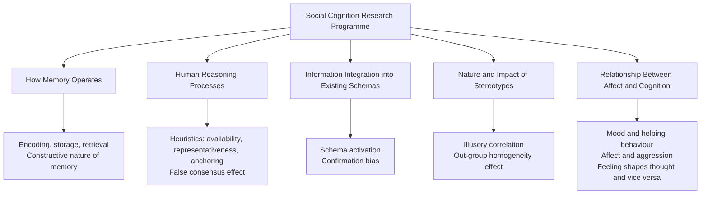
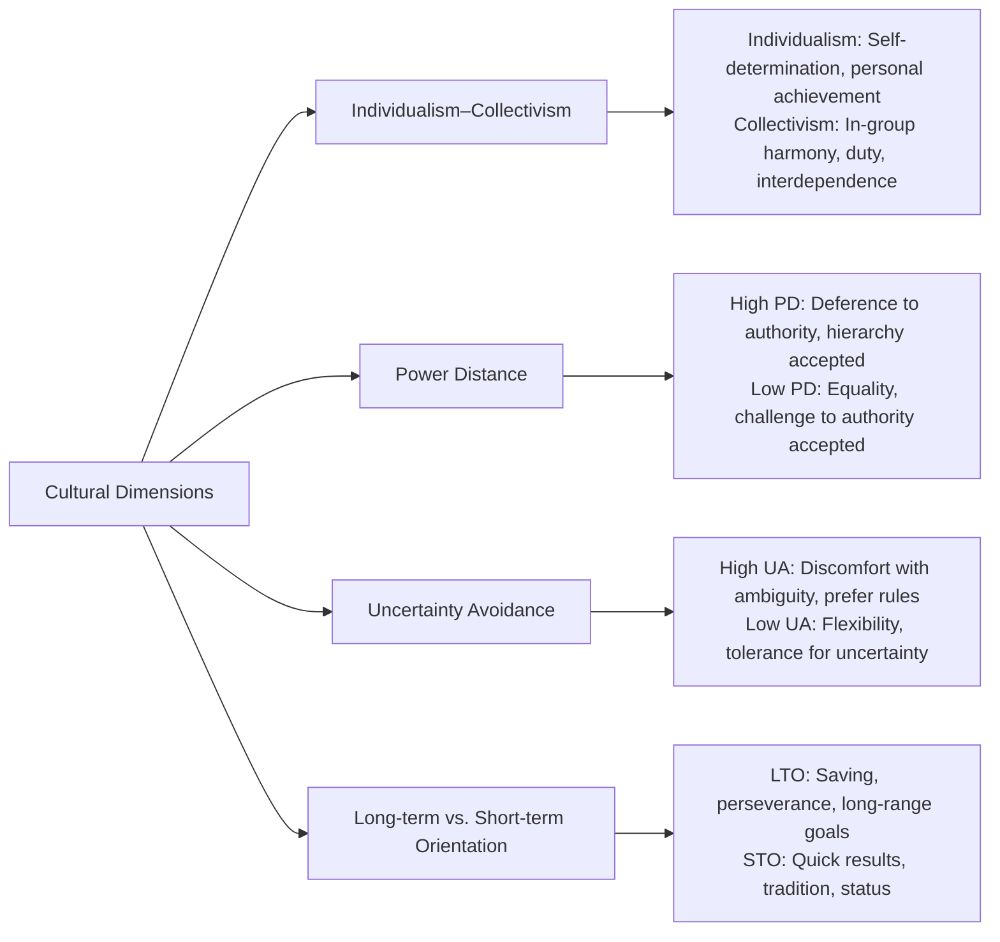

# Cognitive and Multicultural Perspectives in Social Psychology

Two of the most transformative intellectual movements in modern social psychology are the **cognitive revolution** — which placed mental processes at the centre of social behaviour — and the **multicultural turn** — which demanded that social psychology account for cultural diversity rather than assume a universal Western norm. Together, these perspectives have reshaped research questions, methods, and theories.

---

**Source PDFs**:
- 📄 [Block-1/Unit-4.pdf – Pages 73–74](/pdfs/MPC-004%20Advanced%20Social%20Psychology/Block-1/Unit-4.pdf)
- 📚 MPC-004 Advanced Social Psychology

---

## 4.3 The Growing Influence of the Cognitive Perspective

### Historical Context

From its origins, social psychology had a cognitive orientation — attitudes were recognised by Allport in 1935 as the discipline's central concept. Yet during the mid-20th century, **behaviourism** dominated experimental psychology, and social psychology's cognitive core was somewhat eclipsed.

The cognitive revolution of the 1970s–80s restored cognition to centre stage. Today, cognitive factors — **attitudes, beliefs, values, inferences, schemas, and heuristics** — are understood to play a key role in virtually all social behaviours.

### Core Commitments of the Cognitive Approach

The cognitive perspective in social psychology involves systematic investigation of:

### Memory and Social Cognition

Understanding **how memory operates** is central to social cognition:

- **Encoding**: Not all information is attended to equally — schemas guide selective attention
- **Storage**: Information is categorised and linked to existing knowledge structures
- **Retrieval**: Memory is reconstructive — we rebuild, not replay
- **Confirmation bias**: We more readily recall information consistent with existing beliefs

### Heuristics and Social Reasoning

Human reasoning often relies on **cognitive shortcuts**:

| Heuristic | Description | Social Psychology Example |
|-----------|-------------|--------------------------|
| Availability | Judging likelihood by how easily examples come to mind | Overestimating crime rates after media coverage |
| Representativeness | Judging probability by similarity to prototype | Stereotyping based on appearance |
| Anchoring | Over-relying on the first piece of information | Salary negotiation anchoring |
| False consensus | Assuming others share our views | Projecting own attitudes to group |

These heuristics lead people to **false conclusions about others** — a central insight of social cognition research.

### Stereotypes as Cognitive Structures

Research within the cognitive perspective has shown that **stereotypes** are not merely prejudicial attitudes but cognitive structures that influence:
- What information we **attend to** (selective encoding)
- What we **remember** (stereotype-consistent information is better recalled)
- How we **interpret ambiguous behaviour** (schema-guided inference)
- What conclusions we **draw** about others' intentions

### The Affect-Cognition Interface

A major achievement of the cognitive perspective has been demonstrating that **affect (emotion) and cognition are deeply intertwined**:

- **Mood and helping**: People in positive moods are more prosocial
- **Mood and aggression**: Negative affect (frustration, pain) increases aggression
- **Thought shapes feeling**: Cognitive reappraisal can transform emotional experience
- **Feeling shapes thought**: Current mood biases judgment, memory, and risk assessment

### External Resources

- 🌐 [Wikipedia: Social Cognition](https://en.wikipedia.org/wiki/Social_cognition)
- 🌐 [Wikipedia: Cognitive Bias](https://en.wikipedia.org/wiki/Cognitive_bias)
- 🌐 [Wikipedia: Stereotype](https://en.wikipedia.org/wiki/Stereotype)
- 🌐 [Wikipedia: Affect and Cognition](https://en.wikipedia.org/wiki/Affect_(psychology))
- 📹 [Crash Course Psychology: Social Thinking](https://www.youtube.com/watch?v=MkLB0qLSMt0)
- 📹 [MIT OpenCourseWare: Social and Cognitive Neuroscience](https://ocw.mit.edu/courses/9-012-cognitive-science-fall-2009/)
- 📄 [Hagger et al. (2022) – Cognitive and affective components of attitudes – Social Psychological and Personality Science](https://journals.sagepub.com/doi/10.1177/19485506211015168)
- 📄 [Fiske & Taylor (2021) – Social Cognition: From Brains to Culture – review article](https://www.annualreviews.org/doi/10.1146/annurev-psych-010418-103030)

:::tip Exam Tip
The cognitive perspective argues that to understand social behaviour, we must understand the mental processes — schemas, heuristics, memory biases — through which people interpret social situations. This is fundamentally different from behaviourism's focus on observable stimulus-response relations.
:::

---

## 4.4 The Multicultural Perspective

### The "American Psychology" Problem

Social psychology developed predominantly in **North American** universities, using American undergraduate samples, within an individualist cultural framework. This created a profound limitation: findings generated in the U.S. were routinely assumed to be **universal laws of human behaviour**.

Critics pointed out:
- Experimental social psychology focused on **individual cognitive processes** while neglecting **social and cultural context**
- Research findings may not generalise beyond Western, Educated, Industrialised, Rich, Democratic (**WEIRD**) populations
- Cultural factors could influence even the most basic social phenomena

### The Core Questions

The multicultural perspective asks:

1. **Universality**: Which findings reflect universal human psychology, and which are culturally specific?
2. **Cultural variation**: How and why do people from different cultures respond differently to the same situation?
3. **Emic vs. etic**: Should psychology develop culture-specific (emic) frameworks or seek cross-culturally valid (etic) concepts?

### Key Cultural Dimensions and Their Effects

### Individualism vs. Collectivism: A Critical Distinction

This is the most researched cultural dimension in social psychology:

| Dimension | Individualist Cultures (e.g., US, UK) | Collectivist Cultures (e.g., India, China, Japan) |
|-----------|--------------------------------------|--------------------------------------------------|
| Self-concept | Independent, autonomous | Interdependent, relational |
| Goal priority | Personal achievement | In-group harmony |
| Attribution style | Internal attributions favoured | External/situational attributions more common |
| Conformity | Less conformity pressure | More conformity to in-group norms |
| Helping | Helps strangers (universalism) | Helps in-group members preferentially |

### Cultural Variation in Social Phenomena

Research has demonstrated cultural differences in:

- **Conformity**: Collectivist cultures show higher conformity in some Asch-type paradigms
- **Fundamental Attribution Error (FAE)**: The FAE is weaker in East Asian cultures, where situational explanations are more readily considered
- **Self-serving bias**: Less pronounced in East Asian cultures, where modesty norms prevail
- **Negotiation styles**: High power distance cultures favour hierarchical negotiation
- **Emotional expression**: Display rules vary dramatically across cultures

### The Multicultural Perspective in India

India presents a particularly rich case:
- Multiple linguistic, religious, caste, regional, and class-based cultural identities
- **Collectivism** is generally strong, though urban professional Indians show increasing individualism
- The **joint family system** shapes attachment, decision-making, and conflict resolution differently than Western nuclear family assumptions
- **Honour-based cultures** in some regions shape attitudes toward gender, insult, and retaliation

### Cross-Cultural Research Methods

Cross-cultural social psychology faces methodological challenges:
- **Translation equivalence**: Concepts may not translate perfectly
- **Measurement invariance**: Scales must be validated cross-culturally
- **Sampling issues**: University students are overrepresented globally
- **Researcher positionality**: Western researchers may impose Western frameworks

### External Resources

- 🌐 [Wikipedia: Cross-Cultural Psychology](https://en.wikipedia.org/wiki/Cross-cultural_psychology)
- 🌐 [Wikipedia: Individualism and Collectivism](https://en.wikipedia.org/wiki/Collectivism)
- 🌐 [Wikipedia: WEIRD Bias in Psychology](https://en.wikipedia.org/wiki/Psychology#WEIRD_bias)
- 📹 [TED: Hazel Markus – Culture and the Self](https://www.youtube.com/watch?v=K_0lTqzXPBQ)
- 📄 [Henrich et al. (2010) – The WEIRDest people in the world – Behavioral and Brain Sciences](https://www.cambridge.org/core/journals/behavioral-and-brain-sciences/article/weirdest-people-in-the-world/BF84F7517D56AEA9B6B45F1E0C068F5B)
- 📄 [Kitayama et al. (2022) – Cultural psychology of the self – Annual Review of Psychology](https://www.annualreviews.org/doi/10.1146/annurev-psych-040320-035927)

---

## Comparing the Two Perspectives

| Dimension | Cognitive Perspective | Multicultural Perspective |
|-----------|----------------------|--------------------------|
| Primary focus | Internal mental processes | Cultural context of behaviour |
| Unit of analysis | Individual cognition | Cultural group comparisons |
| Key insight | Cognition mediates social behaviour | Culture shapes cognition and behaviour |
| Challenge to earlier work | Challenges pure behaviourism | Challenges universalist assumptions |
| Methodological preference | Laboratory experiments, cognitive tasks | Cross-cultural surveys, field studies, ethnography |
| Key contributors | Nisbett, Fiske, Taylor | Triandis, Markus, Kitayama, Henrich |

---

## Memory Aid: **CAMS**

To remember the cognitive perspective's four key research areas:

> **C**ognition (schemas, heuristics) → **A**ffect-cognition link → **M**emory (constructive, biased) → **S**tereotypes (cognitive structures)

For multicultural perspective:

> **WEIRD** → **W**estern, **E**ducated, **I**ndustrialised, **R**ich, **D**emocratic — the limitation of most psychology research samples

---

## Self-Assessment Questions

### Basic Understanding
1. What does the cognitive perspective in social psychology focus on? Name four key research areas it has developed.
2. Define the multicultural perspective in social psychology. What criticism of mainstream social psychology prompted it?
3. Explain what WEIRD stands for. Why is the WEIRD critique important for social psychology?

### Intermediate Analysis
4. How do heuristics like availability and representativeness lead to biased social judgments? Give one example each.
5. Contrast individualist and collectivist cultures on at least three social psychological phenomena (e.g., self-concept, attribution, conformity).
6. How does the cognitive perspective explain the persistence of stereotypes?

### Advanced Application
7. A social psychologist designs a study on helping behaviour using American undergraduates, then claims the findings demonstrate universal human altruism. Evaluate this claim from a multicultural perspective.
8. How do affect and cognition interact? Illustrate with examples from prosocial behaviour and aggression research.
9. Is it possible to have a truly universal social psychology? Discuss the tension between emic and etic approaches.
