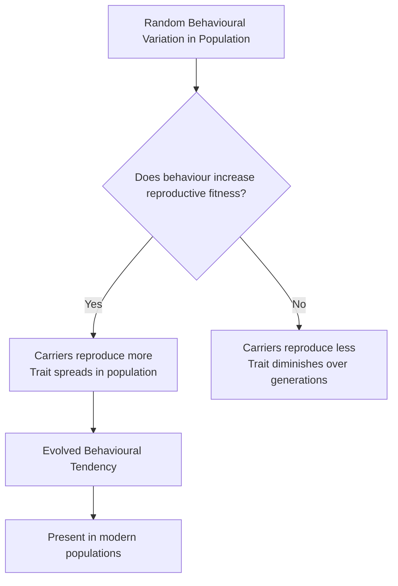
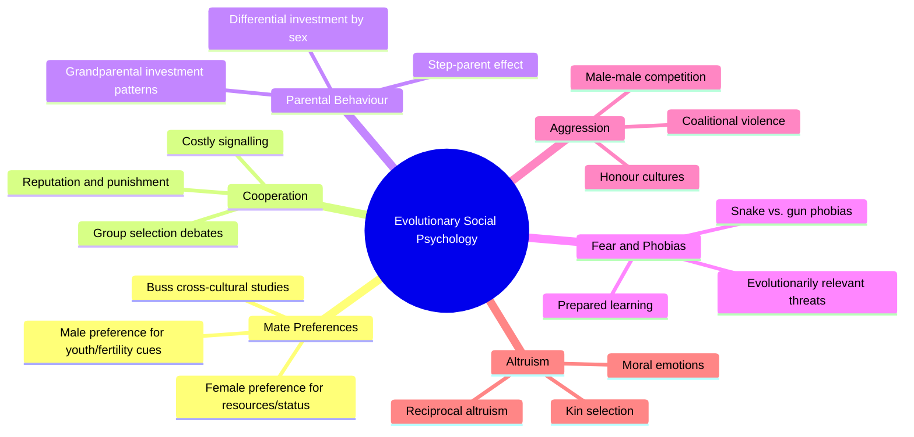

# Sociobiology and Evolutionary Social Psychology

Why do humans cooperate, compete, love, hate, and sacrifice for others? **Sociobiology** and **evolutionary social psychology** argue that the answers lie partly in our evolutionary heritage — in patterns of behaviour that were shaped over millennia because they contributed to survival and reproduction.

---

**Source PDFs**:
- 📄 [Block-1/Unit-4.pdf – Pages 74–75](/pdfs/MPC-004%20Advanced%20Social%20Psychology/Block-1/Unit-4.pdf)
- 📚 MPC-004 Advanced Social Psychology

---

## 4.5 Sociobiology

### Definition

**Sociobiology** is a discipline grounded in the idea that many aspects of social behaviour are the result of evolutionary processes. Specifically, it proposes that **patterns of behaviour that contribute to reproduction are strengthened and spread throughout a population over generations** via natural selection.

The term was popularised by biologist E.O. Wilson in his 1975 book *Sociobiology: The New Synthesis*, which controversially extended Darwinian principles to human social behaviour.

### Core Logic: Natural Selection and Behaviour

### Key Concepts in Sociobiology

| Concept | Explanation |
|---------|-------------|
| **Inclusive fitness** | An organism's genetic success, including that of relatives (Hamilton's kin selection) |
| **Kin selection** | Altruism is more likely toward genetic relatives (sharing genes) — "selfish gene" logic |
| **Reciprocal altruism** | Helping non-relatives who are likely to reciprocate in the future |
| **Parental investment** | Sex differences in parental investment shape mating strategies |
| **Sexual selection** | Traits that increase mating success evolve even if they reduce survival odds |

### Explaining Altruism Through Sociobiology

Altruism appears to contradict natural selection (why help others at your own cost?). Sociobiology resolves this via:

1. **Kin altruism**: Hamilton's rule — help when rB > C (benefit × relatedness > cost)
   - Example: A gene "for" self-sacrifice is preserved if it saves enough close relatives carrying the same gene
2. **Reciprocal altruism** (Trivers 1971): Help strangers when future reciprocation is likely
   - Requires: repeated interactions, ability to detect cheaters, memory

### Aggression: An Evolutionary View

Sociobiology interprets aggression as:
- **Male–male competition** for mates, resources, and status
- **Territorial defence** behaviours
- **Coalitional violence** between groups as intergroup competition for resources

However, critics note that aggression rates vary enormously across cultures — suggesting strong cultural overlay on any biological predispositions.

---

## 4.5.1 Evolutionary Social Psychology

### Definition

**Evolutionary social psychology** is the application of evolutionary theory to social behaviour. It suggests that:

> "Social tendencies toward behaviours that are most adaptive from the point of view of survival increase in strength over time within a given population." — IGNOU MPC-004 Text

### Key Research Areas

### Cross-Cultural Evidence for Evolutionary Predictions

David Buss (1989) conducted a landmark 37-culture study of **mate preferences**:

- Women across cultures consistently prioritised **resource acquisition** and **status** in mates
- Men across cultures consistently prioritised **youth** and **physical attractiveness** (cues of fertility)
- Both sexes valued **kindness, intelligence, and dependability**

These patterns are interpreted as reflecting evolved adaptations to ancestral environments, though feminist and cultural critics dispute this interpretation.

### Evolutionary Psychology and Cognitive Modules

The **massive modularity thesis** (Tooby and Cosmides) proposes that:
- The human mind contains domain-specific **psychological mechanisms** (modules)
- These modules evolved to solve recurrent adaptive problems in ancestral environments
- Examples: cheater detection, face recognition, kin identification, status tracking

### Environmental and Cultural Plasticity

It is also recognised — crucially — that **evolved tendencies can be modified by environmental, social, and cultural conditions**. Evolution provides **reaction norms** (ranges of possible responses), not fixed behavioural programmes.

Cognitive processes — including learning, deliberation, and cultural transmission — can override or redirect evolved tendencies:
- Humans use contraception, violating evolved reproductive drives
- Modern humans form cooperative institutions (laws, markets) that extend trust far beyond kin
- Cultural norms regulate aggression, even in contexts where it might be adaptively useful

---

## 4.5.2 Criticisms and Controversies

### The Nature–Nurture Debate

Sociobiology provoked fierce controversy upon its introduction:

| Criticism | Counter-Response |
|-----------|-----------------|
| Genetic determinism — biology is destiny | Modern evolutionary psychology emphasises **gene–environment interaction** |
| Justifies social inequalities (racism, sexism) as "natural" | Naturalistic fallacy — what evolved is not necessarily what ought to be |
| Just-so stories — unfalsifiable post-hoc explanations | Predictions can and have been tested rigorously cross-culturally |
| Ignores cultural variation | Acknowledges variation; seeks to explain universal tendencies beneath it |
| Social structure, not biology, causes gender differences | Debate remains active; evidence for both biological and social factors |

### The Group Selection Debate

Can natural selection operate at the level of **groups**, not just individuals or genes?
- **Williams (1966)** and **Dawkins (1976)** argued persuasively against group selection
- **Wilson & Wilson (2007)** revived multilevel selection theory
- This debate continues to shape how sociobiologists explain cooperation and altruism

### The Sociobiology-Social Psychology Relationship

Social psychology maintains that:
- **Behaviours can be changed** — evolutionary tendencies are not destiny
- **Environmental and social conditions** strongly modulate evolved tendencies
- Assumptions of sociobiology — that behaviours are adaptive results of long evolutionary processes — are open to empirical scrutiny and critique

---

## Real-World Applications

- **Clinical psychology**: Understanding evolved fears (phobias) helps design exposure therapies
- **Public health**: Evolved in-group favouritism helps explain vaccine hesitancy in tribal/community groups
- **Policy**: Understanding status-seeking and aggression in males helps design de-escalation programmes
- **Marketing**: Evolutionary psychology informs persuasion and consumer behaviour research
- **Indian context**: Honour cultures in northern India, caste-based endogamy, and joint family preferences can be partially understood through evolutionary frameworks (kin investment, within-group cooperation)

---

## External Resources

- 🌐 [Wikipedia: Sociobiology](https://en.wikipedia.org/wiki/Sociobiology)
- 🌐 [Wikipedia: Evolutionary Psychology](https://en.wikipedia.org/wiki/Evolutionary_psychology)
- 🌐 [Wikipedia: Kin Selection](https://en.wikipedia.org/wiki/Kin_selection)
- 🌐 [Wikipedia: Reciprocal Altruism](https://en.wikipedia.org/wiki/Reciprocal_altruism)
- 📹 [Crash Course: Evolution and Natural Selection](https://www.youtube.com/watch?v=GcjgWov7mTM)
- 📹 [Robert Sapolsky: Human Behavioural Biology – Stanford](https://www.youtube.com/watch?v=NNnIGh9g6fA)
- 📄 [Buss (2021) – Evolutionary psychology: A new paradigm for psychological science – Psychological Inquiry](https://www.tandfonline.com/doi/full/10.1080/1047840X.2021.1944629)
- 📄 [Henrich et al. (2023) – The evolution of cooperation and large-scale society – Nature Human Behaviour](https://www.nature.com/articles/s41562-022-01510-8)
- 📄 [Tooby & Cosmides (2015) – The theoretical foundations of evolutionary psychology – Handbook of Evolutionary Psychology](https://onlinelibrary.wiley.com/doi/10.1002/9781119125563.evpsych235)

---

## Memory Aid: **SEPAR**

> **S**election → **E**volution shapes behaviour → **P**lasticity remains → **A**daptation is not destiny → **R**eciprocal altruism extends cooperation

---

## Comparison: Sociobiology vs. Evolutionary Social Psychology

| Feature | Sociobiology | Evolutionary Social Psychology |
|---------|-------------|-------------------------------|
| Origin | E.O. Wilson (1975) | Buss, Cosmides, Tooby (1990s) |
| Focus | Social behaviour of all animals | Human social cognition and behaviour |
| Key concepts | Kin selection, inclusive fitness | Psychological modules, evolved mechanisms |
| Methods | Ethology, genetics | Experiments, cross-cultural surveys |
| Controversy | High — accused of determinism | Moderate — more nuanced gene-environment interaction |
| Stance on culture | Culture is secondary to biology | Culture interacts with biology |

---

## Self-Assessment Questions

### Basic Understanding
1. Define sociobiology. Who is most associated with its development?
2. What is the principle of kin selection? How does it explain altruistic behaviour?
3. Define evolutionary social psychology. How does it differ from sociobiology?

### Intermediate Analysis
4. Explain reciprocal altruism. Under what conditions is it likely to evolve?
5. What did David Buss's cross-cultural mate preference study find? What evolutionary explanation was offered?
6. What is the "massive modularity thesis"? How does it relate to evolutionary psychology?

### Advanced Critical Thinking
7. Critically evaluate the claim that "evolved social tendencies are not destiny." What evidence supports the view that culture can override evolved behavioural predispositions?
8. Discuss the major criticisms of sociobiology. Are any of these criticisms still relevant to contemporary evolutionary social psychology?
9. How does kin selection theory explain why people are more likely to help close relatives than strangers? Discuss its limitations.
