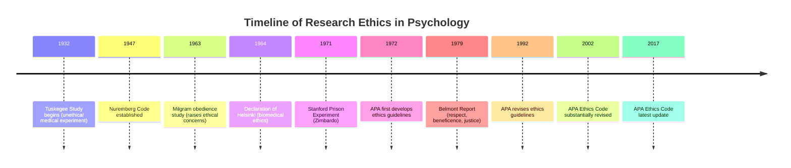
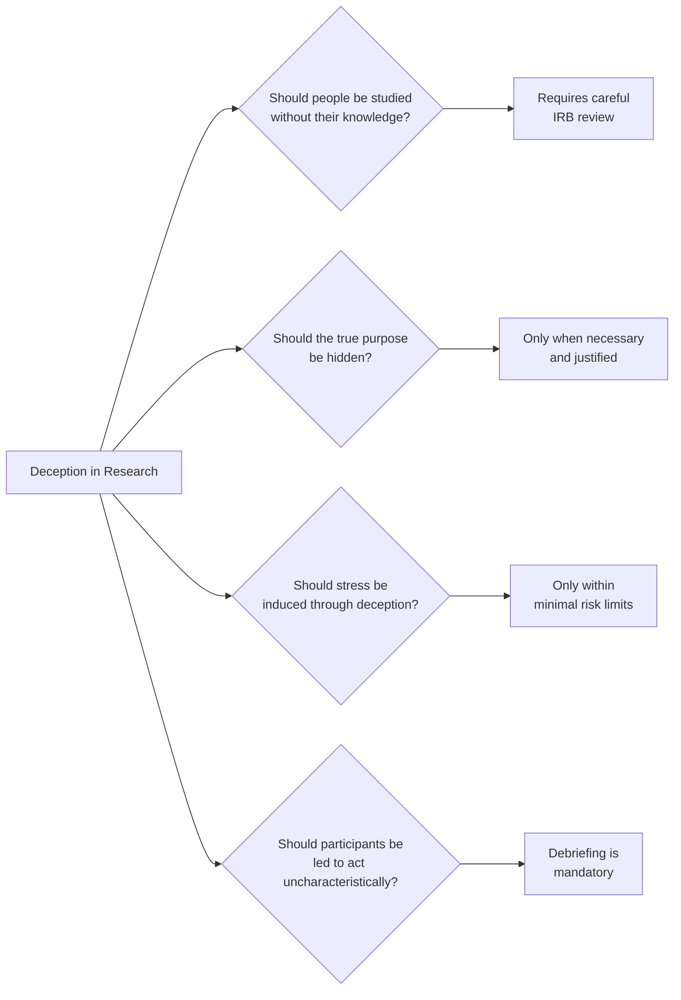
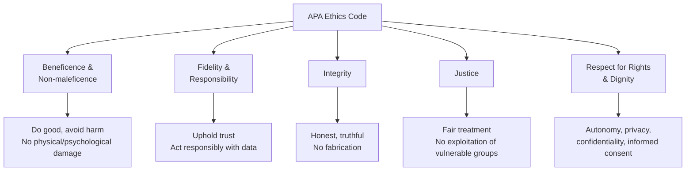

# Ethical Issues in Social Psychological Research

Science depends on the trust of those who participate in it. Yet social psychology — by its very nature — often requires studying people in ways they might not fully anticipate or understand. This tension between **scientific necessity** and **participant rights** has generated one of the richest ethical debates in all of social science.

---

**Source PDFs**:
- 📄 [Block-1/Unit-4.pdf – Pages 75–78](/pdfs/MPC-004%20Advanced%20Social%20Psychology/Block-1/Unit-4.pdf)
- 📚 MPC-004 Advanced Social Psychology

---

## 4.6 Historical Context: The Rise of Research Ethics

Until the mid-20th century, ethical concern about research participants was minimal. Two historical events transformed this situation permanently:

### The Nuremberg Code (1947)

After **World War II**, the Nuremberg trials exposed Nazi doctors' horrific medical experiments on concentration camp prisoners — conducted without consent, causing immense suffering and death. The resulting **Nuremberg Code (1947)** established:

- Voluntary consent is **absolutely essential**
- Research should be for the **good of society**
- Unnecessary harm must be **avoided**
- Experiments should be **stopped** if harm is anticipated

### The Tuskegee Syphilis Study

A notorious American case:
- **1932**: The U.S. Public Health Service began a 40-year study in Tuskegee, Alabama
- **399 poor, semi-literate African American men** with syphilis were enrolled
- They were told they were receiving **treatment** — they were not
- When **penicillin** became available as an effective cure, it was **withheld** from participants
- The study continued into the **1960s**, despite participants suffering, deteriorating, and dying
- It was only ended in **1972** after a whistleblower exposed it

This case demonstrated that **ethical failures in research are not limited to wartime enemies** — they occur in democratic societies when researchers prioritise knowledge over participant welfare.

### Landmark Social Psychology Studies with Ethical Questions

These studies shaped the ethical debate within the discipline:

| Study | Researcher | Ethical Issue |
|-------|-----------|---------------|
| Obedience to Authority | Stanley Milgram (1963) | Extreme stress, deception, potential psychological harm |
| Prison Experiment | Philip Zimbardo (1971) | Loss of control, participant harm, failure to stop study |
| Bystander Effect | Latané & Darling (1968) | Deception, placing participants in distressing situations |

---

## 4.6.1 Deception in Social Psychological Research

### Why Is Deception Used?

Most researchers agree that in many cases it is **necessary to disguise key elements** of a study to avoid participants' behaviour being influenced by what they believe the study's true purpose to be.

If participants know they are being studied for **helpfulness**, they will act more helpfully than usual. If they know a study measures **obedience**, they will consciously resist or comply in non-natural ways. Deception prevents such **demand characteristics**.

### Three Types of Deception

**1. Implicit Deception**
The actual situation differs so greatly from what participants expect that they act under incorrect assumptions — often without even knowing they are in an experiment.

*Example*: A researcher observes helping behaviour by staging a "fall" in a public space. Bystanders do not know they are participants.

**2. Technical Deception**
Equipment and procedures are **misrepresented**. Participants receive a **cover story** about the experiment's purpose, while the real purpose is entirely different.

*Example*: Milgram told participants the study was about **learning and punishment**. In reality, it investigated **obedience to authority**.

**3. Role Deception**
Other people in the study are **misrepresented**. A confederate (a trained actor) may pose as another participant or even as a peer or lecturer.

*Example*: In Asch's conformity studies, all but one person in the group were confederates who deliberately gave wrong answers.

### Ethical Dilemmas of Deception

Deception raises profound questions:

The **American Psychological Association (APA)**:
- First developed ethical research guidelines in **1972**
- Revised them significantly in **1992**
- Continues to update guidelines through the APA Ethics Code

---

## 4.6.2 Informed Consent

### Definition

> **Informed consent** requires that a research participant must voluntarily agree to participate without coercion, understanding what their participation involves.

### What Must Participants Be Told?

Researchers are obligated to inform potential participants about:

| Component | Description |
|-----------|-------------|
| **Research procedures** | What will happen during the study |
| **Risks and benefits** | Any physical or psychological risks; potential benefits |
| **Right to refuse** | Participants may decline without penalty |
| **Right to withdraw** | Participants may stop at any time without consequences |
| **Confidentiality** | How data will be stored and who will have access |

### The Tension in Deceptive Research

Informed consent creates a dilemma for deceptive studies:
- If a researcher studying **willingness to help strangers in distress** first tells participants the study's true purpose, they will behave uncharacteristically
- Even in non-deceptive studies, participants are **rarely told the specific hypotheses** being tested (to avoid hypothesis guessing)

The resolution: participants need not be told **everything** that will happen, but they must know **they are in a study** and retain the right to withdraw.

**Any exception** to informed consent requirements must be reviewed and approved by the **Institutional Review Board (IRB)** — an independent ethics committee at every research institution.

### Special Populations

Extra protections apply to:
- **Children**: Parental or guardian consent + child assent
- **Prisoners**: Concerns about coercion require heightened scrutiny
- **Cognitively impaired**: Proxy consent with best interests assessment
- **Students in researcher's class**: Power differential requires special care

### External Resources on Informed Consent

- 🌐 [Wikipedia: Informed Consent](https://en.wikipedia.org/wiki/Informed_consent)
- 🌐 [Wikipedia: Institutional Review Board](https://en.wikipedia.org/wiki/Institutional_review_board)

---

## 4.6.3 Debriefing

### Definition

**Debriefing** is the process of explaining to participants, at the end of their research involvement, the **study's true purpose, procedures, and findings** — particularly if deception was used.

### Components of Effective Debriefing

A good debriefing session includes:

1. **Explanation of the study's real purpose** — why deception was necessary
2. **Reassurance** — any negative feelings induced (e.g., embarrassment about compliance) are normalised
3. **Discussion opportunity** — participants can ask questions and express feelings
4. **Recovery facilitation** — helping participants recover from any distress caused
5. **Resource provision** — for sensitive topics, providing information for further support or learning
6. **Follow-up offer** — researchers may offer to share published findings with participants

### Why Debriefing Matters

Beyond ethical requirements, debriefing serves several functions:
- Restores participants to their **pre-study psychological state**
- Maintains **trust in psychological research** as an institution
- Provides participants with a **learning experience** about human behaviour
- Allows researchers to **assess psychological harm** and intervene if necessary
- Detects whether **deception was successful** (manipulation checks)

### Limitations of Debriefing

Not all harms can be undone by debriefing:
- **Milgram participants**: Some reported lasting distress despite debriefing
- **Belief perseverance**: Even after correction, initial false beliefs may persist
- **Stigma induction**: Learning one "obeys authority" may cause lasting self-reassessment

This is why the ethical debate continues beyond debriefing — prevention (through minimal risk) is better than remediation.

---

## 4.6.4 The Minimal Risk Principle

### Definition

**Minimal risk** means that the potential risks of participating in research should be **no greater than those ordinarily encountered in daily life** or during routine physical or psychological examinations.

### Categories of Risk in Social Psychological Research

**1. Invasion of Privacy**
- Individuals' right to privacy must be respected
- Observational studies in public places raise questions about consent
- Digital data collection and social media research create new privacy challenges

**2. Stress-Based Risks**
- Studies involving staged emergencies, authority pressure, or failure induction
- Emotional distress from confronting disturbing information
- Social anxiety induced by evaluation situations

### Risk Minimisation Strategies

| Strategy | Description |
|----------|-------------|
| **Pilot testing** | Test procedures before full study to assess stress levels |
| **Stopping rules** | Define in advance when to halt a study due to distress |
| **Screening** | Exclude individuals with relevant vulnerabilities |
| **Alternative designs** | Use role-play, hypothetical scenarios, or simulation |
| **Graduated exposure** | Begin with less stressful components |
| **IRB oversight** | Independent review of all procedures before study begins |

### The Principle of Beneficence

Related to minimal risk is the broader ethical principle of **beneficence** (from the Belmont Report):
- Research should aim to **maximise benefits**
- Risks to participants should be **justified by the potential benefits** to knowledge and society
- Risks should be **distributed fairly** — not concentrated among vulnerable populations

:::important
The ethical principle at stake: participants should leave a study "in essentially the **same state of mind and body** in which they entered."
:::

---

## The APA Ethics Code: Key Principles

The American Psychological Association's **Ethical Principles of Psychologists and Code of Conduct** establishes:

---

## Cross-Cutting Ethical Framework: The Belmont Principles

The **Belmont Report (1979)** — produced by the U.S. National Commission for Protection of Human Subjects — established three core principles that underpin research ethics globally:

| Principle | Description | Application in Social Psychology |
|-----------|-------------|----------------------------------|
| **Respect for Persons** | Treat individuals as autonomous agents; protect those with diminished autonomy | Informed consent; special protections for vulnerable groups |
| **Beneficence** | Maximise benefits; minimise harms | Risk-benefit analysis; stopping rules |
| **Justice** | Distribute research burdens and benefits fairly | Avoid exploiting disadvantaged groups as research subjects |

---

## External Resources

- 🌐 [Wikipedia: Research Ethics](https://en.wikipedia.org/wiki/Research_ethics)
- 🌐 [Wikipedia: Tuskegee Syphilis Study](https://en.wikipedia.org/wiki/Tuskegee_Syphilis_Study)
- 🌐 [Wikipedia: Nuremberg Code](https://en.wikipedia.org/wiki/Nuremberg_Code)
- 🌐 [Wikipedia: Milgram Experiment](https://en.wikipedia.org/wiki/Milgram_experiment)
- 🌐 [Wikipedia: Belmont Report](https://en.wikipedia.org/wiki/Belmont_Report)
- 📹 [Crash Course Psychology: Research Ethics](https://www.youtube.com/watch?v=pdmFTqBEhEM)
- 📹 [Milgram Experiment Documentary – Yale University](https://www.youtube.com/watch?v=mOUEC5YXV8U)
- 📄 [Bohannon (2023) – Replication and ethical scrutiny in psychology – Science](https://www.science.org/doi/10.1126/science.abi5154)
- 📄 [Pittman (2020) – The evolution of research ethics in psychology – American Psychologist](https://psycnet.apa.org/doi/10.1037/amp0000636)

---

## Memory Aid: **DIMD**

The four main ethical guidelines:

> **D**eception (use sparingly, justify) → **I**nformed Consent (always obtain) → **M**inimal Risk (ensure) → **D**ebriefing (always provide)

And for types of deception: **ITR**

> **I**mplicit → **T**echnical → **R**ole

---

## Comparison: Ethical Standards in Different Research Contexts

| Context | Key Ethical Concern | Special Requirement |
|---------|--------------------|--------------------|
| Laboratory experiment | Deception, stress induction | Debriefing mandatory |
| Field study | Privacy invasion | Anonymisation |
| Internet/social media research | Informed consent, data security | GDPR-equivalent protections |
| Clinical research | Harm to vulnerable participants | IRB oversight, enhanced consent |
| Cross-cultural research | Cultural sensitivity, power dynamics | Community consultation |

---

## Self-Assessment Questions

### Basic Understanding
1. What is the ethical significance of the Tuskegee Syphilis Study? What principles were violated?
2. Define the three types of deception used in social psychological research. Give an example of each.
3. What does informed consent require? What must participants be told?
4. Define debriefing. What should it include?
5. What is the minimal risk principle?

### Intermediate Analysis
6. Why is deception sometimes considered necessary in social psychological research? What are the primary arguments for and against its use?
7. Explain the tension between informed consent and the need for deception in experimental research. How do researchers resolve this tension?
8. What are the key principles of the Belmont Report? How do they apply to social psychological research?

### Advanced Critical Thinking
9. Some critics argue that the field of psychology has still not adequately addressed its legacy of unethical research (including studies on racial minorities, prisoners, and children). Discuss the extent to which current ethical frameworks are sufficient.
10. Evaluate the Milgram obedience studies from an ethical perspective. Do the scientific insights gained justify the methods used? Could modern researchers study obedience in a fully ethical way?
11. How has digital technology and online research created new ethical challenges that traditional guidelines did not anticipate?
