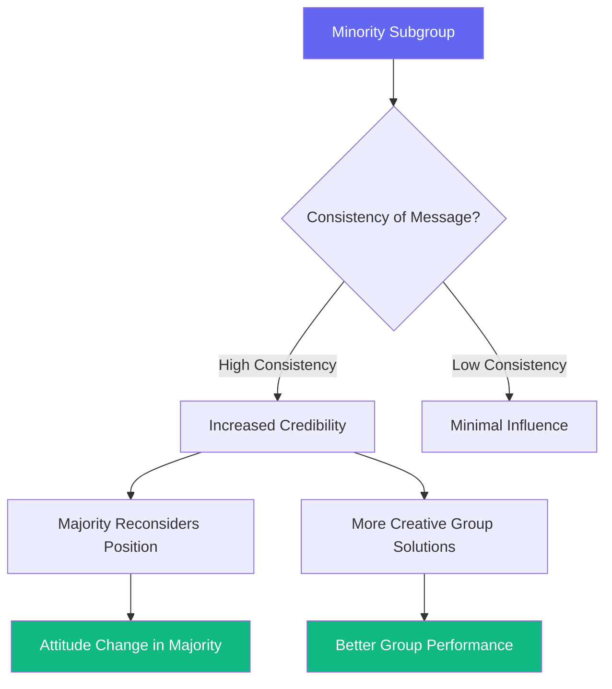
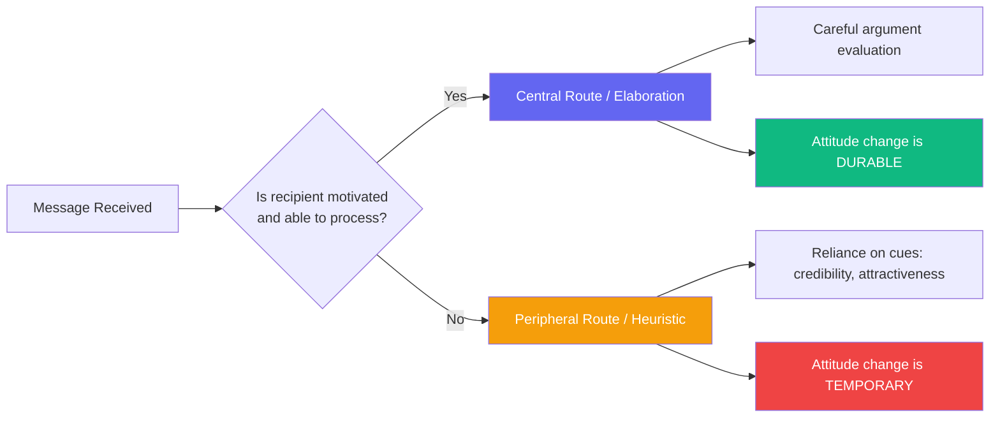
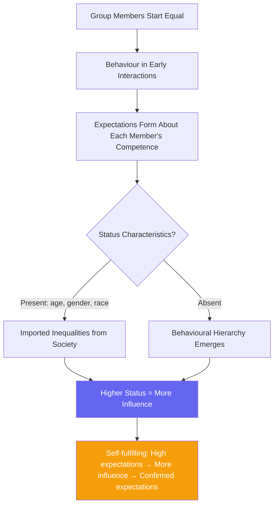

# The Concept of Social Influence: Theories and Research

## Introduction

Social influence is one of the most fundamental forces shaping human behaviour, thought, and society. It is defined as **change in an individual's thoughts, feelings, attitudes, or behaviours that results from interaction with another individual or group**. Social influence refers to the change in behaviour that one person causes in another — intentionally or unintentionally — such that the changed person perceives himself in relationship to the influencer, other people, and society in general.

French and Raven (1959) provided an early formalisation of social influence in their discussion of the bases of social power. For them, agents of change included not just individuals and groups, but also norms and roles. They viewed social influence as the outcome of the exertion of social power from one of five bases: **reward power, coercive power, legitimate power, expert power, or referent power**.

Since 1959, scholars have distinguished true social influence from forced public acceptance and from changes based on reward or coercive power. Current research has moved toward understanding the cognitive, structural, and dynamic processes through which individuals genuinely adopt new attitudes and behaviours.

---

**Source PDFs**:
- 📄 [Block-2/Unit-1.pdf - Pages 5-9](/pdfs/MPC-004%20Advanced%20Social%20Psychology/Block-2/Unit-1.pdf)
- 📚 MPC-004 Advanced Social Psychology, Block-2: Process of Social Influence

---

## 1. French and Raven's Bases of Social Power

The foundational framework by [French and Raven (1959)](https://en.wikipedia.org/wiki/French_and_Raven%27s_bases_of_power) identifies five bases through which social influence operates:

| Base of Power | Description | Example |
|---|---|---|
| **Reward Power** | Ability to provide positive outcomes | Employer offering bonus for compliance |
| **Coercive Power** | Ability to punish non-compliance | Teacher giving detention |
| **Legitimate Power** | Authority from formal position/role | Police officer giving orders |
| **Expert Power** | Influence through knowledge/skill | Doctor's medical advice |
| **Referent Power** | Influence through identification/admiration | Celebrity endorsement |

While reward and coercive power involve external pressure, expert and referent power operate through genuine persuasion — the domain of true social influence research.

---

## 2. Current Research Areas in Social Influence

Current research on social influence generally uses experimental methodology and tends to fall into five main areas:

1. Minority influence in group settings
2. Research on persuasion
3. Dynamic social impact theory
4. A structural approach (Social Influence Network Theory)
5. Social influence in Expectation States Theory

---

## 3. Minority Influence

Minority influence occurs when a **minority subgroup attempts to change the majority**. While traditional views characterised social influence as the majority overriding the minority, modern research shows that every group member can influence others.

Key findings:
- Minority influence is most effective when the minority **is consistent** in what it presents to the majority
- Minority groups often lead to **more creative thinking** and better overall solutions on group tasks
- Nemeth and Kwan (1987) demonstrated this in four-person groups: individuals in the minority condition produced *more correct solutions*, indicating the strong effect of minority viewpoints

### Why Minority Influence Matters

Minority influence has been responsible for many social, scientific, and political transformations — from the civil rights movement to scientific revolutions (e.g., Copernicus proposing heliocentrism against the dominant geocentric majority view). Moscovici's research showed that consistent, confident minorities can shift majority opinions even when the minority lacks formal authority.

---

## 4. Persuasion

Persuasion is broadly defined as **change in attitudes or beliefs based on information received from others**. Current research focuses on written or spoken messages sent from source to recipient, with the assumption that individuals process messages carefully when motivated and able to do so.

Two major models dominate modern persuasion research:

---

## 5. Elaboration Likelihood Model (ELM)

The **Elaboration Likelihood Model (ELM)**, developed by Cacioppo, Petty, and Stoltenberg (1985), has been used most frequently in therapeutic and counselling settings.

The ELM states that **the amount and nature of thinking that a person does about a message will affect the kind of persuasion that the message produces**.

### Two Routes to Persuasion

Key variables in the ELM:
- **Source**: Credibility, attractiveness, expertise
- **Message**: Argument quality, length, complexity
- **Recipient**: Involvement, need for cognition, prior knowledge
- **Affect**: Emotional state of the recipient
- **Context**: Setting and channel of communication

The **degree to which the recipient views the message as personally relevant** is a crucial determinant. This model has demonstrated utility in health communication — persuading cancer patients to seek treatment, discouraging teen tobacco use, and promoting vaccine uptake.

---

## 6. Heuristic-Systemic Model (HSM)

The **Heuristic-Systemic Model** (Chaiken, 1980) proposes two routes similar to ELM:

| Route | When Used | Persuasion Outcome |
|---|---|---|
| **Systematic Route** | High motivation + ability | Deep processing; durable change |
| **Heuristic Route** | Low motivation or ability | Surface cues; temporary change |

When a target is not motivated or unable to attend carefully, persuasion occurs through **indirect means** — nonverbal cues, source credibility, or likeability heuristics. Persuasion through the heuristic route is more likely to be **temporary**, while systemic persuasion produces **relatively permanent** attitude change.

**Heuristics commonly used in everyday persuasion:**
- "Experts are usually right" (credibility heuristic)
- "If many people do it, it must be good" (consensus heuristic)
- "Longer arguments must be more thorough" (length heuristic)

---

## 7. Social Impact Theory

**Social Impact Theory**, developed primarily by Bibb Latané (1981), proposes that social impact — any of the number of changes that might occur in an individual (physiological, cognitive, emotional, or behavioural) due to the presence or action of others — is a function of three factors:

1. **Strength** (salience or power of the source)
2. **Immediacy** (closeness in space or time)
3. **Number** (how many people make up the source)

This is expressed in a multiplicative formula: **Impact = f (Strength × Immediacy × Number)**

### Dynamic Social Impact Theory

Latané (1996) extended this into **Dynamic Social Impact Theory**, which uses ideas about social impact to describe and predict the **diffusion of beliefs through social systems**. Key features:

- Social structure is the result of individuals influencing each other dynamically
- **Immediacy** produces localised cultures of beliefs within communication networks
- Initially randomly distributed attitudes become **clustered** over time
- Less popular beliefs become consolidated into **minority subcultures**
- Society is viewed as a **self-organising complex system**

This has important implications for understanding how social media echo chambers form, how fashion trends emerge, and how political polarisation develops.

---

## 8. Social Influence Network Theory

**Social Influence Network Theory**, as described by Friedkin (1998), has roots in social psychology and mathematical modelling. The formal theory involves a **weighted averaging of influential opinions**.

Process:
1. Actors start with their own initial opinions
2. At each stage, actors form a "norm" opinion: a weighted average of others' opinions in the group
3. Actors modify their own opinion: a weighted average of their initial opinion and the network norm
4. This process continues until equilibrium is reached

This theory uses **mathematical models and quantifications** to measure the process of social influence, predicting how group opinion settles based on the structure of interpersonal influence networks.

**Practical applications:**
- Predicting jury deliberation outcomes
- Modelling opinion formation in online social networks
- Understanding how scientific consensus emerges

---

## 9. Expectation States Theory

**Expectation States Theory** (Berger et al., 1980), rooted in the work of Bales (1950), explains inequalities in the amount of influence group members have over one another.

Key findings by Bales (1950):
- Even when group members are equal in status at the start, some members become more influential than others
- Groups develop **hierarchies** based on member behaviour
- When group members are initially unequal, inequalities from the larger society (age, sex, race) structure a hierarchy of influence

According to the theory:
- Group members develop **expectations about the future task performance** of all members, including themselves
- These expectations **guide and are maintained** by group interaction
- Those for whom the **highest expectations are held** will be the most influential

---

## 10. Comparison of Social Influence Theories

| Theory | Key Proponent | Core Mechanism | Focus |
|---|---|---|---|
| **French & Raven's Power Bases** | French & Raven (1959) | Five bases of social power | Sources of influence |
| **Minority Influence** | Moscovici; Nemeth & Kwan | Consistency and confidence | Minority-to-majority change |
| **ELM** | Cacioppo, Petty & Stoltenberg (1985) | Dual-route processing | Persuasion depth |
| **Heuristic-Systemic Model** | Chaiken (1980) | Heuristics vs systematic processing | Persuasion routes |
| **Social Impact Theory** | Latané (1981) | Strength × Immediacy × Number | Quantifying influence |
| **Dynamic Social Impact Theory** | Latané (1996) | Diffusion through networks | Cultural clustering |
| **Social Influence Network Theory** | Friedkin (1998) | Weighted opinion averaging | Mathematical modelling |
| **Expectation States Theory** | Berger et al. (1980) | Performance expectations | Group hierarchy |

---

## 11. Real-World Applications

### Health Communication
The ELM has been extensively applied in health campaigns. When message recipients are personally involved (e.g., cancer screening campaigns for high-risk individuals), central route processing is activated, producing more durable attitude changes and behaviour modification.

### Marketing and Advertising
Heuristic processing explains why celebrity endorsements, "4 out of 5 dentists recommend" claims, and expert testimonials are so effective — they bypass systematic evaluation and trigger easy heuristics.

### Online Echo Chambers
Dynamic Social Impact Theory predicted the emergence of online echo chambers decades before social media existed. The clustering of like-minded individuals on social platforms is a direct consequence of immediacy and homophily.

### Indian Context
In Indian society, social influence operates through strong hierarchical systems — respect for elders, gurus, and authority figures. The *guru-shishya* (teacher-student) tradition exemplifies legitimate and expert power combined with referent power. Research in Indian contexts shows that normative conformity is particularly strong in collectivist cultures, where belonging to the group is a central value.

---

## External Resources

### Wikipedia Articles
- 🌐 [Social Influence](https://en.wikipedia.org/wiki/Social_influence)
- 🌐 [Elaboration Likelihood Model](https://en.wikipedia.org/wiki/Elaboration_likelihood_model)
- 🌐 [Heuristic-Systematic Model](https://en.wikipedia.org/wiki/Heuristic-systematic_model_of_information_processing)
- 🌐 [Social Impact Theory](https://en.wikipedia.org/wiki/Social_impact_theory)
- 🌐 [Minority Influence](https://en.wikipedia.org/wiki/Minority_influence)

### Educational Videos
- 🎥 [Social Influence: Crash Course Psychology #38](https://www.youtube.com/watch?v=UGxGDdQnC1Y) — Excellent overview of conformity, compliance, and obedience
- 🎥 [Persuasion and Influence - Yale Open Courses](https://oyc.yale.edu/psychology/psyc-110) — Robert Cialdini's influence principles in academic context
- 🎥 [The Elaboration Likelihood Model Explained](https://www.youtube.com/watch?v=MeB2FzQSvT8) — Clear animated explanation of ELM

### Recent Research Papers (2020–2024)
- 📄 **Matz et al. (2022)** - "Potential for Influence at Scale" — *PNAS* — Studied how psychological targeting on social media leverages social influence mechanisms to persuade millions
- 📄 **Bail et al. (2021)** - "Breaking the Social Media Prism" — Princeton University Press — Dynamic Social Impact Theory applied to political polarisation
- 📄 **Cialdini et al. (2023)** - "Pre-suasion: Channelling Attention for Change" — Annual Review of Psychology — Updated principles of social influence in digital environments
- 📄 **Van Kleef & Côté (2022)** - "The Social Effects of Emotions in Groups" — *Psychological Science* — How emotional contagion drives social influence in group settings

### Academic Resources
- 🔬 [Annual Review of Social Psychology - Social Influence](https://www.annualreviews.org/journal/soc)
- 🔬 [Journal of Personality and Social Psychology](https://www.apa.org/pubs/journals/psp)

---

## Memory Aids

### Mnemonic: MINES (Social Impact Theory)
> **M**agnitude × **I**mmediacy × **N**umber = **S**ocial Impact **E**ffect

### Mnemonic: SECRNE (French & Raven's Power Bases)
> **S**trength comes from: **E**xpert, **C**oercive, **R**eward, **N**orm (legitimate), **E**motional (referent) power

### ELM Routes — The "Highway vs Country Road" Analogy
> The **Central Route** is like a highway: fast processing of the message content, leading to durable attitude change.
> The **Peripheral Route** is the country road: slower, winding, relying on scenic cues (attractiveness, credibility) rather than destination quality.

---

## Self-Assessment Questions

### Basic Understanding
1. Define social influence and distinguish it from forced compliance. How did French and Raven's (1959) framework advance the study of social influence?

2. What is minority influence? Under what conditions is a minority most likely to change the views of the majority? Give a real-world example.

3. Compare and contrast the Elaboration Likelihood Model (ELM) and the Heuristic-Systemic Model (HSM). What do they have in common, and where do they differ?

### Applied Understanding
4. You are a public health official launching a vaccination campaign. Using the ELM and HSM, design two different message strategies: one targeting highly motivated, medically literate adults, and one targeting individuals with low involvement. What elements would each strategy include and why?

5. Social Impact Theory states that influence is a function of Strength × Immediacy × Number. Apply this formula to explain:
   (a) Why peer pressure from a close friend is more powerful than from a distant acquaintance
   (b) Why influence decreases as group size increases beyond a certain point

6. Expectation States Theory suggests that group hierarchies form based on performance expectations, not just formal status. How might this theory explain why a first-year medical student might defer to a wrong diagnosis given confidently by a senior consultant?

### Critical Analysis
7. Dynamic Social Impact Theory predicts that beliefs cluster in localised subgroups over time. How does this explain the formation of echo chambers on social media platforms like Twitter or Facebook? What interventions might prevent unhealthy polarisation?

8. Minority influence has been responsible for many positive social changes (e.g., civil rights, environmental movements). What characteristics distinguish a minority group that successfully influences the majority from one that fails? Use both theory and historical examples.

---

## Summary

Social influence encompasses the processes through which individuals' attitudes, beliefs, and behaviours are shaped by others. From French and Raven's power bases to modern computational models, research has revealed that influence operates through multiple pathways: persuasion routes (ELM, HSM), structural network dynamics (Social Influence Network Theory), group processes (Expectation States Theory), and collective diffusion (Dynamic Social Impact Theory). The three main areas of social influence — conformity, compliance, and obedience — represent the behavioural outcomes of these theoretical processes, which we explore in subsequent units.

---

*Cross-references:*
- *[Conformity and Asch's Experiment](/mpc-004/block-2/conformity-asch-experiment)*
- *[Compliance and Cialdini's Principles](/mpc-004/block-2/compliance-cialdini-principles-strategies)*
- *[Obedience and Milgram Experiment](/mpc-004/block-2/obedience-milgram-stanford-hofling)*
