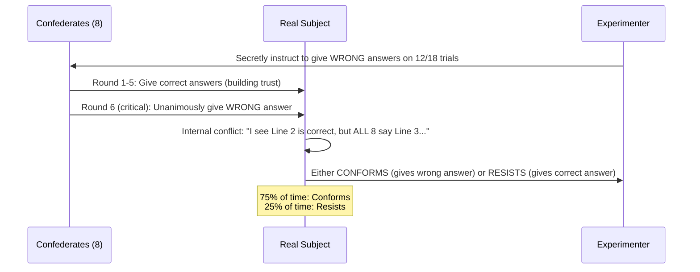

# Conformity: Asch's Experiment and the Forces of Social Influence

## What is Conformity?

**Conformity** is the process by which an individual's attitudes, beliefs, and behaviours are conditioned by what is conceived to be what other people might perceive. It is the tendency to change our perceptions, opinions, or behaviour in ways that are consistent with group norms.

Conformity is not merely surface-level compliance — it can run very deep. We may change our **beliefs and values** to match those of our peers and admired superiors. This influence occurs in:
- Small groups and society as a whole
- As the result of subtle unconscious influences, or direct overt social pressure
- Even through the **"implied presence" of others** when other people are not actually present

For example, people follow norms of society when eating or watching television, even when completely alone at home.

> *"People often conform from a desire to achieve a sense of security within a group — typically a group that is of a similar age, culture, religion, or educational status."* — Aronson et al. (2007)

Because conformity is a group phenomenon, factors such as **group size, unanimity, cohesion, status, prior commitment, and public opinion** all help to determine the level of conformity an individual will display.

---

**Source PDFs**:
- 📄 [Block-2/Unit-1.pdf - Pages 9-15](/pdfs/MPC-004%20Advanced%20Social%20Psychology/Block-2/Unit-1.pdf)
- 📚 MPC-004 Advanced Social Psychology, Block-2: Process of Social Influence

---

## Asch's (1951) Classic Experiment on Conformity

Perhaps the **most influential study of conformity** came from Solomon E. Asch (1951), a foundational experiment that continues to shape social psychology research to this day.

### Procedure

Asch gave groups of 7–9 college students what appeared to be a test of **perceptual judgment**: matching the length of a line segment to comparison lines. Participants were shown two cards:
- **Left card**: One standard line
- **Right card**: Three comparison lines (numbered 1, 2, 3)

The task was simple: which comparison line equals the standard line? Without group pressure, people could pick the correct line **99% of the time**.

**The trick**: In a group of nine, **eight subjects were actually confederates** of the experimenter, secretly instructed to give wrong answers on 12 of the 18 trials — claiming, for instance, that a 4.5-inch line equalled a 3-inch standard.

The genuine subject was always called upon **next-to-last**, hearing eight unanimous wrong answers before giving their own.

### Results

| Condition | Accuracy |
|---|---|
| Individual (no group pressure) | 99% correct |
| With group pressure (12 critical trials) | Conformed 75% of the time |
| Subjects who NEVER conformed | ~25% |

The **75% conformity rate** was striking: people knowingly gave wrong answers under social pressure. When asked why, subjects reported:
- "They must have been looking at line widths"
- "I assumed it was an optical illusion"
- "If eight out of nine people made the same choice, I must have missed something"

### Key Findings

**Effect of a dissenter**: When one confederate disagreed with the majority, this was **enough to free most subjects** from the conformity effect. However, if the dissenter later joined the majority, conformity rates increased again.

**Public vs. Private judgments**: When subjects wrote responses privately while others gave oral responses, the conformity effect was **destroyed** — demonstrating that conformity is largely about public behaviour, not private belief.

**Cultural replication**: NBC News had social psychologist Anthony Pratkanis replicate the Asch experiment in 1997 — the percentage of conformists was nearly identical to 1951 findings, showing the effect is not era-specific.

**A non-conformist's voice**: One independent subject told Asch: *"I've never had any feeling that there was any virtue in being like others. I'm used to being different. I often come out well by being different. I don't like easy group opinions."*

---

## Factors Found to Increase Conformity

Post-Asch research identified several factors that amplify conformity:

1. **Attractiveness of group members**: People tend to go along with a group of attractive people
2. **Complexity or difficulty of the task**: When judgment is difficult, people rely more on others
3. **Group cohesiveness**: People conform more when friendships or mutual dependencies are established beforehand
4. **Group size**: Conformity increases up to 3–4 confederates, then levels off
5. **Unanimity**: Even one dissenter dramatically reduces conformity
6. **Public vs. private responses**: Public judgments produce much more conformity
7. **Status of the group**: Groups we value and respect exert stronger pressure

---

## Two Types of Conformity: Informational vs. Normative Social Influence

Research has focused primarily on two main varieties of conformity:

### Type 1: Informational Social Influence

**Informational social influence** occurs when one turns to members of one's group to obtain **accurate information**. It represents learning from others because you genuinely believe they might be right.

**Most likely in three situations:**
1. **Ambiguous situations**: When uncertain about what to do, people depend on others for the answer
2. **Crisis situations**: When immediate action is necessary despite panic
3. **Expert presence**: When someone appears more knowledgeable

**Outcome**: Often results in **internalisation or private acceptance** — genuinely believing the information is correct.

**Classic demonstration**: Muzafer Sherif's **autokinetic experiment** (1936)
- Participants in a dark room estimated movement of a stationary light (autokinetic effect — a visual illusion)
- Over time, group members converged on the same estimate
- Sherif interpreted this as a simulation of how **social norms develop** in society — providing a common frame of reference

**Baron (1996) eyewitness study on informational influence:**
- Task: Identify a suspect in a lineup (only 1 second allowed — a difficult task)
- High motivation condition: "Your input is very important for legal community" → 51% conformed
- Low motivation condition: "Just a trial" → 35% conformed
- Higher motivation to be accurate → greater reliance on others' information

### Type 2: Normative Social Influence

**Normative social influence** occurs when one conforms **to be liked or accepted** by members of the group. It usually results in **public compliance** — doing or saying something without genuinely believing it.

**Key features:**
- Driven by the need for social approval and fear of rejection
- Can occur even when you privately know the group is wrong (as in Asch's experiment)
- Behaviour is performed publicly, not based on genuine belief change

**Three components of normative influence (Social Impact Theory):**
1. **Number**: As group size increases, each person has less individual impact
2. **Strength**: How important the group is to the person
3. **Immediacy**: How close the group is in time and space

**Baron (1996) normative influence study:**
- Same setup, but easier task (5 seconds instead of 1 second)
- Low motivation group: Conformed 33% (consistent with Asch)
- High motivation group: Conformed only 16%
- **Conclusion**: When accuracy is not important, it is better to conform wrongly than to risk social disapproval

**Friends vs. strangers**: Studies found significantly **less conformity in groups of friends** than strangers — friends may feel less normative pressure because acceptance is already established. However, field studies on cigarette and alcohol use show friends *do* exert normative influence on each other.

### Informational vs. Normative Social Influence: Comparison

| Feature | Informational | Normative |
|---|---|---|
| **Motivation** | Want to be correct | Want to be liked/accepted |
| **Outcome** | Private belief change (internalisation) | Public compliance (surface behaviour) |
| **Occurs when** | Situation is ambiguous, difficult | Social approval is at stake |
| **Durability** | Longer lasting | Temporary (may revert in private) |
| **Classic Study** | Sherif's autokinetic (1936) | Asch's line experiment (1951) |

---

## Minority Influence and Conformity

Although conformity leads individuals to think and act more like groups, individuals are occasionally able to reverse this tendency and change the people around them. This is called **minority influence** — a special case of informational influence.

**Minority influence is most likely when:**
- The minority makes a **clear, consistent case** for their point of view
- Minority members are perceived as **experts or high in status**
- Minority members have **benefited the group in the past**
- The minority does **not show uncertainty or fluctuation**

**Negative minority influence**: Minority members can sometimes create a negative emotional climate that interferes with group functioning. This can be managed through careful selection procedures and by reassigning members to positions requiring less social interaction.

---

## Gender and Conformity

Societal norms often establish gender differences in conformity:

**Eagly and Carli's Meta-Analysis**: A meta-analysis of 148 studies of influenceability found that:
- Women are **more persuasible and conforming** than men in group pressure situations **involving surveillance**
- In situations **NOT involving surveillance**, women are less likely to conform

**Sistrunk and McDavid's studies** (across university, college, and high school):
- Females conformed more than males 3 out of 4 times on **masculine-typed questions**
- Males conformed more than females 2 out of 4 times on **feminine-typed questions**
- Suggests gender differences in conformity may reflect **familiarity and expertise** rather than fundamental personality differences

**Group composition effects** (Reitan and Shaw, 1964):
- Both men and women conformed **more** in mixed-sex groups than same-sex groups
- Mixed-sex groups produced more apprehension when discrepancies arose, leading to more self-doubt

**Body image and normative conformity:**
- Normative social influence explains women's attempts to achieve the "ideal body" through dieting and, in extreme cases, eating disorders
- Men pursue ideal body image through dieting, steroids, and overtraining
- Both likely learn what bodies are culturally attractive through **informational social influence**

---

## External Resources

### Wikipedia Articles
- 🌐 [Conformity (Psychology)](https://en.wikipedia.org/wiki/Conformity)
- 🌐 [Asch Conformity Experiments](https://en.wikipedia.org/wiki/Asch_conformity_experiments)
- 🌐 [Informational Social Influence](https://en.wikipedia.org/wiki/Informational_social_influence)
- 🌐 [Normative Social Influence](https://en.wikipedia.org/wiki/Normative_social_influence)
- 🌐 [Solomon Asch](https://en.wikipedia.org/wiki/Solomon_Asch)

### Educational Videos
- 🎥 [Asch Conformity Experiment - Original Footage](https://www.youtube.com/watch?v=NyDDyT1lDhA) — The original experiment footage and analysis
- 🎥 [Conformity: Crash Course Psychology](https://www.youtube.com/watch?v=UGxGDdQnC1Y) — Accessible overview with modern examples
- 🎥 [Why Do We Conform? | BBC Documentary](https://www.youtube.com/watch?v=MEDsqjCuBH4) — Modern replications and explanations

### Recent Research Papers (2020–2024)
- 📄 **Sunstein & Thaler (2021)** - "Nudge: The Final Edition" — Updated research on how normative information nudges can change behaviour at scale
- 📄 **Fousiani et al. (2022)** - "Conformity Under Threat: How Group Norms Shape Responses to Climate Change" — *Journal of Environmental Psychology*
- 📄 **Brandimarte et al. (2021)** - "Digital Conformity: Group Norms in Online Settings" — *Computers in Human Behavior* — How Asch-like conformity operates in social media environments
- 📄 **Navajas et al. (2022)** - "Aggregated Knowledge from a Small Number of Debates Outperforms the Wisdom of Large Crowds" — *Nature Human Behaviour* — How minority viewpoints improve group accuracy

---

## Memory Aids

### Mnemonic for Asch's Results: "75-25 LINE"
> **7**5% conformed on critical trials
> **2**5% remained independent throughout
> **L**ine judgment task
> **I**ndependent subjects showed principled disagreement
> **N**ine-person groups (8 confederates + 1 real subject)
> **E**ven one dissenter breaks the effect

### Mnemonic: "ACCEPT" (Factors increasing conformity)
> **A**ttractiveness of group members
> **C**ohesiveness of the group
> **C**omplexity/difficulty of task
> **E**qual public pressure (surveillance)
> **P**ublic nature of judgments
> **T**ask importance

### Informational vs Normative: "I Know vs I Care"
> **Informational**: "I conform because *I don't know* — they might be right"
> **Normative**: "I conform because *I care* what they think of me"

---

## Self-Assessment Questions

### Basic Understanding
1. Define conformity and explain why it is an important phenomenon in social psychology. What evolutionary purposes might conformity serve?

2. Describe Asch's (1951) experiment in detail: the procedure, results, and what happened when a dissenter was introduced. Why did subjects conform even when the answer was obviously wrong?

3. Distinguish between informational and normative social influence. In which situations is each type more likely to occur? Give two examples of each from everyday life.

### Applied Understanding
4. A student in a university tutorial group notices that the professor seems to endorse a viewpoint they disagree with. Most of the group nods in agreement. The student stays silent.
   (a) What type of conformity is this? 
   (b) What factors would increase or decrease the likelihood of the student speaking up?
   (c) How does this relate to Asch's findings about the role of a dissenter?

5. Sherif's autokinetic experiment and Asch's line experiment both studied conformity but yielded different insights. Compare the two studies in terms of: (a) the type of conformity studied, (b) the ambiguity of the stimulus, and (c) the implications for real-world behaviour.

6. Research shows women are more likely to conform than men in surveillance situations but not in private. What does this suggest about the nature of gender differences in conformity? Is this a difference in personality, or something else?

### Critical Analysis
7. Hodges and Geyer (2006) reinterpreted Asch's data, arguing that subjects were not as conformist as Asch suggested — instead showing a tendency to tell the truth even when others did not. What evidence supports this interpretation? Do you agree or disagree?

8. NBC News replicated Asch's experiment in 1997 with similar results. Given changes in individualism, social media influence, and awareness of social psychology since the 1950s, why do you think the conformity effect persists? What does this suggest about human nature?

---

## Summary

Conformity is one of the most powerful social forces shaping human behaviour. Asch's landmark experiments revealed that social pressure can lead individuals to deny clear perceptual evidence. Conformity operates through two distinct mechanisms: informational social influence (believing others may be right) and normative social influence (wanting to be liked and accepted). While conformity has social benefits — enabling coordination and social cohesion — it can also lead to poor decision-making, groupthink, and denial of individual judgment. Understanding these forces is essential for both personal empowerment and the design of better group decision-making processes.

---

*Cross-references:*
- *[Social Influence Theories](/mpc-004/block-2/concept-social-influence-theories)*
- *[Compliance and Cialdini's Principles](/mpc-004/block-2/compliance-cialdini-principles-strategies)*
- *[Obedience and Milgram](/mpc-004/block-2/obedience-milgram-stanford-hofling)*
