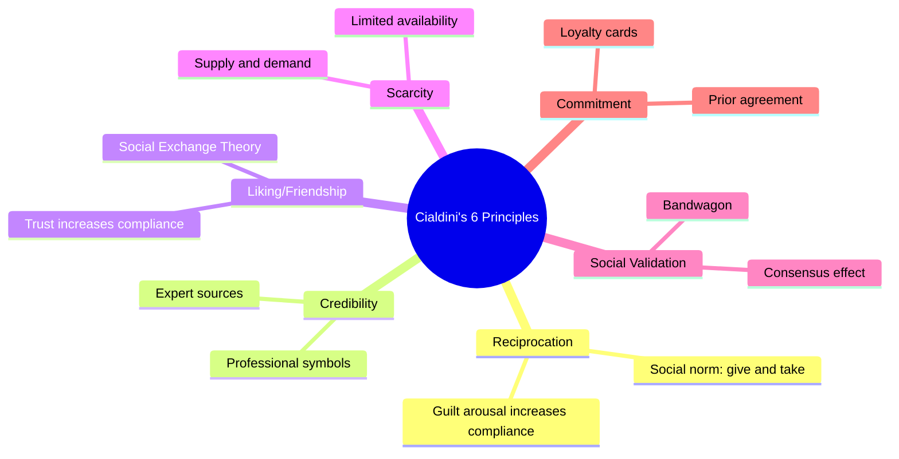
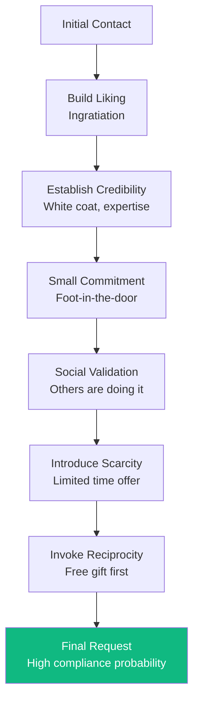

# Compliance: Cialdini's Six Principles and Compliance Strategies

## What is Compliance?

In psychology, **compliance** refers to the act of responding favourably to an explicit or implicit request offered by others. The request may be:
- **Explicit**: A direct request (e.g., "Please donate to our cause")
- **Implicit**: An indirect suggestion (e.g., an advertisement promoting products without directly asking for purchase)

In all cases, the **target recognises** that he or she is being urged to respond in a desired way. This distinguishes compliance from conformity (which involves matching group norms without explicit request) and obedience (which involves orders from authority figures).

Compliance sits between conformity and obedience. In compliance, **you have some choice** about whether to respond; in obedience, you believe you do not.

---

**Source PDFs**:
- 📄 [Block-2/Unit-1.pdf - Pages 16-21](/pdfs/MPC-004%20Advanced%20Social%20Psychology/Block-2/Unit-1.pdf)
- 📚 MPC-004 Advanced Social Psychology, Block-2: Process of Social Influence

---

## Robert Cialdini's Research on Compliance

To study compliance professions from the inside, **Robert Cialdini (2001)** joined training programs of different compliance professions (sales, advertising, public relations) and conducted participant observation. He identified **six core principles** commonly used to increase the probability of successful compliance.

These principles tap into fundamental aspects of human psychology — social norms, cognitive shortcuts, and emotional responses — making them powerful even when we are aware of them.

---

## Principle 1: Reciprocation

Based on the social norm "treat others as you would expect to be treated," **reciprocation** creates a sense of obligation when someone does us a favour. We feel motivated to reciprocate — and failing to do so violates our sense of social obligation, bearing the risk of social sanction.

**Key mechanism**: **Guilt arousal** → Increased compliance

Darlinton and Macker (1966) demonstrated this through an experiment:
- **Condition A**: Participants delivered shocks to others (guilt induction)
- **Condition B**: Participants witnessed others being shocked
- After trials, both groups were asked to make phone calls (a compliance request)
- **Result**: Condition A participants made 39 calls vs. 6.5 calls in Condition B
- **Explanation**: Participants in Condition A complied more to relieve guilty feelings

**Everyday applications:**
- Free samples in supermarkets → higher purchase rates
- A colleague bringing you coffee → higher likelihood you'll agree to their request
- A charity sending a small gift before asking for donation → significantly higher donations

---

## Principle 2: Credibility

The **source of requests** affects whether we comply. A more credible source — one with knowledge, abilities, or skills — elicits greater respect and higher compliance. This principle explains why professionals wear white lab coats, surgeons wear scrubs, and advertisements feature "expert" endorsers.

**Classic experiment (sleep study with 500 university students):**
1. Students gave initial opinions on optimal sleep hours (~8 hours average)
2. Received advice from two sources:
   - A Nobel Prize-winning physiologist specialising in sleep research (HIGH credibility)
   - A YMCA instructor (LOW credibility)
3. Both advised changing sleep estimates (0–8 hours, varying from students' baseline)
4. **Result**: Students changed their answers significantly more after advice from the physiologist than from the YMCA instructor

**Implication**: Credibility can be **real** (actual expertise) or **constructed** (symbols of expertise). This is why: 
- Drug companies feature doctors in commercials
- Financial advisors display credentials on their walls
- Influencer marketing relies on perceived authority in a niche

---

## Principle 3: Liking / Friendship

People are more likely to say yes to those they **know and like**. The Social Exchange Theory states that human relationships are formed through a subjective cost-benefit analysis — and complying with someone we like is inherently more favourable.

**Dennis (2006) Study:**
- 115 female and 94 male undergraduate students completed questionnaires about intimacy with partners
- Participants estimated the effectiveness of 32 health-related behavioural change messages (smoking cessation, safe sex) as if delivered by their partners
- **Result**: Higher levels of **intimacy in romantic relationships** were significantly and positively correlated with the estimated success of health behaviour change appeals

**Why liking increases compliance:**
- Physical attractiveness increases liking and compliance
- Similarity (shared values, background, interests) increases compliance
- Familiarity through repeated contact increases liking
- Flattery and praise increase compliance even when obviously insincere
- Association with positive things (a good meal, pleasant music) increases liking

**Practical example**: The "Tupperware party" model — people buy products not because they need them, but because they don't want to disappoint a friend.

---

## Principle 4: Scarcity

The **scarcity effect** refers to the influence of **perceived scarcity** on the subjective desirability of an object. Individuals do not want to be left without an item, and perceived scarcity signals value.

**Worchel et al. (1975) — Cookie Jar Experiment:**
- Subjects rated cookies on liking, attractiveness, and price they would pay
- **Scarce condition**: 2 cookies in the jar
- **Abundant condition**: 10 cookies in the jar
- **Result**: Ratings of liking, attractiveness, and willingness to pay were significantly **higher in the scarce condition**
- Scarce cookies were rated as more valuable even though the cookies were identical

**Psychological mechanism**: Scarcity triggers **reactance** — the motivation to maintain freedoms that are threatened. When we sense that our freedom to have something is being curtailed, we want it more.

**Marketing applications:**
- "Limited edition" releases (e.g., Air Jordans, Hermès bags)
- "Only 3 left in stock" on e-commerce sites
- "Offer expires in 24 hours" countdown timers
- "Exclusive membership" programmes

**Key insight**: This principle explains a fundamental concept in economics — supply and demand. The psychology of scarcity operates the same way: restricted supply creates perceived value.

---

## Principle 5: Social Validation

Also called the "**Principle of Conformity and Consensus**," social validation is a phenomenon in which people are more willing to take a recommended step **if they see evidence that many others — especially similar others — are taking it**.

**Schultz (1999) — Curbside Recycling Field Experiment:**
- Observed participants' curbside recycling behaviours for 17 weeks with different interventions:
  - Control, Plea, Plea + information, Plea + neighbourhood feedback, Plea + individual household feedback
- **Strongest effect**: "Plea plus neighbourhood feedback" (showing how many neighbours participated that week)
- This condition showed the most long-lasting post-intervention participation
- **Conclusion**: Knowledge that neighbours are participating creates powerful normative pressure to comply

**Why social validation works:**
- It reduces uncertainty: "If others are doing it, it's probably the right choice"
- It leverages the herd instinct: safety in numbers
- It activates conformity mechanisms (both informational and normative)

**Marketing examples:**
- "Best-selling product" claims
- Customer reviews and star ratings
- "4 out of 5 dentists recommend" (despite this being meaningless without context)
- User counts: "Join 50 million users"

Cialdini (2001) noted that providing information about others who had already complied was the **most widely used compliance principle** he encountered across industries.

---

## Principle 6: Commitment

**Commitment** to a store, company, or cause — induced by loyalty cards, bonuses, or prior agreements — can make it harder for a person to change where they shop or what they purchase. Once people commit to a position, they are motivated to remain **consistent** with that commitment.

**Why commitment works:**
- People want to appear consistent with their past behaviour
- Public commitments are particularly binding
- Small initial commitments escalate to larger ones (foot-in-the-door mechanism)

**Examples:**
- Loyalty card programmes (collect 10, get 1 free)
- Subscription services with free trials
- Having someone sign a pledge card before asking for a donation

---

## Cialdini's Six Principles: Summary Table

| Principle | Core Mechanism | Key Experiment | Marketing Example |
|---|---|---|---|
| **Reciprocation** | Obligation to return favours | Guilt-induced phone calls (Darlinton & Macker) | Free samples |
| **Credibility** | Expert compliance | Sleep study (Nobel Prize vs YMCA) | "Doctor recommended" |
| **Liking** | Compliance with those we like | Intimacy and health behaviour (Dennis) | Tupperware parties |
| **Scarcity** | Reactance to threatened freedoms | Cookie jar (Worchel et al.) | "Limited edition" |
| **Social Validation** | Consensus as a guide | Recycling field study (Schultz) | "Best-selling" labels |
| **Commitment** | Consistency motivation | — | Loyalty programmes |

---

## Four Compliance Strategies

Beyond individual principles, Cialdini and others identified **structured techniques** that systematically increase compliance by exploiting psychological tendencies.

### Strategy 1: Foot-in-the-Door Technique (FITD)

The **Foot-in-the-Door (FITD) technique** involves getting a person to agree to a **large request** by first getting them to agree to a **modest request**.

**Classic study (Freedman & Fraser, 1966):**
- Psychologists telephoned California housewives, asking them to answer a few questions about household products (small request)
- Three days later, they asked if five or six men could come to the house for 2 hours to go through cupboards and storage
- Women who received the small request first were **more than twice as likely** to agree to the 2-hour request

**Why it works:**
- Once you agree to a small request, you see yourself as a "helpful" or "cooperative" person
- Compliance with the larger request is consistent with this self-image
- Works particularly well for **pro-social requests** and **over email** (not just face-to-face)

**Real-life examples:**
- "Can I borrow the car for 1 day?" → "Can I borrow it for the weekend?"
- "Would you sign this petition?" → "Would you donate to our cause?"
- "Can I ask you a quick question?" → "Can I take 30 minutes of your time?"

### Strategy 2: Door-in-the-Face Technique (DITF)

The **Door-in-the-Face (DITF) technique** involves first making an **extremely large request** that will obviously be refused, then making a **smaller, more reasonable request** — which is more likely to be agreed to than if asked alone.

**Classic experiment (Cialdini et al.):**
- Students were asked to volunteer to counsel juvenile delinquents for **2 hours a week for 2 years** (extreme request — all refused)
- Then asked to chaperone juvenile delinquents on a **one-day trip to the zoo** (smaller request)
- **50%** agreed to the zoo trip vs. only **17%** in a control group who received only the zoo request

**Why it works:**
- Perceived as **reciprocity**: The requester "gave ground" by lowering their demand, so you feel obligated to give ground too
- **Contrast effect**: The second request seems much smaller relative to the outrageous first request
- **Guilt reduction**: Refusing the first extreme request creates guilt; the second smaller request offers a way to relieve it

**Comparison with FITD:**

| Feature | Foot-in-the-Door (FITD) | Door-in-the-Face (DITF) |
|---|---|---|
| **Starting request** | Small | Extremely large |
| **Core principle** | Commitment and consistency | Reciprocity and contrast |
| **Time gap** | Usually days apart | Usually immediate |
| **Best for** | Pro-social, charitable requests | Business negotiations |

### Strategy 3: Low-Ball Technique

The **Low-Ball technique** is a persuasion and selling strategy in which an item or service is offered at a **lower price than intended**, after which the price is raised.

**Procedure:**
1. Propose an attractive initial offer that the person will accept
2. Maximise buy-in: get verbal and public commitment (e.g., handshake, down payment)
3. Make it clear the decision is their own free will
4. Then change the agreement to the actual terms

**Classic experiment:**
- Students asked to participate in an experiment: **56%** agreed
- Then told the experiment started at **7am** (unsocial timing, revealed after commitment)
- Given option to withdraw — **none did**, and **95%** showed up at 7am (Low-Ball group)
- Control group told the 7am timing upfront: only **24%** agreed
- The commitment to the original agreement held even when conditions changed

**Why it works:**
- Once committed, people feel psychologically bound to their decision
- Backing out would require admitting you were wrong or appear inconsistent
- **Entrapment effect**: Each step of commitment makes withdrawal harder

### Strategy 4: Ingratiation

**Ingratiation** involves strategies to make oneself more liked before making a request:
- **Flattery and compliments** ("You seem like such a generous person...")
- **Self-presentation** (appearing similar to the target)
- **Opinion conformity** (agreeing with the target's views)
- **Rendering favours** before making a request

Ingratiation leverages the **liking principle**: people comply more with those they like. It is widely used in negotiations, sales, and political lobbying.

---

## Integration: How Principles and Strategies Work Together

Sophisticated compliance professionals combine multiple principles and strategies simultaneously:

---

## External Resources

### Wikipedia Articles
- 🌐 [Compliance (Psychology)](https://en.wikipedia.org/wiki/Compliance_(psychology))
- 🌐 [Robert Cialdini](https://en.wikipedia.org/wiki/Robert_Cialdini)
- 🌐 [Foot-in-the-Door Technique](https://en.wikipedia.org/wiki/Foot-in-the-door_technique)
- 🌐 [Door-in-the-Face Technique](https://en.wikipedia.org/wiki/Door-in-the-face_technique)
- 🌐 [Low-Ball Technique](https://en.wikipedia.org/wiki/Low-ball_(psychology))

### Educational Videos
- 🎥 [Cialdini's Six Principles of Influence - Animated](https://www.youtube.com/watch?v=cFdCzN7RYbw) — Clear visual summary of all six principles
- 🎥 [The Science of Persuasion | Cialdini](https://www.youtube.com/watch?v=cFdCzN7RYbw) — Official RSA Animate-style video
- 🎥 [Foot-in-the-Door vs Door-in-the-Face | Social Psychology](https://www.youtube.com/watch?v=M6kgsTAVIcM) — Clear comparison of both techniques

### Recent Research Papers (2020–2024)
- 📄 **Cialdini, R. (2021)** - "Influence, New and Expanded" — Updated principles of influence including the newly added principle of Unity
- 📄 **Doyen et al. (2022)** - "Digital Compliance: How Cialdini's Principles Operate in Online Environments" — *Journal of Consumer Psychology* — How reciprocation, scarcity, and social proof work on e-commerce platforms
- 📄 **Shu & Carlson (2023)** - "Automaticity and Compliance: When Do We Comply Without Thinking?" — *Psychological Science* — Neural basis of automatic compliance
- 📄 **Goldstein et al. (2021)** - "Using Social Norms to Motivate Pro-Environmental Behaviour" — *Journal of Consumer Research* — Social validation in environmental compliance campaigns

---

## Indian Context

In India, compliance mechanisms operate within specific cultural frameworks:

**Reciprocity in Indian culture**: The concept of *upkar* (favour/benefit) creates very strong reciprocal obligations. Social networks, especially *biradari* (community) and extended family networks, create powerful reciprocal compliance pressures.

**Credibility and hierarchy**: *Guru* figures and respected elders command enormous credibility. The low-ball technique is less effective in contexts where negotiation is culturally embedded (e.g., bazaar markets, where both parties expect haggling).

**Scarcity and festivals**: "Festival sales" and "limited Navratri offers" leverage both scarcity and social validation simultaneously. Research shows Indian consumers are particularly susceptible to social proof in purchasing decisions due to high collectivism.

---

## Memory Aids

### Mnemonic for Cialdini's Six Principles: "RCLSSC"
> **R**eciprocation
> **C**redibility
> **L**iking
> **S**carcity
> **S**ocial Validation
> **C**ommitment

*Remember: "Really Cool Lovely Scholars Show Confidence"*

### Four Compliance Strategies: "FILL"
> **F**oot-in-the-door (small then big)
> **I**ngratiation (get liked first)
> **L**ow-Ball (attractive offer then change terms)
> **L**arge-then-small = Door-in-the-Face

### FITD vs DITF: "Small fish, Big fish"
> FITD = Start with a **small fish** (small request), then catch a **big fish** (large request)
> DITF = Ask for a **whale** (huge request) first, then settle for a **big fish** (medium request)

---

## Self-Assessment Questions

### Basic Understanding
1. Define compliance and explain how it differs from conformity and obedience. Give one real-life example of each.

2. Describe Cialdini's principle of reciprocation. What is the psychological mechanism behind it, and what evidence supports its effectiveness? 

3. Explain the scarcity principle with reference to the Worchel et al. (1975) cookie jar experiment. Why does scarcity increase perceived value even when the quality of an item is unchanged?

4. What is the foot-in-the-door technique? Describe the Freedman and Fraser (1966) study and explain why the technique is effective.

### Applied Understanding
5. A non-profit organisation wants to increase donations for flood relief. Design a compliance campaign using **at least three** of Cialdini's principles. For each principle, describe the specific technique you would use and the psychological mechanism you are targeting.

6. Compare the foot-in-the-door (FITD) and door-in-the-face (DITF) techniques:
   (a) In what types of situations is each more effective?
   (b) What different psychological mechanisms do they exploit?
   (c) Give one example of FITD and one of DITF from the context of a college student's daily life.

7. The low-ball technique involves changing terms after commitment. From an ethical standpoint, what are the concerns with this technique? When, if ever, is it ethically acceptable to use?

### Critical Analysis
8. Cialdini's research is based primarily on observations in Western commercial contexts. How might the six principles of compliance differ in operation across cultures? For example, how might reciprocation, social validation, or credibility function differently in collectivist cultures like India compared to individualist cultures like the US?

9. Online platforms routinely use social proof ("1,247 people bought this in the last 24 hours"), scarcity ("Only 2 left in stock!"), and commitment (free trials that auto-renew) to increase compliance. Is this ethical? What safeguards should be in place?

---

## Summary

Compliance is a pervasive form of social influence in everyday life. Cialdini's six principles — reciprocation, credibility, liking, scarcity, social validation, and commitment — represent universal psychological mechanisms that compliance professionals exploit systematically. The four structural strategies (FITD, DITF, Low-Ball, Ingratiation) provide practical techniques for increasing compliance rates. Understanding these principles helps us both apply them ethically in legitimate contexts and recognise when they are being used to manipulate us. As consumers, citizens, and professionals, awareness of compliance mechanisms is an essential component of psychological literacy.

---

*Cross-references:*
- *[Social Influence Theories](/mpc-004/block-2/concept-social-influence-theories)*
- *[Conformity and Asch's Experiment](/mpc-004/block-2/conformity-asch-experiment)*
- *[Obedience and Milgram](/mpc-004/block-2/obedience-milgram-stanford-hofling)*
