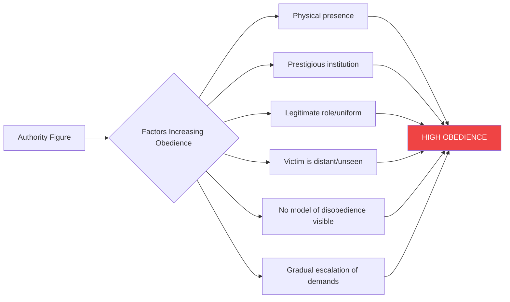

# Obedience: Milgram, Stanford Prison, and Hofling Hospital Experiments

## What is Obedience?

**Obedience** is a form of social influence where an individual acts in response to a **direct order from another individual who is usually an authority figure**. It is assumed that without such an order, the person would not have acted in this way.

### Distinguishing Obedience from Conformity and Compliance

| Type | Source of Influence | Choice Level | Example |
|---|---|---|---|
| **Conformity** | Social norms of the majority | Indirect pressure, choice available | Dressing similarly to peers |
| **Compliance** | Explicit request from peer | Some choice available | Agreeing to sign a petition |
| **Obedience** | Direct order from authority | Perceived no choice | Soldier following orders |

**Key features of obedience:**
- Involves a **hierarchy of power/status** — the person giving the order has higher status
- The authority figure is often **legitimate** (backed by institutional role)
- Obedience involves carrying out commands even when they conflict with personal values
- Humans are "surprisingly obedient" in the presence of perceived legitimate authority (Milgram, 1963)

---

**Source PDFs**:
- 📄 [Block-2/Unit-1.pdf - Pages 21-27](/pdfs/MPC-004%20Advanced%20Social%20Psychology/Block-2/Unit-1.pdf)
- 📚 MPC-004 Advanced Social Psychology, Block-2: Process of Social Influence

---

## Forms of Obedience

Milgram's **Agency Theory** states that we are in one of two states at any time:

1. **Agentic State**: We see ourselves as agents of an authority, surrendering responsibility upward. We act as instruments of authority.
2. **Autonomous State**: We see ourselves as responsible for our own actions and their consequences.

Forms of human obedience include:
- Obedience to **laws** (traffic regulations, criminal law)
- Obedience to **social norms** (queuing, table manners)
- Obedience to a **monarch, government, organisation, religion, or church**
- Obedience to **God** (religious duty)
- Obedience to **self-imposed constraints** (a vow of chastity, professional ethics)
- Obedience of a **spouse or child** to a husband/wife or parent
- Obedience to **management in the workplace**

---

## Cultural Attitudes to Obedience

Obedience is regarded as a **virtue in many traditional cultures**. Historically:
- Children were expected to be obedient to elders
- Slaves to their owners
- Serfs to their lords in feudal society
- Lords to their king
- Everyone to God

In some Christian wedding traditions, obedience was formally included in a bride's (but not the bridegroom's) wedding vow — a practice that came under attack with the women's suffrage and feminist movements.

**The modern shift:**
- As the middle classes gained political power, the power of authority was progressively eroded
- The introduction of **democracy** was a major turning point
- After the democides and genocides of WWI and WWII, obedience came to be regarded as **far less desirable** in Western cultures
- The civil rights and protest movements of the second half of the 20th century marked a remarkable reduction in respect for authority in Western cultures
- Greater respect for **individual ethical judgment** as a basis for moral decisions

---

## Obedience Training of Human Beings

Learning to obey adult rules is a **major part of the socialisation process in childhood**. Obedience training begins at birth — infants are reliant on parents, creating an initial pattern of subservience to authority.

The progression of socialisation:
1. **Family**: Parents establish rules; obedience is expected and rewarded
2. **School**: Teachers give academic and social guidance; hierarchical order begins
3. **Workplace**: Management structures require compliance with authority

**Military obedience training** illustrates how obedience can be shaped incrementally:
- Soldiers are initially ordered to do trivial things (picking up a hat, standing in formation)
- Orders gradually become more demanding
- Eventually, an order to place themselves in gunfire gets a "knee-jerk obedient response"
- This process mirrors the **foot-in-the-door** compliance technique applied to obedience

**Milgram's insight**: The problems lie in the **structure of society** — people follow orders from superiors and do not directly feel responsible for their actions.

---

## The Milgram Experiment (1963–1974)

Stanley Milgram conducted a series of experiments beginning in 1961 at Yale University — the **earliest and most important investigations** of the power of authority figures.

### Background

The Milgram experiments were motivated by the **Holocaust**: How could ordinary German citizens participate in the systematic murder of millions? The experiments sought to understand the mechanisms of destructive obedience.

> *"Milgram's results showed that, contrary to expectations, a majority of civilian volunteers would obey orders to apply electric shocks to another person until they were unconscious or dead."* — Prior to these experiments, most of Milgram's colleagues predicted **only sadists** would be willing to follow the experiment to its conclusion.

### Procedure

```mermaid
sequenceDiagram
    participant E as Experimenter (Authority)
    participant T as Teacher (Real Subject)
    participant L as Learner (Confederate Actor)
    E->>T: You are the Teacher; administer shocks for wrong answers
    T->>L: Asks word-pair questions
    L->>T: Deliberately gives wrong answers
    T->>E: "Should I continue? They seem to be in pain"
    E->>T: "Please continue. The experiment requires that you continue."
    T->>L: Administers increasingly high voltage shocks (15V to 450V)
    Note over L: Screams, protests, then goes silent (staged)
    Note over T: Continues 65% of the time to maximum 450V
```

**Key elements:**
- **Electric shock generator**: 30 switches from 15V to 450V, labelled "Slight Shock" to "XXX Danger: Severe Shock"
- **The Learner** (actor) was not actually shocked; pretended to be in increasing pain
- When Teacher hesitated, Experimenter used standardised prods:
  - "Please continue"
  - "The experiment requires that you continue"
  - "It is absolutely essential that you continue"
  - "You have no other choice, you must go on"
- Experiment ended when the subject refused after four prods OR reached 450V

### Results

| Condition | % Who Obeyed to 450V |
|---|---|
| Baseline (lab, prestigious Yale, experimenter present) | **65%** |
| Authority figure absent (instructions by phone) | Dropped significantly |
| Experimenter not from prestigious institution | Decreased |
| Another "teacher" refused (confederate) | Dramatically decreased |
| Learner in same room | Decreased |

**65% of ordinary civilian volunteers administered what they believed were potentially lethal shocks** — a result that shocked the entire psychology community.

### Why People Obeyed

According to Milgram and subsequent analysis:

1. **Agentic state**: Participants felt they were agents of the experimenter, not responsible for consequences
2. **Legitimacy of authority**: Yale University, white lab coats, scientific framing
3. **Gradual escalation (entrapment)**: Voltage increases were small (15V increments); each step felt like a continuation of the last
4. **Binding factors**: Being polite, fulfilling a commitment, appearing professional
5. **Uncertainty**: Not knowing what would happen if they stopped

Milgram noted that obedience increased with the **prestige of the authority figure**: An undergraduate research assistant posing as a Yale professor had much greater influence than someone of lesser status.

---

## Factors That Increase Obedience

Milgram found subjects were more likely to obey in some circumstances than others:

**Obedience was HIGHEST when:**
1. Commands were given by an **authority figure** rather than another volunteer
2. The experiments were conducted at a **prestigious institution** (Yale University)
3. The **authority figure was present** in the room with the subject
4. The **learner was in another room** (less direct exposure to victim's suffering)
5. The subject did **not see other subjects disobeying** commands

**In everyday situations, people obey because they:**
- Want to **get rewards** from the authority
- Want to **avoid negative consequences** of disobeying
- Believe the authority is **legitimate**

**In extreme obedience situations, additional factors:**
1. **Responsibility diffusion**: "I'm just following orders" — responsibility assigned to the authority
2. **Routinisation**: Defining the behaviour as routine rather than harmful
3. **Politeness norms**: Not wanting to be rude or offend authority
4. **Entrapment**: Having obeyed easy commands, people feel compelled to obey more difficult ones (**foot-in-the-door in obedience**)



---

## The Stanford Prison Experiment (1971)

The **Stanford Prison Experiment** (Philip Zimbardo, 1971) studied the behaviour of people in groups — particularly the willingness of people to **adopt abusive roles** when placed in positions of dominance or submission by an authority.

### Procedure

1. Volunteers divided into two groups: **Guards** and **Prisoners**
2. Placed in a simulated "prison" in the basement of Stanford University
3. Experimenters initially acted as authorities, then delegated responsibility to the "guards"

### What Happened

- Guards enthusiastically followed experimenters' instructions, then assumed roles of **abusive authority figures** — going far beyond the original instructions to dominate and brutalise the "prisoners"
- Prisoners adopted a **submissive, helpless role**, even though they knew it was an experiment and that their captors were other volunteers with no real authority
- The experiment was **stopped after 6 days** (planned for 2 weeks) because the situation became psychologically dangerous

### Key Lessons

The Stanford experiment demonstrated not only **obedience** (guards to experimenters, prisoners to guards), but also:
- **Role adoption**: Roles can override personal identity and values
- **Power corrupts**: Even temporary, arbitrary authority leads to abuse
- **Situational determinism**: Situations can powerfully override individual personality (the **fundamental attribution error** leads us to underestimate this)
- **Deindividuation**: Guards wearing uniforms and prisoners wearing smocks lost individual identity, facilitating cruelty

**Comparison with Milgram:**

| Feature | Milgram Experiment | Stanford Prison Experiment |
|---|---|---|
| **Focus** | Individual obedience | Group obedience and role adoption |
| **Authority** | External experimenter | Delegated to peers ("guards") |
| **Type of harm** | Electric shocks | Psychological abuse |
| **Duration** | Single session | 6 days |
| **Stopping reason** | Subject refusal | Ethical crisis — too dangerous |

---

## The Hofling Hospital Experiment (1966)

Both Milgram and Stanford experiments were conducted in artificial experimental settings. In **1966**, psychiatrist **Charles K. Hofling** published results of a **field experiment** on obedience in the natural hospital setting — the nurse-physician relationship.

### Procedure

- Nurses (unaware they were in an experiment) received calls from an unknown "Dr. Smith"
- "Dr. Smith" ordered them to administer **20mg of a fictional drug "Astroten"** to a patient
- The nurses had been informed that the maximum safe dose was 10mg (labelled on the bottle)
- The doctor was unknown and the order was given by phone (violating multiple hospital protocols)

### Results

- **21 out of 22 nurses (95.5%)** would have given the patient an overdose
- Only 1 refused (and sought clarification first)
- In a parallel study, nurses who were asked hypothetically said they would NOT comply — suggesting people dramatically **underestimate** the power of obedience in real situations

### Significance

The Hofling experiment demonstrates obedience **in a real professional setting** with real consequences:
- Doctors represent **legitimate authority** in hospitals — nurses are socialised to obey
- The authority was **not even present** (phone order from unknown doctor)
- Despite clear dangers, **protocol violations, and professional risk**, compliance was nearly universal

This has profound implications for **patient safety** and **professional responsibility** in healthcare settings.

---

## Milgram's Legacy and Ethical Issues

### Ethical Controversies

Milgram's experiments were highly controversial and could not be replicated today under modern ethics guidelines:
- **Deception**: Participants genuinely believed they were harming someone
- **Psychological harm**: Many participants showed extreme stress and long-term guilt
- **Informed consent**: Participants did not know the true nature of the study
- **Right to withdraw**: The prods ("you must continue") undermined participants' freedom to stop

However, Milgram conducted extensive follow-up interviews and found that most participants were **glad they participated** and felt the study was important. He also provided debriefing sessions with psychological support.

### Why Milgram's Research Remains Important

Despite ethical issues, Milgram's findings remain some of the most important in social psychology:
1. They revealed that **ordinary people** can commit atrocities under authority
2. They explain real-world phenomena: Holocaust, My Lai massacre, Abu Ghraib, Rwandan genocide
3. They show that **situational factors** are far more important than personality in determining moral behaviour
4. They have influenced ethics education, military training, and organisational behaviour

### The Banality of Evil

Hannah Arendt's concept of the "banality of evil" — describing Nazi administrator Adolf Eichmann as an ordinary bureaucrat who committed evil through obedience rather than sadism — aligns perfectly with Milgram's findings. Evil is not the exclusive domain of monsters; ordinary structural obedience can produce extraordinary harm.

---

## External Resources

### Wikipedia Articles
- 🌐 [Milgram Experiment](https://en.wikipedia.org/wiki/Milgram_experiment)
- 🌐 [Stanford Prison Experiment](https://en.wikipedia.org/wiki/Stanford_prison_experiment)
- 🌐 [Hofling Hospital Experiment](https://en.wikipedia.org/wiki/Hofling_hospital_experiment)
- 🌐 [Obedience (Human Behaviour)](https://en.wikipedia.org/wiki/Obedience_(human_behavior))
- 🌐 [Milgram's Agency Theory](https://en.wikipedia.org/wiki/Agentic_state)

### Educational Videos
- 🎥 [The Milgram Experiment — BBC Documentary](https://www.youtube.com/watch?v=fCVlI-_4GZQ) — Documentary including original footage and analysis
- 🎥 [Stanford Prison Experiment — Philip Zimbardo TED Talk](https://www.ted.com/talks/philip_zimbardo_the_psychology_of_evil) — Zimbardo explains the psychology of evil
- 🎥 [Obedience to Authority: Crash Course Psychology](https://www.youtube.com/watch?v=UGxGDdQnC1Y) — Accessible overview

### Recent Research Papers (2020–2024)
- 📄 **Burger et al. (2021)** - "Replication of Milgram's Obedience Research in the Age of Ethics: A Modified Design" — *Social Psychological and Personality Science* — Updated ethical replication confirms core Milgram findings
- 📄 **Haslam, Reicher, & Millard (2022)** - "Tyranny and Legitimacy in Obedience Research: Rethinking the Stanford Prison Experiment" — *British Journal of Social Psychology*
- 📄 **Dolinski & Grzyb (2023)** - "Obedience in a Digital Age: Authority Compliance Via Email and Messaging Apps" — *Computers in Human Behavior* — How obedience to authority operates in online settings
- 📄 **van Bavel et al. (2021)** - "The Dynamics of Obedience Under Moral Pressure: Situational vs. Dispositional Factors" — *PNAS*

---

## Indian Context

In Indian culture, obedience operates within a deeply hierarchical value system:
- **Family hierarchy**: Obedience to parents and elders is a core cultural value (*pitri-devo bhava* — father is like a god)
- **Workplace hierarchy**: Authority of superiors in government and corporate structures is rarely questioned openly
- **Religious obedience**: Guru-shishya relationships involve profound deference to spiritual authority
- **Gender and obedience**: Traditional gender norms have historically required women's obedience to fathers and husbands

Research suggests that Milgram-type obedience effects may be **stronger in collectivist cultures** like India, where social harmony and deference to authority are valued, compared to individualist cultures where personal autonomy is emphasised.

---

## Memory Aids

### Mnemonic for Milgram's Obedience Factors: "PLAV-N"
> **P**restige of institution
> **L**egitimacy of authority figure
> **A**bsence of victim (in another room)
> **V**isibility of disobedience by others (reducing obedience)
> **N**ot seeing others disobey (increasing obedience)

### The Three Experiments Quick Summary: "MiSt-Ho"
> **Mi**lgram: Individual obedience to lab authority; 65% go to 450V
> **St**anford: Group obedience and role adoption; guards become cruel
> **Ho**fling: Real-world obedience; nurses nearly all comply with dangerous drug order

### Agency Theory — Two States: "AGENT stays still, AUTONOMOUS steps up"
> In the **AGENTIC state**: You stay still (passive); follow orders; deny responsibility
> In the **AUTONOMOUS state**: You step up; take responsibility; exercise judgment

---

## Self-Assessment Questions

### Basic Understanding
1. Define obedience and explain how it differs from conformity and compliance. Under what conditions might obedience be adaptive, and when might it become harmful?

2. Describe the Milgram experiment in detail: the procedure, main results, and Milgram's own explanation for why people obeyed. What did the results reveal about human nature that was previously unexpected?

3. What is Milgram's Agency Theory? Explain the difference between the agentic and autonomous states, and describe conditions that shift people from one to the other.

4. Describe the Hofling Hospital Experiment. Why is this experiment considered particularly important for understanding real-world obedience?

### Applied Understanding
5. In light of Milgram's findings, analyse the following real-world events using the concept of obedience:
   (a) Soldiers following orders to harm civilians in warfare
   (b) A junior employee helping falsify accounts at a company because a senior manager orders it
   (c) A medical professional administering a dangerous drug dose because a senior doctor orders it
   For each, identify the mechanisms of obedience at work and what could reduce destructive compliance.

6. What factors would you change in Milgram's experimental design to **decrease** obedience? Which specific factor would you predict would be most effective, and why?

7. The Stanford Prison Experiment showed that even ordinary people can become cruel when placed in positions of power. How does this relate to real-world contexts such as prisons, schools, workplaces, or military settings?

### Critical Analysis
8. Milgram concluded that the capacity for evil lies in all of us, depending on situational factors. Hannah Arendt called this the "banality of evil." Do you agree? What are the implications of this view for how we design institutions and train authority figures?

9. Milgram's experiments would not be allowed under today's ethical guidelines. Yet their findings have been invaluable. Discuss the tension between scientific value and ethical constraints in research involving deception and potential psychological harm. Where should the line be drawn?

10. Cross-cultural research suggests obedience to authority may be higher in collectivist cultures. Based on your knowledge of Indian culture and society, evaluate this claim. Are there cultural factors that might increase or decrease obedience in the Indian context compared to Western contexts?

---

## Summary

Obedience is one of the most disturbing and important topics in social psychology, revealing the extent to which ordinary individuals can commit harmful acts simply because an authority figure instructs them to. Milgram's experiments demonstrated that 65% of ordinary people would administer potentially lethal shocks to an innocent person under the direction of a legitimate-seeming authority — a result that shocked the scientific community and the public alike. The Stanford Prison Experiment extended these findings to group settings, showing how role assignment and authority structures can rapidly lead to abusive behaviour. Hofling's hospital study confirmed that these effects operate in real professional settings. Together, these experiments reveal that situation — not personality — is the primary determinant of destructive obedience, with profound implications for how we design institutions, train authority figures, and cultivate individual moral responsibility.

---

*Cross-references:*
- *[Social Influence Theories](/mpc-004/block-2/concept-social-influence-theories)*
- *[Conformity and Asch's Experiment](/mpc-004/block-2/conformity-asch-experiment)*
- *[Compliance and Cialdini's Principles](/mpc-004/block-2/compliance-cialdini-principles-strategies)*
