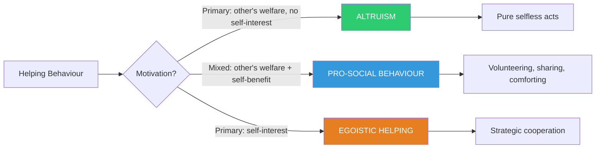
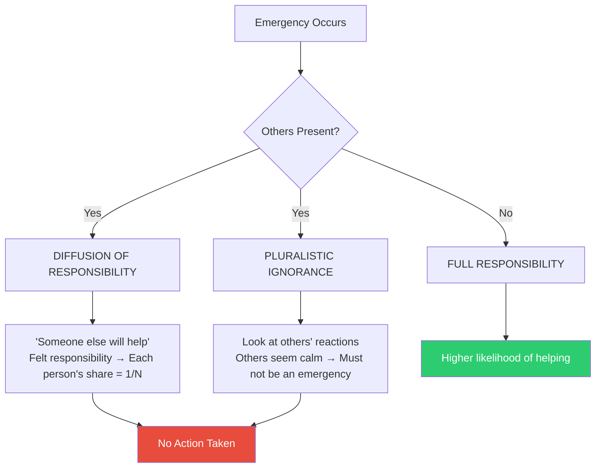

# Pro-social Behaviour and Altruism: Foundations and Historical Context

## Learning Objectives

By the end of this section, you will be able to:
- Define pro-social behaviour and distinguish it from altruism
- Explain the historical origins of pro-social behaviour research
- Describe the bystander effect and diffusion of responsibility
- Analyse the Kitty Genovese case and its scientific legacy

---

## 1. What Is Pro-social Behaviour?

**Pro-social behaviour** refers to any voluntary act performed with the goal of benefiting another person (Aronson, Wilson, & Akert, 2004). This broad category encompasses an enormous range of actions — from donating money to charity, to sharing food, to risking one's life to rescue a stranger.

Staub (1979) offered an influential definition: *voluntary behaviour intended to benefit another person*. The word "voluntary" is crucial — it distinguishes genuine pro-social acts from professional duties (e.g., a doctor helping a patient) or coerced assistance.

### Types of Pro-social Behaviours

According to Bierhoff (2002), pro-social behaviour includes:

| Type | Example |
|------|---------|
| **Helping** | Assisting someone who has fallen |
| **Sharing** | Offering food or resources |
| **Giving** | Donating to charity |
| **Comforting** | Supporting a grieving friend |
| **Instrumental help** | Assisting a peer with studies |
| **Costly help** | Risking one's own life to save another |
| **Emotional support** | Caring for an ill person |

### Why Pro-social Behaviour Matters

Pro-social behaviour is not confined to psychology — philosophers, economists, sociobiologists, and ethicists all study it from their own perspectives. As Kohn (1990) notes, the term is so broad it risks becoming meaningless unless we specify what motivates it, how it manifests, and what sustains it over time.

:::info Key Insight
Individuals benefit from living in societies where pro-sociality is common. Communities with higher levels of helping behaviour show greater social cohesion, lower crime rates, and improved collective wellbeing.
:::

---

## 2. Pro-social Behaviour vs. Altruism

### Defining Altruism

**Altruism** is a specific, narrower concept: any voluntary act intended to favour another *without expectation of reward* (Smith & Mackie, 2000; Batson et al., 2002). The French sociologist **Auguste Comte** coined the term "altruism" in the 19th century, arguing that humans have inborn drives to behave sympathetically toward others (Lee, Lee & Kang, 2003).

True altruism involves:
- **Selfless motivation** — primary concern for the recipient's welfare
- **No expectation of personal gain** — no seeking of praise, reciprocity, or material reward
- **Pure desire to help** — based on intrinsic empathic concern (Aronson et al., 2004)

### The Critical Distinction

```
Pro-social Behaviour ≠ Altruism
```

Pro-social behaviour may involve benefits to the helper — psychological satisfaction, social approval, mood enhancement, or even financial rewards (like tax deductions). Altruism requires that the actor's *primary* goal be the beneficiary's welfare, with no self-interested element.

**Example:** Donating to a Tsunami relief fund may be:
- **Pro-social** if motivated partly by tax exemption or social recognition
- **Altruistic** only if the sole motivation is genuine concern for victims

Researchers have struggled to identify truly "pure" altruistic behaviours that offer zero benefit to the performer. This has led to ongoing debates about whether human altruism truly exists or whether all helping ultimately serves some self-interest.



---

## 3. Historical Context: The Kitty Genovese Case

### The Murder That Changed Psychology

The scientific study of pro-social behaviour was catalysed by a horrifying real event. On **March 13, 1964**, **Kitty Genovese** was murdered in New York City outside her apartment in Queens. The attack unfolded in multiple stages over approximately 30 minutes:

1. Winston Moseley attacked and stabbed Genovese as she walked home
2. She screamed for help; a neighbour shouted "Let that girl alone!" from a window
3. Moseley briefly fled, then returned to attack again twice more
4. Genovese was found dead; she had crawled into a nearby building

Initial media reports claimed **38 witnesses** watched without calling police. This number was later questioned by historians, but the case profoundly shocked the public and prompted urgent scientific inquiry.

### The Question That Launched a Field

Social psychologists **John Darley** and **Bibb Latané** asked: *Why didn't any of the 38 witnesses help?* Their investigation led to the discovery of **bystander apathy** — and eventually to some of the most important experiments in social psychology.

:::tip Historical Significance
The Kitty Genovese case directly prompted Latané and Darley's pioneering research on the bystander effect (1968-1970), which transformed understanding of why people fail to help in emergencies. It also gave birth to the field of pro-social behaviour research in the early 1970s.
:::

### What the Witnesses Said

Many of the neighbours explained their inaction by:
- Assuming it was a "lover's quarrel" (misinterpreting the event)
- Believing someone else must have already called police
- Feeling uncertain about what to do
- Being afraid to get involved

These explanations shaped the theoretical frameworks that Darley and Latané would develop.

---

## 4. The Bystander Effect

### Definition

The **bystander effect** (also called bystander apathy) refers to the phenomenon whereby *the greater the number of people present, the less likely any individual is to help a person in distress* (Latané & Darley, 1969).

### Classic Experimental Demonstration

In a landmark study, Latané and Darley (1969) placed participants in one of three conditions while they filled out questionnaires. Smoke began filling the room:

| Condition | Reported Smoke |
|-----------|----------------|
| Alone in room | **75%** reported smoke |
| With 2 other real participants | **38%** reported smoke |
| With 2 passive confederates | **10%** reported smoke |

The results demonstrated powerfully that social context radically alters individual behaviour even in physical emergencies.

### Two Mechanisms Behind the Bystander Effect



**1. Diffusion of Responsibility:** When multiple bystanders are present, each individual feels less personal obligation to help. The responsibility is implicitly "shared" — "Someone else will surely call for help." As the group grows, each individual's perceived share of responsibility shrinks.

**2. Pluralistic Ignorance:** People use others' reactions as information about how to interpret ambiguous situations (informational social influence). When everyone else appears calm and unresponsive, individuals conclude there is no emergency — even when one is occurring. The blank faces of others signal "no danger," even if everyone is privately concerned.

### Reducing the Bystander Effect

Research suggests the effect can be overcome by:
- **Direct address:** Calling on a specific named person to help (Markey, 2000 showed this overcame bystander effects even in online chat rooms)
- **Explicit responsibility assignment:** Asking someone directly for help
- **Training:** Bystander intervention training that teaches people to recognise and overcome these psychological barriers
- **Personalising the victim:** Making the victim's individuality salient reduces diffusion

---

## 5. Cultural and Indian Context

### Cross-Cultural Variations in Helping

A landmark field study by Levine, Norenzayan, and Philbrick (2001) examined spontaneous helping across 23 cultures. Rates of helping a stranger (picking up dropped magazines) ranged from **22% to 95%** — dramatic evidence of cultural variation.

**Factors explaining cultural differences include:**
- Pace of life (slower-paced cultures helped more)
- Population density (smaller cities showed more helping)
- Collectivist vs. individualist orientation
- Industrial vs. non-industrial economic structures

### Indian Context

In India, research has documented a complex picture of pro-social behaviour:
- **Joint family systems** promote strong ingroup helping norms
- **Dharma and seva** (service) are deeply embedded religious and cultural motivators for helping
- Urban areas show classic bystander effects, while rural communities often maintain strong communal helping networks
- NGO and community volunteering (e.g., "Gandhigiri" movements) reflect indigenous pro-social traditions

---

## 6. External Resources

### Wikipedia Articles
- 📖 [Prosocial behaviour](https://en.wikipedia.org/wiki/Prosocial_behavior)
- 📖 [Altruism](https://en.wikipedia.org/wiki/Altruism)
- 📖 [Bystander effect](https://en.wikipedia.org/wiki/Bystander_effect)
- 📖 [Murder of Kitty Genovese](https://en.wikipedia.org/wiki/Murder_of_Kitty_Genovese)
- 📖 [Bibb Latané](https://en.wikipedia.org/wiki/Bibb_Latan%C3%A9)

### Educational Videos
- 🎥 [The Bystander Effect — Veritasium](https://www.youtube.com/watch?v=OSsPfbup0ac) (7 min — excellent demonstration)
- 🎥 [Prosocial Behaviour — Crash Course Psychology #39](https://www.youtube.com/watch?v=bsHlNe3YDLU) (11 min)
- 🎥 [The Science of Kindness — Greater Good Science Center](https://www.youtube.com/watch?v=gBrON_ZL23A) (5 min)

### Recent Research (2020–2024)
- 📄 Manning, R., Levine, M., & Collins, A. (2007). The Kitty Genovese murder and the social psychology of helping: The parable of the 38 witnesses. *American Psychologist*. *(Classic paper that revised the 38-witness myth)*
- 📄 Machackova, H., & Pfetsch, J. (2022). Bystander roles and cyber-bullying intervention: A systematic review. *Aggression and Violent Behavior*.
- 📄 Levine, M., & Manning, R. (2013). Social identity and bystander behaviour. *Advances in Experimental Social Psychology*.
- 📄 Simunovic, D., et al. (2020). Prosocial behaviour during COVID-19 pandemic. *PLOS ONE* — examined how collective threat increased community helping.

---

## 7. Memory Aids

### The ALTRUISM Acronym
> **A** — Acts voluntarily  
> **L** — Lacks self-interest  
> **T** — True concern for other  
> **R** — Reward not expected  
> **U** — Unselfish motivation  
> **I** — Intrinsic empathy driven  
> **S** — Selfless by definition  
> **M** — Moral or emotional basis

### The "38 Witnesses" Memory Hook
Think of it as the **"38 = 0"** paradox: 38 people watching = effectively zero help. The more people, the less responsibility each feels.

### Bystander Effect Formula
> **More Bystanders → More Diffusion → Less Helping**

---

## 8. Self-Assessment Questions

**Basic Level:**

1. Define pro-social behaviour in your own words and give three examples from everyday Indian life.

2. What is the key difference between altruism and pro-social behaviour? Use an example to illustrate.

3. What was the Kitty Genovese case and why was it significant for psychology?

**Intermediate Level:**

4. Explain the bystander effect with reference to Latané and Darley's smoke-filled room experiment. What were the key findings?

5. Distinguish between diffusion of responsibility and pluralistic ignorance. How does each contribute to bystander inaction?

6. In Latané and Darley's experiment, only 10% of participants reported smoke when two passive confederates were present. What psychological process explains this finding?

**Advanced Level:**

7. Critically evaluate the claim that true altruism does not exist. Draw on psychological research to support your argument.

8. How do cultural factors influence pro-social behaviour? Compare helping patterns in collectivist versus individualist societies.

9. A student witnesses someone collapsing in a crowded shopping mall but does not help. Apply the bystander effect research to explain this inaction, and suggest one intervention that might have increased the likelihood of helping.

---

## 9. Source Citations

**Source PDFs:**
- 📄 [Block-2/Unit-2.pdf — Pages 29–32](/pdfs/MPC-004%20Advanced%20Social%20Psychology/Block-2/Unit-2.pdf)
- 📚 MPC-004 Advanced Social Psychology, IGNOU

**Related Topics:**
- [Social Influence Theories](/mpc-004/block-2/concept-social-influence-theories)
- [Conformity and Asch Experiments](/mpc-004/block-2/conformity-asch-experiment)
- [Attribution Theory](/mpc-004/block-1/attribution-theory-kelley-jones-davis)
