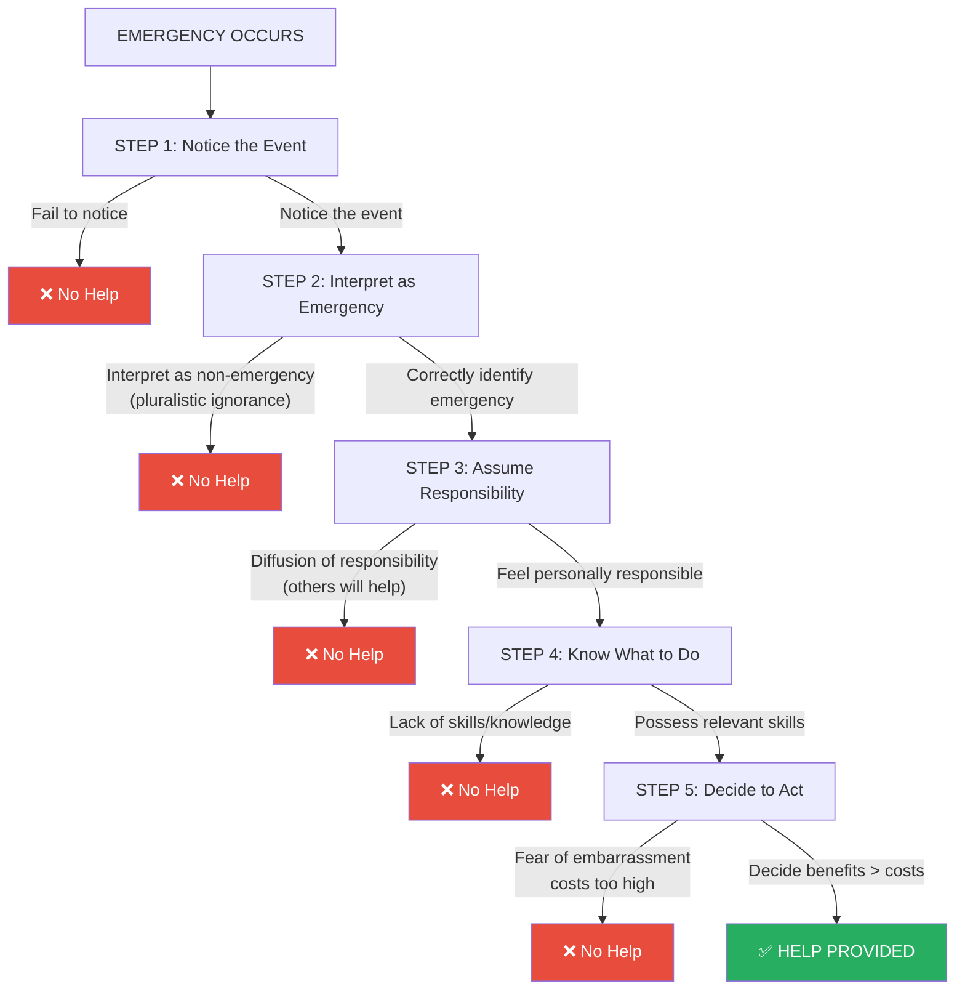
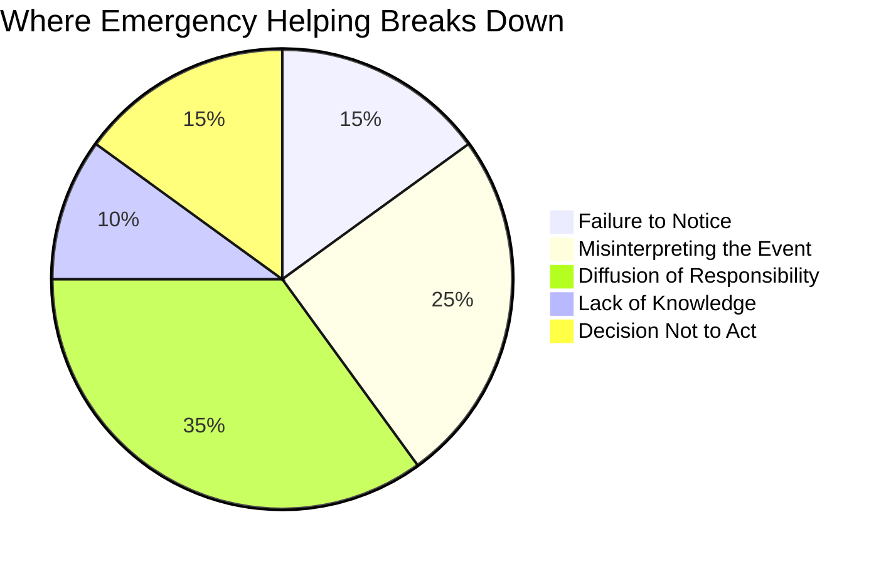

# Pro-social Behaviour in Emergency Situations: Darley & Latané's 5-Step Model

## Learning Objectives

By the end of this section, you will be able to:
- Outline Darley and Latané's five-step model of emergency helping
- Identify the psychological barriers at each step
- Apply the model to real-world situations
- Explain how each step can fail to produce helping behaviour

---

## 1. The Challenge of Helping in Emergencies

Why do people sometimes fail to help in emergencies — even when they have the capacity and proximity to do so? Social psychologists **John Darley** and **Bibb Latané** (1969) developed a revolutionary model showing that helping is not a single act but a **sequential decision process**. Every step in the chain must succeed for helping to occur; failure at any point means no assistance is provided.

This insight fundamentally changed how psychologists understand prosocial behaviour — it is not merely a matter of character, but of how situations structure our cognitions and decisions.

---

## 2. The Five-Step Model

---

## 3. Step-by-Step Analysis

### Step 1: Noticing the Emergency

**The Challenge:** People must first *perceive* that something is happening. This sounds obvious, but trivial contextual factors can prevent noticing entirely.

**Classic Evidence — Darley and Batson (1973): "The Good Samaritan Study"**

Seminary students in Princeton were asked to give a talk on campus. Half were told they were running late (high hurry condition); half were not in a hurry. On the way, they passed a confederate groaning in a doorway (the "injured man").

| Condition | Helped Injured Person |
|-----------|----------------------|
| Low hurry | **63%** |
| Medium hurry | **45%** |
| High hurry | **10%** |

Ironically, some hurrying seminarians were on their way to give a talk *about the Good Samaritan parable* — yet still failed to notice the person in need. Their attention was captured by task demands, not the environment.

:::important Lesson
Attentional focus is a resource. When it is consumed by time pressure, goals, or distraction, potential helpers literally fail to perceive emergencies.
:::

### Step 2: Interpreting the Event as an Emergency

**The Challenge:** Even noticed events must be *correctly* interpreted. Many emergencies are ambiguous — a person lying on the ground could be drunk, asleep, or unconscious. A scream could be laughter or distress.

**Pluralistic Ignorance in Action**

When multiple bystanders are present, people instinctively look at others for interpretive cues. If everyone else appears calm and unconcerned, each individual concludes: "It must not be an emergency — otherwise others would react."

The problem: everyone is reading everyone else's blank face as a signal of "no danger" — while each person privately feels uncertain. The result is **pluralistic ignorance**: collective misinterpretation arising from each individual's mistaken belief that others are better informed or less concerned.

In Latané and Darley's (1970) original observations, bystanders would glance at each other, note no reaction, and return to their activities — each believing the others were less alarmed. This created a false consensus of unconcern.

### Step 3: Assuming Personal Responsibility

**The Challenge:** Even after correctly identifying an emergency, someone must feel *personally* obligated to help. With multiple bystanders, **diffusion of responsibility** occurs.

**Diffusion of Responsibility:**
> "Each bystander's sense of responsibility to help decreases as the number of witnesses increases."

Everyone thinks: "With all these people here, surely *someone* will call for help." The responsibility is psychologically distributed across all witnesses — leaving each individual with a fraction of the full obligation.

**Mathematical intuition:** If you are the only witness, you bear 100% of the moral responsibility. If there are 10 witnesses, your felt share is roughly 10%. This psychological arithmetic powerfully suppresses action.

**Evidence from the Kitty Genovese context:** Multiple neighbours reported believing that someone else had already called the police, or that others were watching and better positioned to help.

### Step 4: Knowing What to Do

**The Challenge:** Good intentions are insufficient without competence. A bystander who wants to help a cardiac arrest victim but doesn't know CPR may be unable to provide effective assistance.

This step involves:
- **Practical knowledge:** Knowing how to perform first aid, how to call emergency services, what steps to follow
- **Role competence:** Believing oneself capable of helping in this specific situation
- **Situational clarity:** Understanding what kind of help is actually needed

According to Midlarsky (1968), individuals' competence with relevant skills directly influences helping — greater competence increases certainty about what to do, reduces fear of making mistakes, and lowers situational stress.

### Step 5: Making the Decision to Help

**The Challenge:** Even knowing what to do, people may decide *not* to intervene due to:
- **Fear of embarrassment:** "What if I'm wrong about this being an emergency?"
- **Cost-benefit analysis:** Potential personal costs (time, money, physical risk, social awkwardness) weigh against benefits
- **Evaluation apprehension:** Fear of looking foolish, intrusive, or incompetent in front of others
- **Feeling unqualified:** "I'm not trained for this"

**Internet-Based Evidence:**

Markey (2000) tested bystander effects in an online chat room. When the entire group was asked to provide information, larger groups responded more slowly (classic bystander effect). However, **when a specific individual was directly named and asked**, that person helped *quickly* — regardless of group size.

This finding has profound practical implications: in emergencies, don't shout "Someone call 911!" Instead, point at a specific person and say "You — call 911 now." This bypasses diffusion of responsibility.

---

## 4. Practical Applications of the Five-Step Model

### What Can Overcome Each Barrier?

| Step | Barrier | Intervention |
|------|---------|-------------|
| Notice | Distraction, hurry | Slow down; cultivate situational awareness |
| Interpret | Pluralistic ignorance | Explicit distress signals; call out "Help!" clearly |
| Responsibility | Diffusion | Direct, personalised requests; "You, in the red shirt!" |
| Knowledge | Competence gap | CPR training; first aid education |
| Decision | Fear of embarrassment | Public commitment; bystander training |

### The Emergency Services Insight

Emergency response training now explicitly addresses these five steps. Public campaigns teach:
- How to recognise emergencies (Step 2)
- How to overcome bystander effect and call for help (Step 3)
- Basic CPR and first aid (Step 4)
- Confidence to intervene (Step 5)

### Real-World Example: Sexual Harassment Bystander Intervention

Universities train bystanders to intervene in potential sexual harassment scenarios. The five-step model maps directly:
1. **Notice** subtle warning signs of uncomfortable situations
2. **Correctly interpret** body language indicating distress (not just "romantic interaction")
3. **Feel personal responsibility** despite others being present
4. **Know intervention strategies** (distraction, direct intervention, assistance-seeking)
5. **Decide to act** despite social awkwardness

---

## 5. Summary Diagram: Where Helping Fails

*(Approximate distribution based on research evidence)*

The largest single barrier is **diffusion of responsibility** — the psychological experience that "someone else will handle it."

---

## 6. Indian Context

In India, the Supreme Court in 2016 issued guidelines protecting **Good Samaritans** — people who stop to help accident victims — from police harassment and legal complications. This addresses a major real-world implementation of Step 5 (decision to act): potential legal consequences were a significant deterrent to helping road accident victims.

Research on Indian urban bystander behaviour shows patterns consistent with Latané and Darley's model:
- Crowded urban settings show strong bystander effects
- Rural and small-town settings show notably higher helping rates
- Religious contexts (temples, mosques, gurudwaras) temporarily increase prosocial norms, overcoming diffusion

---

## 7. External Resources

### Wikipedia Articles
- 📖 [Bystander effect](https://en.wikipedia.org/wiki/Bystander_effect)
- 📖 [Diffusion of responsibility](https://en.wikipedia.org/wiki/Diffusion_of_responsibility)
- 📖 [Pluralistic ignorance](https://en.wikipedia.org/wiki/Pluralistic_ignorance)
- 📖 [Good Samaritan law](https://en.wikipedia.org/wiki/Good_Samaritan_law)

### Educational Videos
- 🎥 [Bystander Effect Explained — TED-Ed](https://www.youtube.com/watch?v=OSsPfbup0ac) (7 min)
- 🎥 [Why We Don't Help in Emergencies — Sprouts Psychology](https://www.youtube.com/watch?v=Z3MtEXMrPXA) (5 min)
- 🎥 [Good Samaritan — Darley & Batson Experiment](https://www.youtube.com/watch?v=7VkAVt3AWEE) (4 min)

### Recent Research (2020–2024)
- 📄 Fischer, P., et al. (2011). The bystander effect: A meta-analytic review. *Psychological Bulletin*, 137(4), 517-537. *(Gold standard meta-analysis)*
- 📄 Padmanabhan, A., et al. (2021). Bystander intervention in India: Attitudes and barriers. *Indian Journal of Social Psychiatry*, 37, 44-51.
- 📄 Levine, M., et al. (2022). How group identification shapes prosocial behaviour during emergencies. *Journal of Experimental Social Psychology*, 100, 104301.

---

## 8. Memory Aids

### The Five Steps — "NIRKA"
> **N** — Notice the event  
> **I** — Interpret it as emergency  
> **R** — Responsibility assumed  
> **K** — Know what to do  
> **A** — Act (decide to help)

### The Decision Chain Rule
> **Each step is a "gate": failure at ANY gate = no help**

Think of it like a password with five characters — each must be correct for the system to unlock. Society often assumes helping is automatic, but it requires five cognitive and motivational successes in sequence.

---

## 9. Self-Assessment Questions

**Basic Level:**

1. List Darley and Latané's five steps required for helping behaviour to occur in an emergency.

2. What is pluralistic ignorance? How does it prevent emergency helping at Step 2?

3. What did the "Good Samaritan" study by Darley and Batson find? What variable predicted whether seminary students helped?

**Intermediate Level:**

4. Explain diffusion of responsibility. Why does each individual feel less responsible as group size increases?

5. Markey (2000) found that directly naming an individual overcame the bystander effect. Which step in the five-step model does this intervention target? Explain why it works.

6. Why might Step 4 (knowing what to do) be a barrier even for motivated, empathic bystanders?

**Advanced Level:**

7. A passenger collapses on a Delhi Metro train during rush hour. The train is packed with 100 passengers. Apply Darley and Latané's five-step model to explain why no one might help initially, and how emergency response might eventually be mobilised.

8. Critically evaluate the five-step model. What are its strengths as an explanatory framework? What does it miss or oversimplify about emergency helping?

9. How do Good Samaritan laws address the psychological and situational barriers identified by Darley and Latané? Evaluate their likely effectiveness based on the model.

---

## 10. Source Citations

**Source PDFs:**
- 📄 [Block-2/Unit-2.pdf — Pages 33–34](/pdfs/MPC-004%20Advanced%20Social%20Psychology/Block-2/Unit-2.pdf)
- 📚 MPC-004 Advanced Social Psychology, IGNOU

**Related Topics:**
- [Pro-social Behaviour Foundations](/mpc-004/block-2/prosocial-behaviour-altruism-foundations)
- [Factors Affecting Helping Behaviour](/mpc-004/block-2/factors-affecting-helping-behaviour)
- [Social Influence Theories](/mpc-004/block-2/concept-social-influence-theories)
