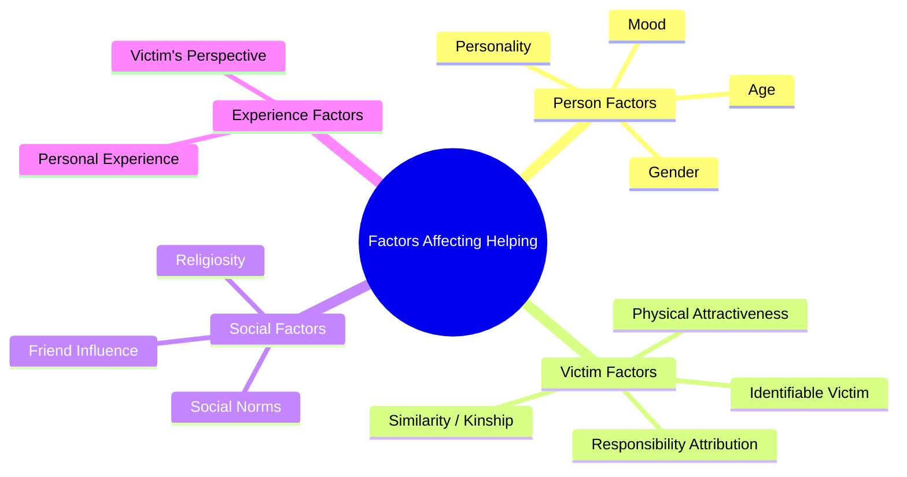
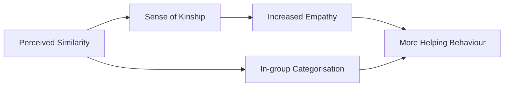
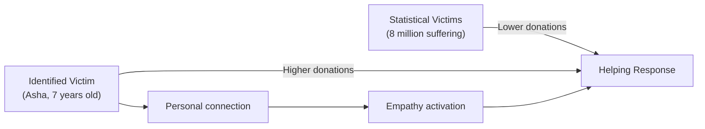
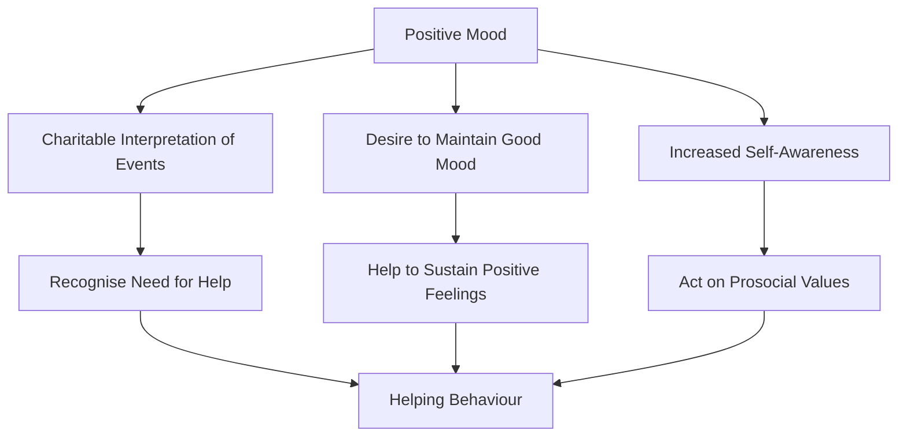

# Factors Affecting Helping Behaviour: A Comprehensive Analysis

Why do we sometimes rush to help a stranger in distress, and other times walk right past? The answer lies in a complex interplay of personal, situational, and social factors that researchers have spent decades unravelling. This unit systematically examines the 12 major factors identified in the literature on helping behaviour, drawing on classic experiments and contemporary research.

---

**Source PDFs**:
- 📄 [Block-2/Unit-2.pdf - Pages 34-37](/pdfs/MPC-004%20Advanced%20Social%20Psychology/Block-2/Unit-2.pdf)
- 📚 MPC-004 Advanced Social Psychology

---

## Overview: Why Do People Help?

Helping behaviour — or the decision *not* to help — is rarely the product of a single variable. Research consistently shows that both *person factors* (personality, mood, age, gender) and *situation factors* (number of bystanders, relationship to victim, perceived responsibility) interact to determine whether aid is given. Understanding these factors has important implications for designing social interventions, charity appeals, emergency response training, and public policies.



---

## 1. Physical Attractiveness

Physical attractiveness influences helping behaviour in ways that operate both consciously and unconsciously. Harrell (1978) found that physically attractive people are significantly more likely to receive help than unattractive people. The underlying mechanism is the **beauty-is-good stereotype** — the implicit societal belief that beautiful people deserve better outcomes in life (Berscheid, Walster & Bohrnstedt, 1973).

This effect has developmental roots. Adams and Cohen (1976) demonstrated that physical attractiveness shapes prosocial behaviour even in children, suggesting that the association between attractiveness and helpworthiness is learned early and reinforced throughout life.

### Indian Context
In Indian sociocultural contexts, physical attractiveness intersects with caste, class, and gender. Research suggests that well-dressed, "respectable-looking" individuals receive far more help in public spaces, reflecting both attractiveness biases and socioeconomic signalling.

---

## 2. Similarity and Kinship

People are substantially more likely to help others who are similar to themselves or who belong to their in-group. This reflects two distinct but related processes:

**Genetic Relatedness (Kin Selection)**: Evolutionary theory predicts that we are more likely to help relatives because doing so promotes the survival of our shared genes. Hamilton's (1964) kin selection theory formalises this: we help when the benefit to the recipient (weighted by genetic relatedness) exceeds the cost to the helper.

**Perceived Similarity**: Even without genetic ties, attitude similarity functions as a proxy cue for kinship (Park & Schaller, 2005). If someone shares our values, worldview, or group membership, we treat them as more deserving of help.

Dovidio et al. (1997) demonstrated that in-group members receive substantially more help than out-group members — a finding replicated across cultures, ethnicity, and sports team membership (Levine et al., 2002).



---

## 3. Religiosity

Several studies have found that humanitarian values and religiosity correlate with charitable giving and helping behaviour (Burnett, 1981; Pessemier, Bemmaor & Hanssens, 1977). Religion often provides explicit prosocial norms (e.g., the Golden Rule, Zakat in Islam, Dana in Buddhism and Hinduism) that motivate helping.

However, the relationship is nuanced. Darley and Batson's (1973) famous "Good Samaritan" study found that seminary students in a hurry to give a sermon about the Good Samaritan were *less* likely to help an injured person — suggesting that religiosity increases helping only when other situational demands are not competing.

> **Key Insight**: Religiosity promotes helping as a *dispositional tendency*, but situational pressures can override it.

---

## 4. Victim's Perspective

Batson and colleagues have consistently shown that **perspective-taking** dramatically increases empathy and altruistic behaviour. When observers are asked to imagine how the victim *feels* (rather than simply observing the victim's situation), they show greater empathic concern and are more motivated to help (Batson, Early & Salvarani, 1997; Batson et al., 2003).

This effect has been exploited by charities worldwide — campaigns that invite donors to "put yourself in their shoes" generate higher donations than purely informational appeals.

---

## 5. Personal Experience

Prior experience with a similar need significantly increases empathy for others facing the same situation. Barnett et al. (1986) found that rape survivors showed greater empathy toward other rape victims compared to those who had not experienced assault. Christy and Voigt (1994) found that adults who had been abused as children were more likely to intervene when witnessing child abuse.

This effect likely operates through **experiential empathy** — having personally suffered makes it easier to truly understand another's pain, which in turn motivates action.

### Limitation
Excessive personal identification can also lead to **empathy overwhelm** or **emotional contagion**, where the helper becomes too distressed to function effectively.

---

## 6. Identifiable Victim Effect

One of the most robust and practically important findings in prosocial behaviour research is the **identifiable victim effect**: people give significantly more to specific, named individuals than to abstract statistics representing larger groups in need.

Small, Loewenstein & Slovic (2006) found that donations were substantially higher for a named child victim than for statistical descriptions of millions affected by a crisis. This effect occurs even when no meaningful personal information is provided about the identified victim (Small & Loewenstein, 2003).



**Practical Application**: Charities use this effect by featuring a single named beneficiary in campaigns rather than aggregate statistics. Understanding this bias helps critically evaluate charity marketing and develop more equitable giving practices.

---

## 7. Attributions Concerning Victim's Responsibility

Weiner's (1980) attribution model predicts that people give more help to victims whose need arises from *external* causes (uncontrollable circumstances) than to those whose need stems from *internal* causes (their own choices or character).

Classic evidence: Piliavin et al. (1969) found in the New York subway study that bystanders were far more likely to help a "blind" person who had collapsed than a person who appeared "drunk." The drunk person was attributed *internal responsibility* for their condition, reducing sympathy.

| Victim Type | Cause Attribution | Sympathy | Helping |
|---|---|---|---|
| Accident victim | External (uncontrollable) | High | High |
| Chronic smoker with cancer | Internal (controllable) | Lower | Lower |
| Laid-off worker | External (economic) | High | High |
| Drug addict | Internal (choice) | Lower | Lower |

Schmidt and Weiner (1988) demonstrated that the relationship between deservingness and helping is mediated by **sympathy** — cold calculations of responsibility don't explain helping; emotional responses do.

---

## 8. Positive Friend Influence

Social networks, and friendships in particular, are powerful channels for shaping prosocial behaviour. Barry and Wentzel (2006) found that children's prosocial behaviour is closely tied to that of their friends — suggesting social modelling within peer groups. Wentzel, Barry & Caldwell (2004) demonstrated that adolescents whose friends display prosocial behaviour are themselves more likely to volunteer, share, and cooperate.

Adolescents who lack friends show lower prosocial behaviour (McGuire & Weisz, 1982), suggesting that social networks provide both modelling and motivation for helping.

---

## 9. Gender

Research consistently finds gender differences in helping behaviour, though the *form* of helping differs more than the overall *amount*:

**Eagly & Crowley (1986) Meta-Analysis**:
- Men are more likely to help in **heroic, chivalrous** situations (e.g., stopping a crime, rescuing someone from danger)
- Women are more likely to engage in **nurturant, long-term** helping (e.g., caregiving, emotional support)

**Developmental Pattern**: Beutel & Johnson (2004) found that females place more importance on prosocial values than males even in early adolescence, with the gender gap widening in older adolescents.

```mermaid
bar
    title Gendered Helping Patterns
    x-axis Types of Helping
    y-axis Frequency (relative)
    bar "Men" [8, 3, 5, 6]
    bar "Women" [3, 9, 8, 7]
```

*Note: Categories approximate: Heroic/Emergency; Caregiving; Emotional Support; Volunteering*

These differences partly reflect socialisation (boys encouraged toward bravery; girls toward nurturing) and partly genuine dispositional differences that emerge early in development.

---

## 10. Age

Prosocial behaviour shows a complex developmental trajectory:

**In Childhood**: Prosocial behaviour increases from toddlerhood through early childhood, driven by developing empathy, moral reasoning, and social norms.

**In Adolescence**: Kavussanu, Seal & Phillips (2006) found that older adolescent males displayed fewer prosocial and more antisocial behaviours than younger adolescent males in sports contexts. However, Eisenberg et al. (2005) found that prosocial *moral reasoning* and perspective-taking increased from late adolescence into early adulthood.

**In Adulthood**: The relationship between age and helping stabilises, with older adults showing more consistent prosocial values but sometimes reduced capacity for spontaneous heroic action.

> **Key Insight**: It's not just *age* but the *type* of prosocial behaviour that matters — moral reasoning improves with age, but spontaneous emergency helping peaks in young adulthood.

---

## 11. Personality

Research supports the existence of a stable **prosocial personality** characterised by:
- **Empathic concern**: Sensitivity to others' distress
- **Social responsibility**: Obligation to help those in need  
- **Agreeableness**: Cooperative, accommodating orientation
- **Low shyness**: Willingness to approach strangers
- **High self-efficacy**: Confidence in one's ability to help effectively

Eisenberg et al. (1999) followed children from early childhood into adulthood and found consistent individual differences in prosociality, supporting the view that prosocial personality is both real and enduring.

However, Hartshorne and May (1929) found only a .23 correlation between different helping behaviours in children, and high scorers on altruism personality scales were not dramatically more helpful than low scorers — suggesting that **situational factors matter enormously** and personality alone cannot predict helping.

Graziano et al. (2007) found an important interaction: agreeable individuals helped *out-group* members more than disagreeable individuals, but agreeableness made no difference for *in-group* helping (everyone helps in-group members, regardless of personality).

---

## 12. Effects of Positive Moods: Feel Good, Do Good

One of the most replicated findings in prosocial behaviour research is the **mood-helping relationship**: being in a good mood significantly increases helping.

**Classic Evidence**: Isen and Levin's (1972) dime-in-the-phone-booth study found that 84% of people who found a dime helped a confederate who dropped papers, compared to only 4% of those who found no dime.

North, Tarrant & Hargreaves (2004) demonstrated that people in good moods (after receiving gifts, succeeding on tests, or hearing pleasant music) are consistently more helpful.

**Three Mechanisms**:
1. **Cognitive**: Good moods lead to more charitable interpretations of situations — ambiguous events are seen as potential emergencies worthy of help
2. **Affective maintenance**: Helping prolongs the good mood; not helping deflates it
3. **Self-attention**: Good moods increase self-awareness, making people more likely to act according to their prosocial values



---

## Interactive Summary: Factor Interaction

These 12 factors rarely operate in isolation. Real-world helping decisions involve complex interactions:

| Scenario | Active Factors | Predicted Outcome |
|---|---|---|
| Pretty, well-dressed stranger falls in market | Attractiveness + Identifiability | High helping |
| Drunk person collapses in street | Internal attribution + low attractiveness | Lower helping |
| Child from your religion needs help | Similarity + Religiosity + Victim perspective | Very high helping |
| Statistics about global poverty | No identifiable victim + social distance | Low donation |
| Friend asks for help studying | Friendship + Similarity + Reciprocity | High helping |

---

## 🔬 Recent Research (2021–2024)

**Digital Age Helping**: Lapierre & Zhao (2022, *Journal of Computer-Mediated Communication*) found that identifiable victim effects persist and even amplify on social media, with personalised appeals (naming, photos, short videos) generating substantially higher sharing and donations than statistical appeals.

**Cross-Cultural Comparison**: Levine et al.'s cross-cultural findings on spontaneous helping have been extended to examine urban vs. rural differences within India — rural areas show higher rates of spontaneous helping of strangers, consistent with tighter social networks and stronger prosocial norms.

**Mood and Digital Helping**: A 2023 study in *Computers in Human Behavior* found that positive emotions experienced during social media browsing increased online prosocial behaviour (sharing, donating via links) — extending the feel-good, do-good effect to digital contexts.

---

## 🎯 Self-Assessment Questions

**Level 1 – Recall**

1. What did Harrell (1978) find regarding physical attractiveness and helping behaviour?
2. According to Eagly and Crowley's (1986) meta-analysis, how do men and women differ in their helping patterns?
3. What is the "identifiable victim effect"?

**Level 2 – Understanding**

4. Explain why the "feel good, do good" effect might not always be straightforward. Can you think of situations where a good mood might *not* increase helping?
5. How does attribution of victim responsibility interact with sympathy to determine helping? Use Weiner's (1980) model in your answer.
6. Why might personality alone be insufficient to predict helping behaviour?

**Level 3 – Application & Critical Analysis**

7. A charity is designing a fundraising campaign for disaster victims. Based on research on the identifiable victim effect, what specific design recommendations would you make? What ethical concerns does this raise?
8. You notice that your friend always helps people of their own religion more readily. Using research on similarity, kinship, and in-group favouritism, analyse this pattern. What might reduce this bias?
9. A policy-maker wants to increase helping behaviour in urban Indian settings. Drawing on at least 4 factors from this unit, design an evidence-based intervention strategy.

---

## 🧠 Memory Aids

**"PASS Me a Friend — GAP"** — 12 factors in order:

> **P**hysical Attractiveness | **A**ttributions about responsibility | **S**imilarity/Kinship | **S**elf-perspective (Victim's perspective) | **M**oods (Feel Good Do Good) | **E**xperience (Personal) | **F**riend Influence | **R**eligiosity | **I**dentifiable Victim | **E**ffect | **N**aming (Gender) | **D**evelopment (Age) | **G**oodness of Fit (Personality) | **A**ge | **P**ositive Moods

**Simpler mnemonic for exam**: Remember **"PARGI FACE"**:
- **P** = Physical Attractiveness
- **A** = Attributions
- **R** = Religiosity
- **G** = Gender
- **I** = Identifiable Victim
- **F** = Friend Influence / Feel-Good Mood
- **A** = Age
- **C** = Contribution (Personal Experience)
- **E** = Empathy / Victim Perspective

---

## 🌐 External Resources

### Wikipedia Articles
- [Bystander Effect](https://en.wikipedia.org/wiki/Bystander_effect) — Background on the helping context
- [Identifiable Victim Effect](https://en.wikipedia.org/wiki/Identifiable_victim_effect) — Deep dive on this key factor
- [Altruism](https://en.wikipedia.org/wiki/Altruism) — Broader philosophical and scientific perspectives
- [Prosocial Behaviour](https://en.wikipedia.org/wiki/Prosocial_behavior) — General overview

### Research Papers
- Harrell, W.A. (1978). Physical Attractiveness, Self-Disclosure, and Helping Behaviour. *The Journal of Social Psychology, 104*(1), 15-17.
- Eagly, A.H. & Crowley, M. (1986). Gender and helping behaviour: A meta-analytic review. *Psychological Bulletin, 100*, 283-308.
- Weiner, B. (1980). A Cognitive-Emotion-Action Model of Motivated Behaviour. *Journal of Personality and Social Psychology, 39*(2), 186-200.
- Graziano, W.G. et al. (2007). Agreeableness, empathy, and helping: A person × situation perspective. *Journal of Personality and Social Psychology, 93*(4), 583-598.
- Eisenberg, N. et al. (2005). Age changes in prosocial responding and moral reasoning. *Journal of Research on Adolescence, 15*, 235-260.

### Educational Videos
- 🎥 [The Science of Helping Others (Social Psychology)](https://www.youtube.com/watch?v=WsaGk5xEbSk) — Crash Course Psychology
- 🎥 [Why We Help: Evolutionary and Social Perspectives](https://ocw.mit.edu/courses/brain-and-cognitive-sciences) — MIT OpenCourseWare
- 🎥 [The Identifiable Victim Effect Explained](https://www.youtube.com/watch?v=l9oWtlKqO1s) — Behavioural economics explainer

### Cross-References
- [Conformity and Social Influence](/mpc-004/block-2/conformity-asch-experiment) — Context for in-group helping dynamics
- [Obedience and Milgram](/mpc-004/block-2/obedience-milgram-stanford-hofling) — How authority affects helping decisions
- [Bystander Effect Foundations](/mpc-004/block-2/prosocial-behaviour-emergency-situations) — Five-step emergency response model
