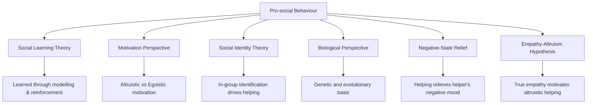
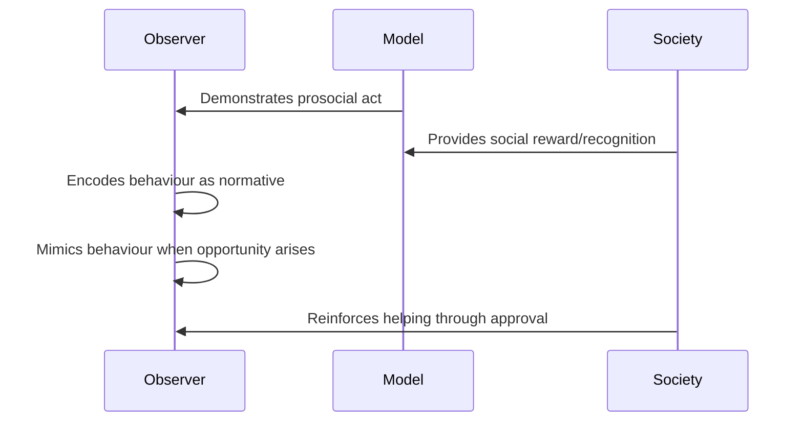
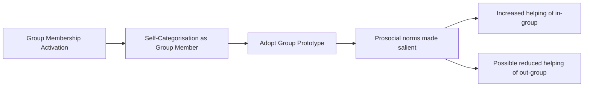
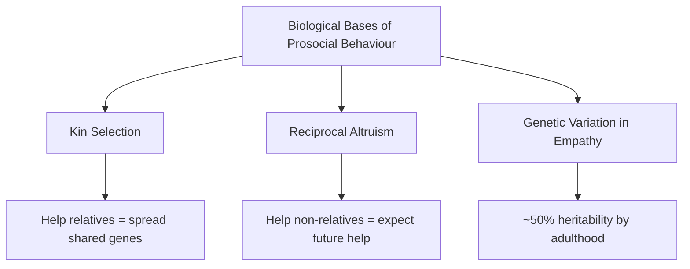
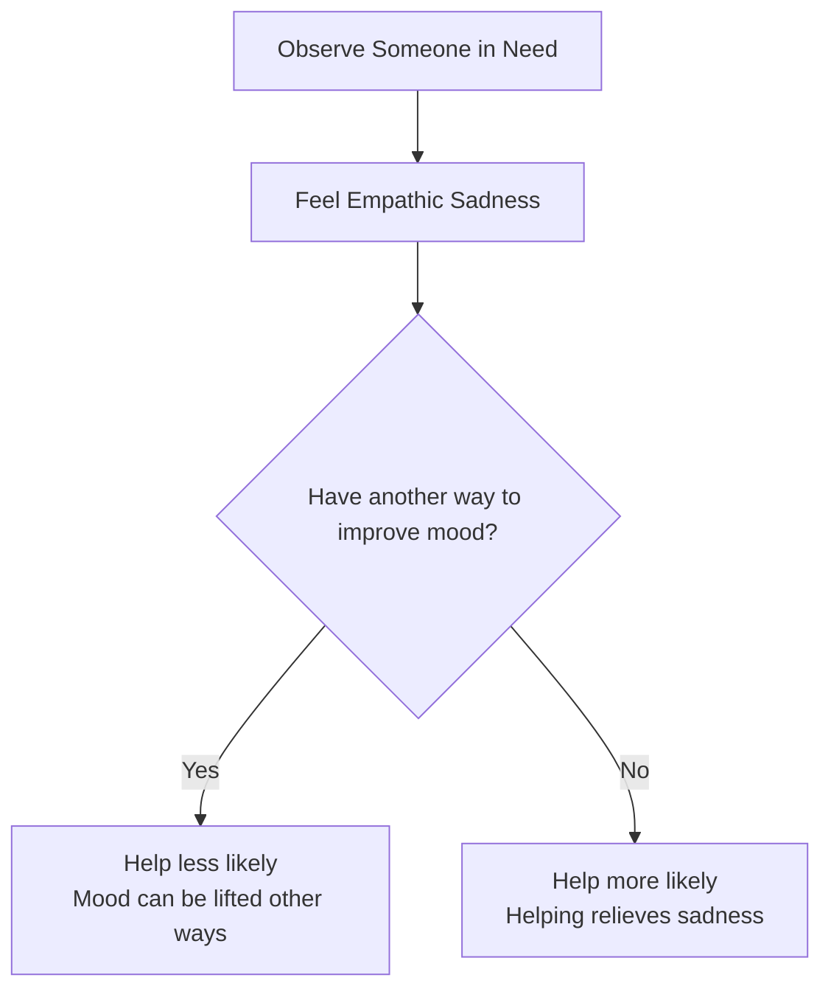
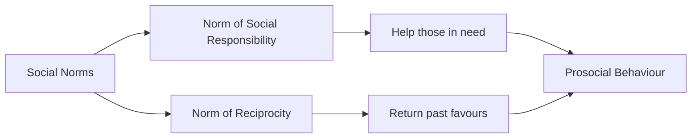

# Theoretical Perspectives on Pro-social Behaviour

Why do people help others? This seemingly simple question has generated decades of theoretical debate. From the role of reinforcement and modelling to the evolutionary roots of empathy, multiple theoretical frameworks offer complementary — and sometimes competing — answers. This unit surveys the major theoretical perspectives, evaluating their strengths, limitations, and real-world implications.

---

**Source PDFs**:
- 📄 [Block-2/Unit-2.pdf - Pages 36-41](/pdfs/MPC-004%20Advanced%20Social%20Psychology/Block-2/Unit-2.pdf)
- 📚 MPC-004 Advanced Social Psychology

---

## Overview: Why Theory Matters

Theoretical frameworks do more than explain behaviour — they guide interventions. If prosocial behaviour is learned (Social Learning Theory), we design programmes with role models. If it is empathy-driven (Empathy-Altruism Hypothesis), we design campaigns that foster perspective-taking. Understanding the *why* of helping determines the *how* of promoting it.

---

## 1. Social Learning Theory

Bandura's (1977) Social Learning Theory proposes that prosocial behaviour is **learned through observation and reinforcement** — not innate or spontaneous, but acquired through social experience.

### Key Mechanisms

**Observational Learning**: Children and adults learn prosocial behaviour by watching role models (especially parents, teachers, respected authorities) engage in helping. This doesn't just teach *what* to do — it teaches *when* it is appropriate and *how* society values such behaviour.

**Reinforcement**: Prosocial behaviours that are rewarded (through praise, social recognition, internal satisfaction) are more likely to be repeated. Punishments for selfish or hurtful behaviour reduce their occurrence.

**Social Recognition**: Within groups, social recognition — not just private reward — powerfully increases prosocial behaviour (Fisher & Ackerman, 1998). Public acknowledgement of helping creates social incentives and normative pressure.

### Bandura and McDonald (1963)

In this classic study, children who observed models making moral judgements (based on intentions rather than consequences) began to adopt similar reasoning styles — demonstrating that moral and prosocial reasoning can be directly transmitted through observation.

### Critical Evaluation

**Strengths**: Well-supported empirically; explains individual, family, and cultural variation in prosociality; has clear intervention implications (use role models, provide reinforcement).

**Limitations**: Cannot fully explain *spontaneous* helping by people with no prior exposure to similar situations; doesn't account for empathy-driven helping where the helper gains no social reward.

---

## 2. Motivation Perspective

The Motivation Perspective focuses on the *underlying goal* of the helper — distinguishing between **altruistic** and **egoistic** prosocial behaviour (Batson, 1991).

### Altruistic Motivation

Purely altruistic prosocial behaviour is motivated by the desire to increase *another person's welfare* as an end in itself. The helper's own benefit is irrelevant or secondary. True altruism involves helping even when it involves significant personal cost and no social recognition.

### Egoistic Motivation

Egoistic prosocial behaviour is motivated by the desire to increase *one's own welfare* — perhaps through social approval, mood relief, reduced guilt, or enhanced self-image — by helping others. The helper benefits from the act of helping.

### The Key Debate: Is Pure Altruism Possible?

This question has occupied philosophers and psychologists for centuries. Batson (1991) argued that empathic concern genuinely motivates altruistic helping — the helper's primary goal is to relieve the victim's suffering, not their own distress. Critics (e.g., Cialdini et al., 1976) argue that all helping ultimately serves the helper's emotional needs (reducing negative affect, maintaining positive mood), making true altruism an illusion.

| Type | Primary Goal | Example | Theorist |
|------|-------------|---------|---------|
| Altruistic | Increase victim's welfare | Donating anonymously to a stranger | Batson (1991) |
| Egoistic | Increase helper's welfare | Donating to appear charitable at work | Cialdini et al. (1976) |
| Mixed | Both | Volunteering for personal growth *and* community benefit | Most real-world helping |

### Children and Motivation

Eisenberg & Mussen (1989) argue that prosocial behaviour in young children need not be grounded in complex unobservable motivations — children help because helping is *the thing to do*, shaped by norms and expectations. However, adolescents who expect *positive adult reactions* to their prosocial acts report engaging in more prosocial behaviour (Wyatt & Carlo, 2002), suggesting that motivation becomes more self-aware over development.

---

## 3. Social Identity Theory

Tajfel and Turner's (1986) **Social Identity Theory (SIT)** explains prosocial behaviour through the lens of group membership and self-esteem maintenance.

### Core Argument

People identify with groups to enhance their self-esteem. When group membership is salient, individuals:
1. **Favour in-group members** by sharing resources, helping, and cooperating
2. **Differentiate from out-group members** by withholding help or competing
3. **Maintain group norms** by behaving in ways consistent with the group's expected prosocial patterns

### Self-Categorisation Theory

Turner et al.'s (1987) extension, **Self-Categorisation Theory**, adds that when people categorise themselves as group members, they adopt group *prototypes* — cognitive representations of the ideal group member's attitudes, values, and behaviours. If the group prototype includes prosocial behaviour (e.g., charitable organisations, religious groups), members are highly motivated to help in-group members to affirm their identity.

### Evidence

Group identification is a consistent predictor of cooperative and prosocial behaviour toward group members (Ashforth & Mael, 1989; Kramer, 1993). In organisational settings, employees who strongly identify with their company are more likely to engage in **organisational citizenship behaviours** — going beyond their formal role to help colleagues.

### Critical Evaluation

**Strengths**: Explains *selective* prosocial behaviour — why we help some people more than others; bridges individual psychology with group dynamics.

**Limitations**: Better at explaining *differential* helping (in-group vs. out-group) than explaining the overall *quantity* of helping; can inadvertently justify in-group favouritism with harmful social consequences.

---

## 4. Biological Perspective

The Biological Perspective posits that empathy, altruism, and prosocial behaviour have **evolutionary and genetic foundations** — not just learned or socially constructed roots.

### Genetic Evidence: Twin Studies

The twin study method compares similarities between monozygotic (MZ) twins (100% shared genes) and dizygotic (DZ) twins (50% shared genes). If MZ twins are more similar than DZ twins on a trait, genes contribute to that trait.

**Key Finding** (Rushton et al., 1986; Rushton, 2004): By adulthood, approximately **50% of the variance in altruism, empathy, and social responsibility** is attributable to genetic factors, with the remaining 50% due to non-genetic (environmental) influences.

**Developmental Heritability** (Knafo & Plomin, 2006): Heritability of prosociality increases with age — from approximately 30% at age 2 to 60% at age 7 — suggesting that genetic influences on prosocial behaviour become more pronounced as children develop.

### Evolutionary Mechanisms

Three primary evolutionary explanations for altruism:

1. **Kin Selection** (Hamilton, 1964): Helping relatives propagates shared genes — mathematical fitness benefits can outweigh personal costs.

2. **Reciprocal Altruism** (Trivers, 1971): Helping non-relatives pays off if the favour is likely to be returned in future interactions.

3. **Group Selection**: In highly cooperative groups, prosocial behaviour promotes group survival even if costly to individuals.

### Critical Evaluation

**Strengths**: Explains universal features of prosocial behaviour across cultures; integrates psychology with evolutionary biology and genetics.

**Limitations**: Cannot fully explain helping of strangers with no prospect of reciprocation; genetic heritability explains individual differences but not the mechanisms through which genes influence prosocial behaviour.

---

## 5. Negative-State Relief Hypothesis

Cialdini's **Negative-State Relief Model** proposes that people help others when they are experiencing negative emotions — because **helping alleviates the helper's own sadness or guilt**.

### Core Mechanism

When people observe someone in distress, they experience empathic sadness themselves. This negative emotional state motivates helping — not out of genuine concern for the victim, but to *relieve the helper's own discomfort*. Three features:

1. Helpers experience **empathic concern** when observing need
2. This concern is accompanied by **feelings of sadness**
3. Helpers are motivated to **relieve their own sadness** by helping

### Cialdini's (1987) Experiment

Participants were asked to observe someone receiving electric shocks. High-empathy participants were less likely to help *if researchers had praised them first* — because praise improved their mood, removing the need to help in order to feel better. This supported the negative-state relief model: it's the *helper's mood* that drives helping, not genuine concern for the victim.

### Guilt and Helping

Harris et al. (1975) found that churchgoers were more likely to donate money after confession — a classic demonstration that guilt (a negative state) motivates prosocial behaviour as a way to relieve that guilt.

### Comparison with Empathy-Altruism Hypothesis

| Model | Primary Motivation | Who Benefits? | Key Proponent |
|---|---|---|---|
| Negative-State Relief | Relieve helper's distress | Helper (primarily) | Cialdini (1987) |
| Empathy-Altruism | Relieve victim's distress | Victim (primarily) | Batson (1991) |

---

## 6. Empathy-Altruism Hypothesis

Batson's (1987, 1991) **Empathy-Altruism Hypothesis** is the most thoroughly researched theory of prosocial motivation. It proposes that **feeling genuine empathic emotion for someone in need evokes genuinely altruistic motivation** — motivation to help for the victim's sake, not the helper's.

### Core Claim

> "The claim that feeling empathic emotion for someone in need evokes altruistic motivation to relieve that need... According to this hypothesis, the greater the empathetic emotion, the greater the altruistic motivation." (Batson et al., 2002)

### Toi and Batson (1982) Study

Students listened to a taped interview with a student who had broken both legs and was falling behind in classes. Two factors were manipulated:
- **Empathy condition**: Imagine how the injured student *feels* vs. remain objective
- **Cost of helping**: Would you see the student every day if you helped vs. not?

**Results**: In the *high empathy* condition, participants helped regardless of the personal cost. In the *low empathy* condition, participants helped only when the cost of not helping was high (e.g., guilt from seeing the person daily). This supports the empathy-altruism model: high empathy eliminates the role of self-interest in the decision to help.

### Sub-Hypotheses

#### 6a. Empathic-Joy Hypothesis (Smith, Keating & Stotland, 1989)
Empathic witnesses experience *vicarious joy* when the recipient's needs are met. The anticipation of this shared happiness motivates helping — not sadness relief, but joy amplification.

Three features:
1. Helpers experience empathic concern
2. This concern reflects sensitivity to another's emotional state
3. Relief of the other's distress produces shared joy in the helper

#### 6b. Self-Efficacy Hypothesis (Midlarsky, 1968)
People are more likely to help when they have **competence** relevant to the need — because competence reduces fear of making mistakes and increases certainty about how to help effectively. Withey (1962) and Staub (1971) similarly found that skill and confidence increase prosocial action.

---

## 7. Reciprocity and Social Norms

Beyond the major theories, **reciprocity** and **social norms** play important roles in sustaining prosocial behaviour over time.

### Reciprocity

**Reciprocity** is the tendency to respond cooperatively to others' cooperative behaviour. Leider et al. (2009) found that giving is motivated partly by the expectation of future reciprocal help — people give more when they expect to interact with the recipient again.

Even charitable behaviour (where no direct return is expected) can be motivated by **reputational reciprocity** — the expectation that one's generosity will be recognised and reciprocated within social networks.

### Social Norms of Helping

Two key social norms shape helping behaviour:

1. **Norm of Social Responsibility**: People *should* help those who depend on them or who are in genuine need.
2. **Norm of Reciprocity**: People *should* help those who have helped them.

Meier (2004) observed that social norms around giving create implicit "recipes" — by observing how much others give, people determine what they themselves "should" contribute, creating powerful conformity pressures around prosocial behaviour.

---

## Integrative Framework: Which Theory When?

Real-world helping situations often activate multiple mechanisms simultaneously. A useful integrative framework:

| Situation | Primary Theory | Secondary Mechanisms |
|---|---|---|
| Parent rescues drowning child | Biological (Kin Selection) | Emotional arousal, empathy |
| Volunteer at orphanage | Social Learning | Social identity, altruistic motivation |
| Donation after disaster news | Empathy-Altruism | Identifiable victim, negative-state relief |
| Helping a colleague to look good | Egoistic Motivation | Social identity, reciprocity |
| Religious charity work | Social norms | Religiosity, social identity |
| Returning a found wallet | Reciprocity norms | Social learning, self-concept maintenance |

---

## 🔬 Recent Research (2020–2024)

**Neuroscience of Empathy**: Decety & Cowell (2014, extended in 2020–2023 reviews) showed that empathic concern for others activates distinct neural pathways (particularly the anterior insula and anterior cingulate cortex) compared to personal distress — providing neurological support for Batson's claim that empathic concern and self-focused distress are functionally distinct.

**Epigenetics and Prosociality**: Recent research (2022–2023) suggests that childhood environments can alter gene expression related to oxytocin receptors — the "love hormone" implicated in bonding and prosocial behaviour — supporting an epigenetic bridge between biology and social learning.

**Digital Social Norms**: During the COVID-19 pandemic, studies found that online public displays of prosocial behaviour (donating, volunteering) created powerful social norms that increased others' helping — extending reciprocity and social norm theories to digital public spaces.

---

## 🎯 Self-Assessment Questions

**Level 1 – Recall**

1. According to Social Learning Theory, what are the two main mechanisms through which prosocial behaviour is learned?
2. What is the key distinction between altruistic and egoistic prosocial motivation?
3. What does the Negative-State Relief Hypothesis propose about the relationship between mood and helping?

**Level 2 – Understanding**

4. How does Social Identity Theory explain why people help in-group members more readily than out-group members? What are the social consequences of this pattern?
5. What evidence did Batson use to support the Empathy-Altruism Hypothesis? How does his Toi and Batson (1982) study distinguish between empathic concern and self-interest?
6. Compare and contrast the Empathy-Altruism Hypothesis with the Negative-State Relief Hypothesis. What is the core disagreement between Batson and Cialdini?

**Level 3 – Application & Critical Analysis**

7. A disaster-relief organisation wants to increase public donations. Design a campaign that applies *three different* theoretical perspectives from this unit. For each, explain the specific mechanism you are targeting and how your design exploits it.
8. A researcher claims: "All prosocial behaviour is ultimately selfish — people always help because it makes them feel good." Using evidence from this unit, argue for *or* against this claim.
9. Social Identity Theory predicts in-group favouritism in helping. Discuss the ethical implications of this for multicultural societies. How might social psychology research inform policy designed to promote cross-group helping?

---

## 🧠 Memory Aids

**"SuMBiNeE-R" for the 6 major perspectives**:

> **S**ocial Learning | **M**otivation | **B**iological | **S**ocial **I**dentity | **N**egative-State Relief | **E**mpathy-Altruism | **R**eciprocity

**Key Equation for Exam**:
- **Batson**: Empathy → Altruistic Concern → Help (for the *victim's* sake)
- **Cialdini**: Empathy → Sadness → Help (to relieve *helper's* distress)

**Twin Study Shortcut**: **"50-50 at 7"** — by age 7, about 50% of prosocial variation is genetic, 50% environmental (Knafo & Plomin, 2006).

---

## 🌐 External Resources

### Wikipedia Articles
- [Empathy-Altruism Hypothesis](https://en.wikipedia.org/wiki/Empathy-altruism_hypothesis) — Comprehensive overview
- [Social Identity Theory](https://en.wikipedia.org/wiki/Social_identity_theory) — Tajfel & Turner
- [Reciprocal Altruism](https://en.wikipedia.org/wiki/Reciprocal_altruism) — Evolutionary perspective
- [Kin Selection](https://en.wikipedia.org/wiki/Kin_selection) — Hamilton's evolutionary theory

### Research Papers
- Batson, C.D. (1991). *The altruism question: Toward a social psychological answer.* Hillsdale, NJ: Erlbaum.
- Rushton, J.P. et al. (1986). Altruism and aggression: The heritability of individual differences. *Journal of Personality and Social Psychology, 50*, 1192-1198.
- Knafo, A. & Plomin, R. (2006). Parental discipline and affection and children's prosocial behaviour. *Journal of Personality and Social Psychology, 90*, 147-164.
- Cialdini, R.B. et al. (1987). Empathy-based helping: Is it selflessly or selfishly motivated? *Journal of Personality and Social Psychology, 52*, 749-758.
- Toi, M. & Batson, C.D. (1982). More evidence that empathy is a source of altruistic motivation. *Journal of Personality and Social Psychology, 43*, 281-292.

### Educational Videos
- 🎥 [Why Do We Help? Altruism and Prosocial Behaviour](https://www.youtube.com/watch?v=9TyZLOhUMg0) — Crash Course Psychology
- 🎥 [Empathy vs Sympathy](https://www.youtube.com/watch?v=1Evwgu369Jw) — RSA Animate (Brené Brown)
- 🎥 [The Selfish Gene and Altruism](https://ocw.mit.edu/courses/brain-and-cognitive-sciences) — MIT OpenCourseWare

### Cross-References
- [Factors Affecting Helping Behaviour](/mpc-004/block-2/factors-affecting-helping-behaviour)
- [Bystander Effect: Emergency Situations](/mpc-004/block-2/prosocial-behaviour-emergency-situations)
- [Social Influence Theories](/mpc-004/block-2/concept-social-influence-theories)
