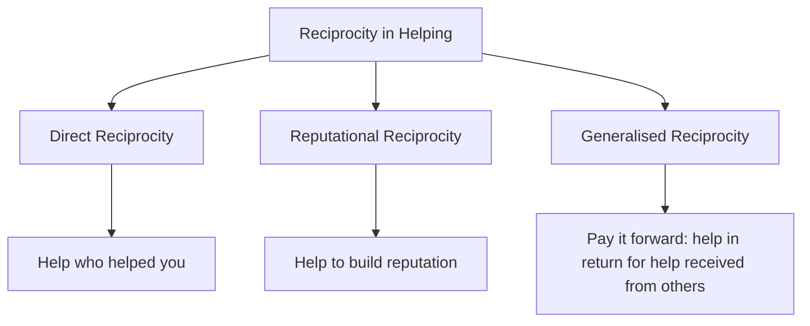
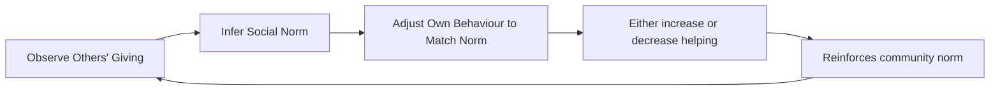
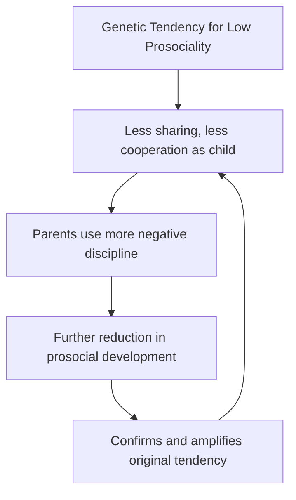

# Reciprocity, Social Norms, and Current Trends in Pro-social Behaviour Research

This concluding unit on prosocial behaviour examines how reciprocity and social norms sustain helping over time, explores cultural and genetic variations in prosociality, and surveys the cutting-edge research directions that are reshaping our understanding of why humans help each other.

---

**Source PDFs**:
- 📄 [Block-2/Unit-2.pdf - Pages 39-41](/pdfs/MPC-004%20Advanced%20Social%20Psychology/Block-2/Unit-2.pdf)
- 📚 MPC-004 Advanced Social Psychology

---

## Reciprocity: The Engine of Sustained Helping

While many theories explain *why* people help in single encounters, reciprocity explains how prosocial behaviour is sustained in ongoing relationships and communities. **Reciprocity** refers to the tendency to cooperate more, give more, or help more in response to others' cooperative, generous, or helpful behaviour.

### Types of Reciprocity in Helping

**Direct Reciprocity**: "You helped me, so I'll help you." The simplest form — helping someone who has previously helped you, or expecting help in return for help given. Leider et al. (2009) established that giving is motivated, at least partly, by the anticipation of future reciprocal interactions (**enforced reciprocity**).

**Indirect/Reputational Reciprocity**: "I'll help you because I want others to see me as generous, which will make them more likely to help me later." Even charitable behaviour toward strangers can be motivated by the expectation that generosity will enhance one's social reputation within a community.

**Generalised Reciprocity**: "I'll help you because someone helped me, even if it wasn't you." Communities with strong helping norms create a culture where help flows freely because everyone benefits from the general expectation of mutual support.

### Reciprocity and Charitable Giving

Although individual charity donations do not typically benefit the donor directly, donors may still expect long-term reputational or social benefits. This "enlightened self-interest" mechanism explains why reciprocity can motivate even seemingly anonymous generosity.

Leider et al. (2009) found in social network analyses that the *structure* of one's social network predicts giving behaviour — people in networks with strong reciprocal ties give more, suggesting that the expectation of future interaction sustains prosocial behaviour.

---

## Social Norms: The Invisible Rules of Helping

Social norms are shared expectations about how people *should* behave in social situations. Two norms are particularly important for understanding helping behaviour:

### 1. The Norm of Social Responsibility

People are expected to help others who genuinely need assistance and who cannot help themselves — especially dependents, children, the elderly, and the vulnerable. This norm operates across most cultures and is strongly reinforced by religious and moral traditions worldwide.

### 2. The Norm of Reciprocity

People are expected to return favours and help those who have previously helped them. Violating this norm — accepting help without reciprocating — is widely condemned as ingratitude or exploitation.

### Norms as Conformity Mechanisms

Meier (2004) demonstrated that people translate observations of others' giving into prescriptions about what *they* should give. In other words, social norms about helping function as **social conformity pressures** — "If everyone at my temple donates ₹500 to the fundraiser, I should too."

This mechanism creates powerful feedback loops:
- When community giving is high → norms shift upward → more giving
- When community giving is low → norms shift downward → less giving

This helps explain charitable campaign strategies that publicise average donation amounts or emphasise that "thousands have already donated."

---

## Current Trends in Prosocial Behaviour Research

### 1. Genetic Contributions to Prosociality

Research has increasingly documented that prosocial behaviour has a meaningful genetic component — not through a single "altruism gene," but through complex interactions of multiple genes influencing empathy, impulse control, emotional regulation, and social bonding.

**Key Finding**: Several longitudinal twin studies find that the heritability of prosociality increases with age:
- At **age 2**: ~30% heritability of parent-rated prosociality
- At **age 7**: ~60% heritability (Knafo & Plomin, 2006)

This suggests that genetic influences on prosocial behaviour become *more prominent* as children develop, potentially because genetic tendencies shape how children select and respond to environments.

### Gene-Environment Correlations

Children with genetically influenced *low* prosociality may elicit harsher, more negative parenting responses, which further reduces their prosocial development — a **gene-environment correlation** in which genetic tendencies amplify environmental effects (Knafo & Plomin, 2006).

This challenges simplistic nature vs. nurture divisions: genes influence both the child's behaviour *and* the environments they experience and create.

### 2. Cultural Variation in Prosocial Behaviour

One of the most important current trends is the recognition that prosocial behaviour varies substantially across cultures — challenging assumptions derived primarily from Western, educated, industrialised, rich, democratic (WEIRD) societies.

**Levine, Norenzayan & Philbrick (2001)**: In a landmark field study, researchers measured spontaneous helping behaviour across 23 cultures using a standardised test (stranger with a hurt leg drops magazines). The proportion of individuals who helped ranged from **22% to 95% across cultures** — a massive range that cannot be explained by individual-level factors alone.

**Two Cultural Dimensions That Explain Variation** (Eisenberg & Mussen, 1989):

| Cultural Type | Value System | Impact on Prosociality |
|---|---|---|
| Industrial/Western | Competition, personal success | Lower spontaneous helping of strangers |
| Non-industrial/Collectivist | Cooperation, family obligation | Higher spontaneous helping, embedded in daily life |

**Cross-Cultural Consistency**: Despite enormous variation in the *form* and *frequency* of helping, some prosocial tendencies appear universal. Even young children (12–18 months) from diverse cultures spontaneously help adults in distress, suggesting that some prosocial dispositions are pan-human.

### 3. Developmental Trajectories

Longitudinal research has refined our understanding of how prosocial behaviour develops across the lifespan:

- **Infancy (12–18 months)**: Spontaneous instrumental helping emerges without training
- **Toddlerhood (2–3 years)**: Sharing and comforting behaviours appear; strongly influenced by parenting
- **Childhood**: Prosocial moral reasoning develops; gender differences emerge
- **Adolescence**: Peer norms become dominant; heroic helping increases; some antisocial competition emerges
- **Early Adulthood**: Prosocial moral reasoning peaks; formal volunteering increases
- **Middle/Late Adulthood**: Sustained volunteering; grandparental investment; community-oriented helping

### 4. Digital and Online Prosocial Behaviour

A burgeoning area of research examines helping behaviour in online environments:

- **Bystander effect online**: Markey (2000) found that the bystander effect extends to internet chat rooms — the larger the group, the slower the response to requests for help. However, directly addressing a specific person by name eliminates this effect.
- **Viral charity**: Social media platforms enable prosocial campaigns (e.g., ice bucket challenge) that harness reciprocity norms, identifiable victim effects, and social identity processes simultaneously.
- **Online microlending and crowdfunding**: Platforms like Kiva (microloans) and GoFundMe demonstrate the identifiable victim effect and empathy-altruism dynamics at massive scale.

---

## Cultural Differences in Altruism: A Summary

Research suggests two explanations for cross-cultural variation (Eisenberg & Mussen, 1989):

1. **Industrial societies** emphasise competition and individual success, which reduces motivation for spontaneous helping of strangers (though it may increase formal charitable giving as a status signal).

2. **Cooperative home environments** in non-industrial societies — where cooperation is essential for survival and deeply embedded in daily routines — promote altruistic dispositions from early childhood.

### Indian Context

India presents a fascinating case: a society undergoing rapid industrialisation while retaining strong traditional values of *seva* (selfless service), *dana* (charitable giving), and community obligation. Research within Indian contexts shows:
- Strong prosocial behaviour within extended family and community networks
- Religious motivation for helping (especially through seva and zakat)
- Significant urban-rural variation in helping of strangers
- Growing tension between collectivist helping traditions and competitive individualism in urban centres

---

## 🎯 Self-Assessment Questions

**Level 1 – Recall**

1. What three types of reciprocity did this unit identify? Give an example of each.
2. What did Levine, Norenzayan & Philbrick (2001) find in their 23-culture study of helping strangers?
3. According to Knafo & Plomin (2006), how does the heritability of prosociality change from age 2 to age 7?

**Level 2 – Understanding**

4. Explain how social norms about helping can create either upward or downward spirals of prosocial behaviour in a community. What are the practical implications for charity campaigns?
5. How does the gene-environment correlation concept challenge simple nature vs. nurture explanations of prosocial behaviour?
6. Why might industrial societies show lower rates of spontaneous helping of strangers than non-industrial societies? What mechanisms explain this?

**Level 3 – Application & Critical Analysis**

7. You are designing a nationwide prosocial behaviour campaign in India that must work across both urban and rural communities. Drawing on research about social norms, cultural variation, and reciprocity, design the key features of your campaign. Explain the psychological mechanisms you are targeting in each feature.
8. A researcher argues: "Online prosocial behaviour is less genuine than face-to-face helping because it is motivated primarily by reputational reciprocity and social norm compliance." Evaluate this claim drawing on evidence from this unit and the broader prosocial behaviour literature.

---

## 🧠 Memory Aids

**"3Rs of Sustained Helping"**:
- **R**eciprocity (direct, indirect, generalised)
- **R**ules (social norms: responsibility and reciprocity)
- **R**oots (genetic and cultural foundations)

**For Cultural Differences**: Remember the contrast:
- **Industrial** = Competition → Lower spontaneous helping
- **Non-industrial** = Cooperation at home → Higher altruism

**For Heritability**: **"30 at 2, 60 at 7"** (Knafo & Plomin)

---

## 🌐 External Resources

### Wikipedia Articles
- [Reciprocal Altruism](https://en.wikipedia.org/wiki/Reciprocal_altruism) — Evolutionary and social perspectives
- [Social Norm](https://en.wikipedia.org/wiki/Social_norm) — Mechanisms of norm enforcement and conformity
- [Cross-Cultural Psychology](https://en.wikipedia.org/wiki/Cross-cultural_psychology) — Methods and findings

### Research Papers
- Levine, R.V., Norenzayan, A. & Philbrick, K. (2001). Cross-cultural differences in helping strangers. *Journal of Cross-Cultural Psychology, 32*, 543-560.
- Knafo, A. & Plomin, R. (2006). Parental discipline and affection and children's prosocial behaviour. *Journal of Personality and Social Psychology, 90*, 147-164.
- Leider, S., Mobius, M., Rosenblat, T. & Do, Q. (2009). Directed altruism and enforced reciprocity in social networks. *Quarterly Journal of Economics*.
- Eisenberg, N. & Mussen, P. (1989). *The roots of prosocial behaviour in children.* Cambridge University Press.

### Educational Videos
- 🎥 [Cross-Cultural Prosocial Behaviour](https://www.youtube.com/watch?v=LVFHmkzCfxA) — Introduction to cultural psychology of helping
- 🎥 [The Science of Generosity](https://www.youtube.com/watch?v=JN-FHcMRGOQ) — Greater Good Science Center
- 🎥 [Genetic Basis of Altruism](https://ocw.mit.edu) — MIT Open Learning Library

### Cross-References
- [Theoretical Perspectives on Pro-social Behaviour](/mpc-004/block-2/theoretical-perspectives-prosocial-behaviour)
- [Factors Affecting Helping Behaviour](/mpc-004/block-2/factors-affecting-helping-behaviour)
- [Conformity and Social Norms](/mpc-004/block-2/conformity-asch-experiment)
