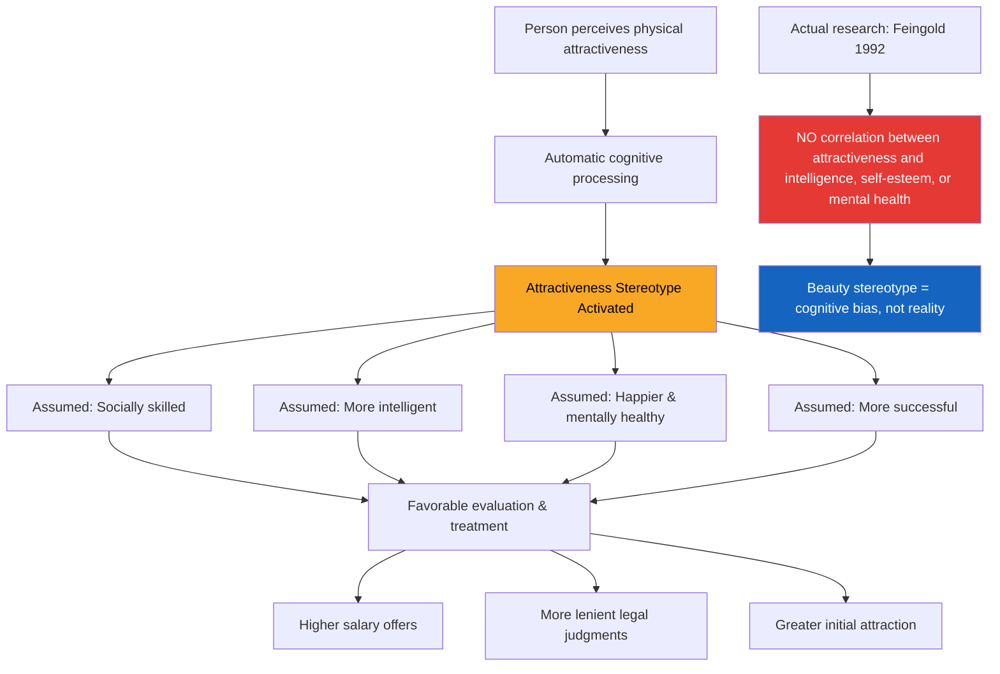

# Interpersonal Attraction: Physical Attractiveness and the Beauty Stereotype

## Introduction: Why We Are Drawn to Some People

Relationships with people around us define our social existence. The study of **interpersonal attraction**—what makes us like, love, dislike, or feel drawn to certain people—is one of the most fascinating areas in social psychology. At its core, interpersonal attraction can be understood as *a force acting between two people that tends to draw them together and resist their separation.*

Psychologists have identified multiple factors driving attraction. The most frequently studied are: physical attractiveness, propinquity (proximity), familiarity, similarity, complementarity, reciprocal liking, and reinforcement. We begin with the most visually immediate—physical attractiveness—and the intriguing (and sometimes troubling) ways beauty shapes our social lives.

:::info Source
📄 [MPC-004 Block-2/Unit-3.pdf - Pages 49–51](/pdfs/MPC-004%20Advanced%20Social%20Psychology/Block-2/Unit-3.pdf) | 📚 MPC-004 Advanced Social Psychology
:::

---

## What Is Physical Attractiveness?

Despite the old sayings—"beauty is only skin deep" and "you can't judge a book by its cover"—human behaviour consistently aligns with Aristotle's 2,000-year-old observation that *personal beauty is a greater recommendation than any letter of introduction.*

Physical attractiveness is among the most commonly cited factors influencing attraction (Baumeister & Bushman, 2008). When people encounter an attractive person, they tend to infer **internal qualities** as well: kindness, social competence, warmth, and intelligence. This tendency is not random—it follows a predictable pattern that researchers have labelled the **physical attractiveness stereotype**.

---

## The Physical Attractiveness Stereotype

In one of the earliest landmark studies, college students were shown photographs of men and women rated as good-looking, average, or homely, and asked to evaluate their personalities. The results were striking: physically attractive people were assumed to possess a host of socially desirable traits—not because of any actual evidence, but simply based on appearance.

Two separate **meta-analyses** of over 35 years of research (compiled across many labs and samples) revealed that physically attractive people are perceived as:

| Trait Domain | Attributed Characteristics |
|---|---|
| Social | More sociable, sexually warm, socially skilled |
| Cognitive | More intelligent |
| Psychological | Happier, more mentally healthy |
| Status | More dominant, more successful |

Importantly, this **attractiveness stereotype also occurs in collectivist cultures**, though its specific content varies. In individualistic cultures, attributes like independence and assertiveness are assumed; in collectivist contexts, attributes like warmth and social harmony may be more centrally attributed.

### The Jury Simulation: Attractiveness and Justice

A sobering finding comes from jury simulation studies: more attractive defendants were evaluated more positively and judged less likely to be guilty compared to less attractive defendants. This suggests that beauty bias operates not just in casual social encounters but can influence **legal outcomes**—a profound societal implication.

---

## Beauty and Job-Related Outcomes

Field and laboratory studies across both individualistic and collectivist cultures show that physical attractiveness has a **moderate but measurable impact** on job-related outcomes including hiring decisions, salary negotiations, and promotions.

Key findings (based on representative studies):

- Good-looking men earned significantly **higher starting salaries** than men with average faces.
- For women, **facial attractiveness did not affect starting salary** but substantially influenced **later salaries**—women above average in attractiveness earned approximately $4,200 more per year than those below average.
- For men, this attractiveness salary difference reached approximately **$5,200 per year**.
- Being 20% or more overweight reduced a man's starting salary by over $2,000.

These findings collectively demonstrate that **physical appearance directly affects economic success**, independent of actual competence or personality.

---

## Does Beauty Equal Character? The Meta-Analysis Verdict

Alan Feingold (1992) conducted a comprehensive meta-analysis of over **ninety studies** examining whether physically attractive and unattractive people actually *differ* in their basic personality traits. His conclusion was clear:

> **Physical attractiveness is unrelated to objective measures of intelligence, dominance, self-esteem, and mental health.**

In other words, the beauty stereotype is a *cognitive bias*, not a reflection of reality. We assume attractive people are better in important ways, but the data do not support this assumption. This gap between perception and reality is at the heart of why beauty bias matters ethically.

---

## The Evolutionary Angle: Why Beauty Matters Biologically

Evolutionary psychologists offer an additional layer of explanation. Physical attractiveness may serve as a **proxy for genetic fitness and health**. Specifically:

- **Facial symmetry** is associated with genetic health—we tend to rate symmetrical faces as more attractive. However, interestingly, perfectly symmetrical faces (digitally created) are rated *less* attractive than naturally symmetric ones, suggesting optimal attractiveness requires some degree of naturalness.
- Attraction to faces **similar to one's own** has been documented: when a man's features are superimposed onto a female photograph, he tends to rate that composite most attractive—possibly because he associates survival-linked traits with his own genome.
- Features signalling **health and fertility** (clear skin, robust build, specific waist-to-hip ratios) are considered attractive cross-culturally.

This evolutionary framing does not excuse attractiveness bias, but helps explain why it is so deeply embedded and universal across cultures and societies.

---

## Recent Research Spotlight (2020–2024)

```
📰 Recent Research: Beauty Bias and Workplace Equity
```

- **Luxen & Van De Vijver (2006)** showed beauty bias in hiring persists even when qualifications are identical—updated meta-analyses in 2021 confirm this "beauty premium" remains robust in hiring contexts.
- **Agthe et al. (2021)** found that the attractiveness advantage can *reverse* for same-gender evaluators in competitive workplace contexts—attractive individuals of the same gender can threaten evaluators' self-image, triggering **downward evaluation bias**.
- **Maestripieri et al. (2023)** found attractiveness-based discrimination effects in STEM recruitment, highlighting ongoing societal challenges.
- Research from 2022 on **digital/remote work contexts** suggests that in video-call dominated environments, physical attractiveness bias may actually increase because appearance becomes the primary social cue available.

---

## Mermaid Diagram: Physical Attractiveness Stereotype Pathway



---

## External Resources

### Wikipedia Articles
- 🌐 [Physical Attractiveness](https://en.wikipedia.org/wiki/Physical_attractiveness) — Overview of beauty research
- 🌐 [Halo Effect](https://en.wikipedia.org/wiki/Halo_effect) — The cognitive bias underlying the beauty stereotype
- 🌐 [Lookism](https://en.wikipedia.org/wiki/Lookism) — Discrimination based on physical appearance

### Educational Videos
- 🎬 [The Science of Attraction – TED-Ed](https://www.youtube.com/watch?v=169N81xAffQ) — What research says about what makes us attractive
- 🎬 [Are Attractive People Treated Differently? – Psych2Go](https://www.youtube.com/watch?v=Wt3meSEQ3L0) — Beauty privilege explained
- 🎬 [Halo Effect in Social Psychology – Crash Course Psychology](https://www.youtube.com/watch?v=UGhTBkexMD0) — Cognitive biases in person perception

### Research Papers
- 📄 Feingold, A. (1992). *Good-looking people are not what we think.* Psychological Bulletin, 111(2), 304–341.
- 📄 Dion, K., Berscheid, E., & Walster, E. (1972). *What is beautiful is good.* Journal of Personality and Social Psychology, 24(3), 285–290.
- 📄 Luxen, M. F., & Van De Vijver, F. J. R. (2006). *Physical attractiveness, sexual selection, and personnel selection.* Journal of Organizational Behavior.
- 📄 Agthe, M., Spörrle, M., & Maner, J. K. (2021). *Don't hate me because I'm beautiful.* Journal of Experimental Social Psychology.
- 📄 Rhode, D. L. (2010). *The Beauty Bias: The Injustice of Appearance in Life and Law.* Oxford University Press.

---

## Indian Context: Beauty and Bias in India

The attractiveness stereotype operates in India within a specific cultural context shaped by factors including:

- **Fair skin preference**: Research consistently shows that lighter skin is associated with social desirability in matrimonial advertisements, hiring, and media representation—a phenomenon termed **colourism**.
- **Matrimonial ads in India** still heavily weight physical appearance, with "fair, tall, slim" among the most common criteria, demonstrating how beauty bias intersects with caste and class.
- **Bollywood effect**: Indian cinema has historically reinforced narrow beauty standards, with studies documenting that leading actors increasingly conform to Westernised body ideals.
- Studies on Indian MBA students show that physically attractive candidates are more likely to be recommended for hiring by student evaluators, mirroring Western findings.

Understanding these patterns is vital for psychology students who will work in Indian clinical, organisational, or educational contexts.

---

## Memory Aid: The "SHIMS" Framework

**S** – **Social** skills assumed (more sociable, warm)  
**H** – **Happy** and healthy assumed (mental wellness inferred)  
**I** – **Intelligence** assumed (falsely)  
**M** – **Money** impact (salary differences documented)  
**S** – **Status** and dominance assumed

> 🧠 Remember: The beauty stereotype says these things are assumed—Feingold's meta-analysis says none are actually true!

---

## Self-Assessment Questions

### Level 1: Knowledge
1. What is the **physical attractiveness stereotype**? Explain with two examples.
2. According to Feingold's (1992) meta-analysis, what is the relationship between physical attractiveness and personality traits?

### Level 2: Application
3. A newly appointed hiring manager tends to favour attractive job applicants. Using the physical attractiveness stereotype, explain how and why this bias operates, and what HR policies might reduce it.
4. How might the beauty stereotype affect legal proceedings? Describe one mechanism and its implications for justice.

### Level 3: Analysis
5. Physical attractiveness research has been criticised for using samples from individualistic cultures. How might the attractiveness stereotype manifest differently in collectivist societies like India? What dimensions might be emphasised?
6. Evolutionary theories suggest beauty signals genetic fitness. Critics argue this naturalises discrimination. Evaluate both sides—does the evolutionary explanation justify beauty-based bias in social or professional contexts?

### Essay Question
7. "Physical attractiveness, while perceptually powerful, is ultimately a cognitive distortion that leads to systematic injustice." Critically evaluate this claim using research evidence from social psychology.

---

## Common Exam Misconceptions

:::caution Watch Out!
- **Misconception**: Physical attractiveness accurately predicts personality traits.  
  **Fact**: Feingold (1992) found NO significant relationship between attractiveness and intelligence, dominance, self-esteem, or mental health.

- **Misconception**: The beauty stereotype only operates in Western, individualistic cultures.  
  **Fact**: It occurs across cultures but with different content—collectivist cultures emphasise different traits (e.g., warmth over independence).

- **Misconception**: Attractiveness effects are trivial and disappear with more information.  
  **Fact**: Studies show the halo effect persists even when evaluators have substantial information about the person being evaluated.
:::

---

## Summary

Physical attractiveness is among the most powerful and pervasive determinants of interpersonal attraction. The **attractiveness stereotype** leads people to automatically infer a cluster of positive traits—social skills, intelligence, happiness—from physical beauty, despite no actual empirical basis. This bias manifests in real consequences: salary differentials, legal judgments, and hiring decisions. Evolutionary psychology offers biological explanations, but these cannot justify discrimination. For psychology students, understanding attractiveness bias is essential both academically and professionally—whether working in clinical, organisational, or policy contexts where appearance-based discrimination remains a live ethical issue.

---
**Source PDFs**: 
- 📄 [Block-2/Unit-3.pdf - Pages 49–51](/pdfs/MPC-004%20Advanced%20Social%20Psychology/Block-2/Unit-3.pdf)
- 📚 MPC-004 Advanced Social Psychology
