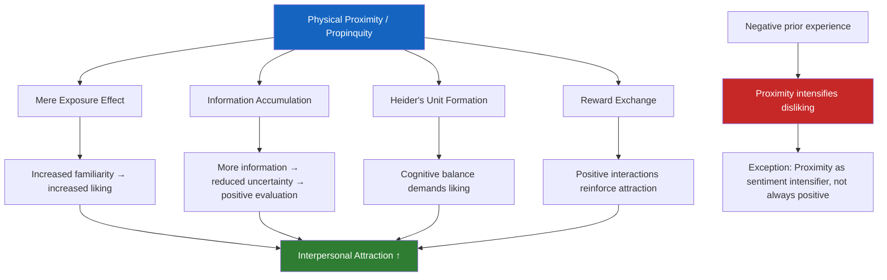

# Proximity and Interpersonal Attraction: Propinquity, Familiarity, and Heider's Balance Theory

## Introduction: Why Geography Shapes Friendship

One of the most reliably demonstrated facts in the study of interpersonal attraction is deceptively simple: **the closer two people are to each other geographically, the more likely they are to become friends or intimate partners.** This is the **propinquity effect**, also known as the proximity effect.

While it might seem obvious that people nearby become friends, the psychological mechanisms behind this effect are rich and theoretically significant. Proximity determines information access, facilitates reward exchange, and even produces cognitive pressures toward liking through processes like Heider's balance theory.

:::info Source
📄 [MPC-004 Block-2/Unit-3.pdf - Pages 51–54](/pdfs/MPC-004%20Advanced%20Social%20Psychology/Block-2/Unit-3.pdf) | 📚 MPC-004 Advanced Social Psychology
:::

---

## The Propinquity Effect: Core Definition

According to Rowland Miller's *Intimate Relationships*, the propinquity effect is defined as:

> *"The more we see and interact with a person, the more likely he or she is to become our friend or intimate partner."*

This effect is closely related to the **mere exposure effect**: the more a person is exposed to a stimulus—whether a sound, image, or person—the more they tend to like it. However, there are exceptions: if initial interactions are negative, greater exposure can *intensify disliking* rather than increase attraction. Proximity is thus better understood as an **intensifier of sentiments**—it amplifies both positive and negative feelings.

---

## Proximity as an Intensifier of Sentiments

The central proposition is elegantly simple:

> **Other things being equal, the closer two individuals are geographically, the more likely it is that they will be attracted to each other.**

Evidence supporting this comes from diverse settings:

- **University classrooms**: Students develop stronger friendships with those who sit nearby or share dormitory space (Byrne, 1961).
- **Department store clerks and bomber crew members**: Workers develop closer relationships with those positioned immediately adjacent to them at work (Zander & Havelin, 1960).
- **Residential housing**: One of the most famous demonstrations of proximity effects on attraction.

---

## The Festinger, Schachter, and Back (1950) Housing Study

This landmark study examined friendship formation in a new housing development for married graduate students. The design was elegant: small houses arranged in U-shaped courts, most facing a common grassy area, with end houses facing the street.

### Key Findings

**Factor 1: Sheer distance between houses**  
Friendships developed most frequently between next-door neighbours, less frequently between people separated by one house, and so on. By five or more houses' distance, friendships were rare.

**Factor 2: Architectural features (functional proximity)**  
The *direction* a house faced mattered as much as raw distance. Houses near stairway entrances/exits had residents with more friends—not because of distance, but because these architectural features channelled pedestrian flow, creating informal but repeated contact.

Similarly, mailbox locations benefited nearby apartment residents socially, as picking up mail created regular opportunities for brief encounters.

**The architect as social engineer:** Festinger's striking conclusion was that *architects can, to a great extent, determine the social life of residents.* This has profound implications for urban planning, campus design, and office layout.

### Integrated Housing and Racial Harmony

Deutsch and Collins (1958) studied integrated housing developments and found that racial integration in housing **increased interracial friendship and reduced racial prejudice**. People who lived near members of different racial groups developed more positive intergroup attitudes. This finding supported arguments for integrated housing policy, demonstrating that proximity breaks down in-group/out-group divides through simple familiarity.

---

## Proximity and Information Acquisition

Why does proximity produce attraction? One mechanism is information-based:

> **Proximity provides opportunities to gather information about the other person and accumulate experience of rewards and punishments from interacting with them.**

Without proximity, we simply lack sufficient information to develop strong sentiments. Since most human interactions involve rewards (cooperation, helpfulness, social support), Newcomb (1956) argued that **the reward-punishment ratio of most interactions tends to be positive**—meaning proximity more often produces liking than disliking.

People generally take care to reward others in interaction (since social interdependence means rewards are mutually beneficial). Therefore, proximity creates a self-reinforcing system: more contact → more positive exchanges → more liking.

---

## Heider's Balance Theory: A Cognitive Explanation

Fritz Heider (1958) offered a powerful cognitive-consistency explanation for why proximity produces attraction—rooted in the **principle of cognitive balance**.

### Core Concepts

**Sentiment relationships**: Our positive or negative attitudes toward persons or objects.

**Unit relationships**: When two entities are perceived as "belonging together"—e.g., members of a family, a person and their possessions.

Heider drew on **Gestalt psychology's perceptual principles**: objects that are close together spatially tend to be perceived as a unit. Therefore:

> If two people are in close proximity → they form a **unit relationship** → cognitive balance theory predicts that the person will develop a **positive sentiment** toward the nearby other.

### The Darley and Berscheid (1967) Study

This elegant experiment tested whether anticipated proximity produces attraction even *before* actual interaction.

**Method**: Female college students were told they would discuss sexual standards with a partner (Person A in one folder). They were given personality information about two people—one designated as their discussion partner, the other a stranger they would never meet. The personality information in both folders was deliberately ambiguous.

**Result**: Subjects **liked their anticipated discussion partner significantly more** than the non-partner, despite identical ambiguous information. This demonstrates that the mere *expectation* of close interaction creates a unit feeling, which in turn generates liking.

**Follow-up finding**: Even when subjects were told the anticipated interaction was cancelled, they still preferred to voluntarily interact with the person they had anticipated meeting—even when that person was described as objectively undesirable.

This shows that **proximity-induced liking is cognitively generated and can outlast its original cause**.

---

## Mermaid Diagram: Mechanisms of Proximity → Attraction

---

## Comparison Table: Theories Explaining Proximity Effects

| Theory | Key Mechanism | Prediction |
|---|---|---|
| **Mere Exposure Effect** (Zajonc) | Familiarity reduces uncertainty and increases positive affect | More exposure = more liking (with no prior negative feelings) |
| **Reward-Punishment Theory** (Newcomb) | Proximity enables reward exchange; most interactions are rewarding | Proximity → liking (because most interactions are positive) |
| **Heider's Balance Theory** | Cognitive consistency; unit formation demands harmonious sentiment | Proximity → perceived unit → liking |
| **Information Processing** | Proximity provides data needed to form judgments | Proximity → knowledge → stable sentiment (positive or negative) |

---

## External Resources

### Wikipedia Articles
- 🌐 [Propinquity](https://en.wikipedia.org/wiki/Propinquity) — Definition and social psychology research
- 🌐 [Mere Exposure Effect](https://en.wikipedia.org/wiki/Mere-exposure_effect) — Zajonc's foundational research
- 🌐 [Heider's Balance Theory](https://en.wikipedia.org/wiki/Balance_theory) — Cognitive balance in social relations

### Educational Videos
- 🎬 [The Mere Exposure Effect – Psych Explained](https://www.youtube.com/watch?v=uEX-4r5PoBo) — Why familiarity breeds liking
- 🎬 [Social Psychology: Attraction – Crash Course Psychology](https://www.youtube.com/watch?v=9X68dm92HVI) — Overview including proximity factors
- 🎬 [Urban Design and Human Connection – TED Talk](https://www.youtube.com/watch?v=Tq0wRfOQFAw) — Architecture shaping social lives (practical application)

### Research Papers
- 📄 Festinger, L., Schachter, S., & Back, K. (1950). *Social Pressures in Informal Groups.* Harper.
- 📄 Zajonc, R. B. (1968). *Attitudinal effects of mere exposure.* Journal of Personality and Social Psychology Monograph.
- 📄 Newcomb, T. M. (1956). *The prediction of interpersonal attraction.* American Psychologist, 11(11), 575–586.
- 📄 Berscheid, E., & Reis, H. T. (1998). *Attraction and close relationships.* In D. T. Gilbert, S. T. Fiske, & G. Lindzey (Eds.), The Handbook of Social Psychology.
- 📄 Montoya, R. M., & Horton, R. S. (2020). *A meta-analytic investigation of the processes underlying the similarity-attraction effect.* Journal of Social and Personal Relationships.

---

## Indian Context: Proximity Effects in Indian Society

The propinquity effect operates in unique ways within Indian social contexts:

- **Joint families and arranged marriages**: Extended family living creates high proximity between family members, often deepening bonds—but also, in some cases, intensifying conflicts. Research on Indian joint families shows that shared living spaces are associated with both greater cohesion and higher interpersonal friction, consistent with the "intensifier of sentiments" model.
- **Caste-based residential segregation**: Historically, Indian neighbourhoods have been organised along caste lines, meaning proximity patterns have reinforced caste-based social networks. Urban migration and mixed housing developments are gradually changing this.
- **University hostels**: Studies on Indian university students show that hostel roommate proximity strongly predicts friendship formation—consistent with Festinger et al.'s findings, students assigned adjacent rooms develop more friendships than those in distant rooms.
- **Workplace proximity post-COVID**: Indian IT and service sector organisations have observed reduced team cohesion in remote work models, consistent with the prediction that reduced physical proximity weakens attraction and cooperation.

---

## Memory Aid: The "FAIR" Framework for Proximity Effects

**F** – **Familiarity increases liking** (mere exposure effect)  
**A** – **Architecture determines social life** (Festinger's insight)  
**I** – **Information access** (proximity → knowledge → sentiment)  
**R** – **Reward exchange** (most interactions are positive → liking follows proximity)

> 🧠 Remember Festinger's finding: Living *near* mailboxes or stairways made people more popular—because architecture controlled proximity!

---

## Self-Assessment Questions

### Level 1: Knowledge
1. Define the **propinquity effect** with reference to Rowland Miller's definition.
2. Explain the two major factors Festinger (1950) identified as determining friendship formation in the student housing project.

### Level 2: Application
3. A new company is designing its office layout. Based on proximity research, what specific architectural features would you recommend to maximise team cohesion and positive interpersonal relationships? Justify using Festinger et al.'s findings.
4. Using Heider's balance theory, explain why two people who are assigned as lab partners at university tend to develop liking for each other, even before they know much about each other.

### Level 3: Analysis
5. Proximity generally increases liking, but researchers note it can also intensify negative sentiments. Under what conditions is proximity likely to *decrease* attraction? Give examples.
6. Deutsch and Collins (1958) found integrated housing reduced racial prejudice. Using proximity mechanisms (mere exposure, information acquisition, balance theory), explain *why* this occurs. What policy implications follow?

### Essay Question
7. "The physical environment shapes our social lives more profoundly than our intentions or choices." Evaluate this claim using research on propinquity, architectural features, and the mechanisms through which proximity drives interpersonal attraction.

---

## Common Exam Misconceptions

:::caution Watch Out!
- **Misconception**: Proximity always leads to liking.  
  **Fact**: Proximity *intensifies* sentiments—both positive and negative. If initial reactions are negative, more proximity can increase disliking.

- **Misconception**: Proximity effects are explained solely by more opportunities to meet.  
  **Fact**: Multiple mechanisms are at work: mere exposure, information access, reward exchange, AND Heider's cognitive balance. Examiners look for multi-mechanism explanations.

- **Misconception**: Heider's balance theory only applies to triadic relationships.  
  **Fact**: As shown by Darley and Berscheid's study, it also applies to dyadic unit formation—when two people are placed in a unit (even by architectural or experimental design), liking tends to follow.
:::

---

## Summary

The propinquity or proximity effect is one of the most robust findings in interpersonal attraction research. Physical closeness shapes our social networks through multiple mechanisms: the mere exposure effect builds familiarity, information accumulation shapes sentiment, reward exchange makes most interactions positive, and Heider's balance theory creates cognitive pressure to like those we perceive as part of our "unit." The architectural design of spaces—housing, offices, campuses—functions as a social engineering tool, shaping who meets whom and therefore who becomes friends. Understanding these mechanisms has implications for urban planning, workplace design, diversity policy, and clinical work on social isolation.

---
**Source PDFs**: 
- 📄 [Block-2/Unit-3.pdf - Pages 51–54](/pdfs/MPC-004%20Advanced%20Social%20Psychology/Block-2/Unit-3.pdf)
- 📚 MPC-004 Advanced Social Psychology
