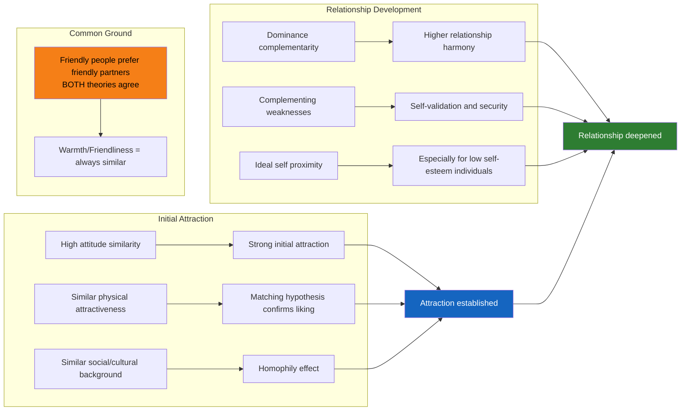

# Similarity and Complementarity in Interpersonal Attraction

## Introduction: "Birds of a Feather" vs. "Opposites Attract"

Two folk sayings capture opposing intuitions about relationships:

- **"Birds of a feather flock together"** — We are drawn to people like us.
- **"Opposites attract"** — Differences create excitement and complement our weaknesses.

Which is true? As with most rich psychological questions, the answer is: **both, but for different dimensions and at different stages of relationships**. Research consistently shows that similarity drives initial attraction, while complementarity may gain importance as relationships deepen. Let's explore what the evidence says.

:::info Source
📄 [MPC-004 Block-2/Unit-3.pdf - Pages 54–57](/pdfs/MPC-004%20Advanced%20Social%20Psychology/Block-2/Unit-3.pdf) | 📚 MPC-004 Advanced Social Psychology
:::

---

## Similarity: The Multidimensional Research

According to **Morry's Attraction-Similarity Model (2007)**, there is a lay belief that people with actual similarity produce initial attraction. People also develop **perceived similarity** in ongoing relationships—either for self-serving reasons (in friendships) or relationship-serving reasons (in romantic relationships). Notably, research finds that **perceived similarity is a better predictor of attraction than actual similarity**.

Newcomb (1963) found that people tend to change their *perceived* similarity to achieve balance in a relationship—suggesting that similarity is not just a cause of attraction, but something we partly construct to maintain comfortable relationships.

Similarity operates across multiple dimensions:

---

## Dimensions of Similarity and Their Effects

### 1. Physical Appearance: The Matching Hypothesis

Sociologist Erving Goffman argued that people are more likely to form lasting relationships with those **equally matched in social attributes**, including physical attractiveness.

This was tested empirically by Walster and Walster, who found that partners similar in physical attractiveness expressed the most liking for each other. A follow-up study analysed photos of dating and engaged couples and found a **definite tendency for couples of similar attractiveness to date or engage** (Murstein et al., 1976).

This is the **matching hypothesis**: in romantic relationships, people tend to pair with partners who are comparably attractive—not necessarily the most attractive available person, but someone who "matches" their own level.

### 2. Attitudes: Byrne's Law of Attraction

The most extensively researched dimension of similarity is **attitudinal similarity**. Byrne (1971) proposed the **"law of attraction"**:

> Attraction toward a person is *positively related* to the proportion of attitudes shared with that person.

Why does attitudinal similarity produce attraction?

- We believe people with similar attitudes are **smart** (they agree with us)
- We expect them to be **agreeable** and we'll get along
- We infer they **probably like us** in return

Research by Jamieson, Lydon, and Zanna (1987) showed that attitude similarity predicts:
- **Respect** for each other
- **Social first impressions**
- **Intellectual first impressions** (specifically, value-based attitude similarity)

Importantly, while attitudinal similarity and attraction are linearly related, attraction does not significantly contribute to attitude *change* (Simons, Berkowitz & Moyer, 1970). Friends influence each other's attitudes over time, but initial attraction is caused by pre-existing similarity rather than being the route to it.

### 3. Social and Cultural Background

Byrne, Clore, and Worchel (1966) found that people with **similar economic status** are more likely to be attracted to each other. Buss and Barnes (1986) found that people prefer romantic partners similar in:
- Religious background
- Political orientation
- Socioeconomic status

This creates a pattern of **social homophily**—social networks and romantic relationships are disproportionately composed of people from similar social, economic, and cultural backgrounds.

### 4. Personality

Research shows interpersonal attraction is positively correlated with personality similarity (Goldman, Rosenzweig & Lutter, 1980). People desire romantic partners similar to themselves on:
- Agreeableness
- Conscientiousness
- Extraversion
- Emotional stability
- Openness to experience
- Attachment style (Klohnen & Luo, 2003)

### 5. Interests and Activities

Activity similarity is especially predictive of liking. Lydon, Jamieson, and Zanna (1988) found an interaction with self-monitoring:
- **High self-monitors** (sensitive to social cues) were influenced more by activity preference similarity
- **Low self-monitors** (guided by internal values) were more influenced by value-based attitude similarity

This means what dimension of similarity matters most depends on the individual's personality orientation.

### 6. Social and Communication Skills

Tactical similarity in communication style (similar use of person-centred tactics in conversation) was positively correlated with **partner satisfaction and global competence ratings** (Waldron & Applegate, 1998).

---

## Effects of Similarity on Relationship Dynamics

| Stage | Role of Similarity |
|---|---|
| **Initial attraction** | High attitude similarity significantly increases attraction to the target |
| **Relationship commitment** | Similarity in intrinsic values linked to commitment and stability (Kurdek & Schnopp-Wyatt, 1997) |
| **Perceived similarity** | Greater predictor of attraction than actual similarity; people actively construct perceptions of similarity |
| **Long-term relationships** | Complementarity gains importance for certain dimensions (especially dominance) |

---

## Complementarity: When "Opposites Attract"

Complementarity addresses whether *differences* can drive attraction. Studies show that **complementary interaction between two partners can increase attractiveness**—but this applies primarily to specific dimensions, particularly **dominance/submissiveness**.

Markey and Markey (2007) found:
- Complementary partners preferred **closer interpersonal relationships** than non-complementary ones.
- Couples who reported the **highest levels of loving and harmonious relationships were more dissimilar in dominance** than lower-quality couples.
- Two dominant people experience conflict; two submissive people experience frustration (no one takes initiative). The optimal pairing is one dominant + one submissive partner.

Mathes and Moore (1985) found that people are more attracted to peers who approximate their **ideal self**—and for people with low self-esteem, this makes complementary relationships especially appealing, as they provide qualities the person feels they lack.

We are attracted to complementary partners because:
- It allows maintenance of our **preferred behavioural style**
- Interaction with someone who complements us provides **self-validation and security**

---

## Reconciling Similarity and Complementarity

Do these two principles contradict each other? Research suggests they actually **agree on one dimension**:

> Both similarity and complementarity principles predict that **friendly people prefer friendly partners** (Dryer & Horowitz, 1997).

The key insight is that **similarity and complementarity operate on different dimensions and at different relationship stages**:

- **Similarity** carries more weight in **initial attraction** (we are drawn to people who share our attitudes, values, and background)
- **Complementarity** gains importance as **relationships develop over time** (we increasingly value what the partner provides that we lack)

Additionally, an important caveat: **Perception may not match reality**. Research found that dominant people *perceived* their partners as similarly dominant, while independent observers rated the partners as behaving submissively—that is, complementarily. The reason why people perceive similarity despite evidence of complementarity remains an open research question.

---

## Mermaid Diagram: Similarity vs. Complementarity Across Relationship Stages

---

## External Resources

### Wikipedia Articles
- 🌐 [Similarity–Attraction Effect](https://en.wikipedia.org/wiki/Similarity_attraction_effect) — Research overview
- 🌐 [Matching Hypothesis](https://en.wikipedia.org/wiki/Matching_hypothesis) — Physical attractiveness matching in relationships
- 🌐 [Interpersonal Attraction](https://en.wikipedia.org/wiki/Interpersonal_attraction) — Comprehensive overview

### Educational Videos
- 🎬 [Why We Like People Similar to Us – Psychology Insights](https://www.youtube.com/watch?v=oB_dBrnHFOo) — Similarity-attraction research
- 🎬 [Do Opposites Really Attract? – SciShow Psych](https://www.youtube.com/watch?v=2p_8gx-XHJo) — Complementarity in relationships
- 🎬 [The Science of Love and Attraction – TED](https://www.youtube.com/watch?v=OYfoGTIG7pY) — Multidimensional view of attraction

### Research Papers
- 📄 Byrne, D. (1971). *The Attraction Paradigm.* New York: Academic Press.
- 📄 Morry, M. M. (2007). *Relationship satisfaction as a predictor of perceived similarity.* Journal of Social and Personal Relationships, 24, 117–138.
- 📄 Klohnen, E. C., & Luo, S. (2003). *Interpersonal attraction and personality.* Journal of Personality and Social Psychology, 85, 709–722.
- 📄 Markey, P. M., & Markey, C. N. (2007). *Romantic ideals, romantic obtainment, and relationship experiences.* Journal of Social and Personal Relationships, 24(4), 517–533.
- 📄 Watson, D., et al. (2004). *Match makers and deal breakers.* Journal of Personality.

---

## Indian Context: Similarity and Homophily in Indian Relationships

The similarity-attraction principle manifests powerfully in Indian cultural contexts:

- **Caste, religion, and language**: Indian matrimonial practices are steeped in similarity-seeking. Studies consistently show that the majority of marriages in India occur within the same caste, religion, and language community—a classic expression of attitudinal and cultural homophily amplified by family expectations.
- **Arranged marriages and similarity matching**: While arranged marriages may seem to prioritise family approval over personal attraction, research on Indian arranged marriages finds that **shared values, educational background, and socioeconomic status** are key matching criteria—directly reflecting the similarity principle.
- **Urban vs. rural attitudes**: Urban Indian youth increasingly cite **personality compatibility and shared interests** (not just caste/religion) as the most important similarity dimensions in partner selection—a shift that mirrors Western findings on attitudinal similarity.
- **Self-monitoring and urban professionals**: Indian MBA students and urban professionals show patterns similar to Lydon et al.'s findings on high self-monitors, preferring activity-based similarity (shared hobbies, lifestyle preferences) in partner selection.

---

## Memory Aid: "SAPIC" for Dimensions of Similarity

**S** – **Social/cultural background** (socioeconomic status, religion)  
**A** – **Attitudes** (Byrne's law of attraction—most researched)  
**P** – **Personality** (Big Five traits, attachment style)  
**I** – **Interests and activities** (especially for high self-monitors)  
**C** – **Communication style** (tactical similarity in conversation)

> 🧠 Complementarity exception: For **dominance**, opposites work better—one dominant + one submissive = better relationship quality!

---

## Self-Assessment Questions

### Level 1: Knowledge
1. What does Byrne's (1971) "law of attraction" state? What psychological mechanisms explain why attitudinal similarity produces liking?
2. Explain the **matching hypothesis** with an example from physical attractiveness research.

### Level 2: Application
3. Maya and Arjun are on their first date. They discover they have very different attitudes about politics but share the same love of hiking, similar music tastes, and similar communication styles. Based on similarity-attraction research, predict how their relationship might develop. Which dimensions of similarity/difference are most likely to matter?
4. A therapy client says, "I keep falling for people who are my complete opposite—they're wild and adventurous, and I'm quiet and cautious." Using the complementarity research, explain why this pattern might occur, and under what conditions it may or may not support a satisfying relationship.

### Level 3: Analysis
5. Perceived similarity is consistently found to be a stronger predictor of attraction than actual similarity. What does this imply about the cognitive processes underlying attraction? Is attraction more a feature of the external world or of our internal constructions?
6. How do similarity and complementarity *interact* across the lifespan of a relationship? Using evidence, describe when each principle is most influential and why.

### Essay Question
7. "The evidence that 'birds of a feather flock together' is compelling, but the real story of similarity in attraction is more nuanced than the proverb implies." Critically evaluate this statement, discussing multiple dimensions of similarity, the role of complementarity, and the distinction between actual and perceived similarity.

---

## Common Exam Misconceptions

:::caution Watch Out!
- **Misconception**: Similarity and complementarity are opposing theories that cannot both be true.  
  **Fact**: They operate on different dimensions—similarity matters for attitudes, values, and social background; complementarity matters for dominance. Both can be true simultaneously.

- **Misconception**: Physical attractiveness matching only applies to aesthetics.  
  **Fact**: Goffman's broader formulation includes matching on multiple "social attributes"—attractiveness is the most studied, but the principle extends to social status, personality, and resources.

- **Misconception**: Perceived similarity = actual similarity.  
  **Fact**: Perceived similarity *predicts* attraction better than actual similarity. We partly construct perceptions of similarity to maintain relationships we are already attracted to.
:::

---

## Summary

Similarity is one of the most powerful determinants of interpersonal attraction, operating across multiple dimensions: physical attractiveness (matching hypothesis), attitudes (Byrne's law), social and cultural background (homophily), personality, interests, and communication style. Perceived similarity—how similar we believe someone to be—is an even stronger predictor than actual similarity. Complementarity, rather than contradicting similarity, applies primarily to dimensions like dominance, where differences in interpersonal style create harmony. The key synthesis: **similarity drives initial attraction across most dimensions, while complementarity gains importance for specific traits as relationships deepen.** Both principles agree that warmth and friendliness attract warmth and friendliness.

---
**Source PDFs**: 
- 📄 [Block-2/Unit-3.pdf - Pages 54–57](/pdfs/MPC-004%20Advanced%20Social%20Psychology/Block-2/Unit-3.pdf)
- 📚 MPC-004 Advanced Social Psychology
