# Explaining Interpersonal Attraction: Social Exchange, Evolutionary Theory, Reciprocity, and Reward Reduction

## Introduction: Why We Need Theories of Attraction

Identifying *what* attracts us—physical beauty, proximity, similarity—is only half the story. We also need to ask *why* these factors operate. What underlying psychological and biological mechanisms connect "being near someone" or "having similar attitudes" to feelings of liking and love?

The theoretical frameworks in this section provide deeper explanations: from rational cost-benefit calculations (Social Exchange Theory) to deep evolutionary logic, from the inherent pleasure of being liked back (reciprocal liking) to the ways that rewarding relationships reduce anxiety, stress, loneliness, and low self-esteem.

:::info Source
📄 [MPC-004 Block-2/Unit-3.pdf - Pages 57–65](/pdfs/MPC-004%20Advanced%20Social%20Psychology/Block-2/Unit-3.pdf) | 📚 MPC-004 Advanced Social Psychology
:::

---

## 1. Social Exchange Theory

Social Exchange Theory frames interpersonal relationships as fundamentally **economic**—a matter of costs, rewards, and comparisons.

### Core Elements

**Rewards**: Parts of a relationship that make it worthwhile and enjoyable—affection, support, companionship, status.

**Costs**: Things that cause irritation, effort, or negative experience—conflict, emotional drain, time, embarrassment.

**Comparison Level (CL)**: The standard against which a person evaluates whether a relationship is satisfying. This is shaped by past relationships and expectations. If outcomes exceed CL → the relationship feels satisfying → attraction increases.

**Comparison Level for Alternatives (CLalt)**: Satisfaction is conditional on whether the person could replace the relationship with a more desirable one. A person may remain in an unsatisfying relationship if all alternatives seem worse.

### The Homans Framework

George Homans (1961) elaborated: a person's esteem from others depends on the *relative rarity* of the services they provide. If someone has unique capacities—emotional intelligence, rare skills, warmth that others lack—they generate more esteem than someone with common qualities.

Homans' concept of **profit** = rewards - costs. The amount of social approval one has for another is a function of the profit obtained from interactions.

Thibaut and Kelley's formulation:
> "If the outcomes in a given relationship surpass the CL, that relationship is regarded as satisfying. The more outcomes are above CL, the more attracted the person is to the relationship."

### Social Exchange Theory: Limitations

- Assumes rational calculation, which may not reflect how attraction actually works
- Ignores intrinsic motivations (love for the other, not just self-benefit)
- Difficulty measuring "rewards" and "costs" objectively
- Does not explain why we are attracted *before* sufficient information for a cost-benefit analysis exists

---

## 2. Evolutionary Theories of Interpersonal Attraction

Evolutionary theory argues that attraction patterns have been shaped by **natural and sexual selection** over thousands of generations, favouring preferences that maximised reproductive success.

### Core Propositions

**Fertility cues**: Opposite-sex attraction most often occurs when someone displays physical features indicating high fertility. Since the primary evolutionary purpose of romantic relationships was reproduction, people were selected to invest in fertile partners.

**Sex differences in mate preferences** (Trivers, 1972 / Buss):
- **Men** place greater importance on **physical attractiveness and youth**—fertility indicators
- **Women** place greater importance on **resource acquisition and protection ability**—crucial for offspring survival

The ability to provide resources and protection is valued by women also because underlying traits (intelligence, ambition, health) may be passed to male offspring.

**Health signals**: Physically healthy individuals are rated more attractive. Facial symmetry signals developmental stability and genetic health. Cross-cultural studies confirm that some health-signalling features (clear skin, symmetrical faces) are universally attractive.

**Face similarity attraction**: Studies found that when a man's features were superimposed onto a female photograph, that composite was often rated most attractive by the man himself. Proposed explanation: we are attracted to faces similar to our own because:
- We want to replicate our survival-linked genetic features
- It may trigger associations with family members (though this is a non-evolutionary explanation)

**Love as evolutionary mechanism**: Love evolved to keep pairs together long enough to successfully raise offspring. In ancestral environments, cooperative parenting substantially increased offspring survival—meaning the capacity for love was itself adaptively selected.

### Evaluation

| Strength | Criticism |
|---|---|
| Explains universal cross-cultural patterns (e.g., symmetry attraction) | Does not explain same-sex attraction |
| Accounts for sex differences in partner preferences | Does not explain couples who do not want children |
| Provides biological grounding for human universals | Over-applies evolutionary logic to complex social phenomena |
| Symmetry and health preferences are well replicated | May naturalise problematic inequalities (e.g., female objectification) |

---

## 3. The Reciprocity-of-Liking Rule

One of the most powerful and reliable determinants of attraction is beautifully simple:

> **We like people who like us.**

This is the **reciprocity-of-liking rule**—and it has both reinforcement-theoretical and cognitive-consistency explanations.

### Reinforcement Account (Homans, 1961)

Social approval (liking, esteem) is a **generalised reinforcer**—like money, it satisfies a wide range of needs. Being liked by others provides confidence that many of our needs will be satisfied; being rejected signals that important needs may be frustrated.

Experimental evidence: Simply **nodding approval** every time a person utters a plural noun dramatically increases how often that person uses plural nouns—demonstrating that subtle approval is a powerful reinforcer.

### Heider's Balance Theory Account

If Person A likes themselves, and Person B likes Person A, then:
- A–B have a positive unit relationship  
- Cognitive balance demands that A likes B in return

### The Two Causal Directions

Researchers recognise two pathways that could produce the observed correlation between "feeling liked" and "liking in return":

1. **A likes B first → A perceives that B likes them.** Liking precedes and creates the perception of being liked.
2. **B likes A first → A comes to like B in return.** Esteem from B functions as a reward, generating attraction.

Both processes probably occur, and distinguishing them empirically requires careful experimental design.

---

## 4. Rewarding Reduces Anxiety, Stress, Loneliness, and Builds Self-Esteem

Lott and Lott (1961), extending Hullian learning theory, argued that we like not only people who directly reward us, but also people who are merely *present* when we receive rewards. People become conditioned stimuli associated with positive outcomes.

**Lott and Lott's Children's Study**: Three-member groups of children played a game where some were rewarded and others were not. Post-game sociometric tests showed that **rewarded children chose their group members significantly more often** for vacation company—even though these group members had not caused the reward. The reward had been conditioned to the other children present.

This means: *Sharing pleasant experiences with someone—even unrelated to them—increases your liking of them.*

---

## 4a. Anxiety and Affiliation

Schachter (1959) tested a dramatic hypothesis: **anxiety conditions lead to increased affiliative tendency** (the desire to be with others).

### The Experiment

Women were brought to a laboratory where, in the high-anxiety condition:
- A serious-looking experimenter (claiming to be Dr. Gregor Zilstein of Neurology and Psychiatry) described painful electric shocks they would receive
- Electrical apparatus was visible
- The experience was described as extremely painful

In the low-anxiety condition:
- No electrical apparatus
- Shocks described as mild (like a tickle or tingle)

During a 10-minute break, women could choose to wait **alone in a private cubicle** or **with other women**.

### Results

- **High anxiety**: 63% wanted to wait with others
- **Low anxiety**: Only 33% wanted to wait with others

Anxiety significantly increased the desire to affiliate—to be with other people.

### The Specificity Finding: "Misery Loves Miserable Company"

In a follow-up, anxious women chose to wait with others **only when those others were in the same situation**—not when others were waiting to talk to professors. This led to Schachter's memorable reformulation:

> **"Misery doesn't love just any company—only miserable company."**

Why do anxious people seek others in the same situation? Schachter proposed five reasons:

1. **Escape**: Others might know how to avoid the painful stimulus
2. **Cognitive clarity**: In a novel, ambiguous situation, others may provide information
3. **Direct anxiety reduction**: Others comfort and reassure us
4. **Indirect anxiety reduction**: Others distract us from our worries ("get our mind off it")
5. **Self-evaluation**: We use others to evaluate whether our emotional reactions are appropriate (social comparison)

---

## 4b. Stress Reduction Through Social Presence

Bovard (1959) developed a compelling neurobiological theory: the presence of others **inhibits the stress response at a hypothalamic level**.

Specifically:
- The **posterior hypothalamus** mediates the neuroendocrine stress response (cortisol release, fight-or-flight)
- The **anterior hypothalamus** and parasympathetic centres inhibit the posterior hypothalamus
- The presence of a conspecific (same-species other) **stimulates the anterior hypothalamus**, thereby inhibiting the stress response

This means social presence literally reduces physiological stress—not just psychologically, but at a neurobiological level. This mechanism provides an evolutionary basis for why humans are profoundly social: others reduce the biological cost of stress.

---

## 4c. Social Isolation: The Need for Human Contact

Even in non-stressful conditions, people strongly prefer social contact to isolation. The strength of this need was dramatically demonstrated by 19th-century prison reform experiments.

John Haviland, following Quaker principles, designed **solitary confinement prisons** (1821) intended to prevent criminal friendships. The wardens discovered inmates went to extraordinary lengths to communicate (re-routing ventilation systems for sound transmission). Eventually, **many inmates became physically and mentally ill** from isolation.

Three patterns characterise the experience of social deprivation:

1. **Nonmonotonic pain trajectory**: Pain increases to a peak, then sharply decreases—replaced by apathy, sometimes resembling a schizophrenic withdrawal state.
2. **Social preoccupation**: Isolates think, dream, and hallucinate about people.
3. **Activity as buffer**: Isolates who keep themselves occupied with distracting tasks suffer less and are less prone to apathy.

These findings confirm that **others provide reward by their sheer physical presence**—they stave off loneliness as a basic human need.

---

## 4d. Self-Esteem and Acceptance

What is the relationship between self-esteem and attraction?

### The Rogers/Adler View: High Self-Esteem Enables Acceptance of Others

Rogers (1951), Adler (1926), Horney (1939), and Fromm (1939) all converged on the view that:
- High self-esteem persons are more receptive to others' love and have better interpersonal relations
- Self-love and love of others are positively related
- Feeling inferior leads to depreciating others

### Dittes' Alternative: Low Self-Esteem Creates Greater Need for Acceptance

Dittes (1959) proposed a different prediction: **approval from others is *especially rewarding* to individuals with low self-esteem**, because they have a greater unmet need for it.

His experiment:
- College freshmen discussed in small groups
- At intermission, each person "saw" (fictitious) ratings of their desirability by other group members
- Some were told they were highly accepted (satisfying condition); others were told they were rejected (frustrating condition)
- Post-experiment: low self-esteem individuals' attraction to the group was *much more strongly affected* by whether they were accepted or rejected

**Result**: Acceptance produced a greater increase in attraction (and rejection a greater decrease) for low self-esteem individuals—consistent with Dittes' prediction that acceptance satisfies a larger need when self-esteem is low.

This has important clinical implications: clients with low self-esteem may be especially vulnerable to manipulation through acceptance (e.g., in coercive groups) because the reward of being liked is disproportionately powerful for them.

---

## Mermaid Diagram: Theories of Interpersonal Attraction - Integrated Overview

```mermaid
graph TD
    subgraph Social Exchange
        SE1[Rewards minus Costs = Profit]
        SE2[Outcomes above CL → Satisfaction → Attraction]
        SE3[Comparison Level for Alternatives]
    end

    subgraph Evolutionary
        E1[Fertility cues → Attraction]
        E2[Sex differences in mate preferences]
        E3[Health signals / facial symmetry]
        E4[Love evolved to maintain pair bonds for childraising]
    end

    subgraph Reciprocal Liking
        R1[Being liked = generalised reinforcer]
        R2[Heider: Cognitive balance demands liking back]
        R3[Social approval satisfies multiple needs]
    end

    subgraph Reward Reduction
        RR1[Anxiety → seek company of similar others]
        RR2[Stress: social presence inhibits hypothalamic stress]
        RR3[Isolation: physical presence of others = reward]
        RR4[Low self-esteem: acceptance especially rewarding]
    end

    SE1 & E1 & R1 & RR1 --> Z[Interpersonal Attraction]

    style Z fill:#2e7d32,color:#fff
```

---

## External Resources

### Wikipedia Articles
- 🌐 [Social Exchange Theory](https://en.wikipedia.org/wiki/Social_exchange_theory) — Thibaut & Kelley framework
- 🌐 [Evolutionary Psychology of Mating](https://en.wikipedia.org/wiki/Evolutionary_psychology_of_mating) — Buss and evolutionary attraction research
- 🌐 [Reciprocal Liking](https://en.wikipedia.org/wiki/Reciprocal_liking) — The liking-begets-liking principle

### Educational Videos
- 🎬 [Social Exchange Theory Explained – Simply Psychology](https://www.youtube.com/watch?v=nKAMnJUvW7Y) — Rewards and costs in relationships
- 🎬 [Why We Love – Robert Waldinger's Harvard Study of Happiness](https://www.youtube.com/watch?v=q-07yAe2woo) — Longitudinal research on social bonds
- 🎬 [Evolutionary Psychology of Attraction – Crash Course Psychology](https://www.youtube.com/watch?v=TlA-ZnGkYT4) — Buss and evolutionary frameworks

### Research Papers
- 📄 Schachter, S. (1959). *The Psychology of Affiliation.* Stanford University Press.
- 📄 Homans, G. C. (1961). *Social Behaviour: Its Elementary Forms.* Harcourt, Brace & World.
- 📄 Thibaut, J. W., & Kelley, H. H. (1959). *The Social Psychology of Groups.* Wiley.
- 📄 Lott, A. J., & Lott, B. E. (1961). *Group cohesiveness, communication level, and conformity.* Journal of Abnormal and Social Psychology, 62, 408–412.
- 📄 Dittes, J. E. (1959). *Attractiveness of group as function of self-esteem and acceptance by group.* Journal of Abnormal and Social Psychology, 59, 77–82.

---

## Indian Context: Social Exchange and Traditional Relationship Frameworks

Social exchange principles manifest distinctively in Indian relationship contexts:

- **Dowry system**: While legally banned, dowry practices represent a form of resource-based social exchange in marriage—families calculating the "value" of potential spouses in material terms. Contemporary Indian social psychology researchers have linked dowry-related disputes to Social Exchange Theory's costs and CL formulations.
- **Reciprocal obligations in Indian joint families**: The Indian joint family system involves complex reciprocal exchange obligations (financial support, caregiving, respect) that mirror Social Exchange Theory's reward-cost calculus.
- **Arranged marriages and CLalt**: Research on young Indian adults shows that as the availability of partner alternatives increases (urban mobility, internet matrimony platforms), comparison-level-for-alternatives reasoning becomes more prominent in partner selection decisions.
- **Anxiety and social affiliation in Indian contexts**: Indian collectivist norms emphasise group support during stressful events (illness, exams, family crises), consistent with Schachter's finding that anxiety drives affiliation—but in Indian contexts, the "appropriate" others to affiliate with are often specified by family and caste norms, not just situational similarity.

---

## Memory Aid: "SERRS" for Theories of Attraction

**S** – **Social Exchange** (rewards-costs-CL-CLalt)  
**E** – **Evolutionary** (fertility, health signals, sex differences)  
**R** – **Reciprocal liking** (we like those who like us)  
**R** – **Reinforcement/Reward** (conditioning, presence during reward)  
**S** – **Self-esteem** (low SE → greater need for acceptance; anxiety → affiliates with similar others)

---

## Self-Assessment Questions

### Level 1: Knowledge
1. Define the **Comparison Level (CL)** and **Comparison Level for Alternatives (CLalt)** in Social Exchange Theory. How does each affect relationship satisfaction?
2. What was Schachter's (1959) key finding about the relationship between anxiety and affiliation? What does "misery loves miserable company" mean?

### Level 2: Application
3. Riya is in a relationship she describes as "okay but not great." She recently met someone new who seems very promising. According to Social Exchange Theory, what variables determine whether she stays in her current relationship or moves on?
4. During a difficult examination season, students at a university tend to form intense friendships very quickly. Using Schachter's theory, explain why stress-induced affiliation produces these rapid bonds—and predict what happens to these friendships after exams end.

### Level 3: Analysis
5. Evolutionary theory suggests men prioritise fertility/attractiveness and women prioritise resources/protection in mate selection. Critics argue this framework is sexist and reductive. Evaluate both the empirical support for these patterns and the legitimate theoretical critiques.
6. Dittes (1959) found that acceptance is more rewarding to individuals with low self-esteem. What are the implications of this finding for understanding manipulation in coercive groups, cults, or abusive relationships?

### Essay Questions
7. "Social Exchange Theory reduces love and friendship to rational calculation and misses what is most important about human relationships." Critically evaluate this claim. Does the theory illuminate or distort our understanding of attraction?
8. Using evidence from social exchange, evolutionary, and reward/reinforcement perspectives, construct a comprehensive account of why humans form close interpersonal relationships. What does each theory contribute that the others miss?

---

## Common Exam Misconceptions

:::caution Watch Out!
- **Misconception**: Social Exchange Theory says people consciously calculate rewards and costs.  
  **Fact**: The theory describes the psychological mechanisms that operate regardless of awareness—people don't need to consciously calculate for the theory to apply.

- **Misconception**: Evolutionary theory says we only care about physical attractiveness.  
  **Fact**: Evolutionary theory makes sex-differentiated predictions—women evolved to prioritise resources and protection-ability; men evolved to prioritise fertility cues. Physical attractiveness is one component, not the whole theory.

- **Misconception**: Schachter found that anxiety makes people want company in general.  
  **Fact**: Anxious people specifically prefer the company of **others in the same situation**—not just any company. The misery-loves-miserable-company finding is a key nuance.

- **Misconception**: Low self-esteem always leads to less liking of others.  
  **Fact**: Dittes' research shows low self-esteem individuals may *more intensely* like those who accept them—because acceptance satisfies a higher unmet need.
:::

---

## Summary

Four major theoretical frameworks explain why interpersonal attraction operates the way it does. **Social Exchange Theory** frames attraction as a cost-benefit calculation moderated by comparison standards. **Evolutionary Theory** grounds attraction in biological imperatives—fertility signals, health indicators, and the adaptive value of pair bonding. **Reciprocal Liking** demonstrates that being liked is one of the most powerful rewards available, triggering attraction through both reinforcement and cognitive balance mechanisms. Finally, **reward and reinforcement mechanisms** explain why others' presence reduces anxiety and stress, why social isolation is painful, and why acceptance is disproportionately rewarding to those with low self-esteem. Together, these frameworks show that interpersonal attraction is simultaneously rational, biological, cognitive, and deeply emotional—and that our need for others is one of the most fundamental features of human psychology.

---
**Source PDFs**: 
- 📄 [Block-2/Unit-3.pdf - Pages 57–65](/pdfs/MPC-004%20Advanced%20Social%20Psychology/Block-2/Unit-3.pdf)
- 📚 MPC-004 Advanced Social Psychology
